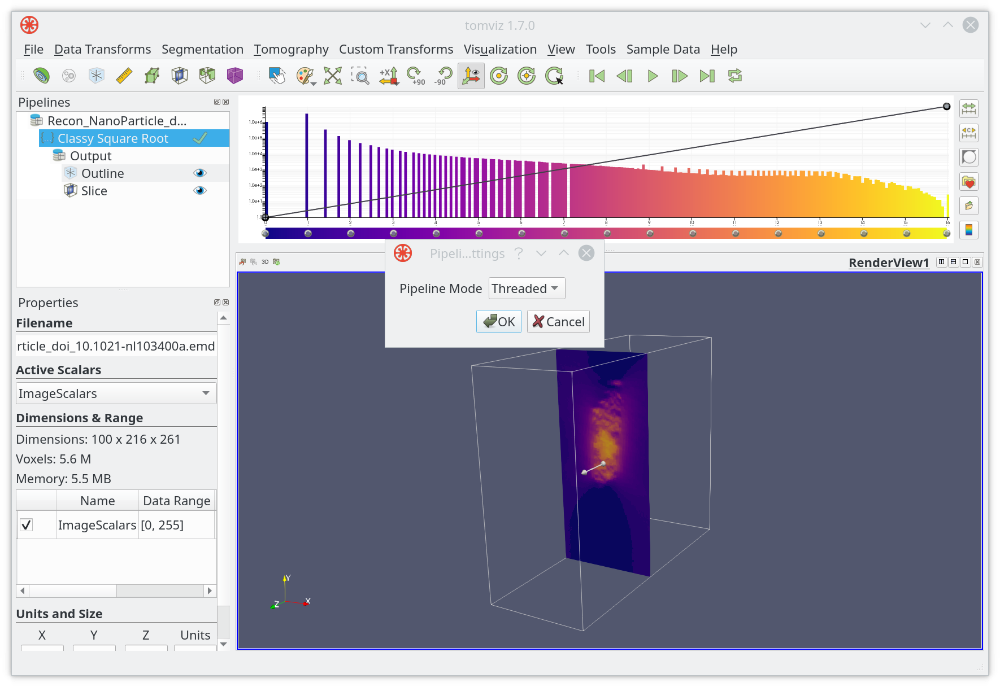

# Advanced

## Introduction

Besides various ready-to-use functions and algorithms that are included, Tomviz also supports extensions. For example, custom operators and file formats, which are primarily implemented using Python or JSON scripts, can be extended at runtime in Tomviz.

Processing pipeline, which is one of the most essential units in Tomviz that takes responsibility of loading, processing and saving data, is made self-contained. The advantage of being self-contained is that the pipeline can be run in Docker and reproduced later. Soon, the processing pipeline is going to support external Python for CUDA.

In this tutorial, we are going to cover materials that are related to custom operators, user input for operators, external pipelines and more.

## Custom Operators

### Create custom operators

A custom operator which takes the square root of the entire dataset may be implemented by code below.

```Python
def transform_scalars(dataset):

  from tomviz import utils
  import numpy as np

  # Get the current volume as a NumPy array.
  array = utils.get_array(dataset)

  # Operate on your data, here we square root it.
  result = np.sqrt(array)

  # Set the transformed data, displayed in Tomviz.
  utils.set_array(dataset, result)
```

To make it as part of a Python class, we need to import ```tomviz.operators``` and add a one-line class declaration above the function, as shown below.

```Python
import tomviz.operators

class SquareRootOperator(tomviz.operators.CancelableOperator):

  def transform_scalars(self, dataset):
    from tomviz import utils
    import numpy as np
    self.progress.maximum = 10
    scalars = utils.get_scalars(dataset)
    # Process dataset in chunks, user can cancel.
    result = np.float32(scalars)
    step = 0
    # Processing loop goes here...
    utils.set_scalars(dataset, result)
```

When the dataset is very large, operators can be coded to process dataset in chunks where user can cancel between chunks. ```for``` loops can be used to achieve this.

```Python
def transform_scalars(self, dataset):
    # ...other stuff from previous slide
    scalars = utils.get_scalars(dataset)
    # Process dataset in chunks, user can cancel.
    result = np.float32(scalars)
    for chunk in np.array_split(result, 10):
      if self.canceled:
        return
      np.sqrt(chunk, chunk)
      step += 1
      self.progress.value = step

    utils.set_scalars(dataset, result)
```

Combining everything above, the completed example of a custom operator that takes the square root of the dataset as output can be implemented as

```Python
import tomviz.operators
CHUNKS = 10

class SquareRootOperator(tomviz.operators.CancelableOperator):

  def transform_scalars(self, dataset):
    from tomviz import utils
    import numpy as np
    self.progress.maximum = CHUNKS
    scalars = utils.get_scalars(dataset)
    # Process dataset in chunks, user can cancel.
    result = np.float32(scalars)
    step = 0
    for chunk in np.array_split(result, CHUNKS):
      if self.canceled:
        return
      np.sqrt(chunk, chunk)
      step += 1
      self.progress.value = step
    utils.set_scalars(dataset, result)
```

### Import custom operators

After creating a custom operator, it can be added via importing custom transforms, which can be easily accessed through ```Custom Transform``` menu, as shown below.


Besides importing them in Tomviz application, users can also copy the suitable Python or JSON scripts into ```~/tomviz``` or ```~/.tomviz``` directory.

### Apply custom operators

After importing or copying the customer operator ```test```, it will show up in the ```Custom Transform``` menu.


```test``` can be applied just as normally as other built-in operators. After loading the example dataset, click on ```test```, the result will be displayed in ```RenderView1``` if everything goes well.


## User Input for Operators

After creating a custom operator, the next question is how to modify various user inputs; for example, the chunk size in the ```test``` operator of the previous section. The good news is that users don't have to edit the code every time. On the other hand, JSON scripts can be used for increased control, as shown below.

```JSON
{
  "name": "Fancy Square Root",
  "label": "Classy Square Root",
  "description": "This is the fanciest square root operator, it does it all...",
  "parameters": [
    {
      "name": "number_of_chunks",
      "label": "Number of Chunks",
      "type": "int",
      "default": 10,
      "minimum": 1,
      "maximum": 1000
    }
  ]
}
```

Now that you can import ```Classy Square Root``` in Tomviz


A user interface which takes user inputs for the operator will pop up. In our case the only user input is ```Number of Chunks```, with default value being 10.


Click on ```Apply``` when ready. Result will be displayed as usual in the ```RenderView1```.


## External Pipelines

Tomviz usually runs pipelines in a background thread (```Threaded```) by default, which can be changed to ```Docker``` in ```Pipeline Settings```.



When changing ```Pipeline Mode``` to ```Docker```, a different type of menu will appear


Click on ```OK``` when ready. Tomviz will start pulling docker image from the selected input image.


### Running pipelines

It is recommended to start with creating a virtual environment and installing

```Shell-scriping
  $ git clone --recursive git://github.com/openchemistry/tomviz
  $ cd tomviz/tomviz/python
  $ mkvirtualenv tomviz
  $ pip install -e .
```

Then, use Tomviz to build a pipeline, and save the sate state file (JSON). Note that, for right now, both input and output must be EMD files, and operator can only be executed in sequence.

```Shell-scriping
  $ tomviz-pipeline -s state.tvsm -d data.emd -o output.emd
  [2019-07-23 14:14:59,647] INFO: Executing 'Invert Data' operator
  [2019-07-23 14:14:59,963] INFO: Writing transformed data.
```

## Summary

In this tutorial we explained why adding a background-running, NumPy-centric custom operators with options to customize user input is easy. We also covered that pipeline can be run externally. Most importantly, more contents about improving file formats, pipelines, and etc are in the works.
