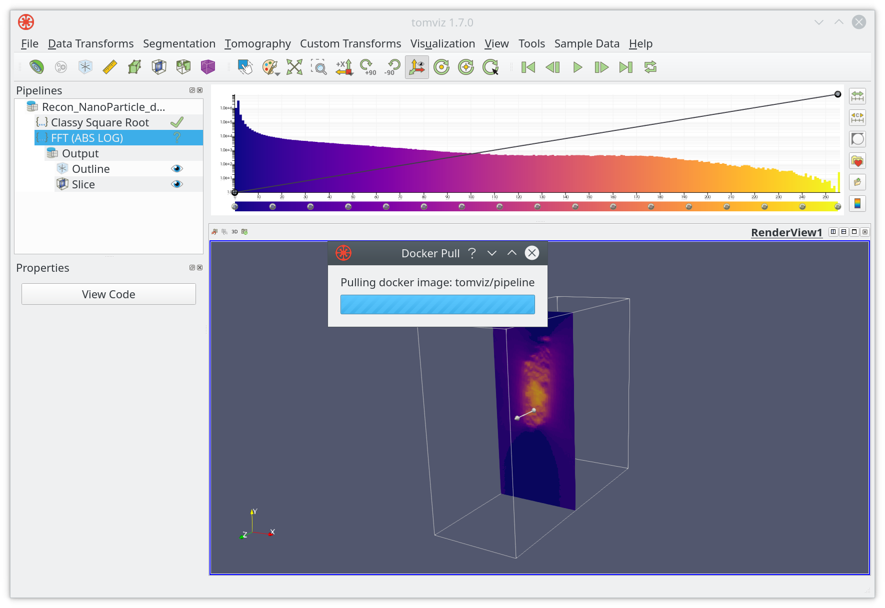

# Advanced

## Introduction

Besides various ready-to-use functions and algorithms that are included, Tomviz also supports extensions. For example, custom operators and file formats, which are primarily implemented using Python or JSON scripts, can be extended at runtime in Tomviz, and introduced in the <a href="https://tomviz.readthedocs.io/en/latest/operator/" target="_blank">operators</a> section.

Processing pipeline, which is one of the most essential units in Tomviz that takes responsibility of loading, processing and saving data, is made self-contained. The advantage of being self-contained is that the pipeline can be run in Docker and reproduced later. Soon, the processing pipeline is going to support external Python for CUDA.

In this tutorial, we are going to cover materials that are related to external pipelines.

## External Pipelines

Tomviz usually runs pipelines in a background thread (```Threaded```) by default, which can be changed to ```Docker``` in ```Pipeline Settings```.


When changing ```Pipeline Mode``` to ```Docker```, a different type of menu will appear


Click on ```OK``` when ready. Tomviz will start pulling docker image from the selected input image.



### Running pipelines

It is recommended to start with creating a virtual environment and installing

```Shell-scriping
  $ git clone --recursive git://github.com/openchemistry/tomviz
  $ cd tomviz/tomviz/python
  $ mkvirtualenv tomviz
  $ pip install -e .
```

Then, use Tomviz to build a pipeline, and save the sate state file (JSON). Note that, for right now, both input and output must be EMD files, and operator can only be executed in sequence.

```Shell-scriping
  $ tomviz-pipeline -s state.tvsm -d data.emd -o output.emd
  [2019-07-23 14:14:59,647] INFO: Executing 'Invert Data' operator
  [2019-07-23 14:14:59,963] INFO: Writing transformed data.
```

## Summary

In this tutorial we explained that pipeline can be run externally. More contents about improving file formats, pipelines, and etc are in the works.
