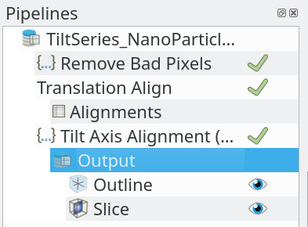
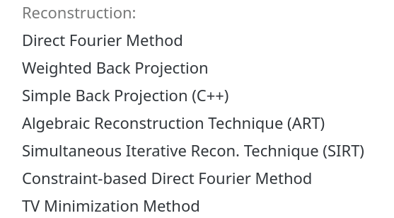
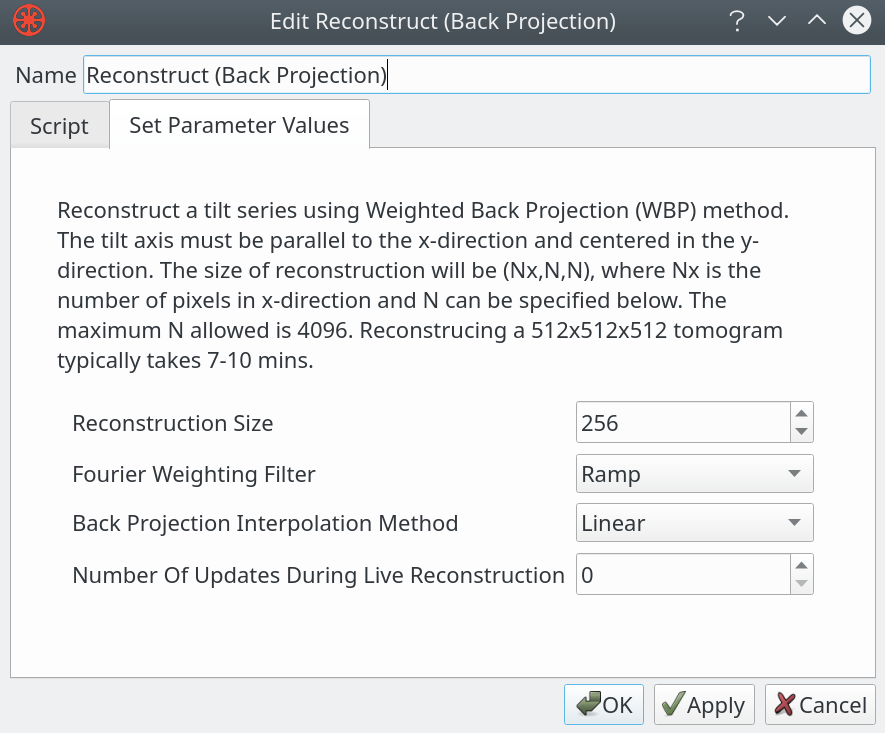
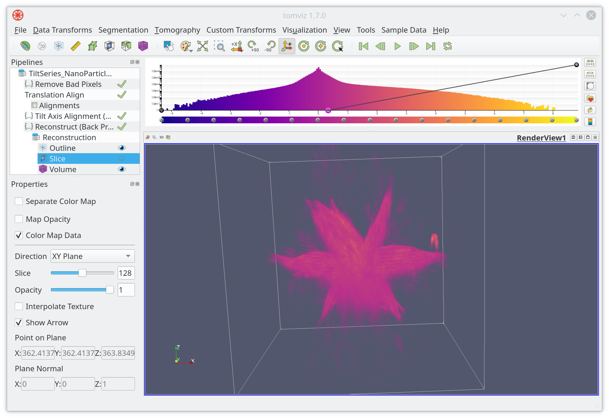

# Alignment and Reconstruction

## Introduction

In general, there are two types of data; volumes and tilt series. Volumes are from tomography or sectioning. And tilt series are projection series with angles. For each kind of data, specialized tools are provided in Tomviz. More specifically, ```Data Transforms``` and ```Segmentation``` menu have tools for volumes, while ```Tomography``` menu provides tools for tilt series. Users can also add their own tools to ```Custom Transforms``` menu.

## Tilt Series

Application comes bundled with a sample tilt series. It will automatically set the tilt angles, which normally has to be done manually.

### Loading sample tilt series

Image below is a screenshot when loading sample tilt series. Simply select ```Star Nanopartical (Tilt Series)``` within the ```Sample Data``` menu.


After loading, the Tomviz window should look like


### Creating a tilt series

Loaded data can be treated as tilt series by selecting ```Mark Data As Tilt Series``` from ```Tomography``` menu, as shown below.


The range of both start and end image number with its corresponding angles are needed, which are required for accurate reconstruction.


Or, more precisely, each image can be set individually, by choosing ```Set Individually``` from the menu.


## Aligning Data

Data alignment can be accessed through the ```Tomography``` menu. In the menu, some automated alignment algorithms are available. Users can also choose to make manual alignments.

### Image data alignment

For image dataset, automated algorithms include cross-correlation-based alignment, and center-of-mass-based alignments.


Besides automated alignment methods, manual alignments are also available. Manual alignment of images offers a number of tools that can be saved to a state file and edited later again.


Manual image alignments involve toggling between images or image differencing, ideally with the help of fiducial markers. Current image can be aligned to previous, next or to a fixed reference. Keyboard shortcuts are available when making alignment and switching images. Other helpful tools also include zooming, brightening, and showing images with different contrasts. Below are two screenshots of the dialog window when making these changes.


### Tilt axis alignment

For tilt series, tilt axis rotation and tilt axis shift alignment are provided. Users need to determine the tilt axis angles and positions, which are not needed when aligning images. Dedicated dialog for manual tilt axis alignments are available, with algorithms to attempt fitting.


Users can choose three slices to show a quick reconstruction, before going with the whole dataset. Simply position one on a fiducial particle, and the other two on interesting features.


Ideally, fiducial nano-particles are spherical. But they can be crescent shaped when placed in the wrong positions.


While making reconstructions, different color maps can be edited for each reconstruction.


## Reconstructing Data

Data reconstruction is the most computationally intensive step step. It is recommended to save the work often, or consider downsampling the dataset. A number of reconstruction techniques are available in Tomviz, which include simple back projection, direct Fourier, weighted back projection and many others. All the algorithms were written in Python except one in C++, which serve as starting points and it is easy to add more.

### Pre-reconstruction pipeline

Pre-reconstruction pipelines are recommended before reconstruction. The pipelines include pre-processing, and image/tilt axis alignment.



### Reconstruction menu

Available reconstructions can be found in ```Tomography``` menu. Most of them are developed in Python, with only one in C++.



### Weighted back projection

One of the most useful techniques in reconstruction is weighted back projection. To use it in Tomviz, after selecting it from ```Tomography``` menu, enter the parameters shown and then the reconstruction can start running.



An example of the reconstruction result is shown below.



### Save the reconstruction data

The reconstructed data is shown as a child dataset of the original data in Tomviz. User can highlight it by clicking on it. The data can be saved by going to the ```File``` menu and selecting ```Save Data```, as shown in the screenshot below.


### Advanced reconstruction techniques

As always, users can modify the existing code/algorithms to optimize towards a certain use case. As introduced before, almost all reconstruction algorithms were written in Python, where users can examine the code in the application or modify them and see the results. Modified operators are saved in the state file.

While Tomviz offers ready-to-use algorithms, we also welcome users making pull request with their new reconstruction techniques.

## Summary

In this tutorial, we started with importing an example of tilt series, and looked at pre-processing, alignment, and reconstruction of the loaded data. In the end we covered how to save pipelines and data.
