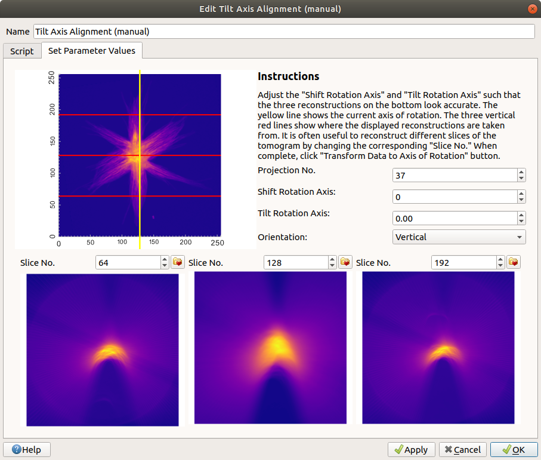
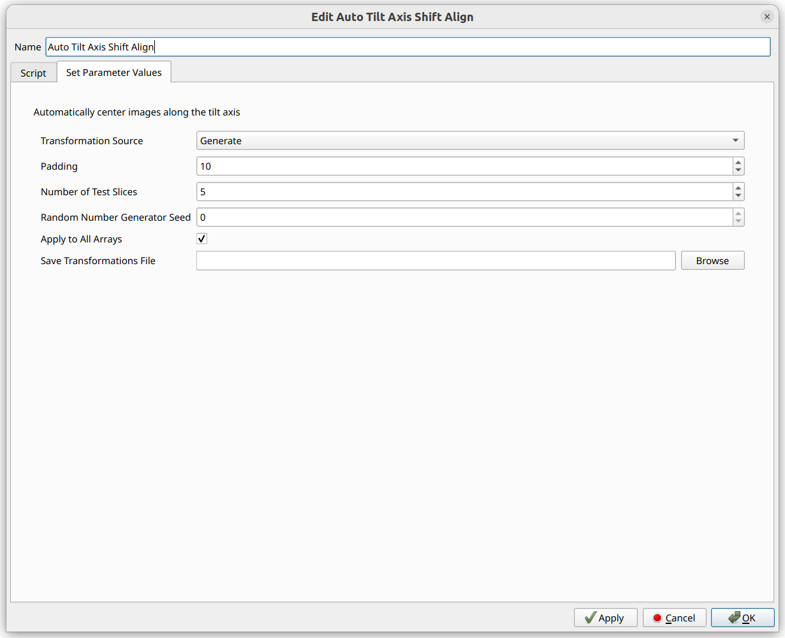

# Alignment

Tomviz supports two types of data; volumes and tilt series. Volumes are from
tomographic reconstructions or sectioning, and tilt series are projection images
with associated angles. Specialized tools are provided for each type of data,
more specifically, `Data Transforms` and `Segmentation` menu have tools for
volumes, while `Tomography` menu provides tools for tilt series. Users can
also add their own tools to `Custom Transforms` menu.

## Tilt Series

The Tomviz installer bundles a sample tilt series and the corresponding
reconstruction. The tilt series sample will automatically set the tilt angles.

### Loading sample tilt series

To load the sample tilt series select `Star Nanoparticle (Tilt Series)` from
the `Sample Data` menu.

Once loaded you will see a default view of the data showing the outline and a
slice through the center of the tilt series.

### Creating a tilt series

Data can be marked as a tilt series by selecting `Mark Data As Tilt Series` from
the `Tomography` menu as shown below.

The angles can be specified in a number of ways, such as specifying the start
and end image number with the start and end angles. It is important to enter
accurate angles in order to obtain a good reconstruction.

You can also set the angle for each image by choosing `Set Individually` from
the dialog. That mode supports loading a list of angles from a file too.

## Aligning Data

The key to a good reconstruction is well aligned data. The `Tomography` menu
offers a number of automated and manual alignment options.

### Image data alignment

Image alignment can be achieved with automated algorithms, we currently offer
cross-correlation and center-of-mass based alignments.

It is often necessary to use manual alignment methods as a final step to achieve
the best alignment of projection images. The alignment offsets can be saved to a
state file and adjusted in future sessions.

The manual alignment procedure uses two main interaction modes: toggling between
images or showing a difference between two images. Ideally your sample will have
a fiducial marker that can be used across all images for alignment. The current
image can be aligned to the previous, next or a fixed image. The tool supports
keyboard shortcuts to move between frames, introduce offsets, etc.

The image above shows the standard toggle mode, and below shows a typical image
difference. Both modes can benefit from zooming, adjusting the brightness or
the contract. Alignment offsets can be saved to a file, or loaded from a file.

#### PyStackReg Image Alignment

The PyStackReg image alignment operator can be used to automatically, and very
quickly, align images with one another. The PyStackReg alignment operator also
works very well with multiple arrays, such as XRF data, because the
transformation matrices can be computed using one array (such as a high
signal-to-noise array) and the same transformations will then be applied to
all other arrays.

First, if the data contains multiple arrays,
ensure that the "active array" (the one that is selected in the Data
Properties Panel in the bottom-left corner when the data source in the
pipeline is clicked on) is one that is high in signal-to-noise, as this
array will be the one used to compute the transformation matrices.

If you wish to align all of the images to a particular slice, make sure
there is a slice module on the data source, and navigate to the ideal
slice (often a slice around 0 degrees for XRF). This slice will be
automatically selected when the operator is open.

Next, open the operator via "Tomography"->"Image Alignment (Auto: PyStackReg)".

You can see that the default "Reference" is "SliceIndex", and the slice index
of the current slice module will automatically be selected. This can be
modified, however, as needed.

The "Transformation Source" should be set to "Generate" if you wish to
generate new transformation matrices. If, however, you have ran the operator
before on a different dataset, saved those transformation matrices, and
wish to apply the exact same transformations to this dataset,
you can select "Load From File" and select the file. Loading from file
will take into account differences in pixel sizes when applying the
transformation matrices, so you could, for example, apply the same
transformation matrices from data of one pixel size (for example, XRF)
to data of another pixel size (for example, Ptychography), if you know
the transformations ought to be the same.

Note that the number of slices must be exactly the same, and they
must correspond to the same angles, when applying the same transformation
matrices from a different dataset to the current one.

If generating, the next option will be "Transformation Type". Details about
each transformation type can be seen in the
[PyStackReg Documentation](https://pystackreg.readthedocs.io/en/latest/).

When applying the same transformation matrices to a dataset with pixels of
a different size, all of the transformation types can be used other than
"Bilinear".

"Padding" is often set to avoid image wrapping issues. The padding is removed
automatically after the alignment is complete, so it only affects the
transformation matrices themselves.

For the "Reference" settings, "Previous", "First", and "Mean" are all detailed
in the [PyStackReg Documentation](https://pystackreg.readthedocs.io/en/latest/).
"SliceIndex" is a new one we added that allows any arbitrary slice to be used
for the reference. The "SliceIndex" is the default setting, and the actual "Slice
Index" option afterward is set to the index of the current slice module, if one
exists on the input data source.

"Apply to All Arrays" may be checked to apply the same transformation matrices
to all arrays.

"Save Transformations File" may be used to save the transformation matrices
along with other metadata such as the pixel sizes to npz files. If non-empty,
the transformation matrices will be saved to the specified file, and they may
be reused in future PyStackReg operations. If empty,
the transformations will not be saved to a file.

### Tilt axis alignment

Once the images are aligned it is important to assure the tilt axis is aligned.
The tilt axis can be shifted and tilted, with reconstruction previews showing
the impact of these adjustments. There are automated routines, and the manual
tilt axis alignment tool.

You can choose three slices to show a preview of the reconstruction, these
should be positioned one on a fiducial particle ideally, with the other two
positioned on features that have contrast spread along the volume.

If the tilt axis is well aligned a fiducial marker will appear to be circular in
the reconstruction preview. If they are crescent shaped this is normally an
indication that the tilt axis is not well aligned.

It is possible to select independent color maps for the reconstruction previews.

Additionally, it is possible to align a tilt series that uses a
vertical axis of rotation rather than a horizontal one.
This can be done by selecting "Vertical" from the "Orientation"
combo box. The lines will then be rotated, and the tilt series may be
manually aligned as before.

#### Auto Tilt Axis Shift Alignment

The Auto Tilt Axis Shift Alignment operator can be used to automatically, and
very quickly, shift the images to the center. This operator also works very
well with multiple arrays, such as XRF data, because the shift can be
computed using one array (such as a high signal-to-noise array) and the same
shift will then be applied to all other arrays. This is similar to the
[PyStackReg operator](#pystackreg-image-alignment).

The shift can also be saved to a file, which will also include metadata such
as the pixel sizes, and then this shift can be applied to a different
dataset, taking into account the differences in pixel sizes when performing
the shift.

This operation should be performed after aligning the images with one another,
and before performing a reconstruction.

First, if the data contains multiple arrays,
ensure that the "active array" (the one that is selected in the Data
Properties Panel in the bottom-left corner when the data source in the
pipeline is clicked on) is one that is high in signal-to-noise, as this
array will be the one used to compute the shift.

Navigate to "Tomography" -> "Tilt Axis Shift Alignment (Auto)" to
begin this process.

If you wish to compute a new shift, select "Generate" for the "Transformation
Source". Alternatively, if you wish to use a shift applied to a previous
dataset, where the shift was saved to a file (along with other metadata such
as the pixel sizes).

"Padding" is often set to avoid image wrapping issues. The padding is removed
automatically after the alignment is complete, so it only affects the
shift itself.

This operator determines the ideal shift by randomly testing out different
slices, and determining the ideal shift from those slices.
Select the "Number of Test Slices" to determine how many test slices will
be used. Selecting a higher number may produce better results, but will
take longer.

The "Random Number Generator Seed" is also able to be specified in order
to make the operator completely reproducible. Since the test slices are
randomly selected, the operator would not be reproducible without a seed.
The default seed is seed 0. If seed 0, however, does not appear to produce
ideal results, a different seed may be tried, which will be saved in
the operator settings for reproducibility.

"Apply to All Arrays" may be checked in order to apply the same shift to
every array within the data source. Only the current active one will be
used for computing the shift, but the same shift will be applied to all
other arrays.

If you wish to save the shift to be reused for a different dataset later,
select a file for "Save Transformations File". This also saves metadata
such as the pixel sizes, to take into account different pixel sizes when
applying the shift to a dataset of a different pixel size. If empty, the
transformations file will not be saved.
