Tomviz supports two types of data; volumes and tilt series. Volumes are from
tomographic reconstructions or sectioning, and tilt series are projection images
with associated angles. Specialized tools are provided for each type of data,
more specifically, `Data Transforms` and `Segmentation` menu have tools for
volumes, while `Tomography` menu provides tools for tilt series. Users can
also add their own tools to `Custom Transforms` menu.

## Tilt Series

The Tomviz installer bundles a sample tilt series and the corresponding
reconstruction. The tilt series sample will automatically set the tilt angles.

### Loading sample tilt series

To load the sample tilt series select `Star Nanoparticle (Tilt Series)` from
the `Sample Data` menu.

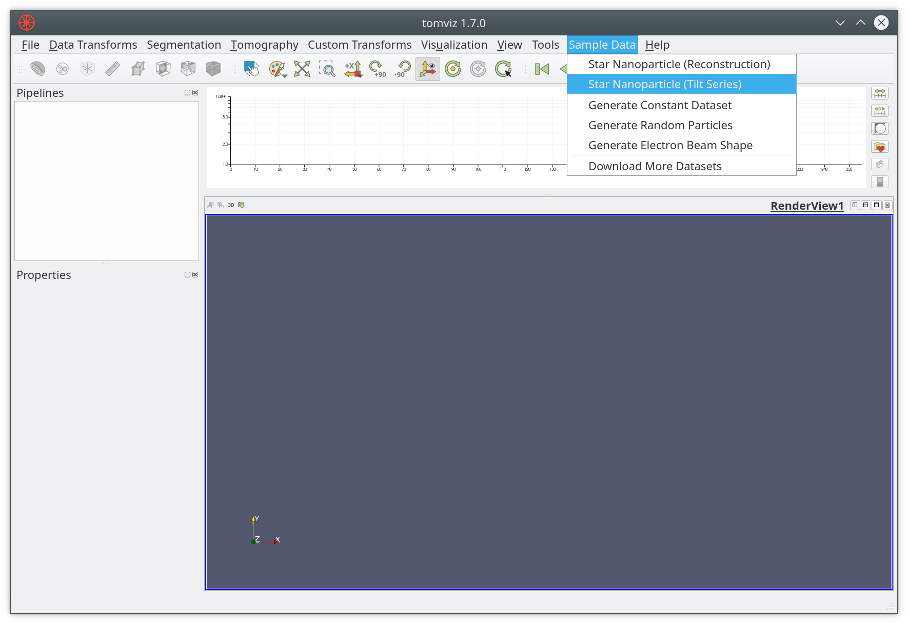

Once loaded you will see a default view of the data showing the outline and a
slice through the center of the tilt series.

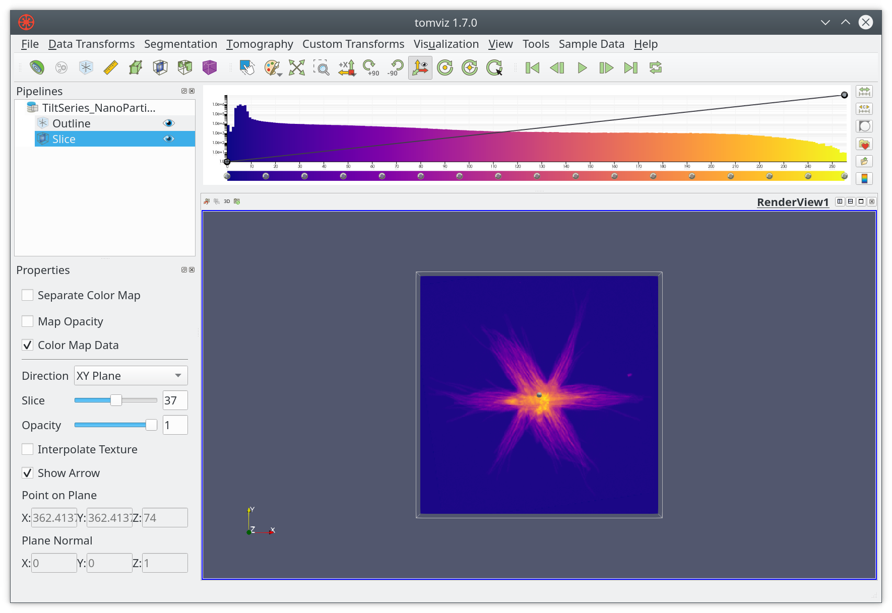

### Creating a tilt series

Data can be marked as a tilt series by selecting `Mark Data As Tilt Series` from
the `Tomography` menu as shown below.

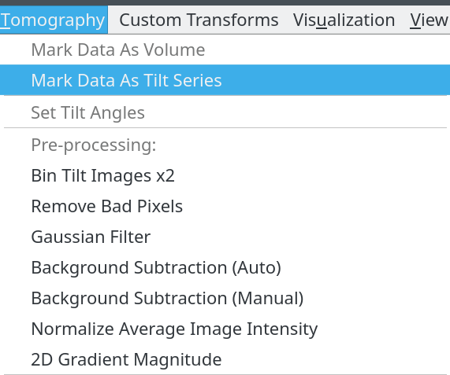

The angles can be specified in a number of ways, such as specifying the start
and end image number with the start and end angles. It is important to enter
accurate angles in order to obtain a good reconstruction.

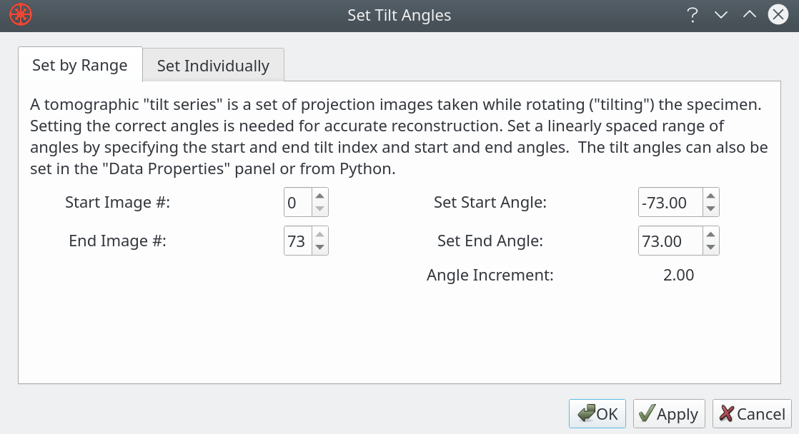

You can also set the angle for each image by choosing `Set Individually` from
the dialog. That mode supports loading a list of angles from a file too.

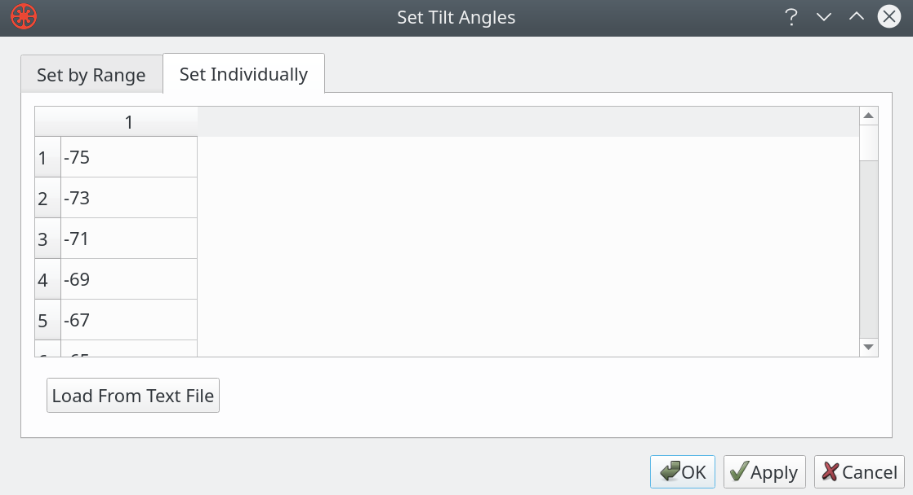

## Aligning Data

The key to a good reconstruction is well aligned data. The `Tomography` menu
offers a number of automated and manual alignment options.

### Image data alignment

Image alignment can be achieved with automated algorithms, we currently offer
cross-correlation and center-of-mass based alignments.

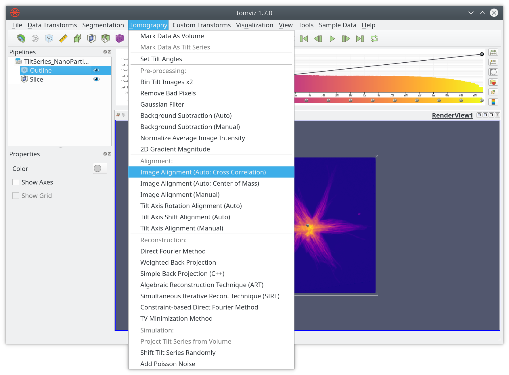

It is often necessary to use manual alignment methods as a final step to achieve
the best alignment of projection images. The alignment offsets can be saved to a
state file and adjusted in future sessions.

The manual alignment procedure uses two main interaction modes: toggling between
images or showing a difference between two images. Ideally your sample will have
a fiducial marker that can be used across all images for alignment. The current
image can be aligned to the previous, next or a fixed image. The tool supports
keyboard shortcuts to move between frames, introduce offsets, etc.

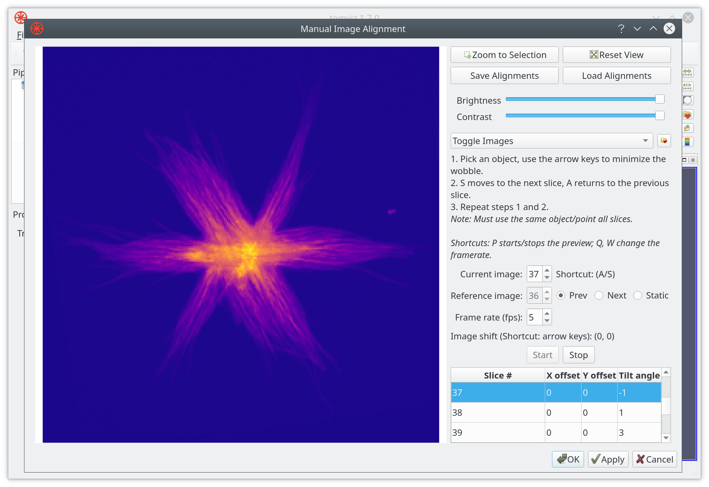

The image above shows the standard toggle mode, and below shows a typical image
difference. Both modes can benefit from zooming, adjusting the brightness or
the contract. Alignment offsets can be saved to a file, or loaded from a file.

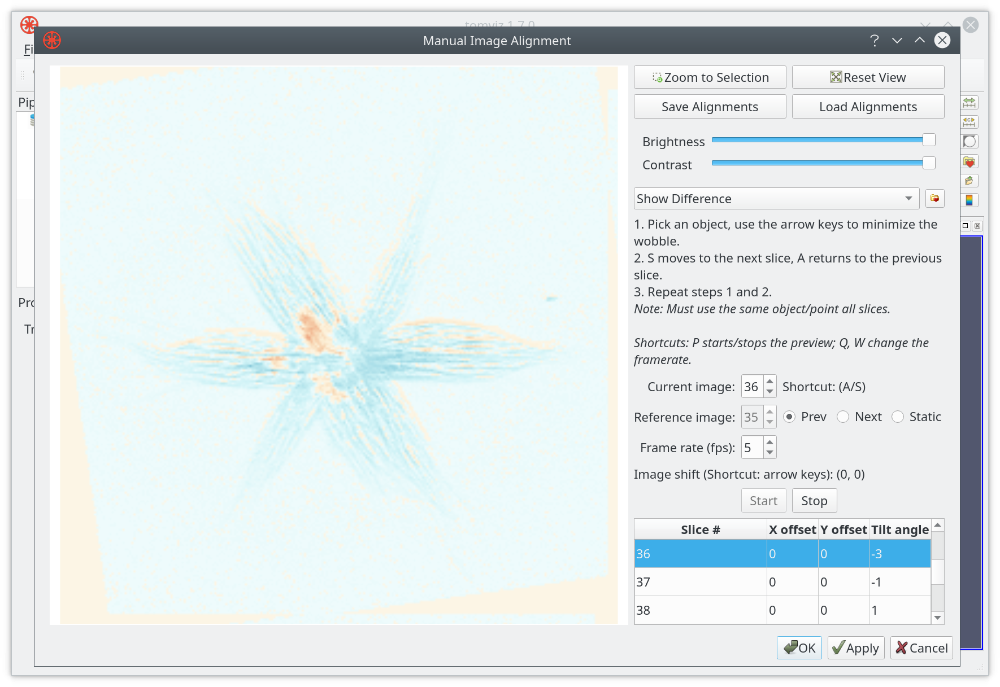

### Tilt axis alignment

Once the images are aligned it is important to assure the tilt axis is aligned.
The tilt axis can be shifted and tilted, with reconstruction previews showing
the impact of these adjustments. There are automated routines, and the manual
tilt axis alignment tool.

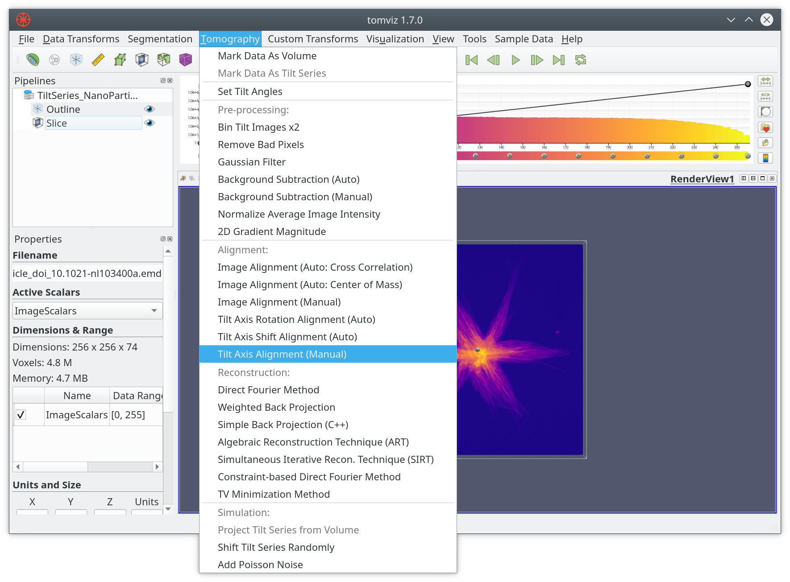

You can choose three slices to show a preview of the reconstruction, these
should be positioned one on a fiducial particle ideally, with the other two
positioned on features that have contrast spread along the volume.

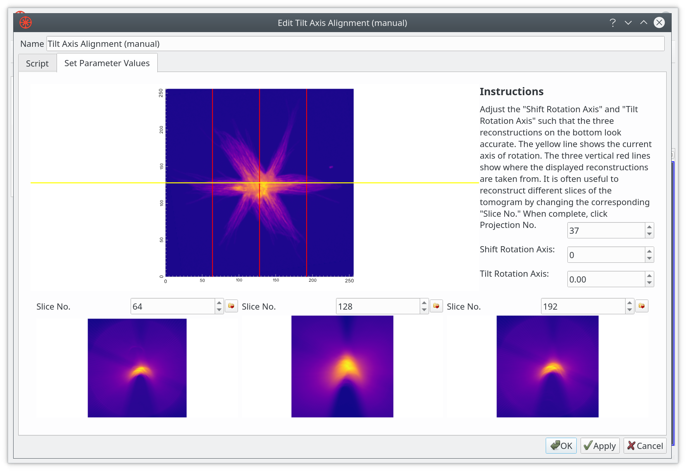

If the tilt axis is well aligned a fiducial marker will appear to be circular in
the reconstruction preview. If they are crescent shaped this is normally an
indication that the tilt axis is not well aligned.

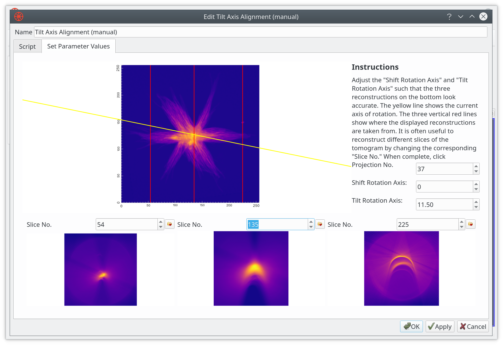

It is possible to select independent color maps for the reconstruction previews.

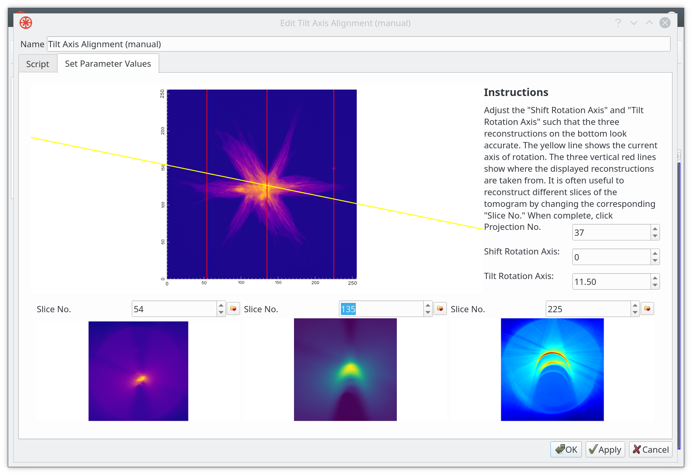