# Alignment

Tomviz supports two types of data: volumes and tilt series. Volumes are from
tomographic reconstructions or sectioning, and tilt series are projection images
with associated angles. Specialized tools are provided for each type of data -
`Data Transforms` and `Segmentation` menus have tools for volumes, while the
`Tomography` menu provides tools for tilt series. Users can also add their own
tools via `Custom Transforms`.

## Tilt Series

The Tomviz installer bundles a sample tilt series and the corresponding
reconstruction. The tilt series sample will automatically set the tilt angles.

### Loading sample tilt series

To load the sample tilt series select `Star Nanoparticle (Tilt Series)` from
the `Sample Data` menu.

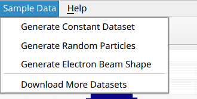

Once loaded you will see a default view of the data showing the outline and a
slice through the center of the tilt series.

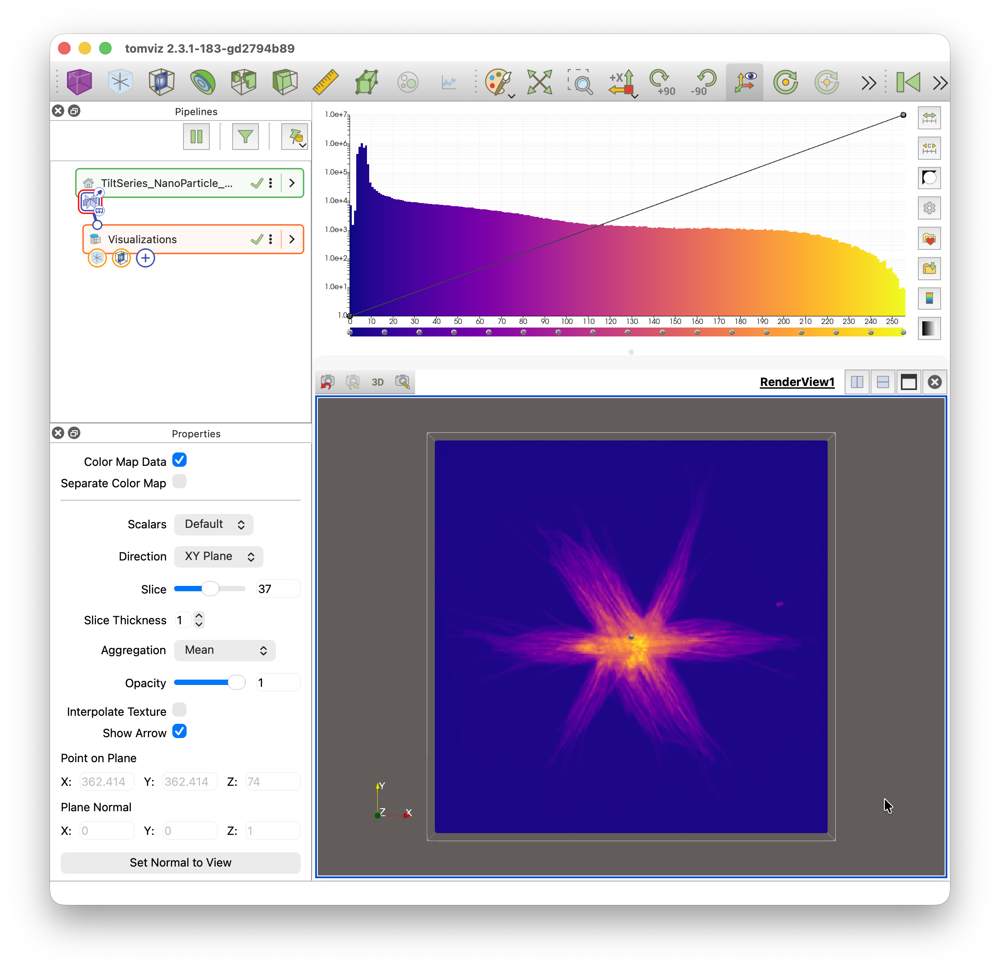

### Creating a tilt series

This sample is loaded from an EMD file that already identifies it as a tilt
series and stores the tilt angles. Data loaded another way, such as from a
stack of TIFF files, must be manually marked as a tilt series and have its
angles set.

Data can be marked as a tilt series by selecting `Mark Data As Tilt Series`
from the `Tomography` menu. Tilt angles can then
be set by selecting `Set Tilt Angles` from the `Tomography` menu, which adds
a Set Tilt Angles transform to the pipeline.

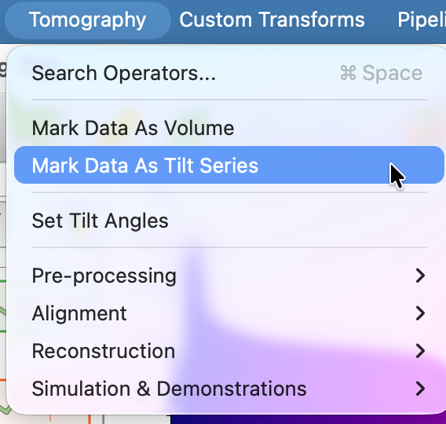

The angles can be specified in a number of ways, such as specifying the start
and end image number with the start and end angles. It is important to enter
accurate angles in order to obtain a good reconstruction.

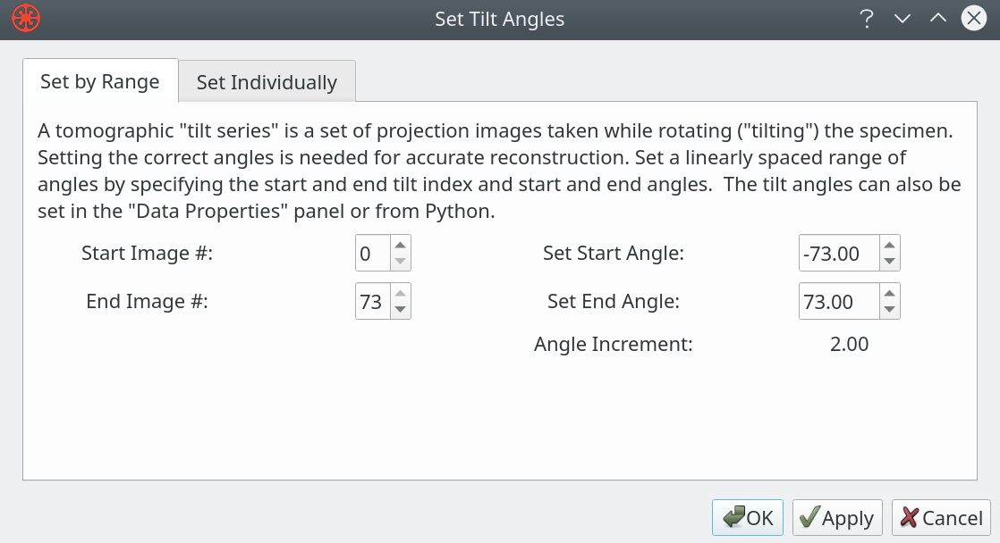

You can also set the angle for each image by choosing `Set Individually` from
the dialog. That mode supports loading a list of angles from a file too.

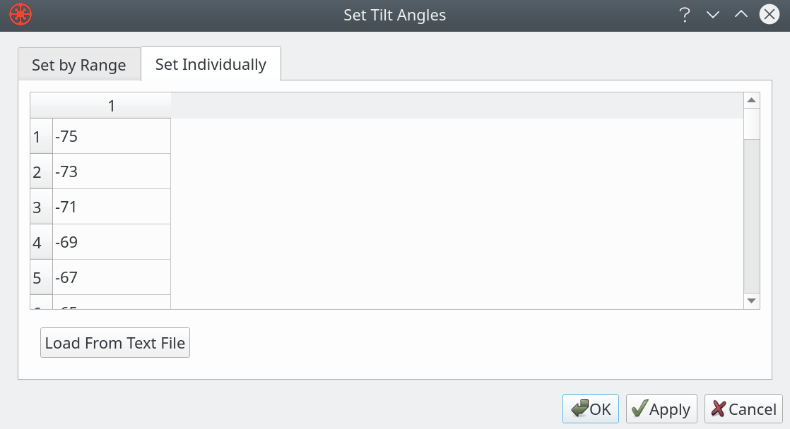

## Aligning Data

The key to a good reconstruction is well aligned data. The `Tomography` >
`Alignment` submenu offers a number of automated and manual alignment options:

 * Image Alignment (Auto: Cross Correlation)
 * Image Alignment (Auto: Center of Mass)
 * Image Alignment (Auto: PyStackReg)
 * Image Alignment (Manual)
 * Tilt Axis Rotation Alignment (Auto)
 * Tilt Axis Shift Alignment (Auto)
 * Tilt Axis Alignment (Manual)
 * Shift Rotation Center (Manual)

### Image data alignment

Image alignment can be achieved with automated algorithms - cross-correlation,
center-of-mass, and PyStackReg-based alignments are available. These are
found under `Tomography` > `Alignment`.

It is often necessary to use manual alignment methods as a final step to achieve
the best alignment of projection images. The alignment offsets can be saved to a
state file and adjusted in future sessions.

The manual alignment procedure uses two main interaction modes: toggling between
images or showing a difference between two images. Ideally your sample will have
a fiducial marker that can be used across all images for alignment. The current
image can be aligned to the previous, next or a fixed image. The tool supports
keyboard shortcuts to move between frames, introduce offsets, etc.

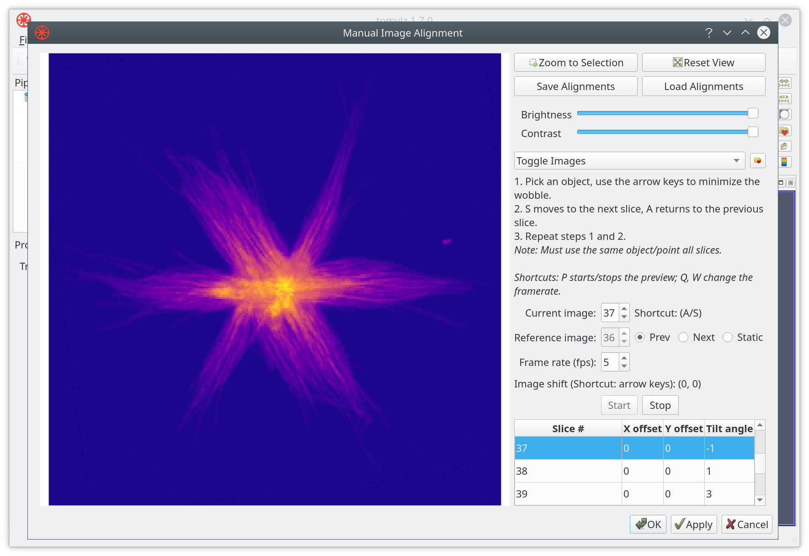

The image above shows the standard toggle mode, and below shows a typical image
difference. Both modes can benefit from zooming, adjusting the brightness or
the contrast. Alignment offsets can be saved to a file, or loaded from a file.

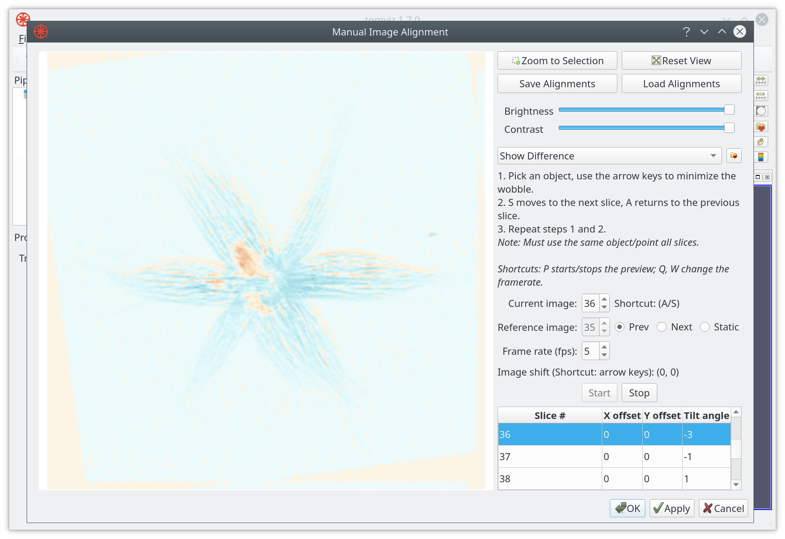

#### PyStackReg Image Alignment

The PyStackReg image alignment transform automatically and quickly aligns
images with one another. It works well with multiple arrays (such as XRF data)
because transformation matrices can be computed using one array (such as a
high signal-to-noise array) and the same transformations applied to all other
arrays.

First, if the data contains multiple arrays, ensure that the active array
(selected in the Properties panel when the source node is clicked) is one with
high signal-to-noise, as this array will be used to compute the transformation
matrices.

If you wish to align all images to a particular slice, navigate to the ideal
slice in a slice visualization (often a slice around 0 degrees for XRF). This
slice will be automatically selected when the transform dialog opens.

Open the transform via `Tomography` > `Alignment` >
`Image Alignment (Auto: PyStackReg)`.

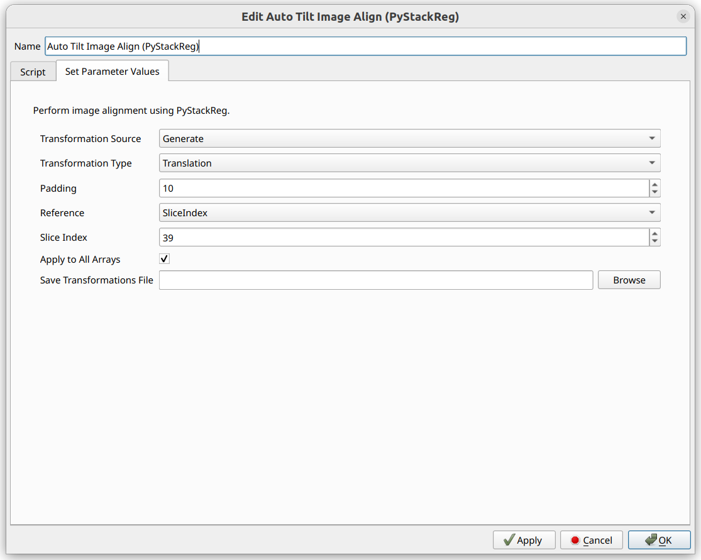

The default "Reference" is "SliceIndex", and the slice index of the current
slice visualization will automatically be selected.

The "Transformation Source" should be "Generate" to compute new transformation
matrices. To reuse matrices from a previous run on a different dataset, select
"Load From File". Loading from file takes into account differences in pixel
sizes, so you can apply XRF transformations to ptychography data, for example.
The number of slices must match exactly, and they must correspond to the same
angles.

"Transformation Type" options are detailed in the
[PyStackReg Documentation](https://pystackreg.readthedocs.io/en/latest/).
All types except "Bilinear" can be applied across datasets with different
pixel sizes.

"Padding" avoids image wrapping issues and is removed automatically after
alignment.

"Apply to All Arrays" applies the same transformation matrices to every array.

"Save Transformations File" saves matrices and pixel sizes to NPZ format for
reuse.

### Tilt axis alignment

Once the images are aligned it is important to assure the tilt axis is aligned.
The tilt axis can be shifted and tilted, with reconstruction previews showing
the impact of these adjustments. Automated routines and a manual tilt axis
alignment tool are available under `Tomography` > `Alignment`.

You can choose three slices to show a preview of the reconstruction - these
should be positioned on a fiducial particle ideally, with the other two on
features that have contrast spread along the volume.

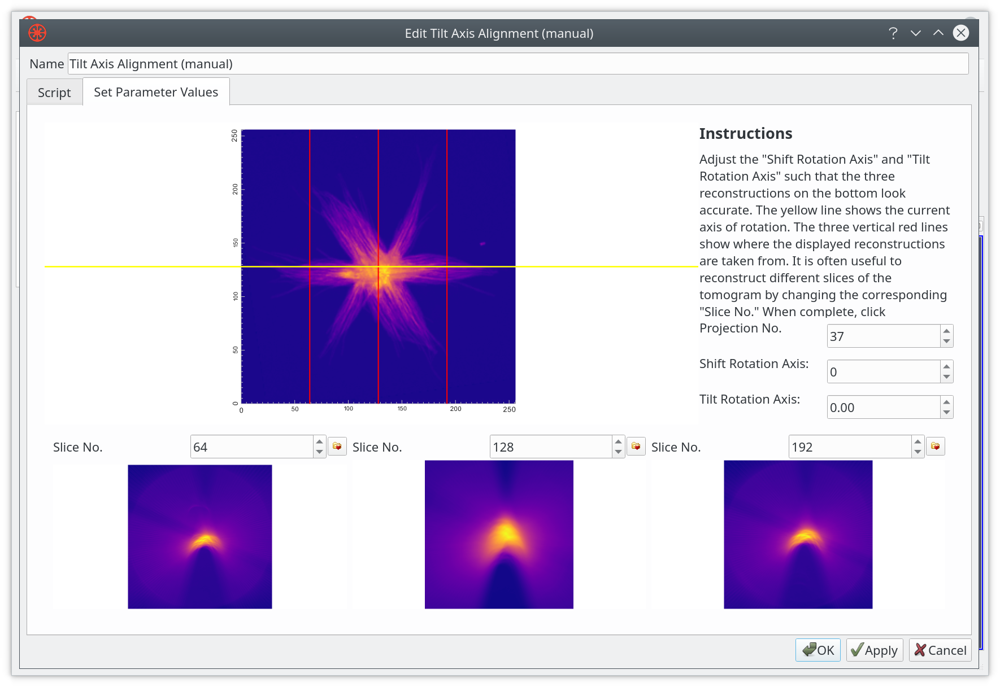

If the tilt axis is well aligned a fiducial marker will appear circular in
the reconstruction preview. Crescent shapes normally indicate poor tilt axis
alignment.

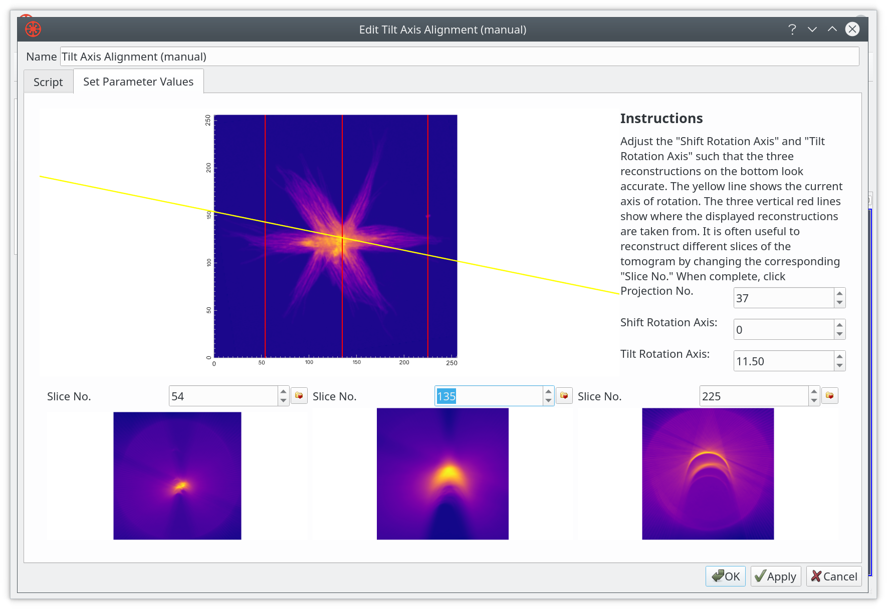

It is possible to select independent color maps for the reconstruction previews.

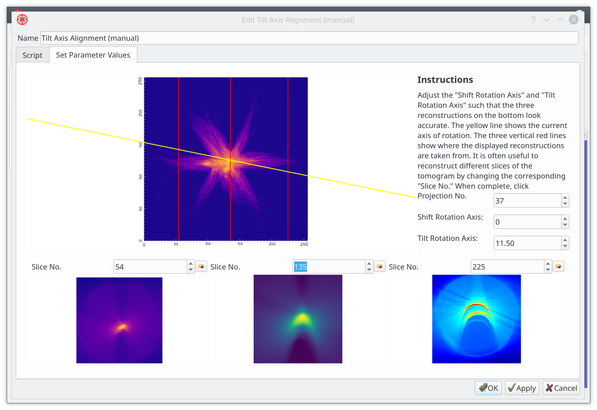

Additionally, tilt series that use a vertical axis of rotation rather than a
horizontal one can be aligned by selecting "Vertical" from the "Orientation"
combo box.

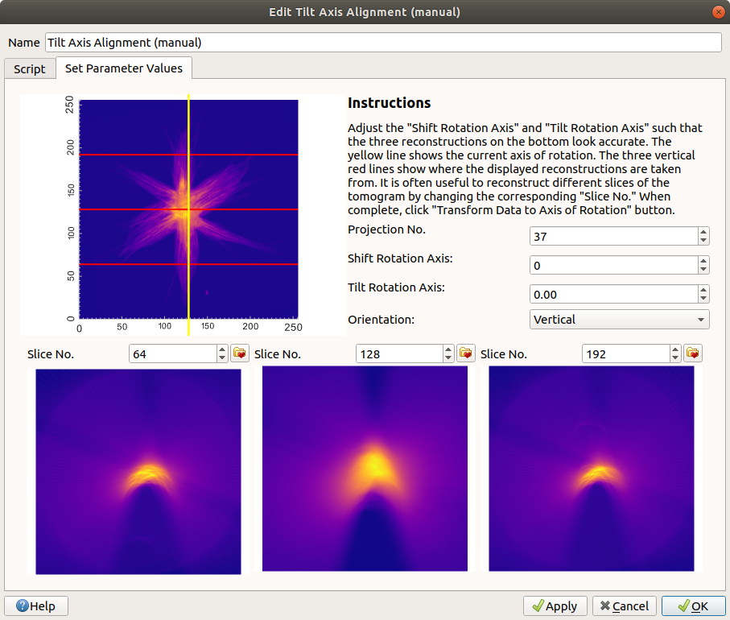

#### Auto Tilt Axis Shift Alignment

The Auto Tilt Axis Shift Alignment transform automatically shifts images to
center them. It works well with multiple arrays because the shift can be
computed using one high signal-to-noise array and applied to all others.

The shift can be saved to a file (with pixel size metadata) and applied to a
different dataset, accounting for pixel size differences.

This should be performed after image alignment and before reconstruction.

First, ensure the active array is one with high signal-to-noise. Navigate to
`Tomography` > `Alignment` > `Tilt Axis Shift Alignment (Auto)`.

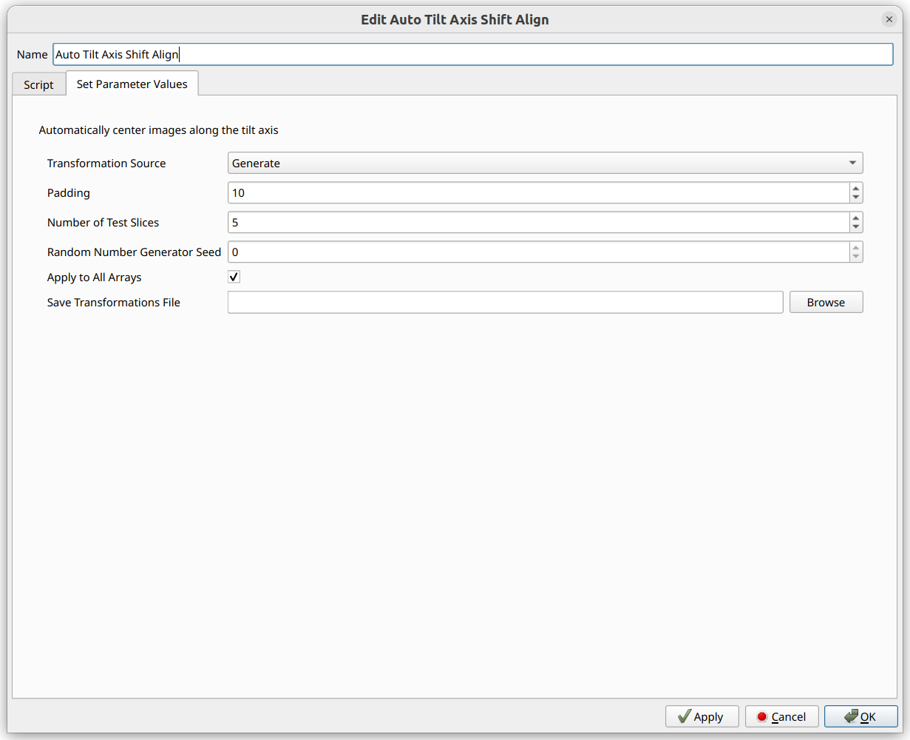

Options:

 * **Transformation Source** - "Generate" to compute new shift, or "Load From
   File" to reuse a saved shift
 * **Padding** - Avoids wrapping; removed automatically after alignment
 * **Number of Test Slices** - More slices may produce better results but take
   longer
 * **Random Number Generator Seed** - For reproducibility (default: 0)
 * **Apply to All Arrays** - Apply the same shift to every array
 * **Save Transformations File** - Save shift and pixel sizes to NPZ for reuse
