# Tilt Series and Alignment

Tomviz works with two types of data: volumes, from tomographic
reconstructions or sectioning, and tilt series, which are projection images
with associated angles. The `Data Transforms` and `Segmentation` menus have
tools for volumes, and the `Tomography` menu has tools for tilt series. You
can add your own tools under `Custom Transforms`.

## Tilt Series

The Tomviz installer bundles a sample tilt series and its reconstruction.

### Loading sample tilt series

To load the sample tilt series select `Star Nanoparticle (Tilt Series)` from
the `Sample Data` menu.

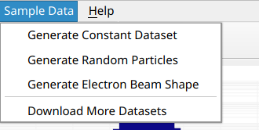

Tomviz shows the tilt series as an outline and a slice through the center.

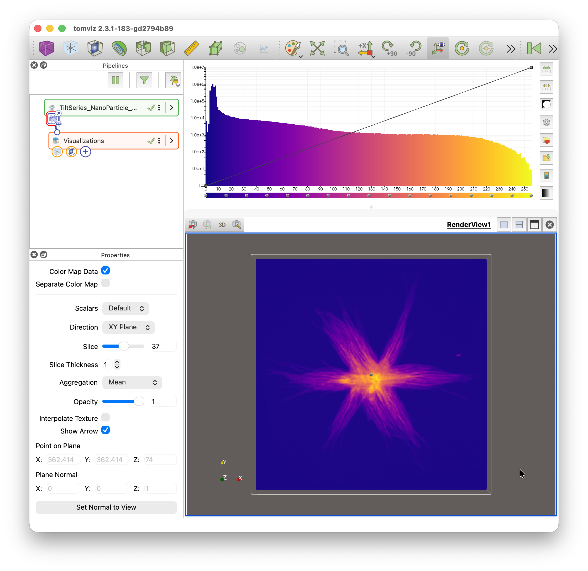

### Creating a tilt series

This sample is loaded from an EMD file that already identifies it as a tilt
series and stores the tilt angles. Data loaded another way, such as from a
stack of TIFF files, must be manually marked as a tilt series and have its
angles set.

Choose `Tomography` -> `Mark Data As Tilt Series`, then
`Tomography` -> `Set Tilt Angles`, which adds a Set Tilt Angles transform to the
pipeline.

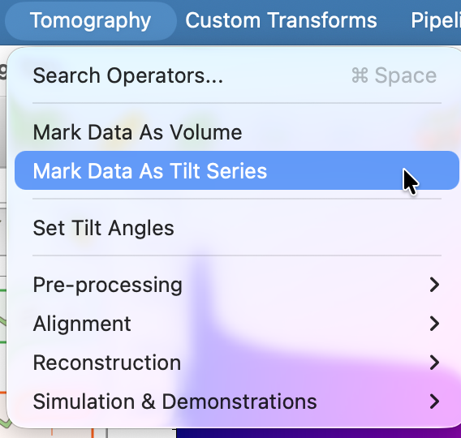

One way to set the angles is by range: a start and end image, each with its
angle. A good reconstruction needs accurate angles.

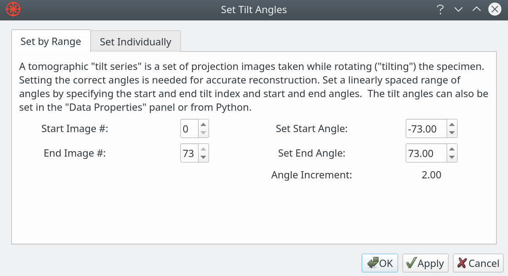

You can also set the angle for each image by choosing `Set Individually` from
the dialog. That mode supports loading a list of angles from a file too.

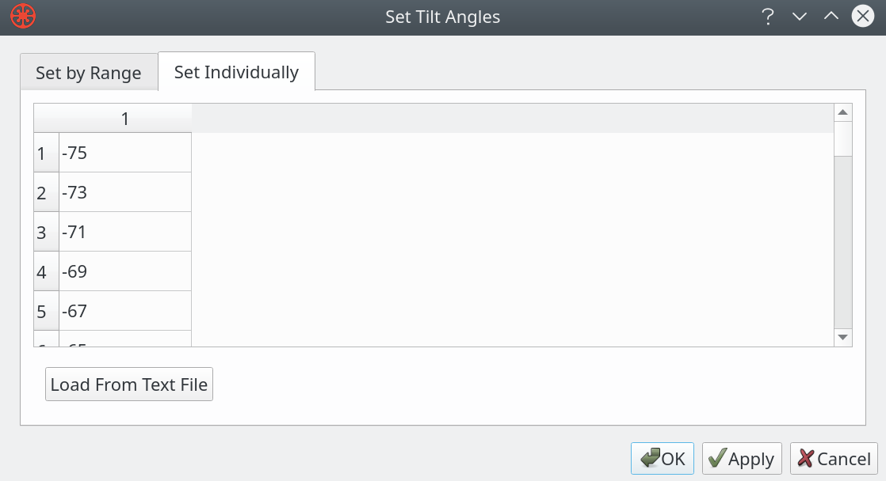

### Pre-processing

The `Tomography` -> `Pre-processing` menu includes these transforms, which
apply to each tilt image before alignment:

 * **Bin Tilt Images x2** halves the size of each image.
 * **Gaussian Filter** smooths each image with a 2D Gaussian of the given
   sigma.
 * **Background Subtraction (Auto)** takes the highest peak of each image's
   histogram as its background level and subtracts it. Negative values are
   kept.
 * **Normalize Average Image Intensity** scales the images to the same total
   intensity, correcting for changes in beam current or thickness.
 * **2D Gradient Magnitude** replaces each image with its Sobel gradient
   magnitude.
 * **CTF Correction** corrects bright-field TEM images for the contrast
   transfer function, given the defocus, aberration and voltage.

To divide or subtract a whole dataset, such as a dark or flat field, use
[Image Math](analysis.md#image-math).

## Aligning Data

A good reconstruction needs well-aligned data. `Tomography` -> `Alignment` has
these automatic and manual tools:

 * Image Alignment (Auto: Cross Correlation)
 * Image Alignment (Auto: Center of Mass)
 * Image Alignment (Auto: PyStackReg)
 * Image Alignment (Manual)
 * Tilt Axis Rotation Alignment (Auto)
 * Tilt Axis Shift Alignment (Auto)
 * Tilt Axis Alignment (Manual)
 * Shift Rotation Center (Manual)

### Image data alignment

The automatic alignments often need a manual pass afterwards for the best
result. The offsets can be saved in a state file, so you can
adjust them in later sessions.

Manual alignment has two modes: toggling between images, or showing the
difference between two images. Align the current image to the previous, next
or a fixed image, ideally using a fiducial marker visible in all of them.
Keyboard shortcuts move between frames and set offsets.

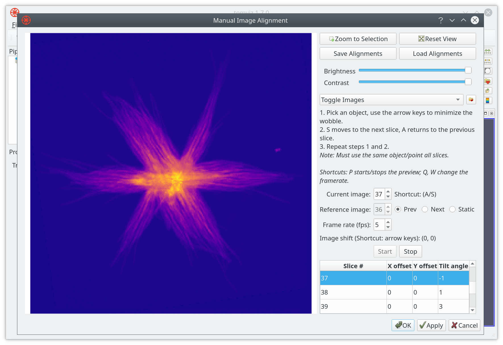

Above is the toggle mode; below is the difference mode. Zooming and
adjusting brightness or contrast help in both. The offsets can also be saved
to, or loaded from, a file.

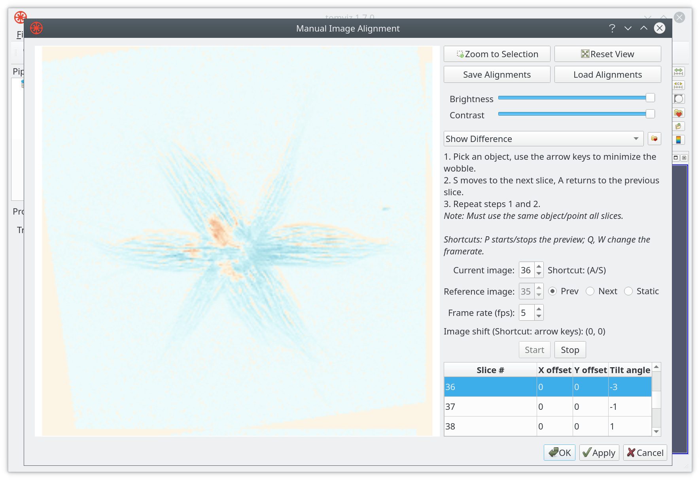

#### PyStackReg Image Alignment

PyStackReg aligns the images quickly. It suits data with several arrays,
such as XRF: the transformation matrices are computed from one array and
applied to all the others.

If the data has several arrays, first make one with high signal-to-noise the
active array (click the source node and pick it in the Properties panel). It
is the one used to compute the matrices.

To align all images to one slice, show that slice in a slice visualization
(often one near 0 degrees for XRF). The dialog opens with it selected.

Then open `Tomography` -> `Alignment` -> `Image Alignment (Auto: PyStackReg)`.

Options:

 * **Reference** - `SliceIndex` by default, set to the slice shown in the
   slice visualization
 * **Transformation Source** - `Generate` computes new matrices; `Load From
   File` reuses matrices from an earlier run, even on a different dataset.
   Pixel size differences are accounted for, so you can apply XRF
   transformations to ptychography data, for example. The number of slices
   must match exactly, and the slices must be at the same angles.
 * **Transformation Type** - see the
   [PyStackReg documentation](https://pystackreg.readthedocs.io/en/latest/).
   All types except `Bilinear` work across datasets with different pixel
   sizes.
 * **Padding** - Avoids wrapping; removed automatically after alignment
 * **Apply to All Arrays** - Apply the same matrices to every array
 * **Save Transformations File** - Save the matrices and pixel sizes to NPZ
   for reuse

### Tilt axis alignment

Once the images are aligned, align the tilt axis.
`Tomography` -> `Alignment` -> `Tilt Axis Alignment (Manual)` shifts and tilts
the axis while reconstruction previews show the effect.

Pick three slices to preview. Ideally put one on a fiducial particle and the
other two on features with contrast spread along the volume.

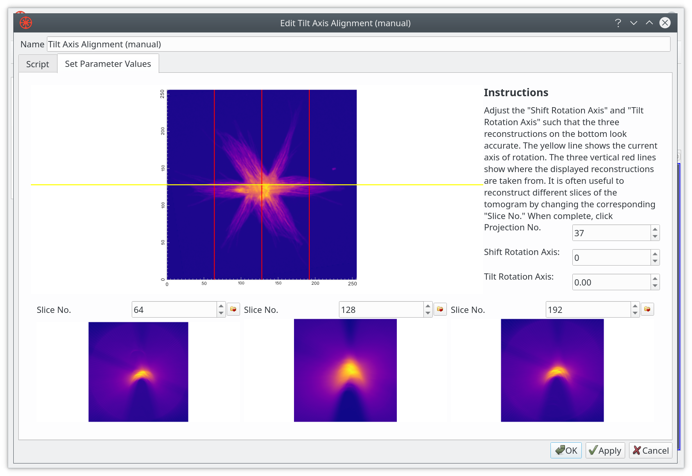

With a well-aligned tilt axis, a fiducial marker looks circular in the
preview. Crescent shapes usually mean the axis is off.

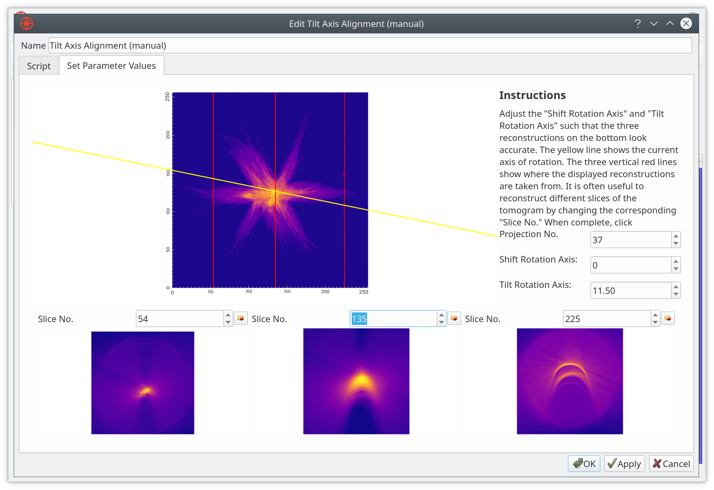

Each preview can have its own color map.

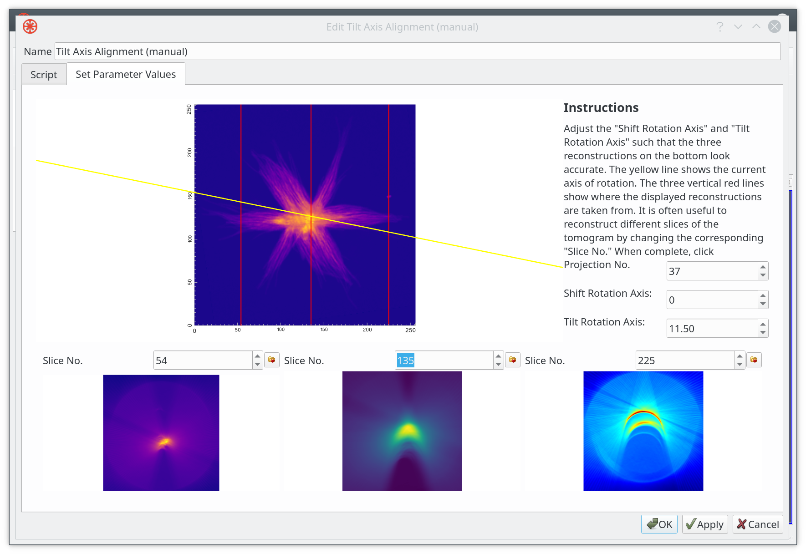

For a vertical tilt axis, choose `Vertical` under `Orientation`.

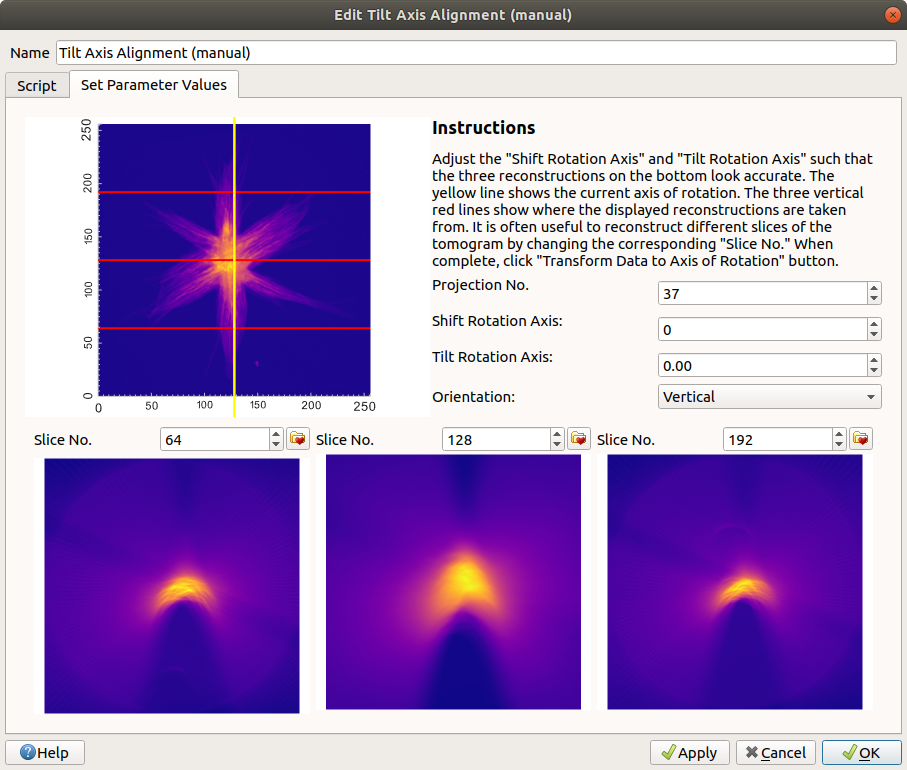

#### Auto Tilt Axis Shift Alignment

`Tilt Axis Shift Alignment (Auto)` shifts the images to put the tilt axis in
the center. Run it after image alignment and before reconstruction. Like
PyStackReg, it computes the shift from the active array and can apply it to
all the others, and the shift can be saved with its pixel size and reused on
another dataset.

First make a high signal-to-noise array active, then open `Tomography` ->
`Alignment` -> `Tilt Axis Shift Alignment (Auto)`.

Options:

 * **Transformation Source** - "Generate" to compute new shift, or "Load From
   File" to reuse a saved shift
 * **Padding** - Avoids wrapping; removed automatically after alignment
 * **Number of Test Slices** - More slices may produce better results but take
   longer
 * **Random Number Generator Seed** - For reproducibility (default: 0)
 * **Apply to All Arrays** - Apply the same shift to every array
 * **Save Transformations File** - Save shift and pixel sizes to NPZ for reuse
