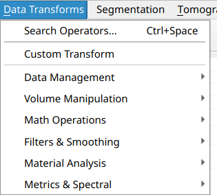
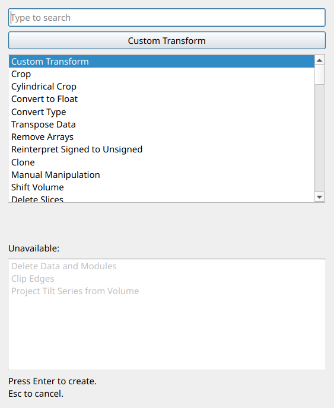
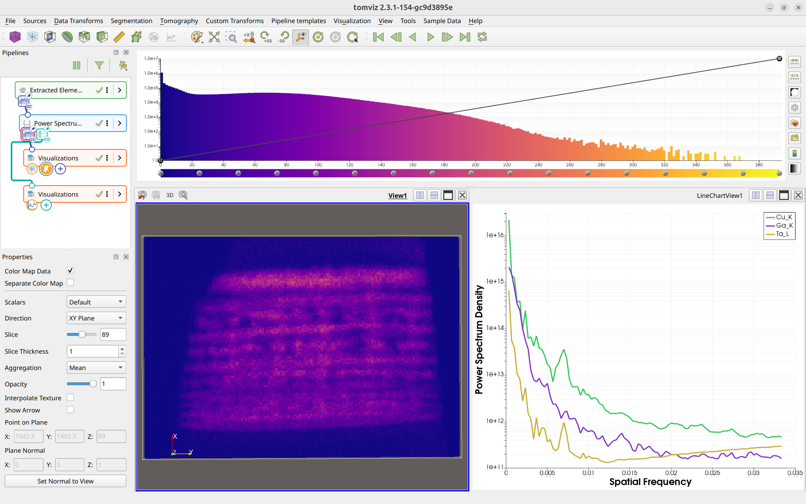
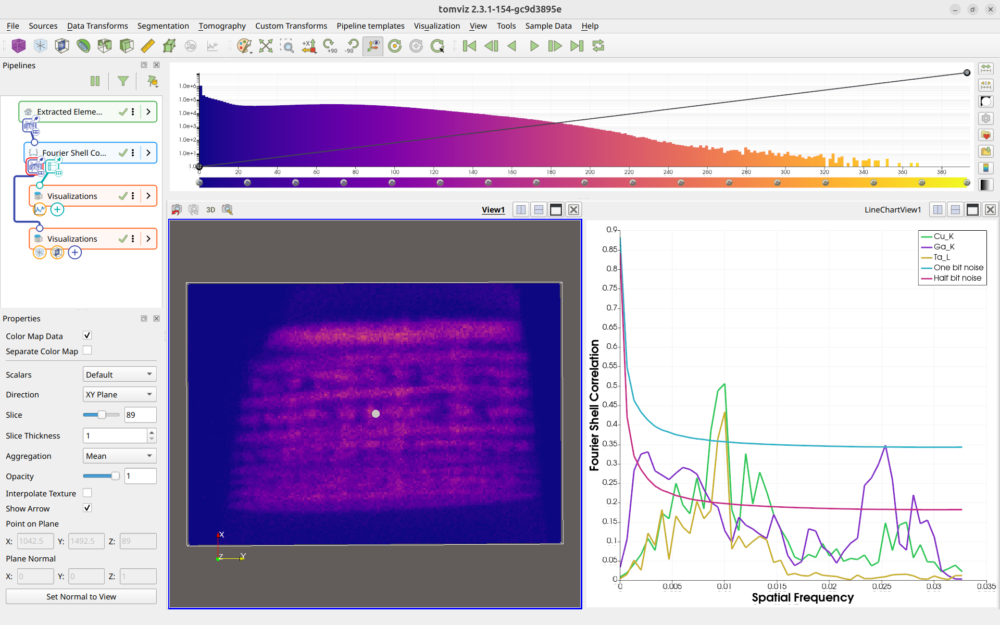
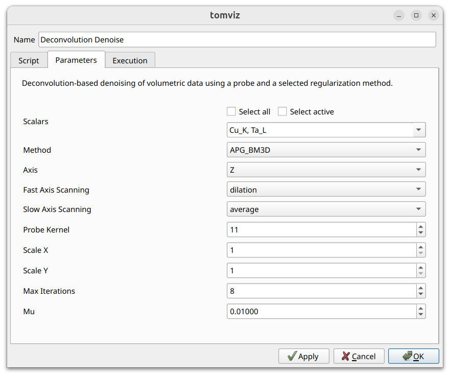
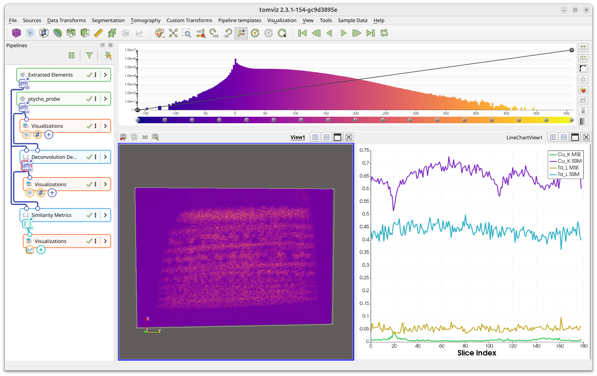
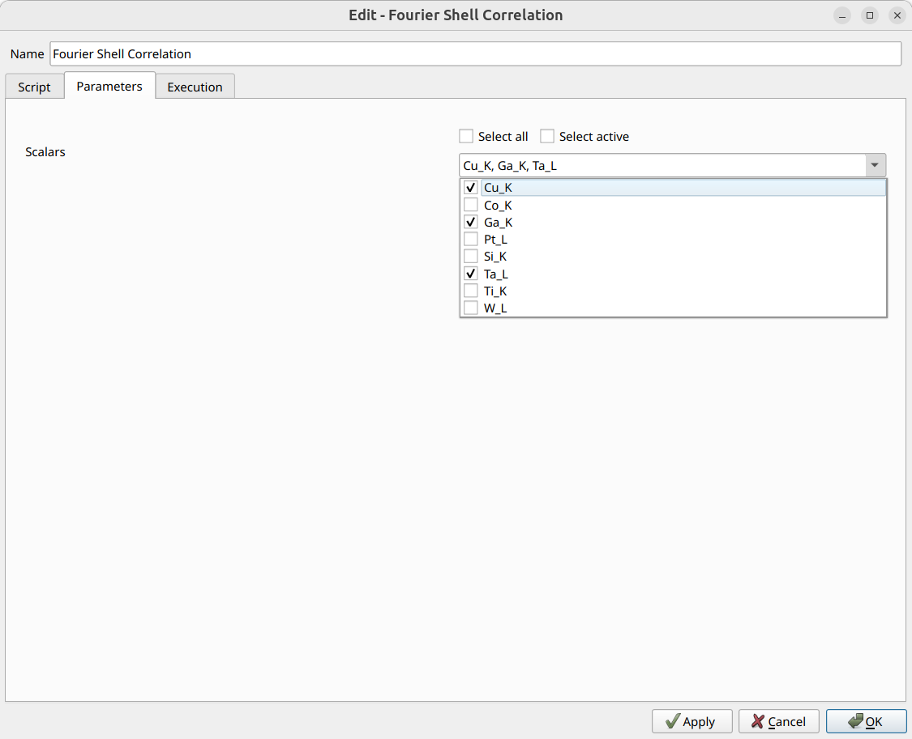
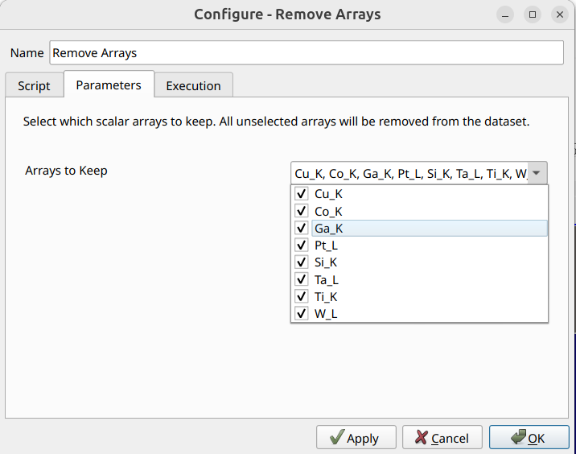
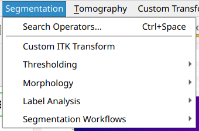

# Analysis

The analysis pipeline consists principally of data
[transforms](operators_catalog.md), which are pipeline objects that perform
various analytical functions on the volumetric data. The first place to look
would be the `Data Transforms` menu, along with the `Segmentation` menu.
Tomviz comes bundled with a full Python environment including NumPy, SciPy,
Python-wrapped ITK, and more.

## Data Transforms

Data transforms contain a number of useful transforms to analyze your data.
They are implemented in C++ or Python, and are organized in the
`Data Transforms` top-level menu into logical subcategories:

 * **Data Management** - Crop, Cylindrical Crop, Convert to Float, Convert
   Type, Transpose Data, Reinterpret Signed to Unsigned, Remove Arrays, Clone,
   Delete Data and Modules, Custom Transform
 * **Volume Manipulation** - Manual Manipulation, Shift Volume, Delete Slices,
   Pad Volume, Bin Volume x2, Resample, Rotate, Clear Subvolume, Swap Axes
 * **Math Operations** - Set Negative Voxels To Zero, Add Constant, Invert
   Data, Square Root Data, Clip Edges, Hann Window, FFT (abs log)
 * **Filters & Smoothing** - Gradient Magnitude, Unsharp Mask, Laplace
   Sharpen, Gaussian Blur, Wiener Filter, Remove Stripes, Curtaining,
   Scratches, Perona-Malik Anisotropic Diffusion, Median Filter, Circle Mask
 * **Material Analysis** - Tortuosity, Pore Size Distribution, Add Molecule
 * **Metrics & Spectral** - Power Spectrum Density, Fourier Shell Correlation,
   Deconvolution Denoise, Similarity Metrics

You can view the source code of the Python transforms and double-click them in
the pipeline to edit inputs or view the source code. All transforms run in a
background thread and the application remains interactive while they execute.

### Operator Search

Each of the Data Transforms, Segmentation, and Tomography menus includes a
`Search Operators...` entry at the top (with the keyboard shortcut
`Ctrl+Space`). Selecting this opens a search dialog where you can quickly
find any transform by typing part of its name. The dialog lists all available
transforms, with unavailable transforms (those that require a different input
data type) shown in a separate section at the bottom.

## Quality Metrics

Tomviz includes transforms for computing quality metrics on your data. These
produce tabular results displayed as interactive line charts using the
[Plot visualization](visualization.md#plot-visualization).

### Power Spectrum Density (PSD)

The Power Spectrum Density transform computes the 1D power spectrum of
volumetric data, which is useful for assessing data quality, identifying
periodic features, and evaluating noise characteristics.

The PSD transform automatically pads the data to cubic dimensions to prevent
errors from non-cubic inputs.

To run, navigate to `Data Transforms` > `Metrics & Spectral` >
`Power Spectrum Density`.

### Fourier Shell Correlation (FSC)

The Fourier Shell Correlation transform computes the FSC between two scalar
arrays in the dataset, providing a measure of similarity as a function of
spatial frequency. This is commonly used to assess the resolution of
tomographic reconstructions.

The FSC transform allows you to select which scalar arrays to use for the
correlation via a scalars subset selection interface.

To run, navigate to `Data Transforms` > `Metrics & Spectral` >
`Fourier Shell Correlation`.

### Deconvolution Denoise

The Deconvolution Denoise transform performs deconvolution-based denoising of
volumetric data using a ptychographic probe and a selected regularization
method. The probe's amplitude is used as a point spread function (PSF) and
deconvolution is applied slice-by-slice along a chosen axis.

Three methods are available: APG_BM3D (most accurate but slowest; requires
the `bm3d` package), APG_TV, and ADMM_TV. The probe dataset is provided via
the transform's second input port - link the probe source to it in the
pipeline. See the [operators catalog](operators_catalog.md#deconvolution-denoise)
for full details.

To run, navigate to `Data Transforms` > `Metrics & Spectral` >
`Deconvolution Denoise`.

### Similarity Metrics

The Similarity Metrics transform computes per-slice MSE (Mean Squared Error)
and SSIM (Structural Similarity Index) between the current dataset and a
reference dataset. The results are output as a table visualized as line charts
using the [Plot visualization](visualization.md#plot-visualization).

To run, navigate to `Data Transforms` > `Metrics & Spectral` >
`Similarity Metrics`.

See the [operators catalog](operators_catalog.md#similarity-metrics) for full
parameter details.

### Scalars Subset Selection

Several transforms include a scalars subset selection interface in their
dialog. This allows you to select which scalar arrays the transform should
process. The scalars are presented as a multi-select dropdown with checkboxes,
along with "Select all" and "Select active" convenience buttons. The
screenshot below shows this interface in the Fourier Shell Correlation dialog.

## Remove Scalar Arrays

The Remove Arrays transform allows you to remove unwanted scalar arrays from
a data source. The dialog presents a multi-select dropdown listing all scalar
arrays in the dataset. Select which arrays to keep - all unselected arrays
will be removed.

To use, navigate to `Data Transforms` > `Data Management` > `Remove Arrays`.

## Exporting Table Results as CSV

Transforms that produce table-based results (such as PSD and FSC) allow you
to export the results as CSV files. Right-click the transform in the pipeline
and select `Export Table as CSV`.

## Segmentation

Tomviz offers a number of segmentation routines that make use of ITK under the
`Segmentation` menu. These are organized into subcategories:

 * **Thresholding** - Binary Threshold, Otsu Multiple Threshold, Connected
   Components, Custom ITK Transform
 * **Morphology** - Binary Dilate, Binary Erode, Binary Open, Binary Close,
   Binary MinMax Curvature Flow
 * **Label Analysis** - Label Object Attributes, Label Object Principal Axes,
   Label Object Distance From Principal Axis
 * **Segmentation Workflows** - Segment Particles, Segment Pores

Segmentation results that produce label maps use a specialized colormap
generator to assign distinct colors to each label.
