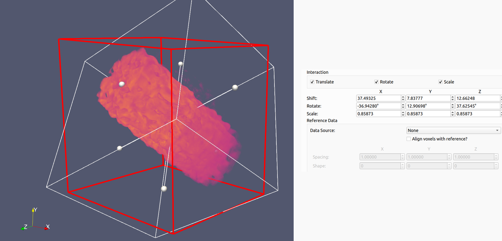
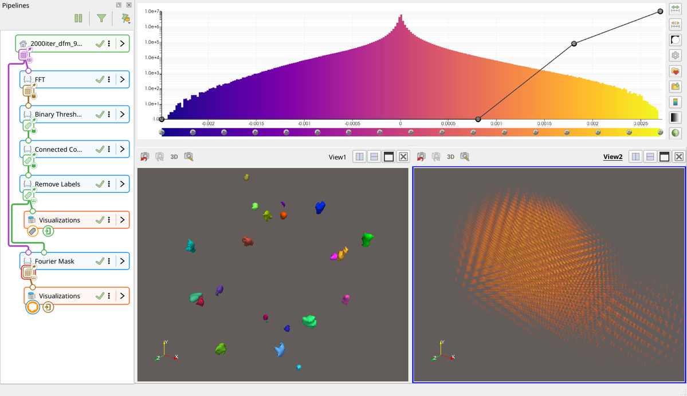

# Analysis

Analysis in Tomviz is done with data [transforms](operators_catalog.md),
pipeline objects that process the volumetric data. They are in the
`Data Transforms` and `Segmentation` menus. Tomviz comes bundled with a full
Python environment including NumPy, SciPy, Python-wrapped ITK, and more.

## Data Transforms

Transforms are written in C++ or Python. The `Data Transforms` menu has
`Custom Transform` at the top and the rest in these subcategories:

 * **Data Management** - Crop, Cylindrical Crop, Convert to Float, Convert
   Type, Transpose Data, Remove Arrays, Combine Datasets, Reinterpret Signed
   to Unsigned, Clone, Delete Data and Modules
 * **Volume Manipulation** - Manual Manipulation, Shift Volume, Delete Slices,
   Pad Volume, Bin Volume x2, Resample, Rotate, Clear Subvolume, Swap Axes,
   Registration
 * **Math Operations** - Set Negative Voxels To Zero, Add Constant, Invert
   Data, Square Root Data, Clip Edges, Hann Window, Fast Fourier Transform (FFT), Fourier
   Filter, Fourier Peak Mask, Fourier Mask, Image Math
 * **Filters & Smoothing** - Gradient Magnitude, Unsharp Mask, Laplace
   Sharpen, Gaussian Blur, Wiener Filter,
   `Remove Stripes, Curtaining, Scratches` (one transform), Perona-Malik Anisotropic Diffusion, Median Filter, Circle Mask
 * **Material Analysis** - Tortuosity, Pore Size Distribution, Add Molecule
 * **Metrics & Spectral** - Power Spectrum Density, Fourier Shell Correlation,
   Deconvolution Denoise, Similarity Metrics


Double-click a transform in the pipeline to edit its parameters or, for a
Python transform, view its source code. Transforms run in a background thread,
so the application stays interactive.

### Volume Manipulation

`Manual Manipulation` moves, rotates and scales a dataset by hand in the 3D
view. Check `Translate`, `Rotate` or `Scale` under `Interaction`, then:

 * drag the center handle (or middle-drag) to translate,
 * drag a face to rotate about the center,
 * drag the handles on the faces to scale along one axis (right-drag scales
   all three).

You can also type values into the `Shift`, `Rotate` and `Scale` boxes.

To line the dataset up with another, pick it as the `Data Source` under
`Reference Data`. The reference is shown centered on this dataset while you
work. `Align voxels with reference?` crops, pads and resamples the result
onto the reference's voxel grid.



`Registration` aligns one volume to another with Elastix. Add it to the
moving dataset and link the fixed dataset to its `Fixed Dataset` input in
the pipeline. The registration is rigid
(rotation and translation); check `Disable Rotation` for translation only.
The result is resampled onto the fixed dataset's grid. The installers include
the `itk-elastix` package it needs; with the conda package, install it with
pip.

`Rotate` has an `Expand to Fit` option, on by default, that grows the volume
so nothing is rotated out of it and pads the new corners with zeros. Turn it
off to keep the original size and crop the corners, for example for small
alignment rotations.

### Operator Search

Each of the Data Transforms, Segmentation, and Tomography menus includes a
`Search Operators...` entry at the top (with the keyboard shortcut
`Ctrl+Space`). It opens a dialog that finds a transform by any part of its
name. Transforms that cannot run on the active data are listed separately at
the bottom.


## Segmentation

The `Segmentation` menu has `Custom ITK Transform` at the top and the
segmentation transforms in these subcategories:

 * **Thresholding** - Binary Threshold, Otsu Multiple Threshold, Connected
   Components, Remove Labels
 * **Morphology** - Binary Dilate, Binary Erode, Binary Open, Binary Close,
   Binary MinMax Curvature Flow
 * **Label Analysis** - Label Object Attributes, Label Object Principal Axes,
   Label Object Distance From Principal Axis
 * **Segmentation Workflows** - Segment Particles, Segment Pores
 * **Machine Learning** - SAM 2 Segmentation (3D), SAM 3 Segmentation
   (3D); see [Machine Learning Segmentation](ml_segmentation.md)


Label maps from segmentation get a color map that gives each label a
distinct color.

The sliders of `Binary Threshold` span the data's scalar range. While the
dialog is open, they are linked to any `Threshold` visualization of the same
data, so you can find the thresholds in the 3D view and segment with exactly
those values.

`Connected Components` gives each group of touching foreground voxels its own
label; the largest component gets the highest label. **Connectivity** sets
what counts as touching: faces only (6 neighbors, the default), faces and
edges (18), or faces, edges and corners (26). **Minimum Size** returns
smaller components to the background, clearing the specks a noisy threshold
leaves.

`Remove Labels` sends chosen labels of a label map to the background, for
example before a [Fourier Mask](#fourier-mask). Check the labels to remove
in its dialog. While a
[Label Map](visualization.md#label-map) visualization of the same data is
open, the checkboxes are linked to it: hiding a label there checks it here,
and the other way around. `Renumber remaining labels` closes the gaps
afterwards; leave it off to keep the label colors in the visualization lined
up.


## Quality Metrics

These transforms are in `Data Transforms` -> `Metrics & Spectral`. Most
produce tables, shown as line charts with the
[Plot visualization](visualization.md#plot-visualization).

### Power Spectrum Density (PSD)

`Power Spectrum Density` computes the 1D power spectrum of the volume, for
assessing data quality, periodic features and noise. Non-cubic data is padded
to a cube first.


### Fourier Shell Correlation (FSC)

`Fourier Shell Correlation` estimates the resolution of a reconstruction. It
splits each selected array into two interleaved half-volumes and plots their
correlation as a function of spatial frequency, along with the one-bit and
half-bit threshold curves. Pick the arrays with the
[scalars selection](#scalars-subset-selection).


### Deconvolution Denoise

`Deconvolution Denoise` denoises data using a ptychographic probe and a
choice of regularization. The probe's amplitude is the point spread function
(PSF), and the deconvolution runs slice by slice along the chosen axis.

The methods are APG_BM3D (most accurate but slowest; needs the `bm3d`
package), APG_TV, and ADMM_TV. Link the probe dataset to the transform's
`Probe` input in the pipeline. See the
[operators catalog](operators_catalog.md#deconvolution-denoise) for details.


### Similarity Metrics

`Similarity Metrics` computes the per-slice MSE (mean squared error) and SSIM
(structural similarity index) between the dataset and a reference dataset
linked to its second input.


See the [operators catalog](operators_catalog.md#similarity-metrics) for full
parameter details.

### Scalars Subset Selection

Several transforms let you pick which scalar arrays they process from a
dropdown, with `Select all` and `Select active` checkboxes. Here it is in the
Fourier Shell Correlation dialog:


## Fourier-Space Filtering

These transforms filter data in Fourier space and transform the result back
to real space, for example to isolate periodic structure or to remove low- or
high-frequency content. They are in `Data Transforms` -> `Math Operations`.

<!-- The note below is a condition of using the dataset: it must stay
     directly with the video wherever the video appears (here and the
     video's description on Google Drive). -->

```{raw} html
<div style="position: relative; padding-bottom: 56.25%; height: 0; overflow: hidden; max-width: 100%; margin-bottom: 1.5em;">
  <iframe src="https://drive.google.com/file/d/1OiP90HB9BLMrn6PlpUWBBwJtrgn_eSwW/preview" style="position: absolute; top: 0; left: 0; width: 100%; height: 100%;" frameborder="0" allow="autoplay; encrypted-media" allowfullscreen></iframe>
</div>
```

:::{note}
The dataset used to demonstrate this workflow in the Tomviz tutorial video is
an X-ray ptychographic tomography reconstruction of a DNA-assembled FCC
superlattice of 20 nm gold nanoparticles, recorded at NSLS-II. It comes from
A. Michelson, B. Minevich, H. Emamy, X. Huang, Y. S. Chu, H. Yan and O. Gang,
"Three-dimensional visualization of nanoparticle lattices and multimaterial
frameworks", *Science* **376**, 203-207 (2022),
[doi:10.1126/science.abk0463](https://doi.org/10.1126/science.abk0463). It is
shown with the authors' permission; please cite that paper for any use of the
data.
:::

### Viewing the spectrum

`Fast Fourier Transform (FFT)` replaces the data with the log magnitude of its
3D Fourier transform, scaled to a maximum of 1, with the zero-frequency (DC)
term in the middle of the volume. Add it as a branch off your data, and add
the filtering transforms below to the original data. The spectrum is only for
viewing and picking peaks; the filters do their own transforms and return
real-space data.

Distances in the spectrum are in *frequency bins* (voxels from the center),
the unit the filtering transforms use. Peaks away from the center are
periodic structure. Hovering over a `Slice` of the spectrum shows the voxel
index under the cursor in the status bar.


:::{note}
Data from A. Michelson et al., *Science* **376**, 203-207 (2022),
[doi:10.1126/science.abk0463](https://doi.org/10.1126/science.abk0463), shown
with the authors' permission; please cite that paper for any use of the data.
:::

### Fourier Filter

The `Fourier Filter` transform applies a radially symmetric filter to the
spectrum and transforms back:

 * **Low pass** keeps frequencies inside the cutoff radius, smoothing the
   data.
 * **High pass** keeps frequencies outside it, emphasizing edges and fine
   detail.
 * **Band pass** keeps a spherical shell of frequencies centered on the cutoff
   radius, isolating a single length scale.

**Cutoff Radius** is in frequency bins from the center of the spectrum.
**Width** softens the edge of a low or high pass (`0` gives a hard cutoff)
and sets the thickness of the shell for a band pass. A band pass also offers
a choice of **Band Profile**: Gaussian, Hann, Rectangular, or Erf.

By default one 3D filter is applied to the whole volume. Set
**Dimensionality** to 2D to filter each slice perpendicular to the
**Slice Axis** instead, for stacks of independent images.

Filtering in Fourier space is the same as convolving the data with the
filter's real-space kernel. `Gaussian Blur` convolves in real space directly.

### Fourier Peak Mask

`Fourier Peak Mask` keeps only the neighborhoods of chosen peaks, like
selected-area electron diffraction: only the periodicities of those peaks
survive in the real-space result.

With **Auto-detect Peaks** checked (the default), the transform finds the
peaks itself. Each region above **Threshold**, on the scale that
`Fast Fourier Transform (FFT)` displays, becomes a peak. Regions within
**Exclude Center Radius** bins of the center, or smaller than
**Min Peak Size** voxels, are skipped. The strongest **Max Peaks** are kept,
counting a peak and its Friedel mate as one. To choose the threshold, add a
`Threshold` visualization to an FFT branch, adjust it until only the peaks
remain, and enter its value.

The peaks found are written into **Peak Centers**. To edit them, uncheck
**Auto-detect Peaks**, remove or add peaks, and run again. Peaks are `x, y, z`
voxel indices into the centered spectrum, separated by semicolons, as read off
an FFT branch. You can also give a **Peak Centers CSV** file with one `x,y,z`
row per peak, with or instead of typed peaks.

Each peak is masked with a soft sphere: **Window Radius** sets its size and
**Edge Softness** the width of its edge, both in frequency bins.
**Include Friedel Mates** (on by default) also keeps each peak's mirror image
across the center. With it off, only one side of the spectrum is kept and the
result has half the amplitude.


:::{note}
Data from A. Michelson et al., *Science* **376**, 203-207 (2022),
[doi:10.1126/science.abk0463](https://doi.org/10.1126/science.abk0463), shown
with the authors' permission; please cite that paper for any use of the data.
:::

### Fourier Mask

`Fourier Mask` keeps whatever parts of the spectrum a *mask volume*, its
second input, covers. Use it instead of the Peak Mask when the regions to keep
have their own shapes, or to see and edit the selection before applying it:

1. Add `Fast Fourier Transform (FFT)` as a branch off your dataset.
2. On that branch, add a `Threshold` visualization and adjust it until only
   the peaks show, then run `Binary Threshold` (its sliders follow the
   visualization). To drop some of the regions, run `Connected Components`,
   view the result as a `Label Map`, hide the components you do not want, and
   run `Remove Labels` (see [Segmentation](#segmentation)).
3. On the original dataset, run `Fourier Mask` and connect the thresholded
   branch to its `Mask` input by dragging a link from its output port in the
   pipeline.

Non-zero mask voxels are kept. With **Include Friedel Mates** on (the
default), their mirror images are kept too, so masking one side of a peak
pair is enough. **Edge Softness** blurs the mask edges by that many frequency
bins; keep it above zero, since a hard cut rings in real space.
**Invert Mask** removes the selected regions instead, for example to strip a
periodic artifact out of an image.



Above, `Binary Threshold` (0.6 to 1) selects the bright regions of the
spectrum, `Connected Components` with a **Minimum Size** of 5 clears the
specks, and `Remove Labels` drops the zero-frequency peak at the center,
leaving 22 Bragg peaks for the mask.

:::{note}
Data from A. Michelson et al., *Science* **376**, 203-207 (2022),
[doi:10.1126/science.abk0463](https://doi.org/10.1126/science.abk0463), shown
with the authors' permission; please cite that paper for any use of the data.
:::

### Combine Datasets

`Combine Datasets` (Data Management) adds the active array of the dataset
linked to its `Second Dataset` input to this dataset as another scalar array.
Both datasets must have the same shape.

### Image Math

`Image Math` combines two datasets voxel by voxel: subtract, add, multiply,
or divide. Link the second dataset to the `Second Dataset` input by dragging
from its output port in the pipeline. The result replaces the active array of
the dataset the transform was added to. Dividing by zero gives zero.

**Normalize First** divides each array by its own mean before combining, for
datasets on different intensity scales such as two elemental channels.

The two datasets normally need the same shape. **Resample To Match**
stretches a second dataset of a different shape onto this dataset's voxel
grid, for example to combine a half-resolution XRF map with a ptychography
reconstruction. Both must cover the same field of view. Add the transform to
the higher-resolution dataset to keep its detail.

## Remove Scalar Arrays

`Data Transforms` -> `Data Management` -> `Remove Arrays` removes unwanted
scalar arrays. Check the arrays to keep in its dropdown; the rest are removed.


## Exporting Table Results as CSV

To save a table (such as PSD or FSC output) as CSV, right-click the
transform, or its table output port, in the pipeline and choose `Save Data`.
