# Analysis

The analysis pipeline consists principally of data
[transforms](operators_catalog.md), which are pipeline objects that perform
various analytical functions on the volumetric data. The first place to look
would be the `Data Transforms` menu, along with the `Segmentation` menu.
Tomviz comes bundled with a full Python environment including NumPy, SciPy,
Python-wrapped ITK, and more.

## Data Transforms

Data transforms contain a number of useful transforms to analyze your data.
They are implemented in C++ or Python, and are organized in the
`Data Transforms` top-level menu into logical subcategories, with
`Custom Transform` at the top of the menu:

 * **Data Management** - Crop, Cylindrical Crop, Convert to Float, Convert
   Type, Transpose Data, Remove Arrays, Combine Datasets, Reinterpret Signed
   to Unsigned, Clone, Delete Data and Modules
 * **Volume Manipulation** - Manual Manipulation, Shift Volume, Delete Slices,
   Pad Volume, Bin Volume x2, Resample, Rotate, Clear Subvolume, Swap Axes,
   Registration
 * **Math Operations** - Set Negative Voxels To Zero, Add Constant, Invert
   Data, Square Root Data, Clip Edges, Hann Window, Fast Fourier Transform (FFT), Fourier
   Filter, Fourier Peak Mask, Fourier Mask, Image Math
 * **Filters & Smoothing** - Gradient Magnitude, Unsharp Mask, Laplace
   Sharpen, Gaussian Blur, Wiener Filter, Remove Stripes, Curtaining,
   Scratches, Perona-Malik Anisotropic Diffusion, Median Filter, Circle Mask
 * **Material Analysis** - Tortuosity, Pore Size Distribution, Add Molecule
 * **Metrics & Spectral** - Power Spectrum Density, Fourier Shell Correlation,
   Deconvolution Denoise, Similarity Metrics

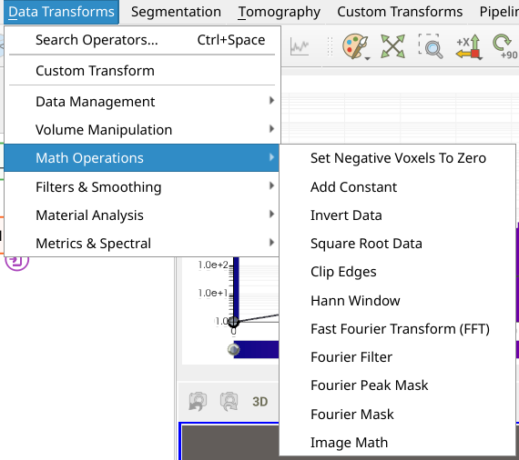

You can view the source code of the Python transforms and double-click them in
the pipeline to edit inputs or view the source code. All transforms run in a
background thread and the application remains interactive while they execute.

### Operator Search

Each of the Data Transforms, Segmentation, and Tomography menus includes a
`Search Operators...` entry at the top (with the keyboard shortcut
`Ctrl+Space`). Selecting this opens a search dialog where you can quickly
find any transform by typing part of its name. The dialog lists all available
transforms, with unavailable transforms (those that require a different input
data type) shown in a separate section at the bottom.

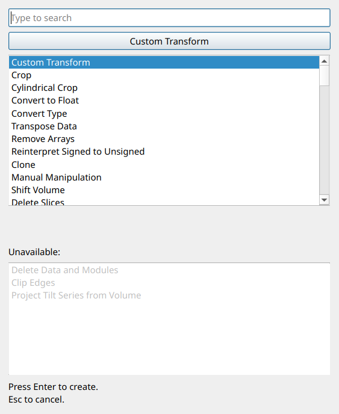

## Quality Metrics

Tomviz includes transforms for computing quality metrics on your data. These
produce tabular results displayed as interactive line charts using the
[Plot visualization](visualization.md#plot-visualization).

### Power Spectrum Density (PSD)

The Power Spectrum Density transform computes the 1D power spectrum of
volumetric data, which is useful for assessing data quality, identifying
periodic features, and evaluating noise characteristics.

The PSD transform automatically pads the data to cubic dimensions to prevent
errors from non-cubic inputs.

To run, navigate to `Data Transforms` > `Metrics & Spectral` >
`Power Spectrum Density`.

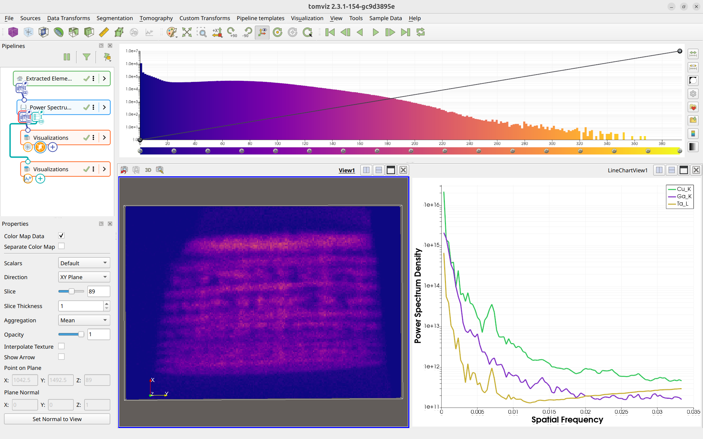

### Fourier Shell Correlation (FSC)

The Fourier Shell Correlation transform computes the FSC between two scalar
arrays in the dataset, providing a measure of similarity as a function of
spatial frequency. This is commonly used to assess the resolution of
tomographic reconstructions.

The FSC transform allows you to select which scalar arrays to use for the
correlation via a scalars subset selection interface.

To run, navigate to `Data Transforms` > `Metrics & Spectral` >
`Fourier Shell Correlation`.

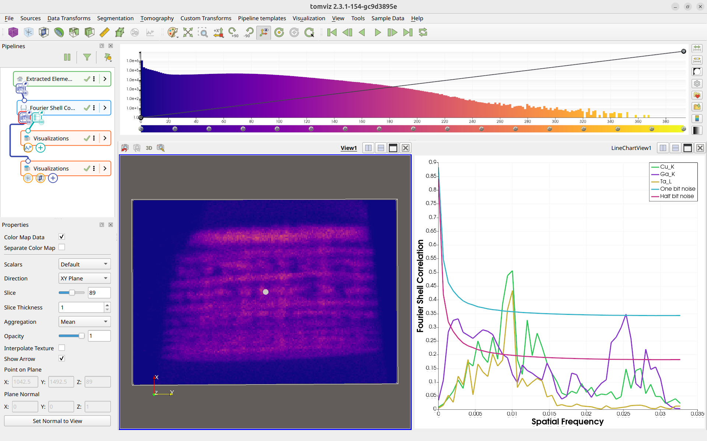

### Deconvolution Denoise

The Deconvolution Denoise transform performs deconvolution-based denoising of
volumetric data using a ptychographic probe and a selected regularization
method. The probe's amplitude is used as a point spread function (PSF) and
deconvolution is applied slice-by-slice along a chosen axis.

Three methods are available: APG_BM3D (most accurate but slowest; requires
the `bm3d` package), APG_TV, and ADMM_TV. The probe dataset is provided via
the transform's second input port - link the probe source to it in the
pipeline. See the [operators catalog](operators_catalog.md#deconvolution-denoise)
for full details.

To run, navigate to `Data Transforms` > `Metrics & Spectral` >
`Deconvolution Denoise`.

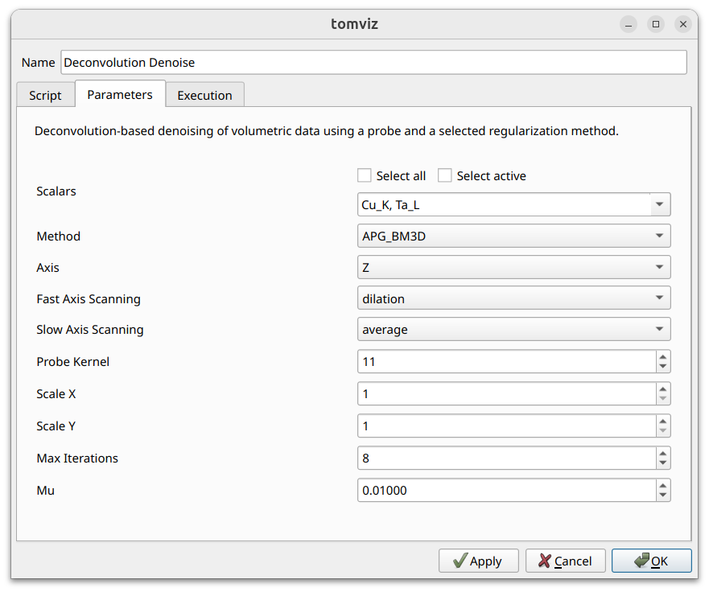

### Similarity Metrics

The Similarity Metrics transform computes per-slice MSE (Mean Squared Error)
and SSIM (Structural Similarity Index) between the current dataset and a
reference dataset. The results are output as a table visualized as line charts
using the [Plot visualization](visualization.md#plot-visualization).

To run, navigate to `Data Transforms` > `Metrics & Spectral` >
`Similarity Metrics`.

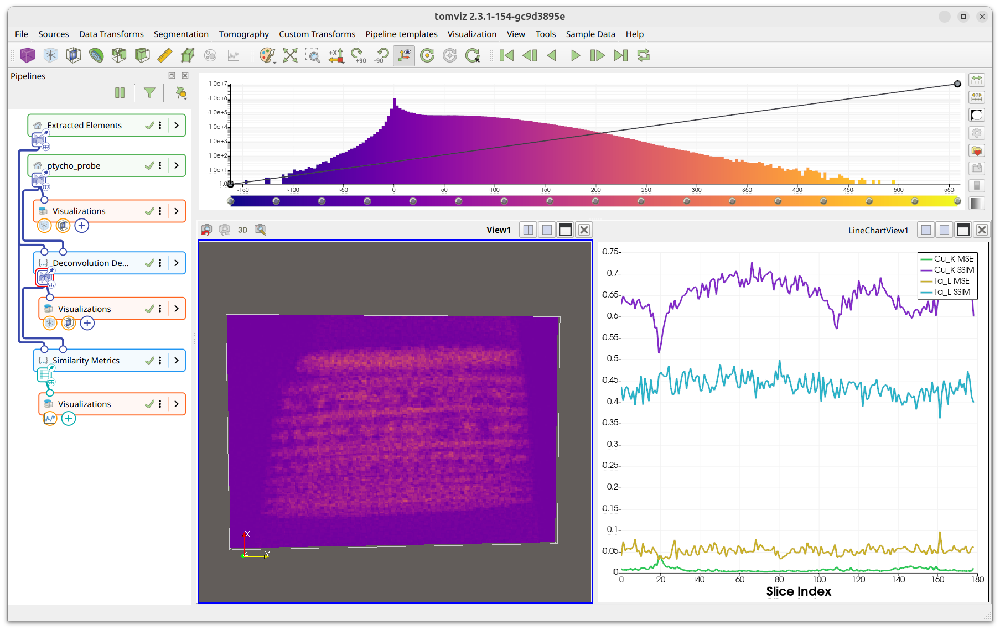

See the [operators catalog](operators_catalog.md#similarity-metrics) for full
parameter details.

### Scalars Subset Selection

Several transforms include a scalars subset selection interface in their
dialog. This allows you to select which scalar arrays the transform should
process. The scalars are presented as a multi-select dropdown with checkboxes,
along with "Select all" and "Select active" convenience buttons. The
screenshot below shows this interface in the Fourier Shell Correlation dialog.

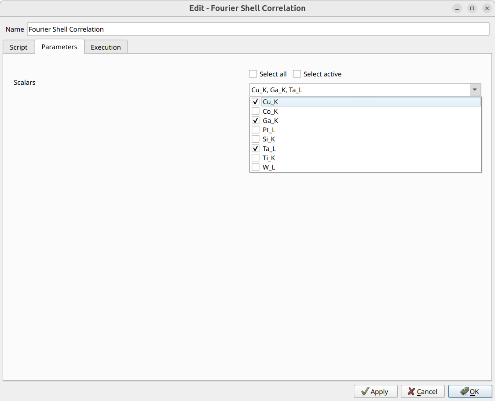

## Fourier-Space Filtering

Tomviz can filter data in reciprocal (Fourier) space and transform the result
back to real space. This is useful for isolating periodic structure, removing
low- or high-frequency content, and examining which spatial frequencies carry
the features of interest.

All of these transforms are in `Data Transforms` > `Math Operations`.

<!-- The note below is a condition of using the dataset: it must stay
     directly with the video wherever the video appears (here and the
     video's description on Google Drive). -->

```{raw} html
<div style="position: relative; padding-bottom: 56.25%; height: 0; overflow: hidden; max-width: 100%; margin-bottom: 1.5em;">
  <iframe src="https://drive.google.com/file/d/1OiP90HB9BLMrn6PlpUWBBwJtrgn_eSwW/preview" style="position: absolute; top: 0; left: 0; width: 100%; height: 100%;" frameborder="0" allow="autoplay; encrypted-media" allowfullscreen></iframe>
</div>
```

:::{note}
The dataset used to demonstrate this workflow in the Tomviz tutorial video is
an X-ray ptychographic tomography reconstruction of a DNA-assembled FCC
superlattice of 20 nm gold nanoparticles, recorded at NSLS-II. It comes from
A. Michelson, B. Minevich, H. Emamy, X. Huang, Y. S. Chu, H. Yan and O. Gang,
"Three-dimensional visualization of nanoparticle lattices and multimaterial
frameworks", *Science* **376**, 203-207 (2022),
[doi:10.1126/science.abk0463](https://doi.org/10.1126/science.abk0463). It is
shown with the authors' permission; please cite that paper for any use of the
data.
:::

### Viewing the spectrum

Start with `Fast Fourier Transform (FFT)`, which replaces the data with the log magnitude of
its 3D Fourier transform, centered so that the zero-frequency (DC) term sits at
the middle of the volume. Add it as a branch off your data rather than in the
main line of the pipeline, since it overwrites the array: select the data
source, add the transform, and the filtering transforms below can still be
added to the source itself. Distances in this view are measured in *frequency
bins* (voxels from the center), which is the unit the filtering transforms
below use, and peaks away from the center correspond to periodic structure in
the data. Hovering over the spectrum shows the voxel index under the cursor
in the status bar.

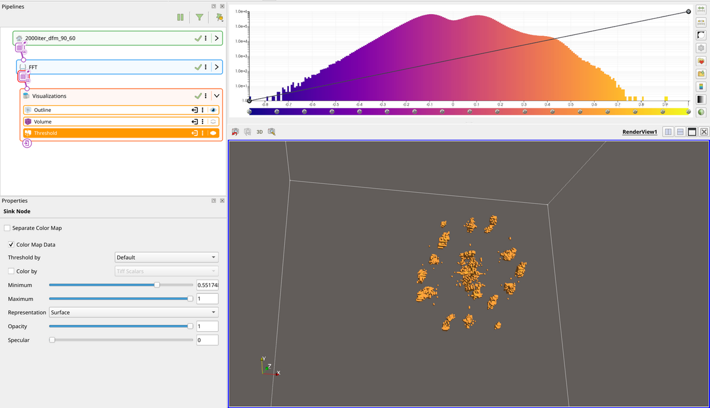

### Fourier Filter

The `Fourier Filter` transform applies a radially symmetric filter to the
spectrum and transforms back:

 * **Low pass** keeps frequencies inside the cutoff radius, smoothing the
   data.
 * **High pass** keeps frequencies outside it, emphasizing edges and fine
   detail. It is the exact complement of the low pass: for a hard cutoff, a
   low pass plus a high pass reconstructs the original data.
 * **Band pass** keeps a spherical shell of frequencies centered on the cutoff
   radius, isolating a single length scale.

The **Cutoff Radius** is measured in frequency bins from the center of the
spectrum. **Width** softens the edge of a low or high pass (use `0` for a hard
cutoff) and sets the thickness of the shell for a band pass. A band pass also
offers a choice of radial profile - Gaussian, Hann, Rectangular, or Erf.

By default one 3D filter is applied to the whole volume. Setting
**Dimensionality** to 2D instead applies the same filter to every slice
perpendicular to the chosen axis, which is what you want when the slices are
independent images rather than samples of one 3D structure.

### Fourier Peak Mask

Where the Fourier Filter keeps a whole shell, the `Fourier Peak Mask`
transform keeps only the neighborhoods of specific peaks. It is the
equivalent of selected-area electron diffraction: only the periodicities
represented by the chosen peaks survive into the filtered real-space result.

With **Auto-detect Peaks** checked (the default) the transform finds the peaks
itself. It thresholds the normalized log magnitude of the spectrum, the same
quantity `Fast Fourier Transform (FFT)` displays, labels the connected regions above the
**Threshold**, and takes the strongest voxel of each as a peak. Regions
within **Exclude Center Radius** bins of the center are skipped, since the
zero-frequency term and the low frequencies around it are always the
brightest part of the spectrum, and regions smaller than **Min Peak Size**
voxels are treated as noise. The strongest **Max Peaks** are kept, counting a
peak and its Friedel mate as one. To choose the threshold, add a `Threshold`
visualization to a `Fast Fourier Transform (FFT)` branch and adjust it until only the peaks
remain; the value it shows is the one to enter.

The peaks found are written into the **Peak Centers** field. Uncheck
**Auto-detect Peaks** to see them, remove any you do not want, or add your
own, and run again. Peaks are entered as `x, y, z` voxel indices into the
centered spectrum, separated by semicolons, exactly as shown by
`Fast Fourier Transform (FFT)`. A CSV file with one `x,y,z` row per peak can be selected as
well - its peaks are used in addition to, or instead of, any typed above
(header lines and extra columns are ignored).

Each peak is masked with a soft spherical window: **Window Radius** sets its
size and **Edge Softness** the width of its erf transition, both in frequency
bins. Because the spectrum of real data is symmetric about the center, every
peak has a mirror-image partner; **Include Friedel Mates** keeps those too,
which is almost always what you want. Leaving it off keeps only one side of
the spectrum and halves the amplitude of the result.

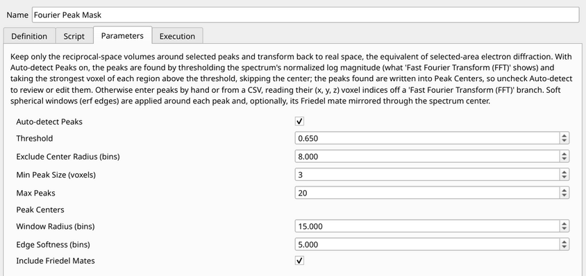

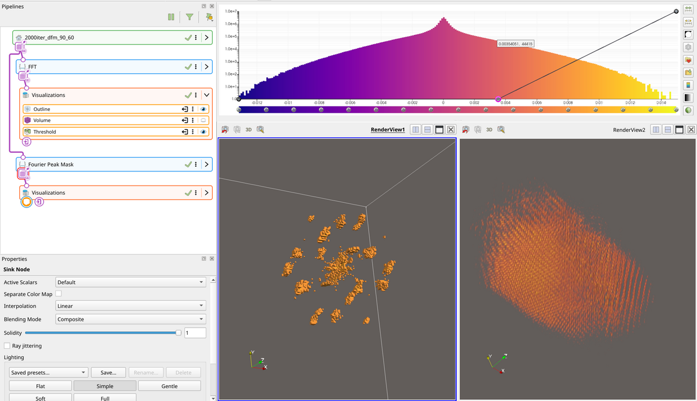

### Fourier Mask

The Peak Mask keeps spheres of one size around every peak. When the regions
to keep have their own shapes, or you want to see and edit the selection
before it is applied, build it as a segmentation instead. The `Fourier Mask`
transform takes a *mask volume* as its second input and keeps whatever parts
of the spectrum the mask covers:

1. Add `Fast Fourier Transform (FFT)` as a branch off your dataset.
2. On that branch, add a `Threshold` visualization and adjust it until only
   the peaks show, then run `Binary Threshold`: its sliders follow the
   visualization, so the segmentation matches what you see. To pick and
   choose among the regions, run `Connected Components`, view the result as
   a `Label Map`, hide the components you do not want, and run
   `Remove Labels`, which takes the hidden ones out (see
   [Segmentation](#segmentation)).
3. On the original dataset, run `Fourier Mask` and connect the thresholded
   branch to its `Mask` input by dragging a link from its output port in the
   pipeline.

Non-zero mask voxels are kept along with their Friedel mates, so masking one
side of a peak pair is enough. **Edge Softness** blurs the mask edges by the
given number of frequency bins before it is applied; keep this above zero,
since a hard cut rings in real space. **Invert Mask** removes the selected
regions instead of keeping them, which is a quick way to strip a periodic
artifact out of an image.

### Combine Datasets

`Combine Datasets` (Data Management) adds the active array of a second
dataset, linked to its `Second Dataset` input, to this dataset as another
scalar array. Both datasets must have the same shape.

### Image Math

The `Image Math` transform combines two datasets voxel by voxel: subtract,
add, multiply, or divide. Link the second dataset to the transform's
`Second Dataset` input by dragging from its output port in the pipeline; the
result replaces the active array of the dataset the transform was added to. Division leaves zeros where the divisor is zero rather
than producing infinities, so the result stays renderable.

Enable **Normalize First** to divide each array by its own mean intensity
before combining. This makes datasets acquired on different intensity scales -
two elemental channels, or two reconstructions of the same specimen - directly
comparable, so that a subtraction shows structural differences rather than a
difference in overall brightness.

The two datasets normally need the same shape. Enable **Resample To Match**
to stretch a second dataset of a different shape onto this dataset's voxel
grid first, so a half-resolution XRF map can be subtracted from, or used as
the background of, a ptychography reconstruction. The two are assumed to
cover the same field of view, and it is worth adding the transform to the
higher-resolution dataset so that its detail is kept. An axis that differs by
only a voxel or two, such as an extra row in one acquisition, is trimmed or
padded rather than stretched.

## Remove Scalar Arrays

The Remove Arrays transform allows you to remove unwanted scalar arrays from
a data source. The dialog presents a multi-select dropdown listing all scalar
arrays in the dataset. Select which arrays to keep - all unselected arrays
will be removed.

To use, navigate to `Data Transforms` > `Data Management` > `Remove Arrays`.

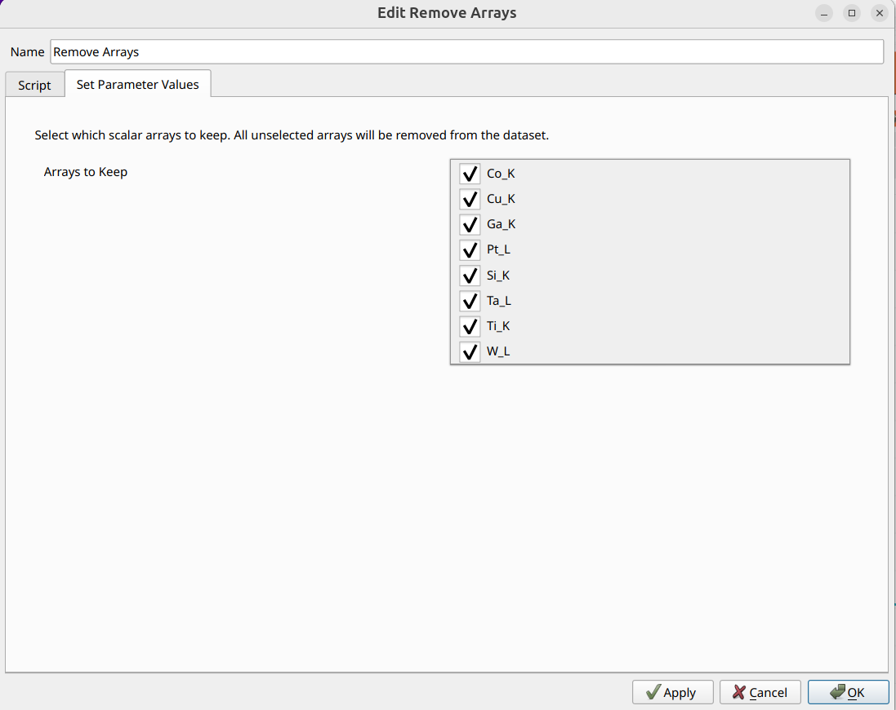

## Exporting Table Results as CSV

Transforms that produce table-based results (such as PSD and FSC) allow you
to export the results as CSV files. Right-click the transform in the pipeline
and select `Export Table as CSV`.

## Segmentation

Tomviz offers a number of segmentation routines under the `Segmentation`
menu. The thresholding and morphology transforms run on NumPy and SciPy, so
they need no conversion of the volume and start instantly; Otsu, curvature
flow, the label analyses, the workflows and the Custom ITK Transform use ITK.
These are organized into subcategories, with `Custom ITK Transform` at the
top of the menu:

 * **Thresholding** - Binary Threshold, Otsu Multiple Threshold, Connected
   Components, Remove Labels
 * **Morphology** - Binary Dilate, Binary Erode, Binary Open, Binary Close,
   Binary MinMax Curvature Flow
 * **Label Analysis** - Label Object Attributes, Label Object Principal Axes,
   Label Object Distance From Principal Axis
 * **Segmentation Workflows** - Segment Particles, Segment Pores
 * **Machine Learning** - SAM 2 Segmentation (3D), SAM 3 Segmentation
   (3D); see [Machine Learning Segmentation](ml_segmentation.md)

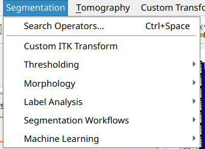

Segmentation results that produce label maps use a specialized colormap
generator to assign distinct colors to each label.

`Binary Threshold`'s lower and upper sliders span the data's actual scalar
range rather than assuming 8-bit data. When a `Threshold` visualization of
the same data exists, the sliders are linked to it while the dialog is open:
dragging a slider moves the visualization's range and adjusting the
visualization moves the slider, so you can find the right thresholds
interactively in the 3D view and segment with exactly those values.

`Connected Components` gives every group of touching foreground voxels its
own label, numbered by size so the largest component carries the highest
label. **Connectivity** decides what counts as touching: faces only (6
neighbors, the default), faces and edges (18), or faces, edges and corners
(26). **Minimum Size** returns components with fewer voxels than that to the
background, which clears the specks a noisy threshold leaves behind. There
is no limit on the number of components; the label type widens as needed.

`Remove Labels` sends chosen labels of a label map to the background, and is
the way to drop components you do not want before a later step such as
[Fourier Mask](#fourier-mask). Its dialog lists the labels in the input with
a box to tick for each. While a [Label Map](visualization.md#label-map)
visualization of the same data is open, the ticks are linked to it: hiding a
label there ticks it here, and ticking one here hides it there, so the view
shows exactly what will be kept. Labels can also be typed as a list such as
`3, 5, 10-14`. **Renumber Remaining Labels** closes the gaps afterwards;
leave it off to keep the names and colors given to the labels in the
visualization lined up.

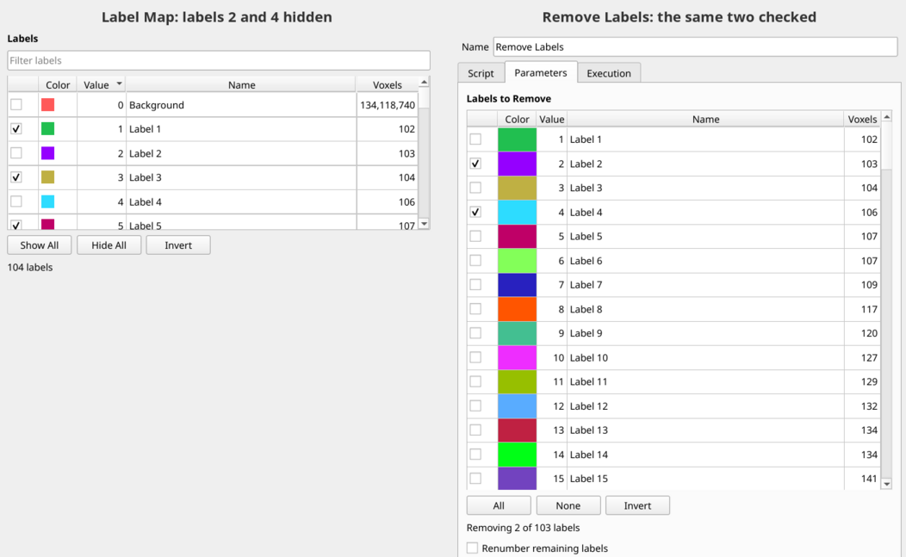
