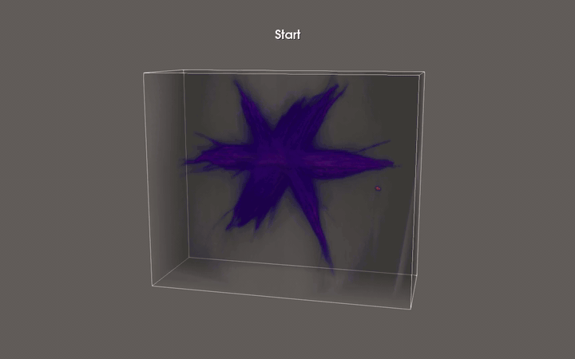
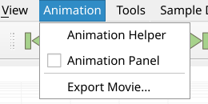

# Animation



Tomviz can animate a scene and export it as a movie. The camera flies
through saved viewpoints or orbits the data, and visualizations can change
along the way. The `Play` button in the toolbar, with nothing set up, spins
the camera around the data. Everything else is in the `Animation` menu.



For time series, see [Time Series](time_series.md).

## Animation Helper

```{raw} html
<div style="position: relative; padding-bottom: 56.25%; height: 0; overflow: hidden; max-width: 100%; margin-bottom: 1.5em;">
  <iframe src="https://drive.google.com/file/d/1iP4xu-RYXccXjCk9W-rW4yyreNBi0B7Z/preview" style="position: absolute; top: 0; left: 0; width: 100%; height: 100%;" frameborder="0" allow="autoplay; encrypted-media" allowfullscreen></iframe>
</div>
```

### Viewpoints

Open `Animation Helper` from the `Animation` menu. Frame the view, click
`Add Current View`, and repeat. `Play` and `Export Movie` then fly the camera
through the viewpoints in order.

Each leg, from one viewpoint to the next, has its own number of frames (100
by default) and `Ease In/Out`. A leg of 0 frames cuts straight to the next
viewpoint. The total length is shown at the bottom of the helper.

Drag viewpoints to reorder them, double-click one to go there, or
right-click for `Rename`, `Go To`, `Update From Current View` and `Remove`.
`Clear All Animations` removes everything.


### Orbits

Check `Add orbit` on a viewpoint and the camera circles the data there, for
the turns and frames you choose, before flying on. A single orbiting
viewpoint is an animation by itself; this is what `Play` creates when
nothing else is set up.

### Recorded changes

With `Record module state with viewpoints` checked (the default), each
viewpoint also stores how the visualizations looked: visibility, opacity,
slice and clip positions, contour and threshold values, hidden labels, the
volume's opacity curve and solidity, and its `Cut Out` and `Exploded View`
settings. Anything that differs between two viewpoints animates on the leg
between them.

These changes are listed on the `Visualizations` tab, marked *recorded*. To
change one, go to the viewpoint, adjust the scene and click
`Update From View`.

### Your own animations

To animate one property by itself, pick the `Data Source`, the
`Visualization` and what to `Animate`, set the start and stop values, and
click `Add Animation`. It can run over the whole animation or during one
leg. For a volume's `Opacity curve`, select a viewpoint and click
`Capture Current Curve` instead; the curve morphs between the captured
viewpoints. What can be animated depends on the visualization:

 * **Contour**: iso value, opacity.
 * **Slice** and **Clip**: position, opacity.
 * **Threshold**: either end of the range, opacity.
 * **Volume**: opacity curve, solidity, exploded view and cut-out.
 * **Label Map**: surface opacity, solidity, exploded view and cut-out.


### Captions

Give a viewpoint a `Label` and its text is shown in the view, and in
exported movies, from that viewpoint until the next. `Label position` sets
where captions are centered, as a fraction of the view's width and height
(the default, `0.5, 0.05`, is the bottom middle).

## Export Movie

`Export Movie...` in the `File` and `Animation` menus records the
animation. Choose the `Format` (MP4 video, Ogg Theora video when available,
or a PNG image sequence), `File`, `Resolution`, `Frame rate` and `Quality`,
then click `Export`. MP4 needs FFmpeg, which the installers include.


