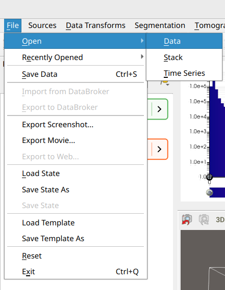
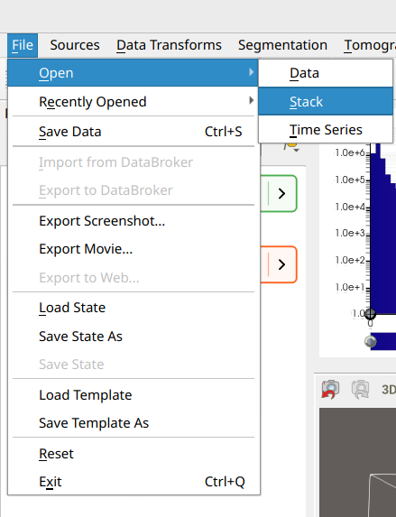
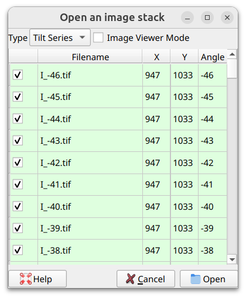
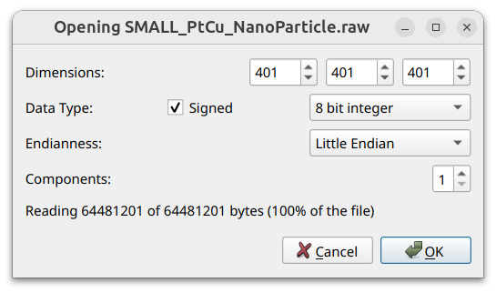
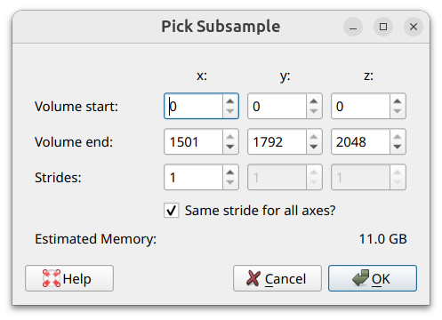
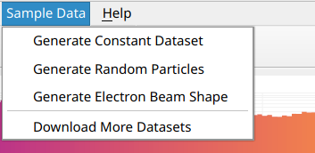
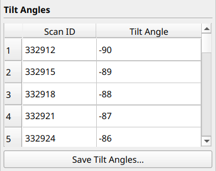
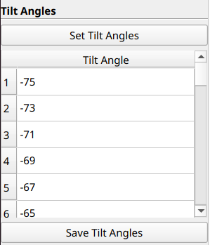
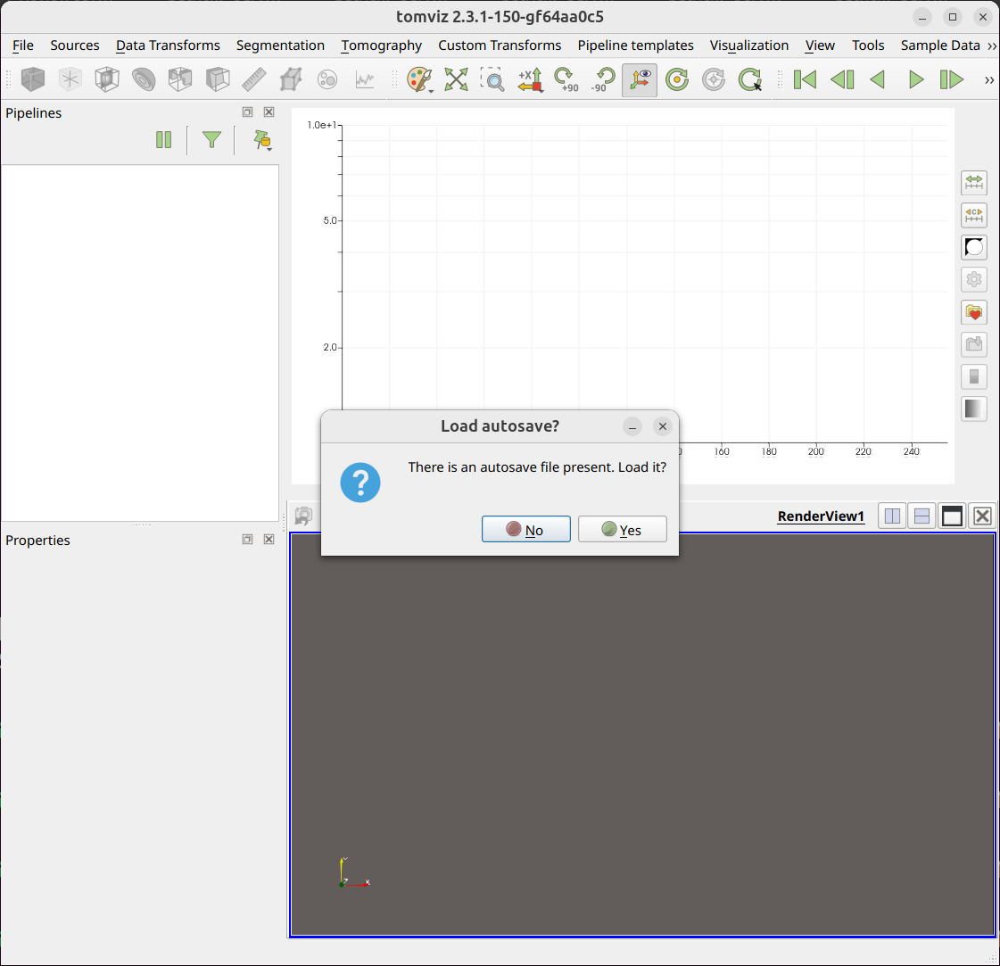
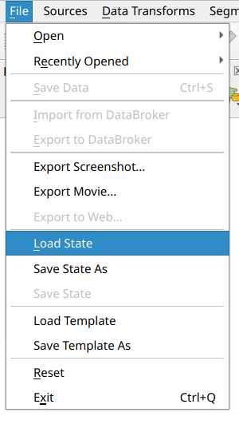

# Data

Typical data sets may have following relationships between attributes and sizes.

| Volume          | Voxels        | Size (char) | Size (int) |
|  :---           |  :---         |    :---     | :---       |
| 64<sup>3</sup>  | 262,144       | 0.25 MB     | 1 MB       |
| 128<sup>3</sup> | 2,097,152     | 2.00 MB     | 8 MB       |
| 256<sup>3</sup> | 16,777,216    | 16.00 MB    | 64 MB      |
| 512<sup>3</sup> | 134,217,728   | 128.00 MB   | 512 MB     |
| 1024<sup>3</sup>| 1,073,741,824 | 1,024.00 MB | 4096 MB    |

## Load data

In this section, loading methods for three data categories - single data file,
stack of images, and raw data set - are introduced.

### Single data file

Loading a single dataset is straightforward. Select `Open` > `Data` from the
`File` menu.



Tomviz supports the following file formats for reading:

| Format | Extensions | Notes |
| :--- | :--- | :--- |
| EMD | `.emd` | Electron Microscopy Data format (HDF5-based) |
| TIFF | `.tiff`, `.tif` | Including multi-file stacks |
| MRC | `.mrc`, `.st`, `.rec`, `.ali` | Electron microscopy format |
| HDF5 | `.h5`, `.hspy` | Auto-detects DataExchange, FXI, HyperSpy, or generic |
| DICOM | `.dcm` | Enhanced (single-file) DICOM only; classic multi-file DICOM is not yet supported (requires ITK) |
| NumPy | `.npy` | NumPy binary arrays |
| MATLAB | `.mat` | MATLAB v7.2 and earlier |
| VTK ImageData | `.vti` | VTK XML format |
| Meta Image | `.mhd`, `.mha` | ITK Meta Image format |
| XDMF | `.xmf`, `.xdmf` | XDMF/HDF5 composite |
| Raw | `.raw`, `.dat`, `.bin` | Requires dimension/type configuration |
| Images | `.png`, `.jpg`, `.jpeg` | Single image files |
| OME-TIFF | `.ome.tif`, `.ome.tiff` | Multi-channel microscopy images |
| Text | `.txt` | Plain text arrays |
| XYZ | `.xyz` | Molecule files |

### Drag-and-drop

Data files can also be loaded by dragging them from the file manager and
dropping them onto the Tomviz application window. State files (`.tvh5`,
`.tvsm`) are recognized automatically and loaded as state rather than data.

### Image stacks

Loading image stacks takes a little bit more effort than loading a single data
file. After selecting `Open` > `Stack` from the `File` menu, check all the
images you would like to include in the pop-up dialog. You can also select the
data type (e.g. `Tilt Series`) and toggle `Image Viewer Mode`.





### Time Series

Loading a time series is straightforward. Simply select `Open` > `Time Series`
from the `File` menu, and select a list of files to load. Each file is
considered to be one step in the time series. For more information about
editing, analyzing, and visualizing time series data, see
[Time Series](time_series.md).

### Reading a raw file

Users can also choose to read raw files by defining data dimensions, data type,
endianness, and number of components, as indicated below.



### HDF5 Formats

#### HDF5 Subsampling
Tomviz utilizes the
[hyperslab selection](https://support.hdfgroup.org/HDF5/Tutor/select.html)
features of HDF5, so that HDF5 files may be read with subsampling.

When opening any kind of HDF5 file (includes EMD, Data Exchange, HyperSpy, or
any generic HDF5 file), if any dimension of the dataset is 1200 voxels or
larger, Tomviz will automatically show a "Pick Subsample" dialog. This dialog
allows the user to specify volume bounds and strides (per-axis or uniform),
and conveniently provides an estimated memory usage of the dataset at the
bottom.



Once accepted, the dataset will immediately reload with the new
subsample settings.

The subsample dialog will also appear if a user attempts to open a
very large HDF5 dataset, so that the user may subsample the dataset
before the initial reading.

#### EMD
Tomviz supports reading and writing both volumes and tilt series with
the [EMD format](https://emdatasets.com/format/). For tilt series
datasets, Tomviz expects the first axis to define the angles.

As an extension of the EMD format, Tomviz also supports writing multiple
scalar arrays and reading them back in. The active scalar is always
written as the "data" dataset in the EMD data group. All other scalars
are written by name in a "tomviz\_scalars" group in the EMD data group.

#### Data Exchange
Tomviz supports reading volumes from
[Scientific Data Exchange format](https://doi.org/10.1107/S160057751401604X)
files.

When opening an HDF5 file, Tomviz will check to see if a dataset
exists in the path "/exchange/data". If it does, the dataset will
be loaded into Tomviz as a volume.

Volumes in Tomviz that are saved as a generic HDF5 file will be written
in the Data Exchange format.

#### HyperSpy

Tomviz recognizes HyperSpy `.hspy` files as HDF5 and can load
three-dimensional datasets from them.

#### Generic HDF5 File
If an HDF5 file is opened that does not appear to be a format Tomviz
recognizes, Tomviz will locate all three-dimensional datasets in the
file. If only one three-dimensional dataset exists, Tomviz will load
that dataset as a volume. If more than one exists, a dialog will appear
asking the user to choose a dataset to load.

## Data Generators

Tomviz includes built-in data generators that create synthetic datasets without
loading from files. These are available from the `Sample Data` menu:

 * **Constant Dataset** - Generates a 3D dataset filled with a constant value.
   Parameters: shape (default 100×100×100) and Value (the fill value).
 * **Random Particles** - Generates random 3D particles using a Fourier Noise
   method. Parameters: shape (up to 512³), internal complexity, particle size,
   and sparsity.
 * **Electron Beam Shape** - Generates a convergent electron beam in 3D for
   STEM imaging simulation, with full aberration parameters including beam
   energy, semi-convergence angle, pixel sizes, defocus range, spherical
   aberration, astigmatism, and coma.

When you select a data generator, a parameter dialog will appear. After
configuring parameters and clicking OK, the dataset is generated and added to
the pipeline with default visualizations.

These built-in generators are implemented using the Python
[SourceNode API](operators_development.md#sourcenode). You can create your own
source nodes that generate data from Python, using any installed third-party
library - for example, downloading data from a web server or generating
synthetic datasets with a custom algorithm.



## Scan IDs

Tomviz supports associating scan IDs with each image in a tilt series. Scan IDs
are identifiers that track which experimental scan produced each projection
image, and are particularly useful when working with synchrotron beamline data.

### Viewing Scan IDs

Scan IDs are displayed alongside tilt angles in the Properties panel
(bottom-left corner of the application). When a source with scan IDs is
selected in the pipeline, the scan IDs appear in the properties table.



### Setting Scan IDs

Scan IDs can be set in several ways:

 * **From file** - When loading tilt angles from a file via the "Set Tilt
   Angles" dialog, if the file contains a scan IDs column, it will be
   automatically imported alongside the angles.
 * **From PyXRF source** - Scan IDs are automatically extracted during the
   PyXRF source workflow.
 * **From Ptycho source** - Scan IDs are automatically extracted
   during the Ptycho source workflow.

### Storage

Scan IDs are stored in EMD files under the `/data/tomography/scan_ids` path,
ensuring they persist across save/load cycles.

### Python Access

Scan IDs can be accessed in Python operators via the `dataset.scan_ids`
property:

```python
def transform(dataset):
    scan_ids = dataset.scan_ids
    # Use scan IDs for processing...
```

## Saving Tilt Angles

Tilt angles can be saved to a text file directly from the Properties panel.
This is useful for exporting the angles for use in external tools or
for documentation purposes.

To save tilt angles, click the `Save Tilt Angles...` button below the tilt
angles table in the Properties panel. You will be prompted to choose a
filename and location for the `.txt` file.



If scan IDs are also available and displayed, they will likewise be saved
to that `.txt` file, in the first column. The tilt angles will be present
in the second column.

## Save results

### Save data

Users can save the data by clicking `Save Data` from the `File` menu, or
by using the keyboard shortcut `Ctrl+S`.


Tomviz supports the following file formats for writing:

| Format | Extensions | Notes |
| :--- | :--- | :--- |
| EMD | `.emd`, `.hdf5` | Recommended - supports all Tomviz data types and units |
| TIFF | `.tiff`, `.tif` | Widely supported; double data converted to float |
| HDF5 | `.h5` | Written in Data Exchange format |
| MRC | `.mrc`, `.mrc2` | Electron microscopy format |
| DICOM | `.dcm` | Enhanced (single-file) DICOM with tilt angle metadata |
| NumPy | `.npy` | NumPy binary arrays |
| VTK ImageData | `.vti` | VTK XML format |
| Meta Image | `.mhd` | ITK format |
| CSV | `.csv` | Tabular data |
| Legacy VTK | `.vtk` | Older VTK format |
| XDMF | `.xmf` | XDMF/HDF5 composite |
| Exodus II | `.ex2`, `.exo` | Finite element format |

We recommend EMD (HDF5 based) for saving data because it supports all the data
types used in Tomviz and can save units in all three dimensions. TIFF is often
the most versatile export format when sharing with other tools.

### Save state

Similarly to saving data, users can save the state by clicking `Save State As`
from the `File` menu.

Once a state file has been saved or loaded, `Save State` can be used
to overwrite the same state file. For more information about the types
of state files, see [below](#state-files).

### State files

Two types of state files are available in Tomviz:

1. Full state files (`.tvh5` files)
2. Light state files (`.tvsm` files)

The full state files save both the state of the program and the data
into a single file, which is in HDF5 format. Both input and output data
are saved in the file, so that pipelines do not need to be re-run when
the file is opened.

The light state files only save the state of the program, and they
use relative file paths on the file system to load the input data.
When a light state file is loaded, all of the pipelines are re-run
to produce the output data.

Full state files are useful for moving the Tomviz state between file
systems and computers. Light state files are useful for saving progress
on a single computer.

Tomviz 3.0 uses a new state file format (schema version 2) that stores the
full node-based pipeline graph. State files from previous versions of Tomviz
are loaded via a legacy compatibility layer and automatically converted to the
new format.

## Recover and load state

### Recover state

Tomviz saves the pipeline every five minutes, users can recover the previous
states by simply allowing Tomviz to load them.



### Load state

When there is no prompt, users can manually load and recover previous states
by selecting `Load State` from `File`.



Both full state files and light state files may be loaded from this menu.
Once a state file has been loaded, it may be overwritten via
`Save State`. For more information about the types of state files,
see [above](#state-files).

## Exporting Data

Resulting data can be exported by saving to standard formats, or by taking
screenshots or animations of the render view.

For details on exporting visualizations (screenshots and movies), see the
[Exporting Visualizations](visualization.md#exporting-visualizations) section.
