# Data

Typical volume sizes and the memory they take:

| Volume          | Voxels        | Size (char) | Size (int) |
|  :---           |  :---         |    :---     | :---       |
| 64<sup>3</sup>  | 262,144       | 0.25 MB     | 1 MB       |
| 128<sup>3</sup> | 2,097,152     | 2.00 MB     | 8 MB       |
| 256<sup>3</sup> | 16,777,216    | 16.00 MB    | 64 MB      |
| 512<sup>3</sup> | 134,217,728   | 128.00 MB   | 512 MB     |
| 1024<sup>3</sup>| 1,073,741,824 | 1,024.00 MB | 4096 MB    |

## Load data

### Single data file

Choose `File` -> `Open` -> `Data`.

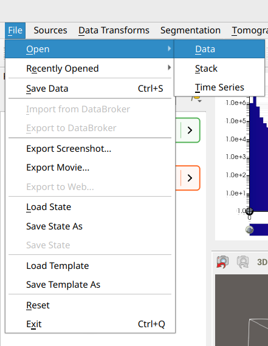

Tomviz reads these formats:

| Format | Extensions | Notes |
| :--- | :--- | :--- |
| EMD | `.emd` | Electron Microscopy Data format (HDF5-based) |
| TIFF | `.tiff`, `.tif` | Including multi-file stacks |
| MRC | `.mrc`, `.st`, `.rec`, `.ali` | Electron microscopy format |
| HDF5 | `.h5`, `.hspy`, `.nxs` | Auto-detects Data Exchange and FXI; other files, including HyperSpy (`.hspy`) and NeXus (`.nxs`), are read as generic HDF5 |
| DICOM | `.dcm` | Enhanced (single-file) DICOM only; classic multi-file DICOM is not yet supported; requires ITK |
| NumPy | `.npy` | NumPy binary arrays |
| MATLAB | `.mat` | MATLAB v7.2 and earlier |
| VTK ImageData | `.vti` | VTK XML format |
| Meta Image | `.mhd`, `.mha` | ITK Meta Image format |
| XDMF | `.xmf`, `.xdmf` | XDMF/HDF5 composite |
| Raw | `.raw`, `.dat`, `.bin` | Requires dimension/type configuration |
| Images | `.png`, `.jpg`, `.jpeg` | Single image files |
| OME-TIFF | `.ome.tif`, `.ome.tiff` | Multi-channel microscopy images |

DICOM reading and writing need ITK. The installers include it; with the
conda package, install `itk` with pip.

### Drag-and-drop

You can also drop data files from the file manager onto the Tomviz window.
State files (`.tvh5`, `.tvsm`) are loaded as state.

### Image stacks

Choose `File` -> `Open` -> `Stack`, then check the images to include in the
dialog. You can also set the data type, such as `Tilt Series`.

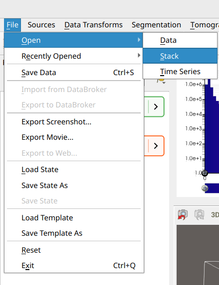

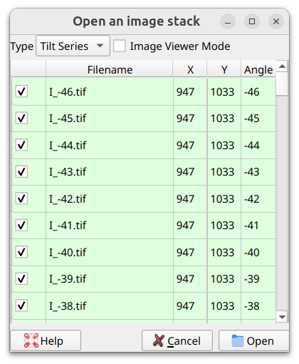

### Time Series

Choose `File` -> `Open` -> `Time Series` and select the files. Each file is one
time step. See [Time Series](time_series.md) for working with them.

### Reading a raw file

To read a raw file, set its dimensions, data type, endianness and number of
components:

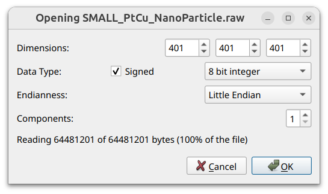

### HDF5 Formats

#### HDF5 Subsampling
Tomviz uses HDF5
[hyperslab selection](https://support.hdfgroup.org/documentation/hdf5/latest/_l_b_dset_sub_r_w.html)
to read HDF5 files with subsampling.

When any dimension of an HDF5 dataset (EMD, Data Exchange, HyperSpy or
generic HDF5) is 1200 voxels or larger, Tomviz shows a `Pick Subsample`
dialog before reading it. Set the volume bounds and the strides (per axis, or
the same for all); the estimated memory is shown at the bottom.

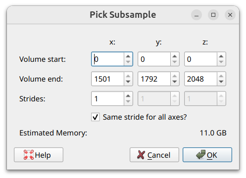

#### EMD
Tomviz reads and writes volumes and tilt series in the
[EMD format](https://emdatasets.com/format/). In a tilt series, the first
axis holds the angles.

As an extension of the format, Tomviz writes several scalar arrays and reads
them back: the active one as the "data" dataset in the EMD data group, and
the others by name in a "tomviz\_scalars" group in the same data group.

#### Data Exchange
Tomviz reads volumes from
[Scientific Data Exchange format](https://doi.org/10.1107/S160057751401604X)
files: if an HDF5 file has a dataset at "/exchange/data", Tomviz loads it as a
volume. Tomviz does not write this format: volumes saved as HDF5 (`.h5`)
are written in [EMD](#emd) format.

#### HyperSpy

Tomviz reads HyperSpy `.hspy` files as HDF5 and loads their
three-dimensional datasets.

#### Generic HDF5 File
In any other HDF5 file, Tomviz looks for three-dimensional datasets. If
there is one, it is loaded as a volume. If there are several, a dialog asks
which to load; the first one checked becomes the volume and the others are
added to it as extra scalar arrays.

## Data Generators

The `Sample Data` menu has built-in sources that generate data instead of
reading a file:

 * **Simulated Live Acquisition** - A simulated tomography scan that adds a
   projection every 5 seconds; the pipeline updates as projections arrive.
   It is also a template for live sources. See
   [Live Data and Periodic Execution](pipeline_management.md#live-data-and-periodic-execution).
 * **Generate Constant Dataset** - A 3D volume filled with one value.
   Parameters: shape (default 100×100×100) and value.
 * **Generate Random Particles** - Random 3D particles made with a Fourier
   noise method. Parameters: shape (up to 512³), internal complexity,
   particle size and sparsity.
 * **Generate Electron Beam Shape** - A convergent electron beam in 3D for
   STEM imaging simulation. Parameters include beam energy, semi-convergence
   angle, pixel sizes, defocus range, spherical aberration, astigmatism and
   coma.

The installers also add `Star Nanoparticle (Reconstruction)` and
`Star Nanoparticle (Tilt Series)` to this menu; the conda package does not
include them. `Download More Datasets` opens a web page with more electron
tomography datasets.

Each generator opens a dialog for its parameters. Click `OK` to generate the
data and add it to the pipeline with default visualizations.

The generators are written with the Python
[SourceNode API](operators_development.md#sourcenode). Your own source nodes
can use any installed library, for example to download data from a web
server or to generate synthetic data with your own algorithm.

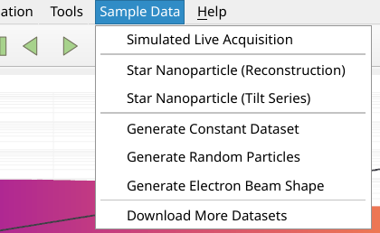

## Scan IDs

A tilt series can carry a scan ID for each image, recording which
experimental scan produced it. Scan IDs are most useful with synchrotron
beamline data.

### Viewing Scan IDs

Select a source with scan IDs in the pipeline, and the Properties panel
(bottom left) shows them beside the tilt angles.

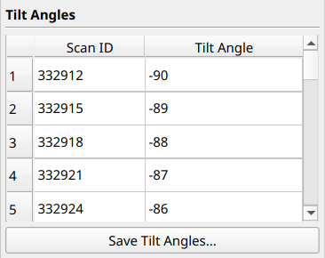

### Setting Scan IDs

Scan IDs come from:

 * **A tilt angle file** - If a file loaded in the `Set Tilt Angles` dialog
   has a scan ID column, it is imported with the angles.
 * **The PyXRF and Ptycho sources** - Both extract scan IDs automatically.

### Storage

EMD files store scan IDs at `/data/tomography/scan_ids`, so they survive
saving and loading.

### Python Access

Python transforms can read them from `dataset.scan_ids`:

```python
def transform(dataset):
    scan_ids = dataset.scan_ids
    # Use scan IDs for processing...
```

## Saving Tilt Angles

To save the tilt angles to a `.txt` file, for use in other tools, click
`Save Tilt Angles...` below the tilt angle table in the Properties panel and
choose a file name.

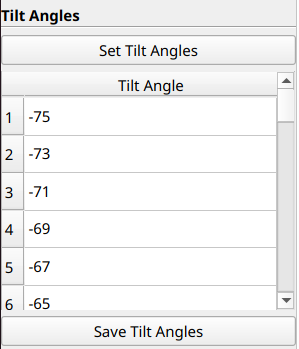

The file has one angle per line.

## Save results

### Save data

Choose `File` -> `Save Data` (`Ctrl+S`). To save one node or port,
right-click it and choose `Save Data`.

The dialog writes every checked port to the `Destination` directory, in the
`File formats` chosen for each data type. `Ports to save` lists
`Leaf nodes only` (outputs that feed no other transform) or
`All ports with data`.

Any output that holds data can be saved. A transient port drops its data once
the pipeline is done with it, and the dialog lists it as unsaveable. To save
it, right-click the port and choose `Persist in Memory`; Tomviz runs that
step again.

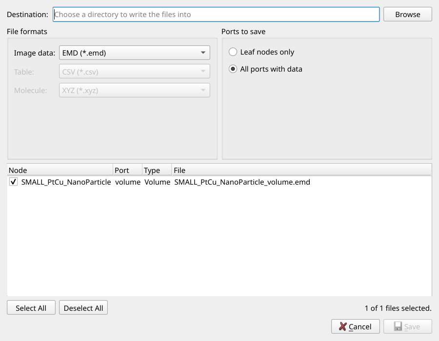

Tomviz writes these formats:

| Format | Extensions | Notes |
| :--- | :--- | :--- |
| EMD | `.emd` | Recommended - supports all Tomviz data types and units |
| HDF5 | `.h5` | Written in EMD format |
| TIFF | `.tiff` | Widely supported; double data converted to float |
| MRC | `.mrc` | Electron microscopy format |
| DICOM | `.dcm` | Enhanced (single-file) DICOM with tilt angle metadata; requires ITK |
| NumPy | `.npy` | NumPy binary arrays |
| VTK ImageData | `.vti` | VTK XML format |
| Meta Image | `.mhd` | ITK format |
| CSV | `.csv` | Volumes and tables |
| JSON | `.json` | Volumes (JSON Image) and tables |
| Legacy VTK | `.vtk` | Older VTK format |
| XDMF | `.xmf` | XDMF/HDF5 composite |
| XYZ | `.xyz` | Molecules |

EMD keeps every Tomviz data type and the units of all three dimensions. For
sharing with other tools, TIFF is often the most versatile.

### Save state

Choose `File` -> `Save State As` to save the state. Once a state file has
been saved or loaded, `Save State` overwrites it. See
[State files](#state-files) for the two types.

### State files

Two types of state files are available in Tomviz:

1. Full state files (`.tvh5` files)
2. Light state files (`.tvsm` files)

A full state file holds the application state and the data, both input and
output, in one HDF5 file, so pipelines do not need to re-run when it is
opened.

A light state file holds only the application state, with relative paths to
the input data files. Loading one re-runs every pipeline to produce the
output data.

Use full state files to move work between computers, and light state files
to save progress on one computer.

Since Tomviz 3.0, state files (schema version 2) store the full node-based
pipeline graph. State files from earlier versions are converted
automatically when loaded.

## Recover and load state

### Recover state

Tomviz saves the pipeline every five minutes. If it did not close normally,
it offers to load that autosave the next time it starts.

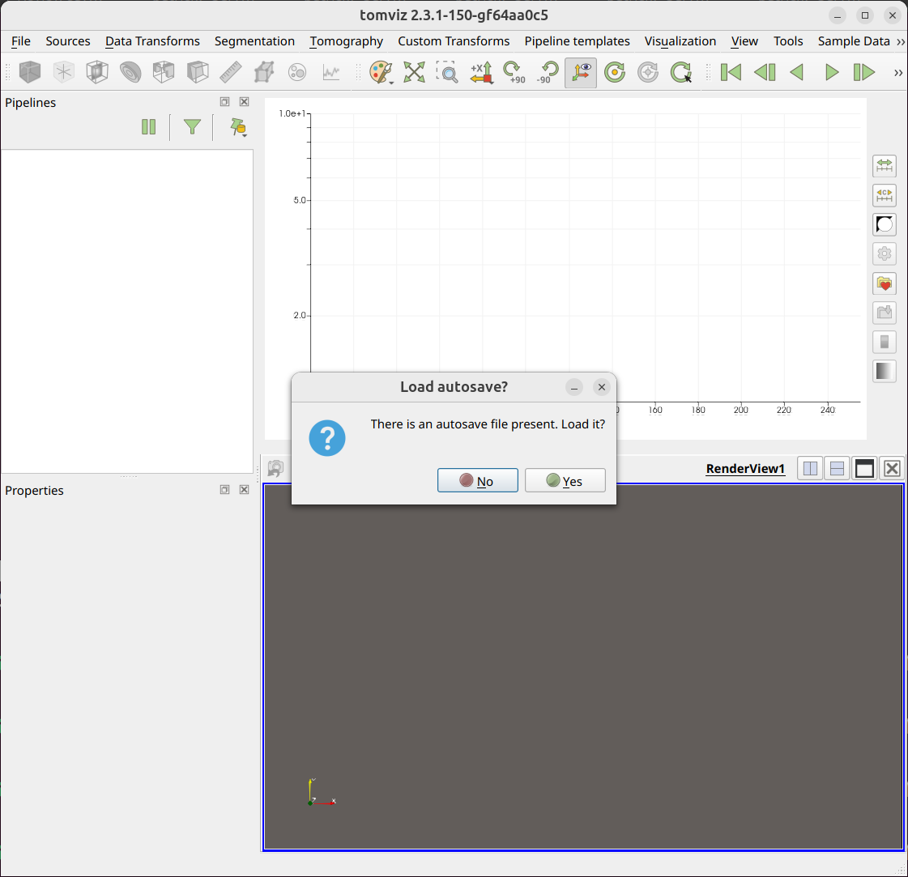

### Load state

To load a saved state, choose `File` -> `Load State`.

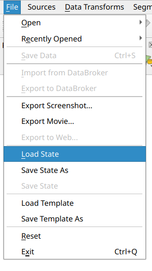

It loads both full and light [state files](#state-files).

## Exporting Data

Besides saving data in standard formats, you can export images and movies
of the render view. For screenshots, see
[Exporting Visualizations](visualization.md#exporting-visualizations); for
movies, see [Animation](animation.md).
