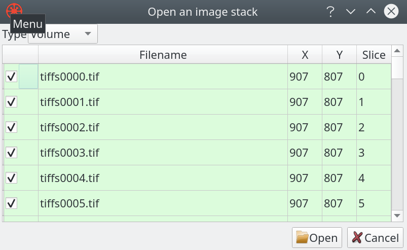

Typical data sets may have following relationships between attributes and sizes.

| Volume          | Voxels        | Size (char) | Size (int) |
|  :---           |  :---         |    :---     | :---       |
| 64<sup>3</sup>  | 262,144       | 0.25 MB     | 1 MB       |
| 128<sup>3</sup> | 2,097,152     | 2.00 MB     | 8 MB       |
| 256<sup>3</sup> | 16,777,216    | 16.00 MB    | 64 MB      |
| 512<sup>3</sup> | 134,217,728   | 128.00 MB   | 512 MB     |
| 1024<sup>3</sup>| 1,073,741,824 | 1,024.00 MB | 4096 MB    |

### Load data

In this subsection, loading methods for three data categories, single data file, stack of images and raw data set, are being introduced.

#### Single data file

Loading single dataset is straight forward, simply select ```Open Data``` from the ```File``` menu, as indicated in screenshot below.


#### Image stacks

Loading image stacks takes a little bit more efforts than loading single data file. After selecting ```Open Stack``` from the ```File``` menu, check all the images you would like to include in the pop-up window, as indicated in screenshots below.




#### Reading a raw file

Users can also choose to read raw files by defining data dimensions, type, endianness, and etc, as indicated below.


#### HDF5 Formats

##### HDF5 Subsampling
Tomviz utilizes the
[hyperslab selection](https://support.hdfgroup.org/HDF5/Tutor/select.html)
features of HDF5, so that HDF5 files may be read with subsampling.

After opening any kind of HDF5 file (includes EMD, Data Exchange, or
any generic HDF5 file), the data may be reloaded and resampled by
right-clicking the original dataset in the pipeline and selecting
"Reload and Resample", as shown below.


A dialog will then appear which allows the user to specify volume
bounds and a stride (applied to all three axes). The dialog
also conveniently provides an estimated memory usage of the dataset
at the bottom.


Once accepted, the dataset will immediately reload with the new
subsample settings.

The subsample dialog will also appear if a user attempts to open a
very large HDF5 dataset, so that the user may subsample the dataset
before the initial reading.

##### EMD
Tomviz supports reading and writing both volumes and tilt series with
the [EMD format](https://emdatasets.com/format/). For tilt series
datasets, Tomviz expects the first axis to define the angles.

As an extension of the EMD format, Tomviz also supports writing multiple
scalar arrays and reading them back in. The active scalar is always
written as the "data" dataset in the EMD data group. All other scalars
are written by name in a "tomviz\_scalars" group in the EMD data group.

##### Data Exchange
Tomviz supports reading volumes from
[Scientific Data Exchange format](https://doi.org/10.1107/S160057751401604X)
files.

When opening an HDF5 file, Tomviz will check to see if a dataset
exists in the path "/exchange/data". If it does, the dataset will
be loaded into Tomviz as a volume.

Volumes in Tomviz that are saved as a generic HDF5 file will be written
in the Data Exchange format.

##### Generic HDF5 File
If an HDF5 file is opened that does not appear to be a format Tomviz
recognizes, Tomviz will locate all three-dimensional datasets in the
file. If only one three-dimensional dataset exists, Tomviz will load
that dataset as a volume. If more than one exists, a dialog will appear
asking the user to choose a dataset to load.

### Save results

#### Save data

Users can save the data by either clicking the ```Save Data``` button from ```File``` (as shown below), or simply using the keyboard short-cut ```Ctrl+S```.


#### Save state

Similarly to saving data, users can save the state by clicking the ```Save State As``` button from ```File```.


Once a state file has been saved or loaded, ```Save State``` can be used
to overwrite the same state file. For more information about the types
of state files, see [here](#state-files).

#### State files

Two types of state files are available in tomviz:

1. Full state files (`.tvh5` files)
2. Light state files (`.tvsm` files)

The full state files save both the state of the program and the data
into a single file, which is in HDF5 format. Both input and output data
are saved in the file, so that pipelines do not need to be re-ran when
the file is opened.

The light state files only save the state of the program, and they
use relative file paths on the file system to load the input data.
When a light state file is loaded, all of the pipelines are re-ran
to produce the output data.

Full state files are useful for moving the tomviz state between file
systems and computers. Light state files are useful for saving progress
on a single computer.

### Recover and load state

#### Recover state

Tomviz saves the pipeline every five minutes, users can recover the previous states by simply allowing the Tomviz to load them.


#### Load state

When there is no prompt, users can manually load and recover previous states by selecting ```Load State``` from ```File```.


Both full state files and light state files may be loaded from this menu.
Once a state file has been loaded, it may be overwritten via
```Save State```. For more information about the types of state files,
see [here](#state-files).

## Exporting Data

Resulting data can be exported via many ways, which includes saving data to standard formats; taking screenshots or animations of the render view; creating an interactive scene for web browsers; exporting geometry for 3D printing and generating images of slices.

### Save data

Saving data can be accessed via ```File``` menu, simply click on ```Save Data```. Alternatively users can also simply press ```Ctrl+S```.


In the pop-up window, choose one of the standard formats that you want to save your data as.


We recommend EMD (HDF5 based) for saving data. Because it supports all the data types that are used in Tomviz, and can save units in all three dimensions. However, note that it may not be as widely supported.

Besides EMD, TIFF is often the most diverse type to export to. Although it supports limited types that are used in Tomviz due to limited support for units and dimensions, it is open and widely supported by many other packages.
