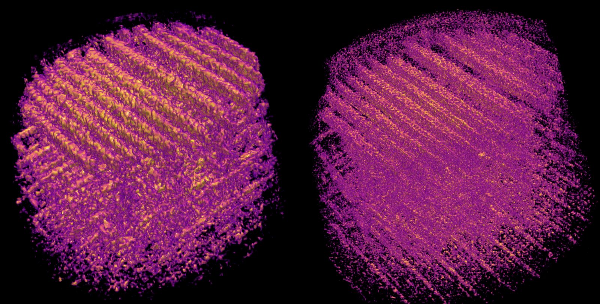
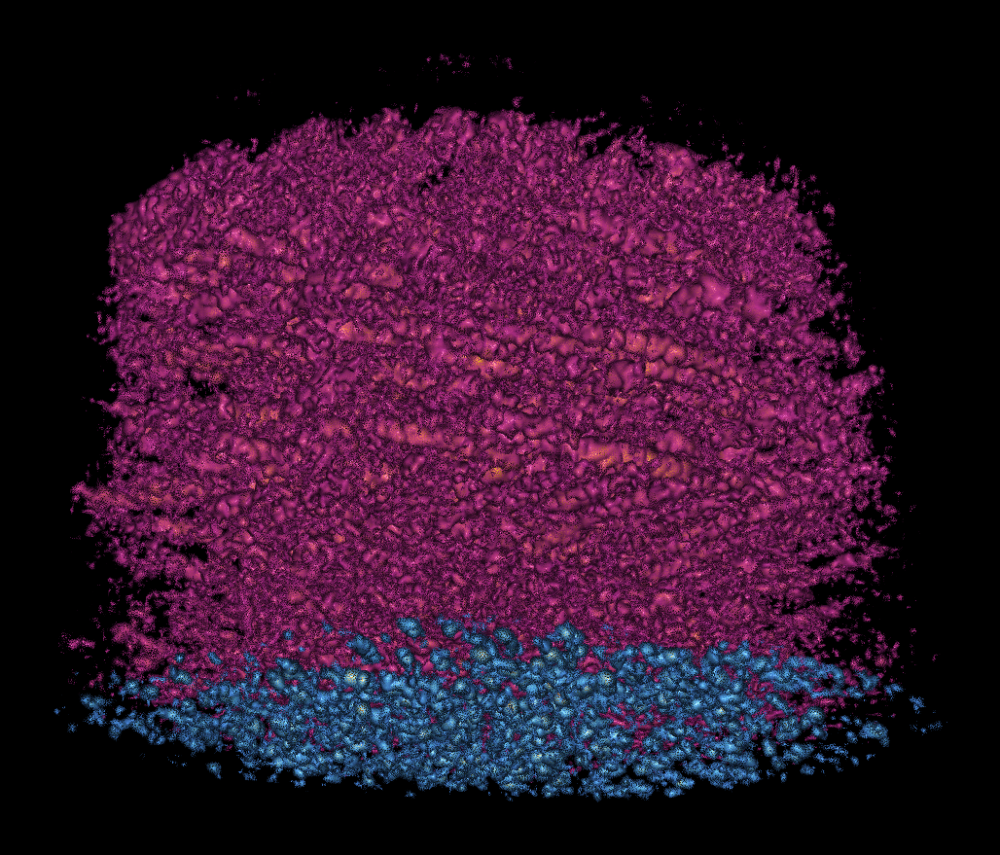
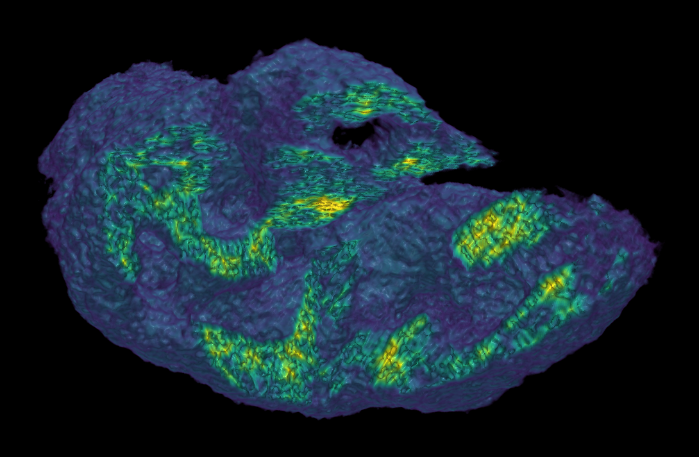
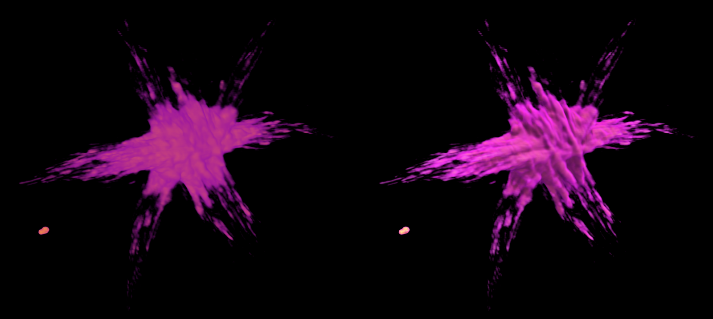
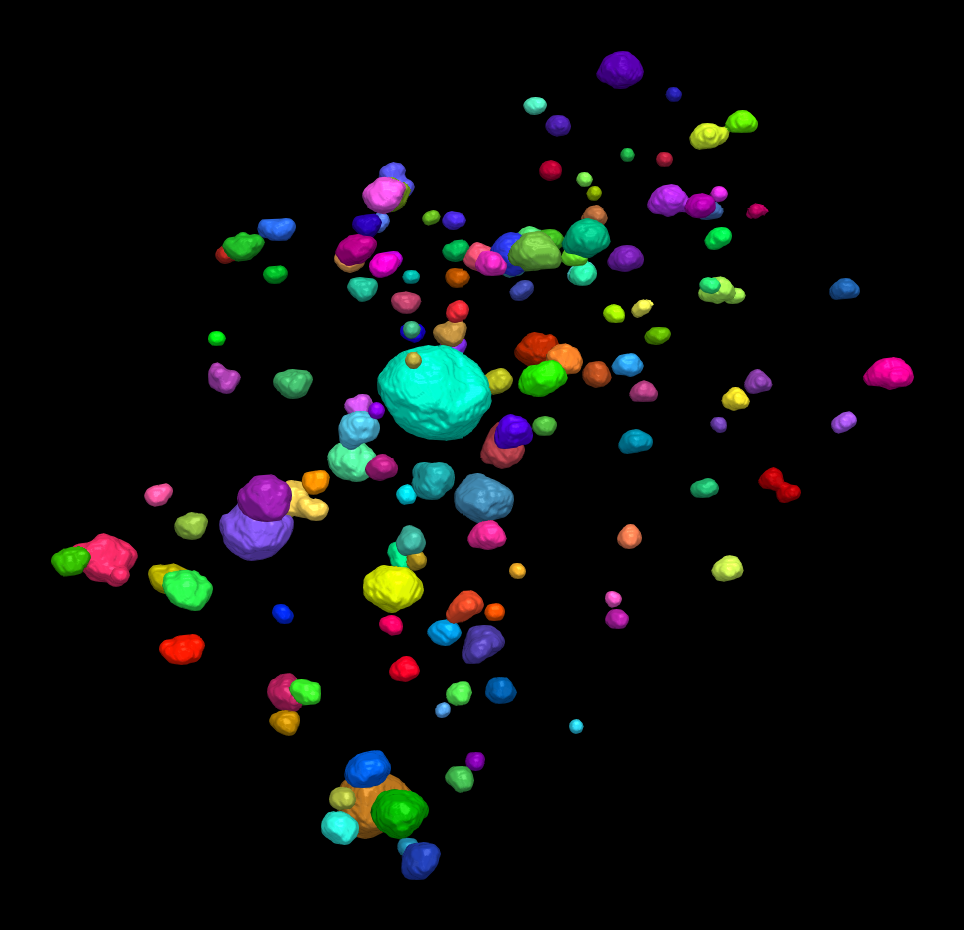
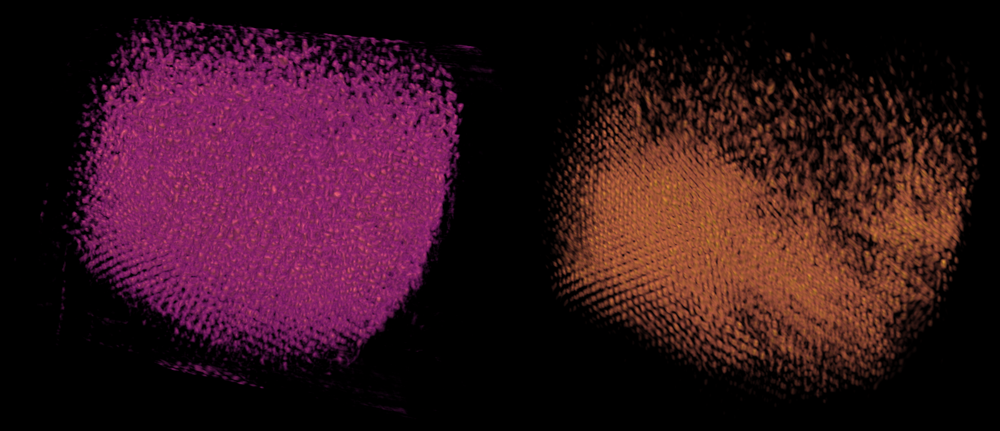
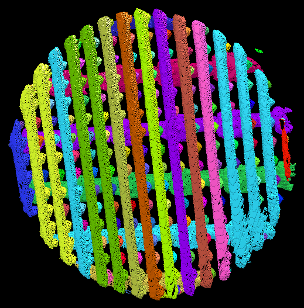

# Gallery

Renderings made in Tomviz 3.1, each exported with `File` >
`Export Screenshot`. The caption under each one links to the page that shows
how to make it.

## X-ray fluorescence and ptychography

An integrated circuit sample measured at NSLS-II. Left, the copper
fluorescence reconstructed from a PyXRF tilt series; right, the phase from
ptychography of the same sample, shown with the same camera, where the finer
resolution of ptychography is plain. See the [PyXRF](sources_pyxrf.md) and
[Ptycho](sources_ptycho.md) sources.

## Several volumes in one view

Two element maps from the same XRF reconstruction, copper (magenta) and
tungsten (blue), each a volume with its own color map and opacity, rendered
together so they blend correctly where they overlap. See
[Several volumes in one view](visualization.md#several-volumes-in-one-view).

## Cut-out view

A corner cut out of a PtCu nanoparticle to show its interior, with a
Viridis color map. See [Cut-out views](visualization.md#cut-out-views).

## Exploded view

The same nanoparticle split into seven slabs along one axis and pulled apart,
so every layer can be seen at once. See
[Exploded view](visualization.md#exploded-view).

## Lighting presets

The star-shaped nanoparticle that comes with the installers, rendered with
the `Flat` lighting preset (left) and the `Full` preset (right), which adds
shading and brings out the shape of each arm. See
[Rendering Properties](visualization.md#rendering-properties).

## Label maps

Nanoparticles segmented with `Segment Particles` and
`Connected Components`, then shown with the `Label Map` visualization: 140
labels, each drawn as a smoothed surface in its own color. See
[Label Map](visualization.md#label-map).

## Fourier-space filtering

A superlattice of gold nanoparticles as reconstructed (left), and after
`Fourier Peak Mask` keeps only its Bragg peaks (right), which brings out the
periodic lattice. See
[Fourier-Space Filtering](analysis.md#fourier-space-filtering).

:::{note}
This dataset is an X-ray ptychographic tomography reconstruction of a
DNA-assembled FCC superlattice of 20 nm gold nanoparticles, recorded at
NSLS-II. It comes from A. Michelson, B. Minevich, H. Emamy, X. Huang,
Y. S. Chu, H. Yan and O. Gang, "Three-dimensional visualization of
nanoparticle lattices and multimaterial frameworks", *Science* **376**,
203-207 (2022),
[doi:10.1126/science.abk0463](https://doi.org/10.1126/science.abk0463). It is
shown with the authors' permission; please cite that paper for any use of the
data.
:::

## SAM 3 segmentation

Instance segmentation of the integrated circuit's ptychographic
reconstruction by SAM 3 with the text prompt "IC feature", using a
fine-tuned checkpoint. See
[SAM 3 Segmentation](ml_segmentation.md#sam-3-segmentation-3d).
