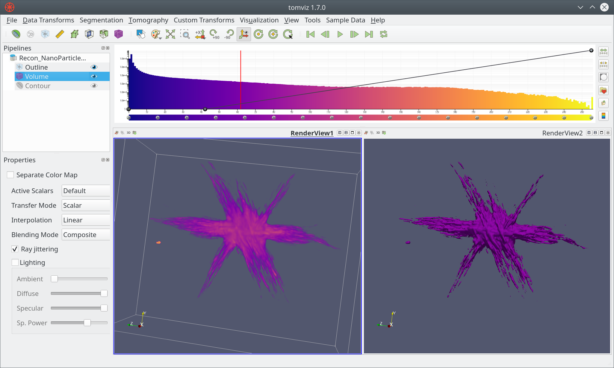

# Introduction

The main site is at [tomviz.org](https://tomviz.org/). This site serves as a home
for online documentation of the desktop application, and related documentation.
For the latest release please check out the [downloads](https://tomviz.org/downloads/)
page. The project is developed primarily in C++, with a data pipeline that offers
Python or C++ operators. The GUI is Qt-based, and the code is distributed under
the [3-clause BSD license](https://tomviz.org/licensing/).

## Getting Started

The Tomviz application supports all phases of your tomography workflow:

 * [Acquisition](acquisition.md)
 * Preprocessing
 * [Alignment](alignment.md)
 * [Reconstruction](reconstruction.md)
 * [Segmentation](analysis.md)
 * [Analysis](analysis.md)
 * [Visualization](visualization.md)

The application is shown below with some data loaded and a couple of different
representations of the data (volume render and isosurface). The integrated
histogram-color-opacity editor is at the top-right, and the pipeline at the
top-left.

You can download the latest release (first block) or the latest builds (second
block) if you want to check out the latest improvements at the risk of less
stability. For Windows the installer is the simplest method, but the zip file
can be unpacked anywhere and run without administrator privileges. The macOS
DMG is relocatable, and can be installed wherever you. The Linux binary can
be installed with Windows and Linux offering the Tomviz executable in the bin
directory.

## Tutorials and Documentation

In addition to this new documentation resource there several other tutorials:

 * [Tutorial on the Visualization of Volumetric Data](https://doi.org/10.1017/S1551929517001213)
 * [A basic user guide for 3D reconstruction](https://tomviz.org/wp-content/uploads/2017/03/TomvizBasicUserGuide.pdf)
 * [Slides from a course presented at Kitware course week](https://openchemistry.github.io/tomviztutorial/)

If you know of other available material that should be featured please let us
know.

## First Steps

Once you open the application you will be offered the opportunity to open an
example data set, this will display a volume rendering of a reconstructed
nanoparticle. The `Sample Data` menu offers the reconstruction and tilt series
for the star nanoparticle, along with options for generating simulated data or
downloading open data sets for TEM tomography data.
