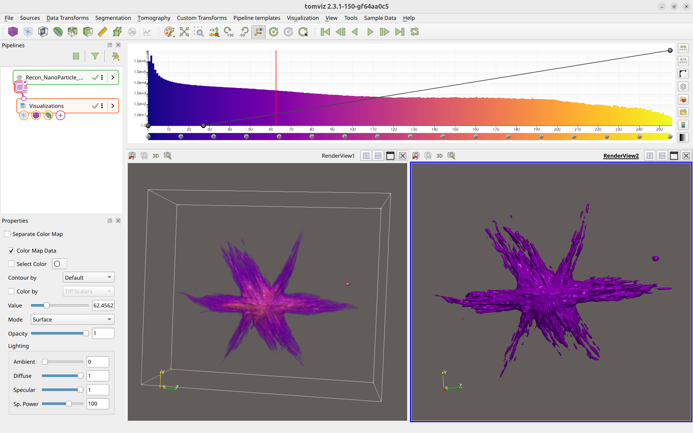

# Introduction

The main site is at [tomviz.org](https://tomviz.org/). This site serves as a home
for online documentation of the desktop application, and related documentation.
For the latest release please check out the [downloads](https://tomviz.org/downloads/)
page. The project is developed primarily in C++, with a data pipeline that offers
Python or C++ transforms. The GUI is Qt-based, and the code is distributed under
the [3-clause BSD license](https://tomviz.org/licensing/).

## About

The Tomviz project was founded by
[Marcus D. Hanwell](https://kitware.com/marcus-hanwell/) and
[Utkarsh Ayachit](https://kitware.com/utkarsh-ayachit/) at
[Kitware](https://kitware.com/),
[David A. Muller](http://muller.research.engineering.cornell.edu/) at
[Cornell University](https://www.cornell.edu/), and
[Robert Hovden](http://www.roberthovden.com/) at the
[University of Michigan](https://www.engin.umich.edu/) under DOE Office of
Science contract DE-SC0011385. If you find it useful in your research we would
appreciate you citing [tomviz.org](https://tomviz.org/). It is developed by a
large group of developers, collaborators and users in the community, and
contributions are welcome through the main
[Github project page](https://github.com/openchemistry/tomviz). This page offers
a complete list of contributors, older releases, issue tracking, and more.

## What's New in 3.0

Tomviz 3.0 includes a major overhaul of the application's pipeline architecture
and user interface:

 * **New pipeline model** - The pipeline has been redesigned around a node-based
   graph of sources, transforms, and visualizations connected by typed ports and
   links. A new vertical strip widget provides an interactive visual
   representation of the pipeline.
 * **Terminology updates** - "Modules" are now called "Visualizations" and
   "Workflows" are now called "Sources" throughout the application.
 * **Reorganized menus** - The Data Transforms, Segmentation, and Tomography
   menus are now organized into logical subcategories, with a search dialog
   accessible from each menu.
 * **New reconstruction methods** - SIRT, ART, and TV reconstruction algorithms
   have been added, along with GPU acceleration for SIRT and MLEM via TomoPy.
 * **New data formats** - Enhanced DICOM, HyperSpy, `.npy`, and `.mat` file reading, plus
   DICOM and MRC writing support.
 * **Drag-and-drop** - Data files and state files can be loaded by dragging them
   onto the application window.
 * **Cylindrical crop** - A new interactive 3D cylindrical cropping tool.
 * **Data generators** - Built-in sources for generating constant datasets,
   random particles, and electron beam shapes.
 * **Pipeline controls** - Pause, stop, and resume pipeline execution, with
   live progress reporting.
 * **Per-node Python environments** - Individual transforms can execute in
   separate conda environments.

## Getting Started

The Tomviz application supports all phases of your tomography workflow:

 * [Acquisition](acquisition.md)
 * Preprocessing
 * [Alignment](alignment.md)
 * [Reconstruction](reconstruction.md)
 * [Segmentation](analysis.md)
 * [Analysis](analysis.md)
 * [Visualization](visualization.md)

The application is shown below with some data loaded and a couple of different
representations of the data (volume render and isosurface). The integrated
histogram-color-opacity editor is at the top-right, and the pipeline strip
widget is at the top-left.



You can download the latest release (first block) or the latest builds (second
block) if you want to check out the latest improvements at the risk of less
stability. For Windows the installer is the simplest method, but the zip file
can be unpacked anywhere and run without administrator privileges. The macOS
DMG is relocatable and can be installed wherever you like. For Windows and
Linux, the Tomviz executable is in the `bin` directory.

## Tutorials and Documentation

In addition to this new documentation resource there are several other tutorials:

 * [Tutorial on the Visualization of Volumetric Data](https://doi.org/10.1017/S1551929517001213)
 * [A basic user guide for 3D reconstruction](https://tomviz.org/wp-content/uploads/2017/03/TomvizBasicUserGuide.pdf)
 * [Slides from a course presented at Kitware course week](https://openchemistry.github.io/tomviztutorial/)

If you know of other available material that should be featured please let us
know.

## First Steps

Once you open the application you will be offered the opportunity to open an
example data set, this will display a volume rendering of a reconstructed
nanoparticle. The `Sample Data` menu offers the reconstruction
and tilt series for the star nanoparticle, along with options for generating
simulated data or downloading open data sets for TEM tomography data.

```{toctree}
:maxdepth: 1
:hidden:

data
visualization
analysis
alignment
reconstruction
pipeline_management
templates
```

```{toctree}
:maxdepth: 1
:caption: Operators
:hidden:

operators_catalog
operators_development
ml_segmentation
```

```{toctree}
:maxdepth: 1
:caption: Sources
:hidden:

sources_pyxrf
sources_ptycho
```

```{toctree}
:maxdepth: 1
:caption: Advanced
:hidden:

pipelines
acquisition
interactive
time_series
```

```{toctree}
:maxdepth: 2
:caption: API Reference
:hidden:

api/index
```

```{toctree}
:maxdepth: 2
:caption: Operators Reference
:hidden:

operators/index
```
