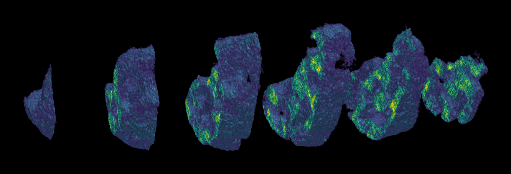
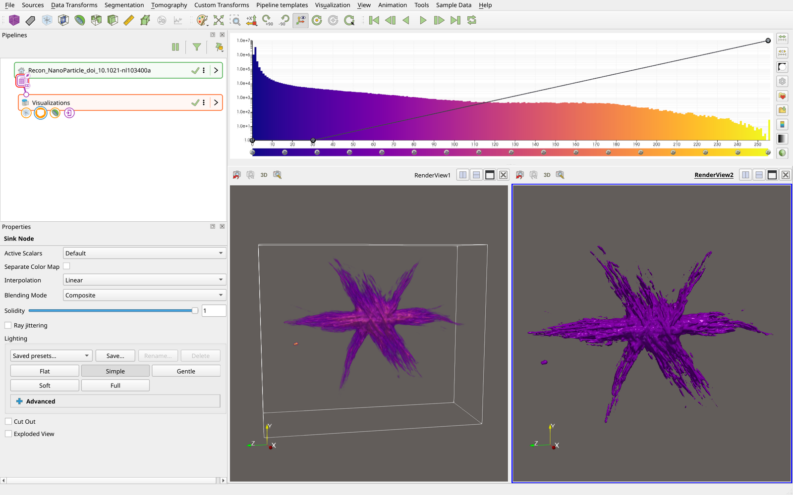

# Introduction

Tomviz is an open-source application for reconstructing, analyzing and
visualizing electron and X-ray tomography data. These pages document the
desktop application; the main site is [tomviz.org](https://tomviz.org/), and
installers are on the [downloads](https://tomviz.org/downloads/) page.



## What's New in 3.1

 * **Animation** - New `Animation` menu and Animation Helper: camera paths that
   also animate visualization settings, orbits, captions, property sweeps and
   MP4 export. See [Animation](animation.md).
 * **Volume rendering** - Lighting presets, shadows, cut-out and exploded views,
   region auto contrast, opacity presets, and several volumes in one view. See
   [Volume Rendering](visualization.md#volume-rendering) and
   [Several volumes in one view](visualization.md#several-volumes-in-one-view).
 * **Live data** - Python sources re-run on a timer to follow a running
   experiment; try `Sample Data` -> `Simulated Live Acquisition`. See
   [Live Data and Periodic Execution](pipeline_management.md#live-data-and-periodic-execution).
 * **Segmentation and label maps** - Thresholding, connected components and
   morphology run on NumPy and SciPy. The new `Label Map` visualization colors
   each label, and `Remove Labels` removes the ones hidden there. See
   [Label Map](visualization.md#label-map).
 * **Slices** - Linked slices across datasets, and a 2D image viewer. See
   [Slice](visualization.md#slice) and
   [2D image viewer](visualization.md#d-image-viewer).
 * **Pipelines outside the application** - Run saved pipelines from the command
   line with the `tomviz-pipeline` package. See [External Pipelines](pipelines.md).
 * **Fourier-space filtering** - FFT, Fourier Filter, Fourier Peak Mask and
   Fourier Mask, plus Image Math and Combine Datasets. See
   [Fourier-Space Filtering](analysis.md#fourier-space-filtering).
 * **Custom transforms** - Create and edit your own transforms from the
   `Custom Transforms` menu. See
   [Custom Transforms](operators_development.md#custom-transforms).
 * **Linux packages** - RPM (RHEL 8 and 9) and Flatpak. See
   [Installation](#installation).
 * **Volume manipulation** - `Manual Manipulation` and `Registration` are back,
   and `Rotate` can keep the original size. See
   [Volume Manipulation](analysis.md#volume-manipulation).
 * **Saving** - `Save Data` can save any output that holds data. See
   [Save data](data.md#save-data).

## Installation

Installers are on the [downloads](https://tomviz.org/downloads/) page. On
Windows, the `.msi` installer is simplest; the `.zip` file runs from anywhere
without administrator privileges. The macOS `.dmg` can be installed anywhere.
Linux has three packages of the same build:

 * **`.tar.gz`** - extract it anywhere; the Tomviz executable is in the `bin`
   directory.
 * **`.rpm`** (RHEL 8 and 9) - installs to `/opt/tomviz` and adds `tomviz` to
   the path and the desktop menu:

   ```bash
   sudo dnf install ./Tomviz-<version>.x86_64.rpm
   ```

   To install somewhere else, use
   `sudo rpm -i --prefix=/path/to/tomviz Tomviz-<version>.x86_64.rpm`.
 * **`.flatpak`** - a single-file bundle. Its runtime comes from Flathub:

   ```bash
   flatpak remote-add --user --if-not-exists flathub https://flathub.org/repo/flathub.flatpakrepo
   flatpak install --user Tomviz-<version>.flatpak
   flatpak run org.tomviz.Tomviz
   ```

Tomviz is also on conda-forge:

```bash
conda install -c conda-forge tomviz
```

The 3.1 installers ship Python 3.14 and ParaView 6.1.1 with Qt 6; the
conda-forge package is built for Python 3.11 to 3.14.

The RPM and Flatpak build files are in the
[tomviz-packaging](https://github.com/OpenChemistry/tomviz-packaging)
repository.

## First Steps

The installers bundle a star nanoparticle dataset, offer to load its
reconstruction when Tomviz opens, and add its reconstruction and tilt series
to the `Sample Data` menu. That menu also has `Simulated Live Acquisition`, a
scan that updates as projections arrive, generators for simulated data, and a
link to more open TEM tomography datasets.

## Getting Started

Tomviz covers each step of a tomography workflow:

 * [Acquisition](acquisition.md)
 * [Pre-processing](alignment.md#pre-processing)
 * [Alignment](alignment.md)
 * [Reconstruction](reconstruction.md)
 * [Segmentation](analysis.md#segmentation)
 * [Analysis](analysis.md)
 * [Visualization](visualization.md)
 * [Animation](animation.md)

For XRF and ptychography data from NSLS-II, start with the
[PyXRF](sources_pyxrf.md) and [Ptycho](sources_ptycho.md) sources.

Below, one dataset is shown as a volume rendering and as an isosurface. The
histogram, color map and opacity editor is at the top right, and the pipeline
is at the top left.



## Tutorials and Documentation

Tutorial videos for 3.1 are on these pages:

 * [Live Data and Periodic Execution](pipeline_management.md#live-data-and-periodic-execution)
 * [Fourier-Space Filtering](analysis.md#fourier-space-filtering)
 * [Label Map](visualization.md#label-map)
 * [Volume Rendering Techniques](visualization.md#techniques)
 * [Animation](animation.md)

The [Gallery](gallery.md) shows renderings made with these features.

Other tutorials and guides:

 * [Tutorial on the Visualization of Volumetric Data](https://doi.org/10.1017/S1551929517001213)
 * [A basic user guide for 3D reconstruction](https://tomviz.org/wp-content/uploads/2017/03/TomvizBasicUserGuide.pdf)
 * [Slides from a course presented at Kitware course week](https://openchemistry.github.io/tomviztutorial/)

If you know of other material we should list, please let us know.

## What's New in 3.0

Tomviz 3.0 overhauled the pipeline architecture and user interface:

 * **New pipeline model** - A node-based graph of sources, transforms and
   visualizations connected by typed ports and links, shown in a new vertical
   strip widget.
 * **Terminology updates** - "Modules" are now "Visualizations" and
   "Workflows" are now "Sources".
 * **Reorganized menus** - The Data Transforms, Segmentation and Tomography
   menus are grouped into subcategories, each with a search dialog.
 * **New reconstruction methods** - SIRT, ART and TV, plus GPU acceleration
   for SIRT and MLEM via TomoPy.
 * **New data formats** - Enhanced DICOM, `.npy` and `.mat` reading,
   plus DICOM and MRC writing.
 * **Drag-and-drop** - Drop data or state files onto the window to load them.
 * **Cylindrical crop** - An interactive 3D cylindrical crop.
 * **Data generators** - Sources that generate constant datasets, random
   particles and electron beam shapes.
 * **Pipeline controls** - Pause, stop and resume execution, with live
   progress.
 * **Per-node Python environments** - Transforms can run in separate conda
   environments.

## About

The Tomviz project was founded by
[Marcus D. Hanwell](https://kitware.com/marcus-hanwell/) and
[Utkarsh Ayachit](https://www.kitware.com/author/utkarsh-ayachit/) at
[Kitware](https://kitware.com/),
[David A. Muller](http://muller.research.engineering.cornell.edu/) at
[Cornell University](https://www.cornell.edu/), and
[Robert Hovden](http://www.roberthovden.com/) at the
[University of Michigan](https://www.engin.umich.edu/) under DOE Office of
Science contract DE-SC0011385. If you use it in your research, please cite
[tomviz.org](https://tomviz.org/). A large community of developers,
collaborators and users works on it, and contributions are welcome on the
[GitHub project page](https://github.com/openchemistry/tomviz), which also has
the full list of contributors, older releases and the issue tracker.

Tomviz is developed primarily in C++, with a data pipeline that offers Python
or C++ transforms. The GUI is Qt-based, and the code is distributed under the
[3-clause BSD license](https://tomviz.org/licensing/).

```{toctree}
:maxdepth: 1
:hidden:

data
visualization
animation
analysis
alignment
reconstruction
pipeline_management
templates
gallery
```

```{toctree}
:maxdepth: 1
:caption: Operators
:hidden:

operators_catalog
operators_development
ml_segmentation
```

```{toctree}
:maxdepth: 1
:caption: Sources
:hidden:

sources_pyxrf
sources_ptycho
```

```{toctree}
:maxdepth: 1
:caption: Advanced
:hidden:

pipelines
acquisition
interactive
time_series
```

```{toctree}
:maxdepth: 2
:caption: API Reference
:hidden:

api/index
```

```{toctree}
:maxdepth: 2
:caption: Operators Reference
:hidden:

operators/index
```
