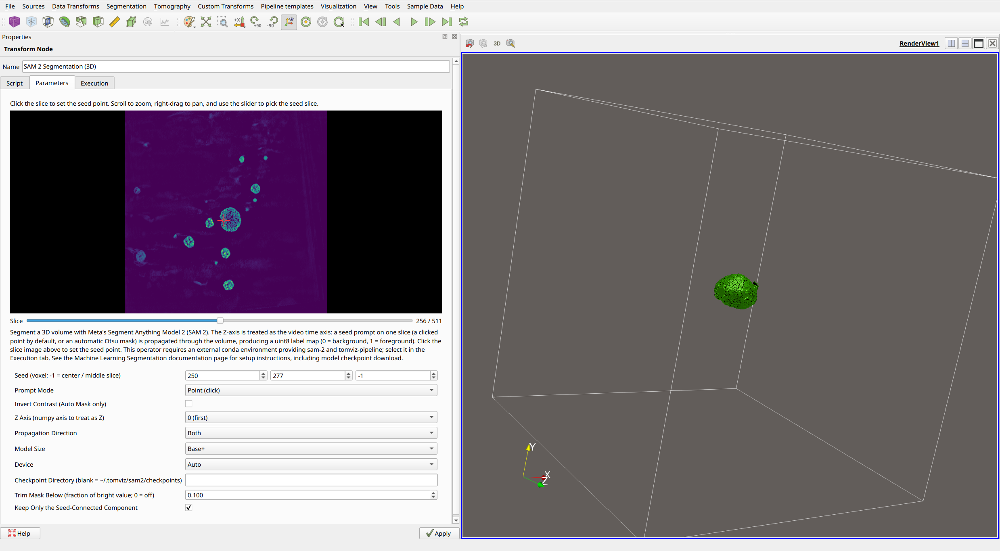
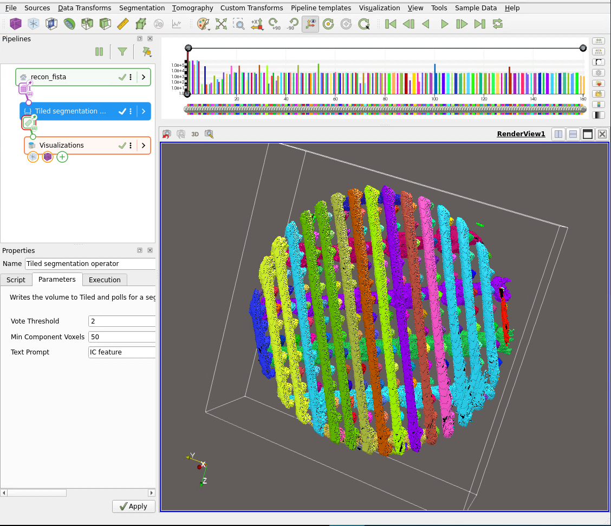

# Machine Learning Segmentation

Tomviz supports segmentation with machine-learning models in two ways:

1. **Local inference** with the built-in `SAM 2 Segmentation (3D)` and
   `SAM 3 Segmentation (3D)` operators, which run Meta's Segment Anything
   models on your machine in a separate conda environment. SAM 2
   propagates a seed-slice prompt and runs on all platforms; SAM 3 is
   text-prompted and requires an NVIDIA GPU.
2. **Facility-hosted inference**, where a lightweight operator submits
   the volume to a remote service and retrieves the finished
   segmentation. This is the pattern used for SAM 3 at the NSLS-II HXN
   beamline.

Both approaches keep the heavyweight AI dependencies (PyTorch, model
weights) out of the Tomviz application itself. Local inference relies on
Tomviz's [external subprocess
execution](operators_development.md#external-subprocess-execution), which
runs an operator in any conda environment you point it at.

## SAM 2 Segmentation (3D)

Available under `Segmentation` -> `Machine Learning`. The operator treats
the volume as a video: the Z-axis is the time axis, and SAM 2's video
predictor propagates a segmentation from a seed slice through the rest of
the volume. The result replaces the active scalars with a uint8 label map
(0 = background, 1 = foreground).

### One-time setup

**1. Create the conda environment.** Environment files ship with Tomviz
under `share/tomviz/environments/` and are also available in the
[Tomviz repository](https://github.com/OpenChemistry/tomviz/tree/master/tomviz/python/environments):

* `sam2-tomviz-cpu.yml` - all platforms; on Apple Silicon PyTorch uses
  the MPS backend automatically.
* `sam2-tomviz-cuda.yml` - NVIDIA GPUs on Linux (conda-forge ships
  CPU-only builds of `sam-2` for Windows and macOS).

```bash
conda env create -f sam2-tomviz-cpu.yml
```

**2. Download a model checkpoint.** Model weights are distributed by Meta
(Apache 2.0) and are not bundled with Tomviz. Download one or more
checkpoints into `~/.tomviz/sam2/checkpoints/` (or any directory; set it
in the `Checkpoint Directory` parameter):

```bash
mkdir -p ~/.tomviz/sam2/checkpoints && cd ~/.tomviz/sam2/checkpoints
curl -O https://dl.fbaipublicfiles.com/segment_anything_2/092824/sam2.1_hiera_base_plus.pt
```

Variants: `sam2.1_hiera_tiny.pt` (~150 MB), `sam2.1_hiera_small.pt`,
`sam2.1_hiera_base_plus.pt` (~320 MB, the default),
`sam2.1_hiera_large.pt` (~900 MB). If the checkpoint matching the
selected `Model Size` is missing, the operator's error message includes
the exact download URL.

**3. Select the environment** in the operator's `Execution` tab. The
operator is external-only, so the `Internal` executor is disabled.

### Usage

The operator dialog shows a slice of the input volume: **click the
slice to set the seed point**, and use the slider to pick the seed
slice. `Prompt Mode` defaults to `Point (click)`, so SAM 2 segments
whatever object contains the seed and propagates it through the volume
in both directions. With no click, the seed defaults to the volume
center (a `Seed` component of -1 means center / middle slice).



*SAM 2 on a nanoparticle reconstruction. The crosshair in the slice
view (left) selects one nanoparticle as the seed; the volume rendering
(right) shows that only the clicked particle is segmented out of the
many in the volume. The dialog shows the full parameter set: the seed
point set by the click, `Point (click)` prompt mode, the propagation
axis and direction, model size and device, and the drift-cleanup
parameters (`Trim Mask Below`, `Keep Only the Seed-Connected
Component`) that keep the result to just the seeded particle.*

Alternatively, switch `Prompt Mode` to `Auto Mask (Otsu)` to build the
seed mask automatically by thresholding the seed slice - this works well
for a single bright object on a dark background, but on noisy or
textured data the threshold tends to grab only the brightest fragment.
Toggle `Invert Contrast` if your feature is darker than the background.
If faint parts of the object are missed in either mode, apply a
contrast stretch (e.g. `Square Root Scale`) before this operator.

Other parameters: `Z Axis` (which numpy axis to propagate along),
`Propagation Direction` (both ways from the seed slice, or only forward
or backward), `Model Size` (larger models segment better and run slower;
use `Tiny` for quick previews), and `Device` (`Auto` picks MPS or CUDA
when available, else CPU). The operator can be canceled, and progress
reports the current slice.

**Drift cleanup** (on by default): after the seeded object ends, SAM 2's
video tracker can reattach to other bright objects in later slices,
leaving phantom regions - very noticeable on volumes with many
particles. Two parameters suppress this: `Trim Mask Below` removes mask
voxels darker than the given fraction of the volume's bright reference
value (99.9th percentile), and `Keep Only the Seed-Connected Component`
drops every mask region not connected to the clicked seed (with an
auto-mask prompt, the largest region is kept instead). Set the fraction
to 0 and untick the checkbox to get the raw SAM 2 mask.

## SAM 3 Segmentation (3D)

Available under `Segmentation` -> `Machine Learning`. Instead of a seed
point, you describe what to segment with a **text prompt**. Concrete,
appearance-based phrases work far better than domain terms: "bright
lines" (the default), "bright object", or "glowing object" rather than
"particle" or "pore" -- SAM 3 is grounded in everyday visual vocabulary, and
abstract terms can score below the confidence threshold on every slice,
yielding an empty result. Each slice along all three axes is
segmented independently by the SAM 3 image model, the per-axis masks are
combined by majority voting, and connected-component labeling stitches
the result into a 3D **instance label map** (int32, 0 = background).

**Requirements:** an NVIDIA GPU (CUDA) with at least 8 GB of memory. On
other machines, use the SAM 2 operator or a facility-hosted service
(below).

### One-time setup

**1. Create the conda environment** from `sam3-tomviz-cuda.yml` (shipped
alongside the SAM 2 files):

```bash
conda env create -f sam3-tomviz-cuda.yml
```

**2. Download the model checkpoint.** `sam3.pt` (about 3.5 GB) is
distributed by Meta on
[HuggingFace](https://huggingface.co/facebook/sam3); the repository is
gated, so you need a free HuggingFace account and must accept Meta's SAM
License. Place it at `~/.tomviz/sam3/checkpoints/sam3.pt` (or any path;
set it in the `Checkpoint Path` parameter). Fine-tuned checkpoints of the
SAM 3 image model work the same way.

**3. Select the environment** in the `Execution` tab, as for SAM 2.

### Usage



*SAM 3 instance segmentation of an integrated-circuit ptychography
reconstruction with the text prompt "IC feature" (vote threshold 2,
minimum component size 50), using a fine-tuned SAM 3 checkpoint. Each
interconnect wire is a separate instance with its own label and color.
This result was produced with the facility-hosted Tiled workflow
described below, which runs the same SAM 3 model server-side; the local
operator reproduces it on a FISTA reconstruction with the same prompt,
vote threshold 2, minimum component size 500, and `Split Touching
Instances` set to 2.*

Set the `Text Prompt` to the kind of feature you want segmented and press
`Apply`. Tuning knobs:

* `Vote Threshold` - how many of the three axis passes must agree for a
  voxel to be foreground (default 1). Raise it to 2 or 3 to keep only
  features that look right from multiple directions - stricter, but it
  can discard structures that are only recognizable in one view (e.g.
  wiring that reads as "lines" only from the side).
* `Minimum Component Size` - connected components smaller than this many
  voxels are removed (default 200).
* `Split Touching Instances` - instance identity comes from 3D
  connected-component labeling, so objects that touch anywhere merge
  into one label; the denser (better) the segmentation, the more likely
  everything collapses into a single instance. Setting an erosion
  radius here breaks thin junctions: the mask is eroded by that many
  voxels, the surviving cores become the instances, and every mask
  voxel joins its nearest core. Radius 2 turns the merged IC wiring
  above into one instance per wire (0 = off).
* `Confidence Threshold` - the SAM 3 detection confidence cutoff
  (default 0.3).

**If the result comes back empty** (all zeros), the prompt most likely
scored below the confidence threshold on every slice. Try a more
concrete visual phrase, lower the `Confidence Threshold` to ~0.1, or set
`Vote Threshold` to 1 to check whether detections exist on only one
axis. With a fine-tuned checkpoint, the prompt used during fine-tuning
works best.

Each slice is processed three times (once per axis); progress reports the
current axis and slice, and the operator can be canceled.

## Facility-hosted segmentation

When no local GPU is available, or when a facility maintains a central
model (for example a fine-tuned SAM 3 checkpoint on a data-center GPU),
the recommended pattern is a thin client operator that ships the volume
to a service and polls for the result. The NSLS-II HXN deployment
implements this with [Tiled](https://blueskyproject.io/tiled/): the
Tomviz operator writes the volume and prompt metadata into a Tiled
catalog and polls for the finished segmentation, while a receiver process
on a GPU server runs SAM 3 inference on each new volume and writes the
label map back. The client operator needs only the `tiled` package, so it
runs in the internal executor with no AI dependencies, and the model
weights, license terms, and GPU provisioning stay entirely within the
facility. The reference implementation (operator and receiver) is
maintained in the NSLS-II HXN operator repository.

## A note on model licensing

Tomviz does not distribute any model weights. SAM 2 checkpoints are
released by Meta under the Apache 2.0 license; SAM 3 is released under
Meta's custom SAM License, which carries additional terms. Use of all
third-party models is governed by their own licenses.
