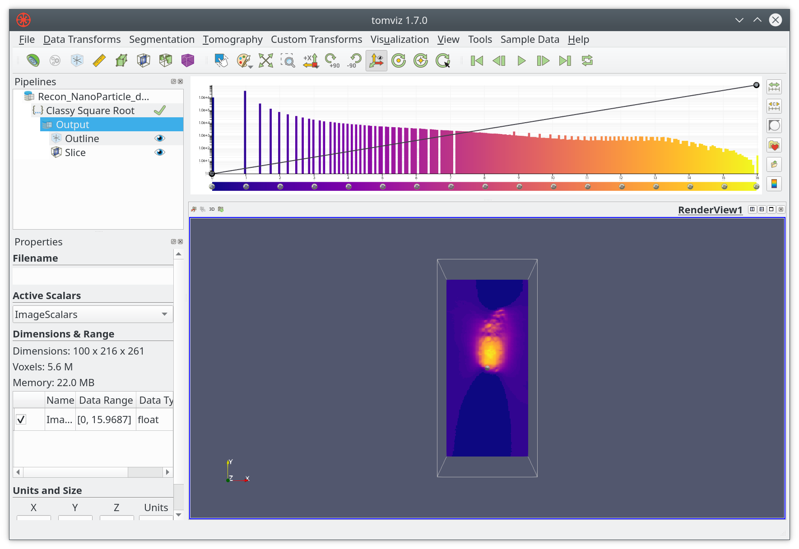

# Operators

Operators are the core of the data processing pipeline. They are predominantly
written in Python, with some developed in C++. Most operators take a volume as
an input, do some operations on that volume, and output a volume. In Python
these are typically viewed as NumPy arrays where they are a view of the native
C++ memory used by Tomviz.

## Simple Operator

This operator can be found by clicking on `Data Tansforms -> Custom Transform`.
It is one of the simplest transforms possible where all simple operators define
the `transform` function, import the necessary modules, and then get the
data as an array. This array can be treated like any NumPy array, operated on,
and once ready the output should be set to make it visible to the application.

``` python
def transform(dataset):
    """Python operators that transforms the input array"""

    import numpy as np

    # Get the current volume as a numpy array.
    array = dataset.active_scalars

    # This is where you operate on your data, here we square root it.
    result = np.sqrt(array)

    # This is where the transformed data is set, it will display in tomviz.
    dataset.active_scalars = result
```

The dialog in Tomviz enables editing of Python transforms in the source tab,
clicking apply will apply the code in the editor leaving the dialog open,
clicking OK will apply the transform and close the dialog. The Python code is
not saved permanently, saving a state file will save custom Python.

### Subclassing tomviz.operators.Operator

Tomviz provides an operator base class that can be used to implement a Python
operator. To create an operator simply subclass and provide an implementation of
the `transform` method.

```python

import tomviz.operators

class MyOperator(tomviz.operators.Operator):
    def transform(self, dataset):
        # Do work here

```

### Subclassing tomviz.operators.CancelableOperator

To implement an operator that can be canceled the operator should be derived
from `tomviz.operators.CancelableOperator`. This provides an additional
property called `canceled` that can be used to determine if the operator
execution have been canceled by the user. The data should be processed in chunks
so that this property can be periodically checked to break out of the execution
if necessary.

```python

import tomviz.operators

class MyCancelableOperator(tomviz.operators.CancelableOperator):
    def transform(self, dataset):
         while(not self.canceled):
            # Do work here

```

### Operator progress

Instances of `tomviz.operators.Operator` have a `progress` attribute that can be
used to report the progress of an operator. The maximum number of steps the
operator will report is held in the `progress.maximum` property and the current
progress can be updated using `progress.value = currrent_value`. A status
message can also be set on the progress object to give further feedback to the
user `progress.message = msg`.

```python

import tomviz.operators

class MyProgressOperator(tomviz.operators.Operator):
    current_progress = 0
    def transform(self, dataset):
        self.progress.maximum = 100
        # Do work here
        current_progress += 1
        self.progress.value = current_progress
```

### Generating the user interface automatically

Python operators can take zero or more parameters that govern their operation.
Initializing these parameter values is typically done through a dialog box
presented prior to running the operator. The simplest way to define the user
interface is to describe the parameters in a JSON file that accompanies the
Python script.

The JSON file consists of a few key/value pairs at the top level of the JSON
tree:

* `name` - The name of the operator. The name should not contain spaces.
* `label` - The displayed name of the operator as it should appear in the user
interface. No restrictions.
* `description` - Text that describes what the operator does. No restrictions.
* `parameters` - A JSON array of parameters.

An item in the `parameter` array is itself a JSON object consisting of several
name-value pairs.

* `name` - The name of the parameter. This must be a valid Python variable name.
* `label` - The displayed name of the parameter in the user interface. No
restrictions.
* `type` - Parameter type. Currently supported types are:
    * `bool` - Boolean type. Valid values are `true` or `false`.
    * `int` - Integral type. Valid values are in the range of a C integer.
    * `double` - Floating-point type. Valid values are in the range of a C double.
    * `enumeration` - Provides a set of options. Possible values are listed in
    an `options` key/value pair (described below)
    * `xyz_header` - Special type used as a hint for the UI to add the headers
    "X", "Y", and "Z" above columns for 3-element parameters representing
    coordinates.
    * `file` - Provides the ability to browse for a file path.
    * `directory` - Provides the ability to browse for a directory path.
* `default` - Default value for the parameter. Must be a number or boolean JSON
value `true` or `false`. The default for a multi-element `int` or `double`
parameter is an array of one or more ints or doubles.
* `minimum` - Sets the minimum value that a parameter may be. An array of
values specifies the component-wise minimum of a multi-element parameter.
* `maximum` - Like the `minimum`, but sets the maximum value that a parameter
may be.
* `precision` - Optional number of digits past the decimal for `double`
parameters.
* `options` - An array of JSON objects, each of which contains a single
key-value pair where the key is the name of the option and the value is an
integer index of the options.

Examples of parameter descriptions:

`bool`

```
{
  "name" : "enable_valley_emphasis",
  "label" : "Enable Valley Emphasis",
  "type" : "bool",
  "default" : false
}
```

`int`
```
{
  "name" : "iterations",
  "label" : "Number of Iterations",
  "type" : "int",
  "default" : 100,
  "minimum" : 0
}
```

Multi-element `int`
```
{
  "name" : "shift",
  "label" : "Shift",
  "description" : "The shift to apply",
  "type" : "int",
  "default" : [0, 0, 0]
}
```

`double`
```
{
  "name" : "rotation_angle",
  "label" : "Angle",
  "description" : "Rotation angle in degrees.",
  "type" : "double",
  "default" : 90.0,
  "minimum" : -360.0,
  "maximum" : 360.0,
  "precision" : 1
}
```

Multi-element `double`
```
{
  "name" : "resampling_factor",
  "label" : "Resampling Factor",
  "type" : "double",
  "default" : [1, 1, 1]
}
```

`enumeration`
```
{
  "name" : "rotation_axis",
  "label" : "Axis",
  "description" : "Axis of rotation.",
  "type" : "enumeration",
  "default" : 0,
  "options" : [
    {"X" : 0},
    {"Y" : 1},
    {"Z" : 2}
  ]
}
```

### Defining Operator Results and Child Data Sets

In addition to transforming the current data set, operators may produce
additional data sets. The additional data sets are described in the top-level
JSON with the following keys:

* `results` - An array of JSON objects describing the outputs produced by the
operator. Results are additional datasets produced when the operator is run.
Result JSON objects have three key/value pairs:
    * `name` - The name of the result
    * `label` - The displayed name of the result in the UI.
More than one result may be produced by the operator.
* `children` - An array of JSON objects describing child data sets produced by
the operator. Child data sets are similar to results, but are special in that
they must be image data to which additional operators may be applied. A child
dataset is described with the same key/value pairs as `results` datasets.
Currently, only a single child data set is supported.

The `name` key of each result and child data set must be unique.

### Creating Operator Results and Child Data Sets

In the operator Python code, results and child data sets are set in a dictionary
returned by the `transform` function. This dictionary consists of
key/value pairs where the name is the `name` value of the result or child
dataset and the value is the result or child dataset. Results and child
datasets are created in the Python operator code.

### Command line execution of pipeline

An operator pipeline can be executed from a Python command line. The data source
must be in EMD format. The execution is driven using a state file containing
the operator pipeline. To install the command line package run the following:

```bash
pip install  <tomviz_repo_directory>/tomviz/python/

```
Then to execute the operator pipeline run the following command:

```
tomviz-pipeline -s <path_to_state_file> -o <path_to_write_output_emd>
```
The input data source in the state file can be overridden by providing a path to
a different EMD file using the -d option.

Current restrictions/issues:

- EMD data source only.
- Spacing and units are copied from input data source.
- No support for child data.

### Custom Operators

Tomviz comes with a number of operators, many of which are developed in Python.
We welcome contributions to the code base, but sometimes it is preferable to
add local operators. On startup the application looks for a `tomviz` directory
as a folder in your home directory, if found that directory is scanned for
operators. These will be added to the `Custom Transforms` menu, and will look
just like builtin operators (empty menu shown below with option to import).


The default name will match that of the Python file, i.e. `my_thing.py` would
be added as `my_thing` to the menu. You should only import a transform once,
all this really does is add the Python file to the `tomviz` directory in your
home directory, i.e. `~/tomviz/my_thing.py`. When developing a custom transform
it is preferable to simply copy your code to that directory, and edit it in
place. You will need to close and reopen Tomviz in order to see new changes.

If you add a JSON file with the same name you can customize the appearance
further, and even add some input interface.

``` json
{
  "name" : "Custom Thing",
  "label" : "Operate on data",
  "description" : "Apply my special operation to the data...",
}
```

## Import operators

After creating a custom operator, it can be added by importing it as a custom
transform, which can be accessed through `Custom Transform` menu.


In addition to importing the Python code, users can also copy the Python scripts
or JSON metadata into the `~/tomviz` or `~/.tomviz` directory.

## Apply operators

After importing or copying the customer operator `test`, it will show up in
the `Custom Transform` menu.


The `test` operator can be applied just like any other built-in operator.
After loading the example dataset, click on `test`, the result will be
displayed in the main render window.


### User Input for Operators

Once you have a custom operator you may want to accept user input. For example
instead of hard-coding the chunk size in `test` we could let the user set it.
JSON metadata can specify what input a script accepts, and a Qt user interface
will be generated at runtime. An example of a single input is shown below:

```JSON
{
  "name": "Fancy Square Root",
  "label": "Classy Square Root",
  "description": "This is the fanciest square root operator, it does it all...",
  "parameters": [
    {
      "name": "number_of_chunks",
      "label": "Number of Chunks",
      "type": "int",
      "default": 10,
      "minimum": 1,
      "maximum": 1000
    }
  ]
}
```

Now that you can run `Classy Square Root` from the `Custom Transforms` menu.


The interface is generated based on the objects in the `parameters` array. In
this case the input control for ```Number of Chunks``` is shown with a default
value of 10.


You can click on `OK` when ready, and the result will be displayed in the
application.



###  Accessing multiple channels

It is possible for a dataset to contain multiple channels. Operators can access
these channels by passing the channel name to the `dataset.scalars()`
function to specify the channel of interest.

In the example below, the channel named `'Tiff Scalars'` is extracted from the dataset.

```python

def transform(dataset):
    import numpy as np

    array = dataset.scalars(name='Tiff Scalars')
    dataset.active_scalars = array

```

It is also possible to iterate through the channels one at a time using the
`dataset.scalars_names` property along with the `dataset.scalars()` function.
The example below loops through the channels and sums them up. Note that the call
to `dataset.active_scalars = ...` will always update the active channel.


```python

def transform(dataset):
    import numpy as np

    channel_sum = None
    # Iterate through the channels adding them up.
    for name in dataset.scalars_names:
        channel = dataset.scalars(name)
        if channel_sum is None:
            channel_sum = channel
        else:
            channel_sum += channel

    dataset.active_scalars = channel_sum

```
