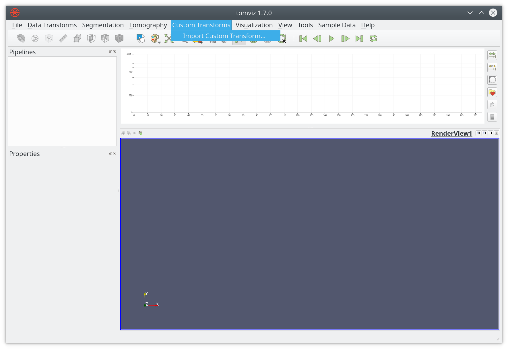

# Operators

Operators are the core of the data processing pipeline. They are predominantly
written in Python, with some developed in C++. Most operators take a volume
as an input, do some operations on that volume, and output a volume. In Python
these are typically viewed as NumPy arrays, where they are a view of the native
C++ memory used by Tomviz.

## Simple Operator

This operator can be found by clicking on `Data Tansforms -> Custom Transform`.
It is one of the simplest transforms possible where all simple operators define
the `transform_scalars` function, import the necessary modules, and then get the
data as an array. This array can be treated like any NumPy array, operated on,
and once ready the output should be set to make it visible to the application.

``` python
def transform_scalars(dataset):
    """Python operators that transforms the input array"""

    from tomviz import utils
    import numpy as np

    # Get the current volume as a numpy array.
    array = utils.get_array(dataset)

    # This is where you operate on your data, here we square root it.
    result = np.sqrt(array)

    # This is where the transformed data is set, it will display in tomviz.
    utils.set_array(dataset, result)
```

The dialog in Tomviz enables editing of  Python transforms in the source tab,
clicking apply will apply the code in the editor leaving the dialog open,
clicking OK will apply the transform and close the dialog. The Python code is
not saved permanently, saving a state file will save custom Python.

## Custom Operators

Tomviz comes with a number of operators, many of which are developed in Python.
We welcome contributions to the code base, but sometimes it is preferable to
add local operators. On startup the application looks for a `tomviz` directory
as a folder in your home directory, if found that directory is scanned for
operators. These will be added to the `Custom Transforms` menu, and will look
just like builtin operators (empty menu shown below with option to import).



The default name will match that of the Python file, i.e. `my_thing.py` would
be added as `my_thing` to the menu. You should only import a transform once,
all this really does is add the Python file to the `tomviz` directory in your
home directory, i.e. `~/tomviz/my_thing.py`. When developing a custom transform
it is preferable to simply copy your code to that directory, and edit it in
place. You will need to close and reopen Tomviz in order to see new changes.

If you add a JSON file with the same name you can customize the appearance
further, and even add some input interface.

``` json
{
  "name" : "Custom Thing",
  "label" : "Operate on data",
  "description" : "Apply my special operation to the data...",
}
```