# Catalog

## Tortuosity

The `Tortuosity` operator calculates various quantities described in the paper by [Chen-Wiegart et al.](https://doi.org/10.1016/j.jpowsour.2013.10.026)

The operator can be found under the `Data Transform` menu.

### Parameters
- `phase (int)`: the scalar value in the dataset that is considered a pore
- `distance_method (enum`): the distance method to calculate distance between pore nodes. Options are: Eucledian, CityBlock, Chessboard.
- `propagation_direction (enum)`: the face of the volume from which distances are calculated. Options are X+, X-, Y+, Y-, Z+, Z-.
- `save_to_file (bool)`: save the detailed output of the operator to files. If set to True, propagate along all six directions and save the results, but only display results for one direction within the application.
- `output_folder (str)`: the path to the folder where the optional output files are written to

### Output
- Volumetric data: in the output volume are saved the distances between each pore voxel and the starting propagation face.
- Path length table: the average path length for a face vs the linear length
- Tortuosity table: 4 different tortuosity values calculated from the path length table.
- Tortuosity distribution table: the distribution of tortuosities for voxels in the last slice of the propagation
- If the `save_to_file` parameter is set to `True`, the quantities above will also be saved to disk inside `output_folder` for all the possible propagation directions. For each direction, the following files are created:
    - `distance_map_*.npy`
    - `path_length_*.csv`
    - `tortuosity_*.csv`
    - `tortuosity_distribution*.csv`

## Pore Size Distribution

The `Pore Size Distribution` operator calculates the continuous pore size distribution as described in the paper by [Münch and Holzer](https://doi.org/10.1111/j.1551-2916.2008.02736.x)

The operator can be found under the `Data Transform` menu.

### Parameters
- `threshold (int)`: scalars greater than `threshold` are considered matter. scalars less than `threshold` are considered pore.
- `radius_spacing (int)`: the pore size distribution is computer for all radii from 1 to `r_max`. Tweak the `radius_spacing` parameter to reduce the number of radii. For example, if `radius_spacing` is 3, only calculate distribution for `r_s = 1, 4, 7, ... , r_max`.
- `save_to_file (bool)`: save the detailed output of the operator to files.
- `output_folder (str)`: the path to the folder where the optional output files are written to

### Output
- Volumetric data: for each pore voxel, save distance from the closest matter voxel.
- Pore size distribution table: the fraction of the total volume that can be filled by spheres with the a certain radius
- If the `save_to_file` parameter is set to `True`, the quantities above will also be saved to disk inside `output_folder`. The following files are created:
    - `pore_size_distribution.csv`

## FXI Workflow

### Running

The `FXI Workflow` operator uses [tomopy](https://tomopy.readthedocs.io/en/latest/) to perform a reconstruction as needed in the [Full Field X-ray Imaging](https://www.bnl.gov/nsls2/beamlines/beamline.php?r=18-ID) workflow. The operator has a custom UI that allows the user to generate and visualize reconstructions of a single slice with different rotation centers, so that a reasonable rotation center for the full reconstruction may be chosen. Since both the operator and the UI require tomopy, the `FXI Workflow` operator may only be used if Tomviz was downloaded from [conda-forge](https://anaconda.org/conda-forge/tomviz), and tomopy was installed in that conda environment.

The operator can be found under the `Tomography` menu.

To visualize reconstructions of a slice with different rotation centers, first set the various options in the `Test Rotation Centers` group and then click the `Test Rotations` button. This will run the `test_rotations()` function in the script with the selected parameters. After the reconstructions are generated, the left side of the dialog will display the reconstruction for the selected slice at the selected rotation. Use the `Rotation` slider bar in the `Rotations Preview Settings` group to scroll through and identify the rotation center with the clearest reconstruction. After a reasonable estimated rotation center is found, a more precise rotation center may be identified by narrowing the "Start" and "Stop" window, clicking `Test Rotations`, and scrolling through the reconstructions again. The colormap and `Min`/`Max` may also be edited to improve the contrast of the image.

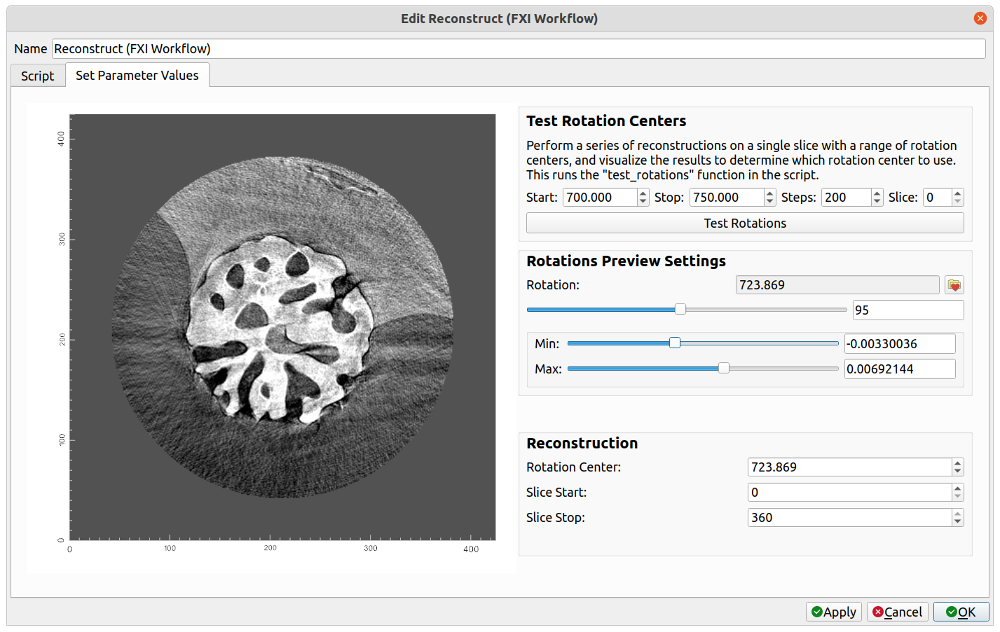

The settings for the reconstruction operation may be found in the `Reconstruction` group. If test rotations were visualized, the `Rotation Center` will automatically be set to match the rotation center of the current preview on the left side of the dialog. Select the start and stop slices, and then click `OK`. This will run the `transform()` function in the script with the selected parameters. A "Reconstruction" dataset will be created as the output, to which further processing and visualization can be performed. For the reconstruction of the example above, after performing a circle mask, followed by adding a "Volume" visualization module, and editing the color opacity histogram at the top of the application, the following is displayed:

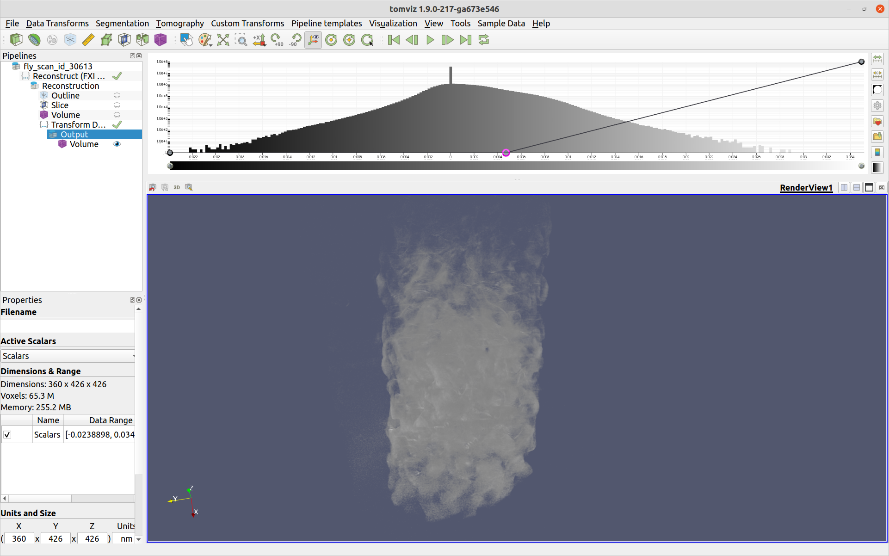

### Adding Custom Parameters

The `FXI Workflow` operator also allows custom parameters to be added to the UI, which will be passed to the relevant functions when they are called. Custom parameters for the reconstruction can be added as follows:

1\. Save the `FXI Workflow` script by selecting the `FXI Workflow` operator, clicking on the `Script` tab, and clicking the `Save Script` button below the script. The name does not matter, but save it with a `.py` extension in the default directory that appears in order for Tomviz to automatically load it on start-up.

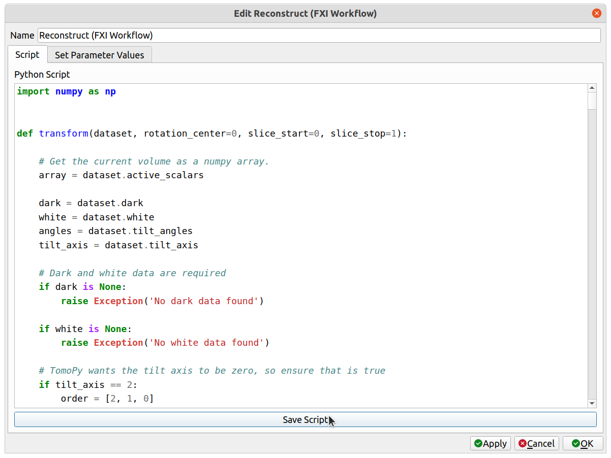

This will save both the script and a `.json` description file alongside it.

2\. Navigate to the directory where the script was saved and open the `.json` file that was saved next to it (it should have the same name as the saved script except with a `.json` extension). In the `parameters` list, add a new parameter by following the example of the other parameters there (see detailed documentation of the `.json` file in [Operator Development](operators_development.md#generating-the-user-interface-automatically)). The new parameter must have a unique name, and this name will be used as an argument in the `transform()` python function. See the `custom_int` parameter in the example below.

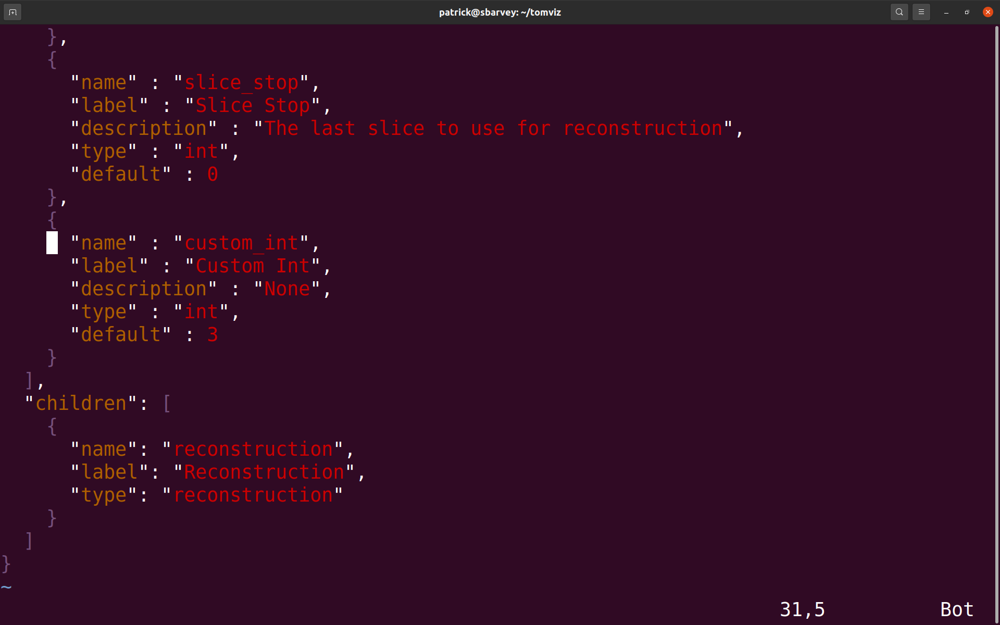

3\. Save the `.json` file. Next, either click on `Custom Transforms`->`Import Custom Transform...` and select the python script, or restart Tomviz if the file was saved in its default directory. The operator should appear under the `Custom Transforms` menu. Select it. There should be a new group in the `Reconstruction` group named `Additional Parameters`, and the extra parameter with the provided label should be there. In this case, the extra parameter is "Custom Int".

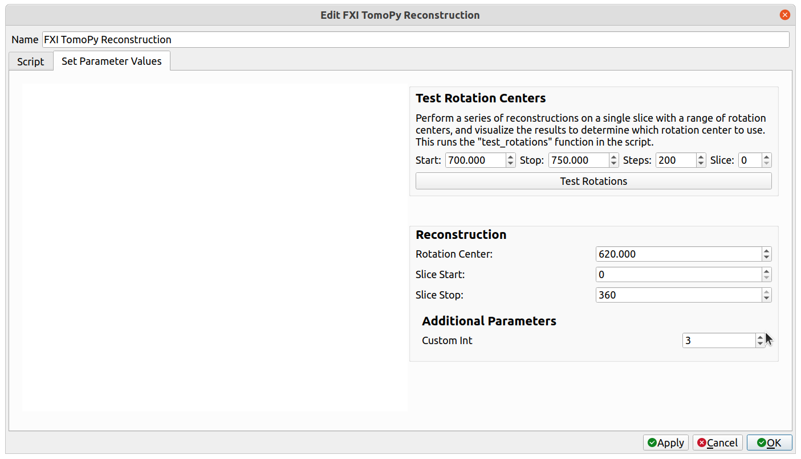

4\. The new parameter needs to be added as an argument to the `transform()` function. Select the "Script" tab, find the `transform()` function, and add an argument with the same name as the newly added parameter (`custom_int`, in the above example). When "Apply" or "OK" is clicked, the operator will begin, and the extra parameter will be passed into the `transform()` function as that argument. Save the script one more time so that it includes the new argument.

In the `FXI Workflow` operator, new parameters may also be added to the `Test Rotation Centers` group, which will be passed to the `test_rotations()` function in the script. To do so, follow the same instructions as above, except that in the `.json` file, provide a `tag` key to the parameter with a value of `test_rotations`, like so:

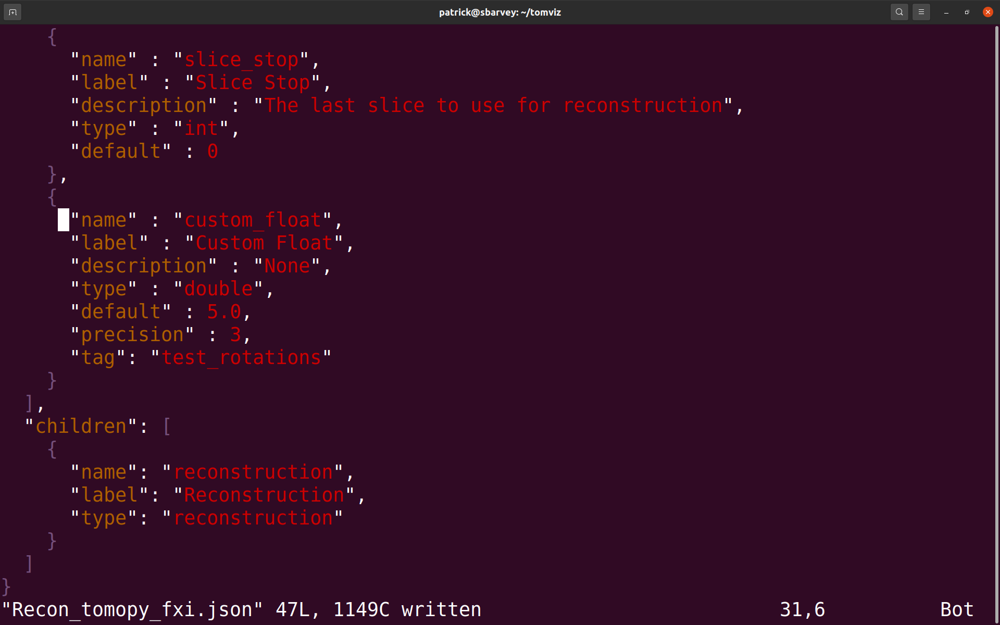

The added parameter should appear within the `Test Rotation Centers` group within a newly visible `Additional Parameters` group, like so:

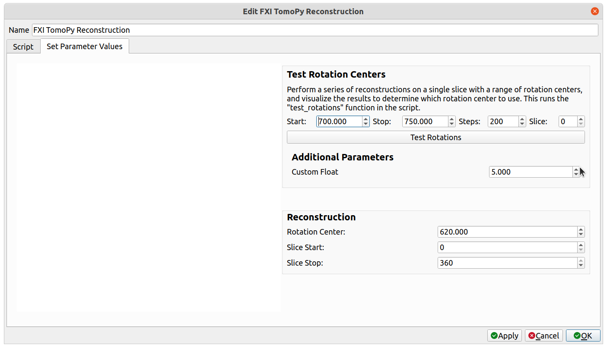

Select the "Script" tab, find the `test_rotations()` function, and add an argument with the same name as the newly added parameter (`custom_float`, in the above example). When "Test Rotations" is clicked, the extra parameter will be passed into the `test_rotations()` function as that argument. Save the script one more time so that it includes the new argument.

This process may be repeated to add any number of extra parameters to either the reconstruction operation or the "Test Rotations" feature.

### Test Rotation Parameters
- `Start (double)`: the starting value of the rotation centers to generate
- `Stop (double)`: the final value of the rotation centers to generate
- `Steps (int)`: the number of evenly spaced samples to generate over the [`Start`, `Stop`] interval
- `Slice (int)`: the index of the slice to reconstruct using the rotation centers

### Reconstruction Parameters
- `Rotation Center (double)`: the rotation center to use for the reconstruction. If test rotations were previewed, this will automatically be set to match the current rotation center being previewed.
- `Slice Start (int)`: the starting index of the slices to reconstruct (defaults to 0)
- `Slice Stop (int)`: the final index of the slices to reconstruct (defaults to the last slice)

### Output
- `reconstruction`: the reconstruction output

## Manual Manipulation

The manual manipulation operator allows the user to visually manipulate a
volume, and then apply those visual transformations to the underlying voxels.
One use case is to manually register one volume with another.

### Running

To perform manual manipulation, first ensure that the data source to be
manipulated is selected in the pipeline view.

Next, select "Data Transforms" -> "Manual Manipulation". The operator dialog
should appear, and a red outline will be rendered in the view.

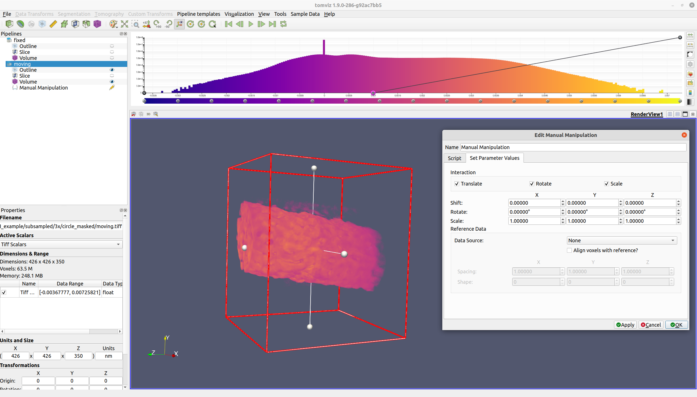

The red outline indicates the region where the voxels will lie after the
operation has completed. Input voxels outside of this region will either
be zeroed out (in the rotation step), or wrapped around to the other side
(in the shift step).

All three types of interaction (translation, rotation, and scaling) may be
enabled/disabled via their respective checkboxes. Translation may be
performed by either middle-clicking and dragging the volume, or by
left-clicking and dragging the middle handle. Rotation may be performed
by left-clicking and dragging a face. Scaling may be performed by either
left-clicking and dragging a face handle (for non-fixed aspect ratio scaling),
or by right-clicking and dragging the volume (for fixed aspect ratio scaling).

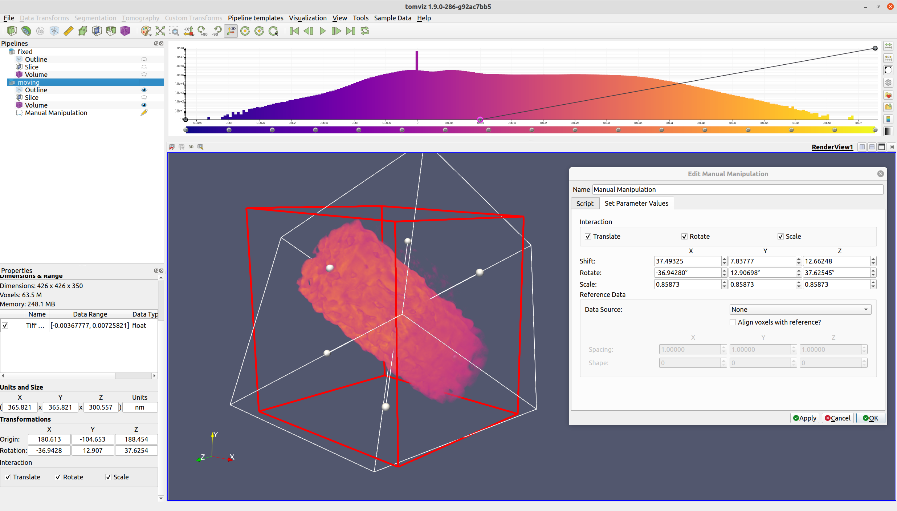

Once the volume is suitably transformed, click the "OK" button. The voxels
will then be transformed via rotation, shift, and scaling.

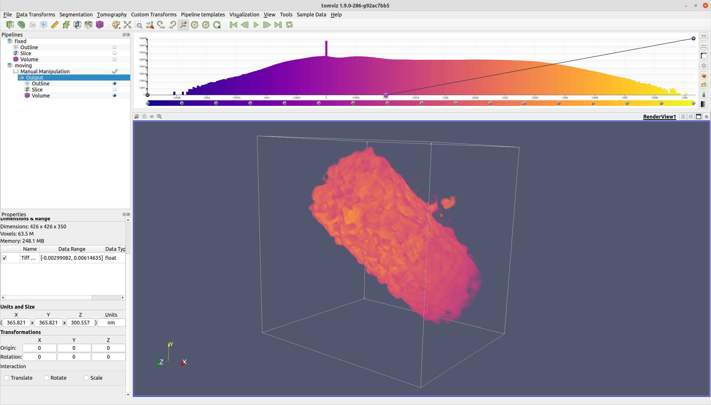

The manual manipulation operator also provides the ability
to assign a reference data source. If a reference data source is selected,
the center of the reference data source will be moved to match the center
of the moving data source. This is especially valuable if the data sources
are different sizes, as it will allow for a more visually intuitive alignment.

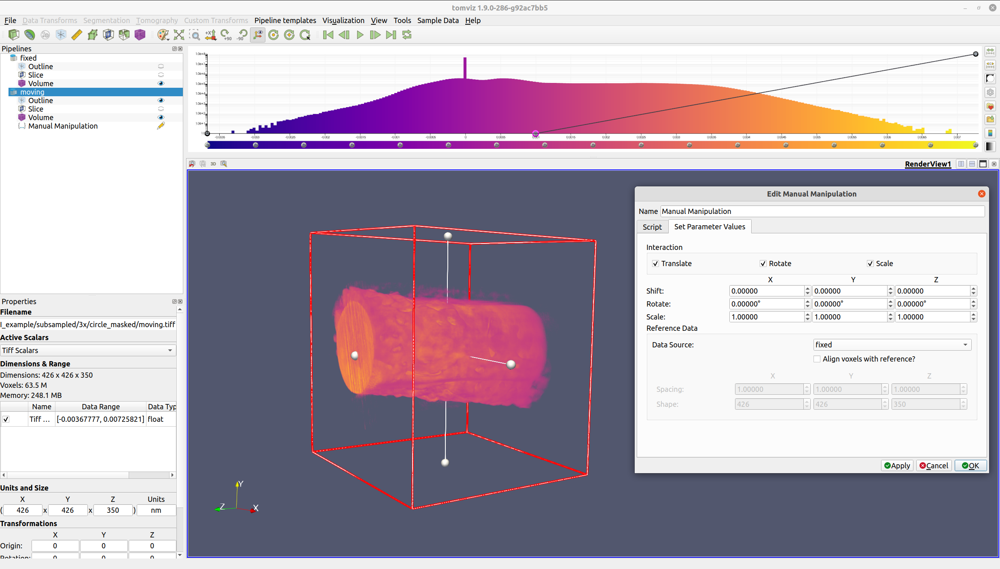

If "Align voxels with reference?" is checked, then the moving data source
will be cropped, padded, and resampled so that the voxels align with the
reference data source.

Alternatively, if "Align voxels with reference?" is checked, but the
reference data source is "None", the values of the reference spacing
and shape may be entered manually. These values will then be used to
determine the cropping, padding, and resampling that is needed.

### Parameters

- `Shift (int)`: the shift to apply to the voxels. In the custom Manual
Manipulation widget, this is expressed instead as a double representing
the shift in physical units. This is converted (including rounding) to
integer shift. The shift is applied after rotation, and before any
reference alignment.
- `Rotate (double)`: the rotations to perform about the center of the
volume in YXZ ordering (the same ordering that VTK uses internally).
Rotation is performed before any other operation.
- `Scale (double)`: the scaling to apply to the volume. This does not
affect the voxels (unless "Align with Reference" is checked - see the
"Reference Spacing" parameter for details). It is instead an attribute
on the data source.
- `Align with Reference (bool)`: whether to align the voxels of the
output volume with a reference spacing and shape
- `Reference Spacing (double)`: the reference spacing target.
Resampling will be performed to transform the volume's spacing to the
reference spacing. This will only be applied if "Align with Reference"
is `True`.
- `Reference Shape (int)`: the reference shape target. Cropping/padding
will be performed to transform the volume's shape to the reference
shape. This will only be applied if "Align with Reference" is `True`.

### Output
- the resulting volume from the transformations
