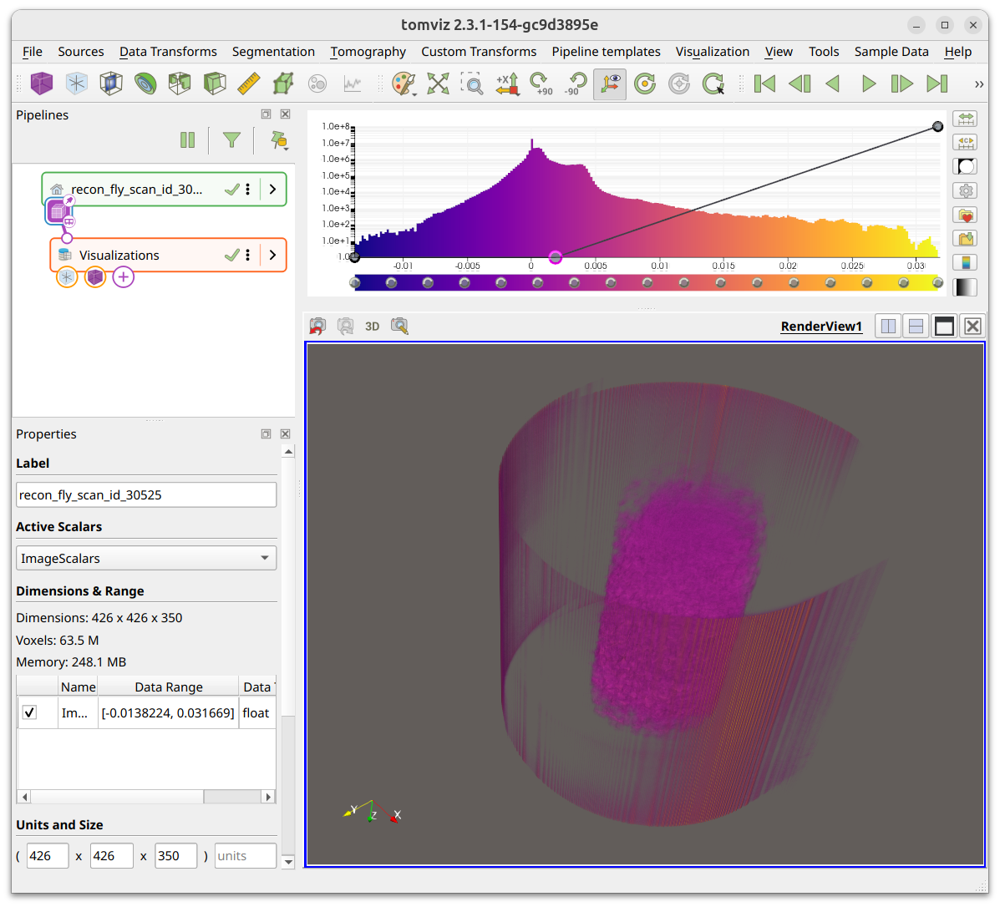
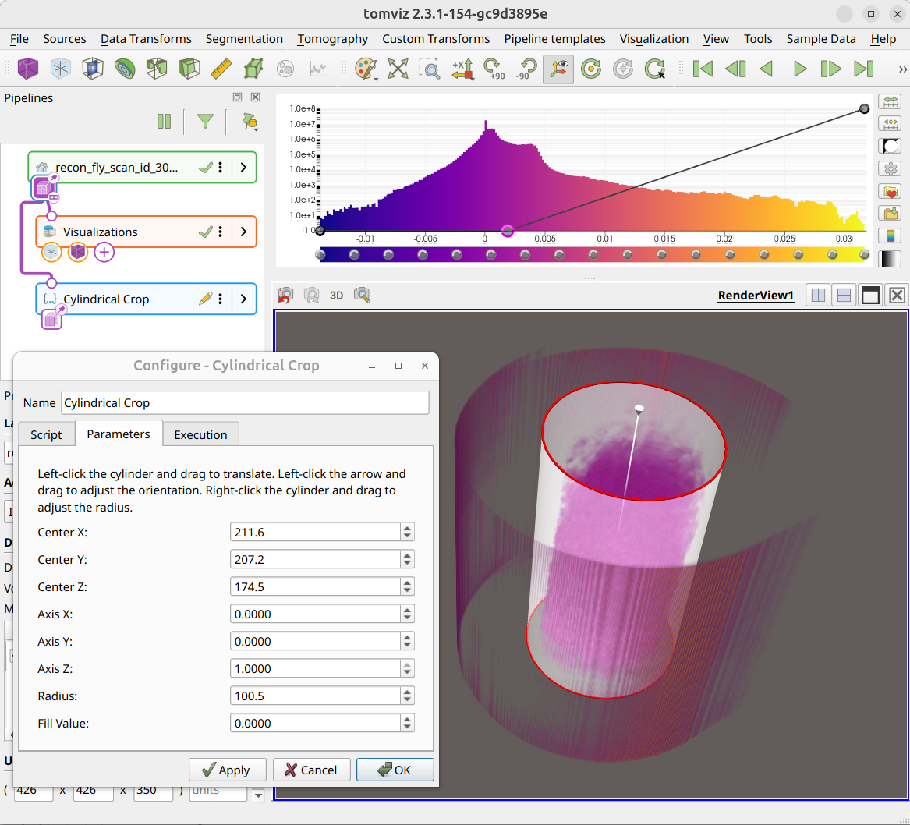
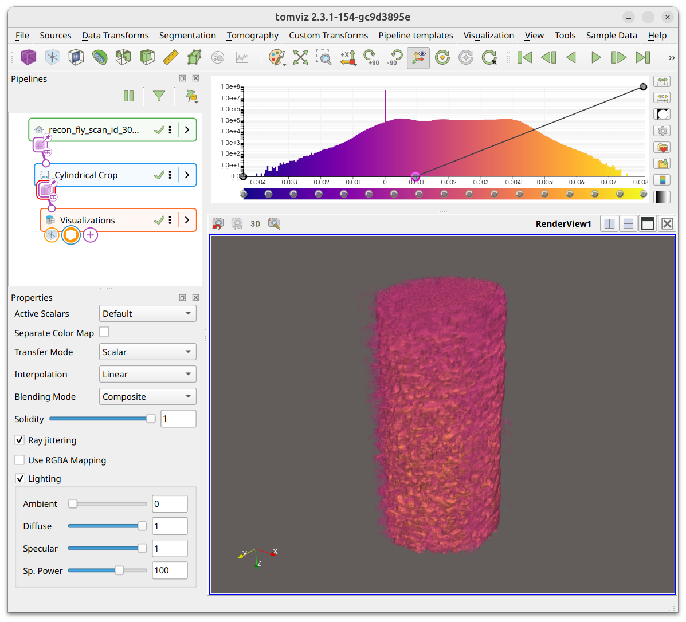

# Catalog

## Invert Data

The `Invert Data` transform inverts scalar values so that the maximum becomes
the minimum and vice versa. This is useful for preparing data where the
convention for foreground/background intensity is reversed.

The transform can be found under `Data Transforms` > `Math Operations` >
`Invert Data`.

### Parameters
- None

### Output
- The volume with inverted scalar values. Supports cancellation.

## Tortuosity

The `Tortuosity` transform calculates various quantities described in the paper
by [Chen-Wiegart et al.](https://doi.org/10.1016/j.jpowsour.2013.10.026)

The transform can be found under `Data Transforms` > `Material Analysis`.

### Parameters
- `phase (int)`: the scalar value in the dataset that is considered a pore
- `distance_method (enum)`: the distance method to calculate distance between
  pore nodes. Options are: Euclidean, CityBlock, Chessboard.
- `propagation_direction (enum)`: the face of the volume from which distances
  are calculated. Options are X+, X-, Y+, Y-, Z+, Z-.
- `save_to_file (bool)`: save the detailed output of the operator to files. If
  set to True, propagate along all six directions and save the results, but
  only display results for one direction within the application.
- `output_folder (str)`: the path to the folder where the optional output files
  are written to

### Output
- Volumetric data: in the output volume are saved the distances between each
  pore voxel and the starting propagation face.
- Path length table: the average path length for a face vs the linear length
- Tortuosity table: 4 different tortuosity values calculated from the path
  length table.
- Tortuosity distribution table: the distribution of tortuosities for voxels in
  the last slice of the propagation
- If `save_to_file` is True, the following files are created for all propagation
  directions:
    - `distance_map_*.npy`
    - `path_length_*.csv`
    - `tortuosity_*.csv`
    - `tortuosity_distribution*.csv`

## Pore Size Distribution

The `Pore Size Distribution` transform calculates the continuous pore size
distribution as described by
[Münch and Holzer](https://doi.org/10.1111/j.1551-2916.2008.02736.x).

The transform can be found under `Data Transforms` > `Material Analysis`.

### Parameters
- `threshold (int)`: scalars greater than `threshold` are considered matter;
  scalars less than `threshold` are considered pore.
- `radius_spacing (int)`: the pore size distribution is computed for all radii
  from 1 to `r_max`. Increase `radius_spacing` to reduce the number of radii
  tested.
- `save_to_file (bool)`: save the detailed output to files.
- `output_folder (str)`: the path to the folder where output files are written.

### Output
- Volumetric data: for each pore voxel, the distance from the closest matter
  voxel.
- Pore size distribution table: the fraction of total volume that can be filled
  by spheres of each radius.
- If `save_to_file` is True: `pore_size_distribution.csv`

## Cylindrical Crop

The `Cylindrical Crop` transform crops a volume to a cylindrical region with
an arbitrary axis orientation. It provides an interactive 3D widget for
visually positioning and sizing the cylinder.

The transform can be found under `Data Transforms` > `Data Management` >
`Cylindrical Crop`.

  <iframe src="https://drive.google.com/file/d/1GKXI173fJYuabPbwkItOwclbPU0Fprmz/preview" width="760" height="480" allow="autoplay"></iframe>

The volume before cropping:

When the operator is added, an interactive cylinder widget appears overlaid on
the volume. The Configure dialog shows instructions and numeric spinboxes for
the center, axis, radius, and fill value. Left-click the cylinder and drag to
translate. Left-click the arrow and drag to adjust the orientation. Right-click
the cylinder and drag to adjust the radius.

After applying, voxels outside the cylinder are replaced with the fill value
and the cropped volume is displayed:

### Parameters
- `center_x, center_y, center_z (double)`: Center of the cylinder in voxel
  coordinates. Default -1.0 (auto-center).
- `axis_x, axis_y, axis_z (double)`: Direction of the cylinder axis
  (normalized). Default: along Z axis.
- `radius (double)`: Radius of the cylinder in voxels. Default -1.0
  (auto-compute as half the smallest perpendicular dimension).
- `fill_value (double)`: Value assigned to voxels outside the cylinder.
  Default: 0.0.

### Output
- The input volume with voxels outside the cylinder replaced by `fill_value`.

## Deconvolution Denoise

The `Deconvolution Denoise` transform performs deconvolution-based denoising
using a ptychographic probe and a selected regularization method. See the
[analysis page](analysis.md#deconvolution-denoise) for an overview.

The transform can be found under `Data Transforms` > `Metrics & Spectral`.

### Methods

- **APG_BM3D** - Most accurate but slowest; requires `bm3d` package.
- **APG_TV** - Total Variation regularization; no extra dependencies.
- **ADMM_TV** - Fast ADMM with TV; no upscaling support; no extra dependencies.

### Parameters
- `Scalars (select_scalars)`: which scalar arrays to process.
- `Method (enum)`: APG_BM3D, APG_TV, or ADMM_TV.
- `Axis (enum)`: X, Y, or Z.
- `Probe`: probe dataset for PSF, provided via the transform's second input
  port. Link the probe source node to this port in the pipeline.
- `Fast Axis Scanning (enum)`: dilation or average.
- `Slow Axis Scanning (enum)`: dilation or average.
- `Probe Kernel (int)`: size of probe kernel. Default: 11.
- `Scale X (int)`: X scale for super-resolution (APG methods only). Default: 1.
- `Scale Y (int)`: Y scale for super-resolution (APG methods only). Default: 1.
- `Max Iterations (int)`: maximum iterations. Default: 8.
- `Mu (double)`: regularization parameter. Default: 0.01.

### Output
- Denoised volumetric dataset with selected scalars processed.

## Similarity Metrics

The `Similarity Metrics` transform computes per-slice MSE and SSIM between the
current dataset and a reference. See the
[analysis page](analysis.md#similarity-metrics) for an overview.

The transform can be found under `Data Transforms` > `Metrics & Spectral`.

### Parameters
- `Scalars (select_scalars)`: which scalar arrays to compute metrics for.
- `Axis (enum)`: X, Y, or Z.
- `Reference Dataset (dataset)`: dataset to compare against.

### Output
- Similarity table with columns for slice index, MSE, and SSIM per scalar.
