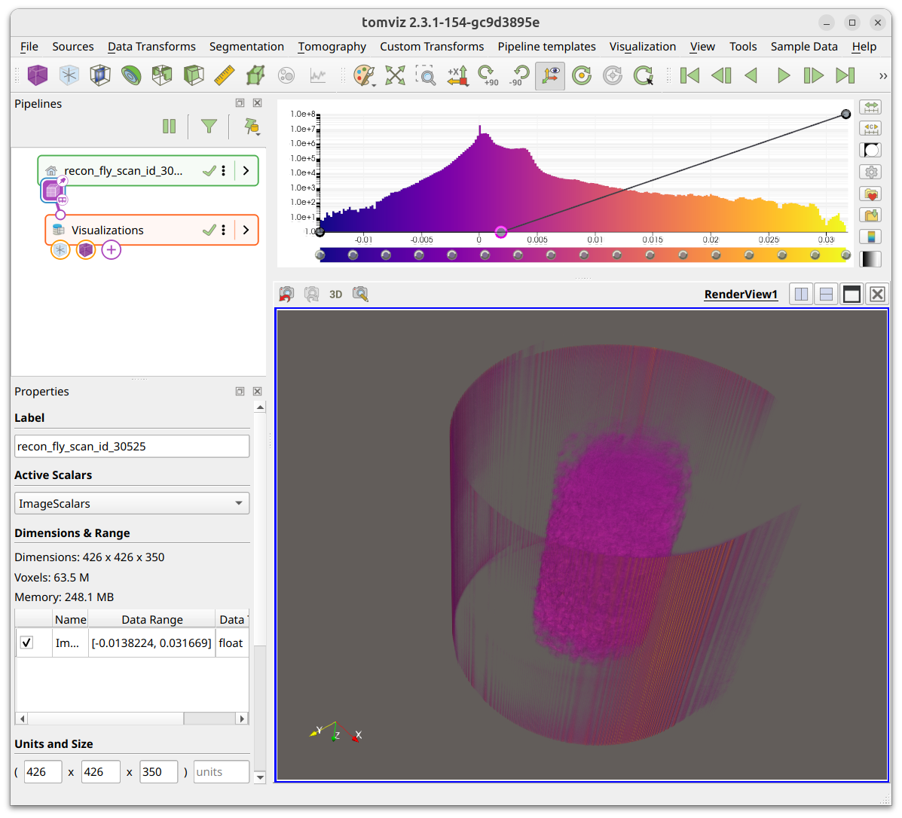
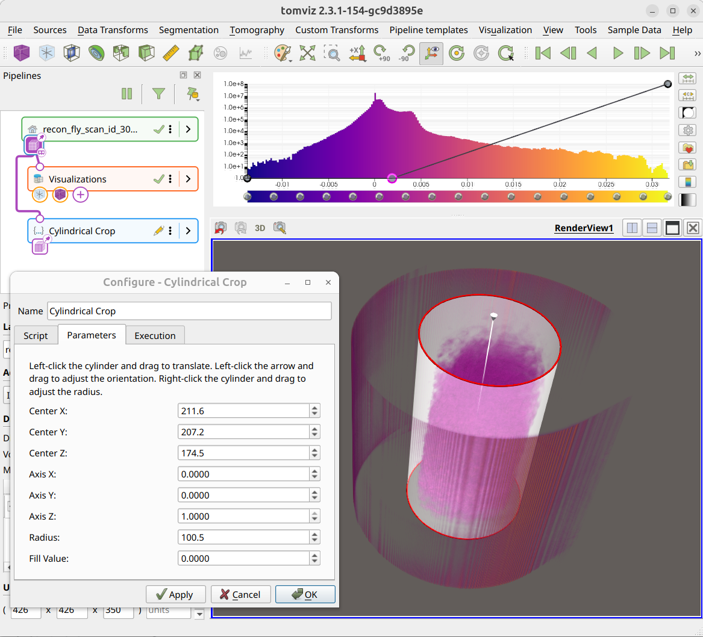
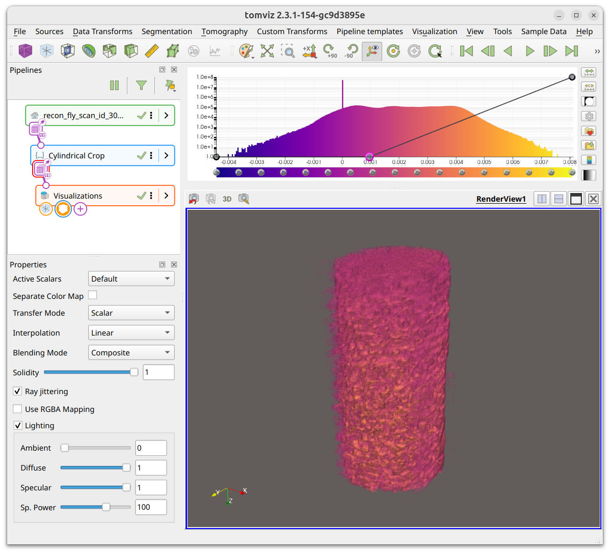

# Catalog

## Invert Data

`Data Transforms` -> `Math Operations` -> `Invert Data` inverts the scalar
values so that the maximum becomes the minimum and vice versa, for data whose
foreground/background intensity convention is reversed.

### Parameters
- None

### Output
- The volume with inverted scalar values. Supports cancellation.

## Tortuosity

The `Tortuosity` transform (`Data Transforms` -> `Material Analysis`)
calculates the quantities described by
[Chen-Wiegart et al.](https://doi.org/10.1016/j.jpowsour.2013.10.026)

### Parameters
- `phase (int)`: the scalar value in the dataset that is considered a pore
- `distance_method (enum)`: the distance method to calculate distance between
  pore nodes. Options are: Euclidean, CityBlock, Chessboard.
- `propagation_direction (enum)`: the face of the volume from which distances
  are calculated. Options are X+, X-, Y+, Y-, Z+, Z-.
- `save_to_file (bool)`: if True, also propagate along all six directions and
  save the detailed results to files. Only one direction is shown in the
  application.
- `output_folder (str)`: the folder for the optional output files

### Output
- Volumetric data: the distance from each pore voxel to the starting
  propagation face.
- Path length table: the average path length for a face vs the linear length
- Tortuosity table: four tortuosity values calculated from the path length
  table.
- Tortuosity distribution table: the distribution of tortuosities for voxels in
  the last slice of the propagation
- If `save_to_file` is True, the following files are created for all propagation
  directions:
    - `distance_map_*.npy`
    - `path_length_*.csv`
    - `tortuosity_*.csv`
    - `tortuosity_distribution*.csv`

## Pore Size Distribution

The `Pore Size Distribution` transform (`Data Transforms` ->
`Material Analysis`) calculates the continuous pore size distribution
described by
[Münch and Holzer](https://doi.org/10.1111/j.1551-2916.2008.02736.x).

### Parameters
- `threshold (int)`: scalars greater than `threshold` are considered matter;
  scalars less than `threshold` are considered pore.
- `radius_spacing (int)`: the pore size distribution is computed for all radii
  from 1 to `r_max`. Increase `radius_spacing` to reduce the number of radii
  tested.
- `save_to_file (bool)`: save the detailed output to files.
- `output_folder (str)`: the path to the folder where output files are written.

### Output
- Volumetric data: for each pore voxel, the distance from the closest matter
  voxel.
- Pore size distribution table: the fraction of total volume that can be filled
  by spheres of each radius.
- If `save_to_file` is True: `pore_size_distribution.csv`

## Cylindrical Crop

`Data Transforms` -> `Data Management` -> `Cylindrical Crop` crops a volume to a
cylinder with any axis orientation, placed and sized with a 3D widget.

  <iframe src="https://drive.google.com/file/d/1GKXI173fJYuabPbwkItOwclbPU0Fprmz/preview" width="760" height="480" allow="autoplay"></iframe>

The volume before cropping:

When the transform is added, the cylinder widget appears on the volume, and
the dialog shows instructions and fields for the center, axis, radius, and
fill value. Left-click the cylinder and drag to
translate. Left-click the arrow and drag to adjust the orientation. Right-click
the cylinder and drag to adjust the radius.

After applying, voxels outside the cylinder are replaced with the fill value
and the cropped volume is displayed:

### Parameters
- `center_x, center_y, center_z (double)`: Center of the cylinder in voxel
  coordinates. Default -1.0 (auto-center).
- `axis_x, axis_y, axis_z (double)`: Direction of the cylinder axis
  (normalized). Default: along Z axis.
- `radius (double)`: Radius of the cylinder in voxels. Default -1.0
  (auto-compute as half the smallest perpendicular dimension).
- `fill_value (double)`: Value assigned to voxels outside the cylinder.
  Default: 0.0.

### Output
- The input volume with voxels outside the cylinder replaced by `fill_value`.

## Deconvolution Denoise

The `Deconvolution Denoise` transform (`Data Transforms` ->
`Metrics & Spectral`) denoises data by deconvolution with a ptychographic
probe and a choice of regularization. See the
[analysis page](analysis.md#deconvolution-denoise) for an overview.

### Methods

- **APG_BM3D** - Most accurate but slowest; requires `bm3d` package.
- **APG_TV** - Total Variation regularization; no extra dependencies.
- **ADMM_TV** - Fast ADMM with TV; no upscaling support; no extra dependencies.

### Parameters
- `Scalars (select_scalars)`: which scalar arrays to process.
- `Method (enum)`: APG_BM3D, APG_TV, or ADMM_TV.
- `Axis (enum)`: X, Y, or Z.
- `Probe`: the probe dataset for the PSF. Link the probe source node to this
  input port in the pipeline.
- `Fast Axis Scanning (enum)`: dilation or average.
- `Slow Axis Scanning (enum)`: dilation or average.
- `Probe Kernel (int)`: size of probe kernel. Default: 11.
- `Scale X (int)`: X scale for super-resolution (APG methods only). Default: 1.
- `Scale Y (int)`: Y scale for super-resolution (APG methods only). Default: 1.
- `Max Iterations (int)`: maximum iterations. Default: 8.
- `Mu (double)`: regularization parameter. Default: 0.01.

### Output
- Denoised volumetric dataset with selected scalars processed.

## Similarity Metrics

The `Similarity Metrics` transform (`Data Transforms` -> `Metrics & Spectral`)
computes per-slice MSE and SSIM between the dataset and a reference. See the
[analysis page](analysis.md#similarity-metrics) for an overview.

### Parameters
- `Scalars (select_scalars)`: which scalar arrays to compute metrics for.
- `Axis (enum)`: X, Y, or Z.
- Reference dataset: the dataset to compare against, linked to the
  transform's second input port in the pipeline.

### Output
- Similarity table with columns for slice index, MSE, and SSIM per scalar.
