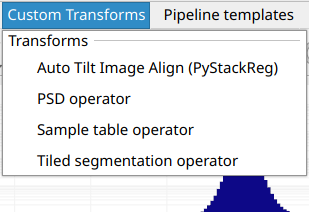

# Development

Transforms are the core of the data processing pipeline. They are predominantly
written in Python, with some developed in C++. Most transforms take a volume as
an input, do some operations on that volume, and output a volume. In Python
these are typically viewed as NumPy arrays where they are a view of the native
C++ memory used by Tomviz.

Tomviz supports two APIs for writing Python transforms: the **legacy operator
API** (`tomviz.operators`) and the **new node API** (`tomviz.nodes`). Both
are fully supported and can be used for custom transforms.

## Legacy Operator API

### Simple Transform

This transform can be created by clicking on `Data Transforms` >
`Data Management` > `Custom Transform`. It is one of the simplest transforms
possible - all simple transforms define a `transform` function, import the
necessary modules, and then get the data as an array.

``` python
def transform(dataset):
    """Python transform that operates on the input array"""

    import numpy as np

    # Get the current volume as a numpy array.
    array = dataset.active_scalars

    # This is where you operate on your data, here we square root it.
    result = np.sqrt(array)

    # This is where the transformed data is set, it will display in tomviz.
    dataset.active_scalars = result

    # Optionally set the voxel sizes (in physical units)
    dataset.spacing = [5, 10, 7]
```

The dialog in Tomviz enables editing of Python transforms in the source tab.
Clicking Apply will apply the code in the editor leaving the dialog open;
clicking OK will apply the transform and close the dialog.

### Subclassing tomviz.operators.Operator

Tomviz provides an operator base class that can be used to implement a Python
transform. To create a transform, subclass and provide an implementation of
the `transform` method.

```python
import tomviz.operators

class MyOperator(tomviz.operators.Operator):
    def transform(self, dataset):
        # Do work here
```

### Subclassing tomviz.operators.CancelableOperator

To implement a transform that can be canceled, derive from
`tomviz.operators.CancelableOperator`. This provides a `canceled` property
that can be checked to determine if the user has requested cancellation.

```python
import tomviz.operators

class MyCancelableOperator(tomviz.operators.CancelableOperator):
    def transform(self, dataset):
         while(not self.canceled):
            # Do work here
```

### Operator progress

Instances of `tomviz.operators.Operator` have a `progress` attribute for
reporting progress. Set `progress.maximum` for the total steps,
`progress.value` for the current step, and `progress.message` for a status
message.

```python
import tomviz.operators

class MyProgressOperator(tomviz.operators.Operator):
    def transform(self, dataset):
        self.progress.maximum = 100
        for i in range(100):
            # Do work here
            self.progress.value = i + 1
```

## New Node API

Tomviz 3.0 introduces a new node-based API via `tomviz.nodes`. This API aligns
with the new pipeline model and provides explicit port-based input/output.

### SourceNode

A `SourceNode` produces output data without any inputs. Subclass
`tomviz.nodes.SourceNode` and implement the `produce` method:

```python
import tomviz.nodes
import numpy as np

class MySphere(tomviz.nodes.SourceNode):
    def produce(self, radius=10.0, shape_x=100, shape_y=100, shape_z=100):
        ds = self.create_dataset()

        # Generate a sphere
        x, y, z = np.mgrid[:shape_x, :shape_y, :shape_z]
        center = np.array([shape_x, shape_y, shape_z]) / 2
        dist = np.sqrt((x - center[0])**2 + (y - center[1])**2 +
                       (z - center[2])**2)
        volume = (dist <= radius).astype(np.float32)

        ds.active_scalars = volume
        ds.spacing = (1.0, 1.0, 1.0)
        return {'output': ds}
```

Parameters are passed as keyword arguments from the JSON description file.
The return value is a dictionary mapping output port names to Dataset objects.

### TransformNode

A `TransformNode` consumes input data and produces output data. Subclass
`tomviz.nodes.TransformNode` and implement the `transform` method:

```python
import tomviz.nodes

class AddConstant(tomviz.nodes.TransformNode):
    def transform(self, inputs, constant=0.0):
        ds = inputs['volume']
        ds.active_scalars = ds.active_scalars + constant
        return {'volume': ds}
```

The `inputs` parameter is a dictionary mapping input port names to Dataset
objects. Return a dictionary mapping output port names to the results.

### Progress, Cancellation, and Completion

Both `SourceNode` and `TransformNode` provide the same progress/cancellation
interface as the legacy API:

```python
class MyNode(tomviz.nodes.TransformNode):
    def transform(self, inputs, **params):
        self.progress.maximum = 100
        for i in range(100):
            if self.canceled:
                return None
            # Do work
            self.progress.value = i + 1
        return {'volume': inputs['volume']}
```

### Dataset API

The `Dataset` object provides these properties and methods:

 * `active_scalars` - Get/set the active scalar array (NumPy ndarray)
 * `active_name` - Get/set the name of the active scalar
 * `num_scalars` - Number of scalar arrays
 * `scalars_names` - List of all scalar array names
 * `scalars(name)` - Get a scalar array by name
 * `set_scalars(name, array)` - Add or update a scalar array
 * `remove_scalars(name)` - Remove a scalar array
 * `spacing` - Voxel spacing (x, y, z) tuple
 * `tilt_angles` - NumPy array of tilt angles
 * `tilt_axis` - Axis index for tilting (0, 1, 2, or None)
 * `scan_ids` - NumPy array of scan IDs
 * `dark` / `white` - Dark/white field calibration data
 * `file_name` - Original filename
 * `metadata` - Arbitrary metadata dictionary
 * `empty_copy()` - Create a new dataset with same geometry but no arrays

## Generating the user interface automatically

Python transforms can take parameters governed by a JSON description file.
The JSON file consists of:

* `name` - The transform name (no spaces).
* `label` - The displayed name in the UI.
* `description` - Description of what the transform does.
* `parameters` - A JSON array of parameter definitions.

Each parameter has:

* `name` - Must be a valid Python variable name.
* `label` - Displayed name in the UI.
* `type` - One of: `bool`, `int`, `double`, `enumeration`, `xyz_header`,
  `file`, `directory`.
* `default` - Default value.
* `minimum` / `maximum` - Value bounds.
* `precision` - Decimal digits for `double` parameters.
* `options` - Array of `{"Name": index}` objects for `enumeration` type.

Examples of parameter descriptions:

`bool`
```json
{
  "name" : "enable_feature",
  "label" : "Enable Feature",
  "type" : "bool",
  "default" : false
}
```

`int`
```json
{
  "name" : "iterations",
  "label" : "Number of Iterations",
  "type" : "int",
  "default" : 100,
  "minimum" : 0
}
```

Multi-element `int`
```json
{
  "name" : "shift",
  "label" : "Shift",
  "type" : "int",
  "default" : [0, 0, 0]
}
```

`double`
```json
{
  "name" : "rotation_angle",
  "label" : "Angle",
  "type" : "double",
  "default" : 90.0,
  "minimum" : -360.0,
  "maximum" : 360.0,
  "precision" : 1
}
```

`enumeration`
```json
{
  "name" : "rotation_axis",
  "label" : "Axis",
  "type" : "enumeration",
  "default" : 0,
  "options" : [
    {"X" : 0},
    {"Y" : 1},
    {"Z" : 2}
  ]
}
```

### Defining Results and Child Data Sets

Transforms may produce additional datasets described in the JSON:

* `results` - Array of `{"name": "...", "label": "..."}` objects for additional
  output datasets.
* `children` - Array describing child datasets that accept further transforms.

Results and children are returned from the `transform` function as a dictionary
mapping names to datasets.

### Command line execution of pipeline

A pipeline can be executed from the command line without the Tomviz GUI. The
`tomviz-pipeline` package is available on conda-forge:

```bash
conda install -c conda-forge tomviz-pipeline
```

Alternatively, install from the Tomviz source repository:

```bash
pip install <tomviz_repo_directory>/tomviz/python/
```

Then execute a saved state file:

```bash
tomviz-pipeline -s <path_to_state_file> -o <path_to_write_output_emd>
```

The input data source can be overridden with the `-d` option, enabling batch
processing: save a pipeline as a state file in the GUI, then run it on
multiple datasets from a script:

```bash
for f in dataset_*.emd; do
    tomviz-pipeline -s my_pipeline.tvh5 -d "$f" -o "output_${f}"
done
```

## Custom Transforms

Tomviz comes with many built-in transforms. To add local transforms, place
Python files in one of these directories:

 * `~/tomviz/`
 * `~/.tomviz/`

The `Custom Transforms` menu re-scans these directories every time you open
it, so new files appear immediately without restarting the application.
Edits to existing files are also picked up on next use, since the script is
loaded from disk when the transform is applied.



The file name becomes the menu entry name (e.g., `my_thing.py` appears as
`my_thing`). Add a JSON file with the same base name to customize the
displayed label and add input parameters:

```json
{
  "name" : "Custom Thing",
  "label" : "Operate on data",
  "description" : "Apply my special operation to the data..."
}
```

### Custom Transforms Path

The search directories can be overridden by setting the
`TOMVIZ_CUSTOM_TRANSFORMS_PATH` environment variable. It accepts multiple
directories separated by `:` (Linux/macOS) or `;` (Windows).

## Apply transforms

Custom transforms appear in the `Custom Transforms` menu and can be applied
just like built-in transforms.

### User Input for Transforms

Custom transforms can accept user input via JSON metadata. For example,
to let the user set a parameter:

```json
{
  "name": "Fancy Square Root",
  "label": "Classy Square Root",
  "description": "A configurable square root operator.",
  "parameters": [
    {
      "name": "number_of_chunks",
      "label": "Number of Chunks",
      "type": "int",
      "default": 10,
      "minimum": 1,
      "maximum": 1000
    }
  ]
}
```

### Automatic Multi-Array Processing

By default, all transform functions are automatically wrapped to apply the
transform to every scalar array in the dataset. This means datasets with
multiple arrays (e.g., XRF elements) are processed automatically.

To disable this (e.g., for transforms that handle multi-array logic
internally), add to the JSON:

```json
{
  "apply_to_each_array" : false
}
```

### External Subprocess Execution

Individual transforms can execute in an external subprocess with a separate
Python environment. This is useful for transforms that depend on libraries
that would conflict with Tomviz's built-in environment, or that require
specialized packages such as AI/ML frameworks.

The external environment only needs the `tomviz-pipeline` package installed
(available from `conda-forge`). Beyond that, you can install any packages
you need - PyTorch, TensorFlow, specialized reconstruction libraries, etc.
The transform runs in a completely independent Python process, so there are
no dependency conflicts with Tomviz itself.

External execution can be configured in two ways:

**Via the Execution tab:** Every transform's configure dialog includes an
Execution tab with an executor dropdown. Select `External` and specify the
path to a Python environment containing `tomviz-pipeline`. This lets you
configure external execution at runtime without modifying any files.

**Via JSON metadata:** Set `tomviz_pipeline_env` in the transform's JSON
description file to make external execution the default:

```json
{
  "name": "MyAITransform",
  "label": "AI Denoise",
  "tomviz_pipeline_env": "/path/to/conda/envs/ai_env"
}
```

Note that `tomviz_pipeline_env` embeds a machine-specific path, so it is
best suited to operator collections managed for a specific site. For
portable operators, prefer configuring the environment through the
Execution tab.

Setting `"externalOnly": true` marks a transform as requiring external
execution: the Internal executor is disabled in the Execution tab, and
newly added instances default to External (with a warning until an
environment is selected). Use this for operators whose dependencies
(e.g. PyTorch) can never be imported in the application environment. The
built-in `SAM 2 Segmentation (3D)` operator is an example; see
[Machine Learning Segmentation](ml_segmentation.md).

To set up an external environment:

```bash
conda create -n my_transform_env python=3.10
conda activate my_transform_env
conda install -c conda-forge tomviz-pipeline
pip install torch  # or any other packages your transform needs
```

### Conditional Visibility with `visible_if`

Parameters can be conditionally shown based on other parameter values:

```json
{
  "name" : "num_iter",
  "label" : "Number of Iterations",
  "type" : "int",
  "default" : 100,
  "visible_if" : "algorithm == 'mlem' or algorithm == 'ospml_hybrid'"
}
```

Supports `and` and `or` operators for complex conditions.

### Accessing multiple channels

Datasets can contain multiple scalar arrays. Access them by name:

```python
def transform(dataset):
    import numpy as np

    array = dataset.scalars(name='Tiff Scalars')
    dataset.active_scalars = array
```

Iterate through all channels:

```python
def transform(dataset):
    import numpy as np

    channel_sum = None
    for name in dataset.scalars_names:
        channel = dataset.scalars(name)
        if channel_sum is None:
            channel_sum = channel
        else:
            channel_sum += channel

    dataset.active_scalars = channel_sum
```
