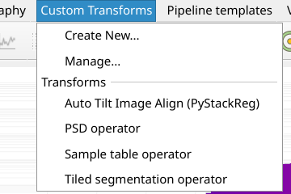
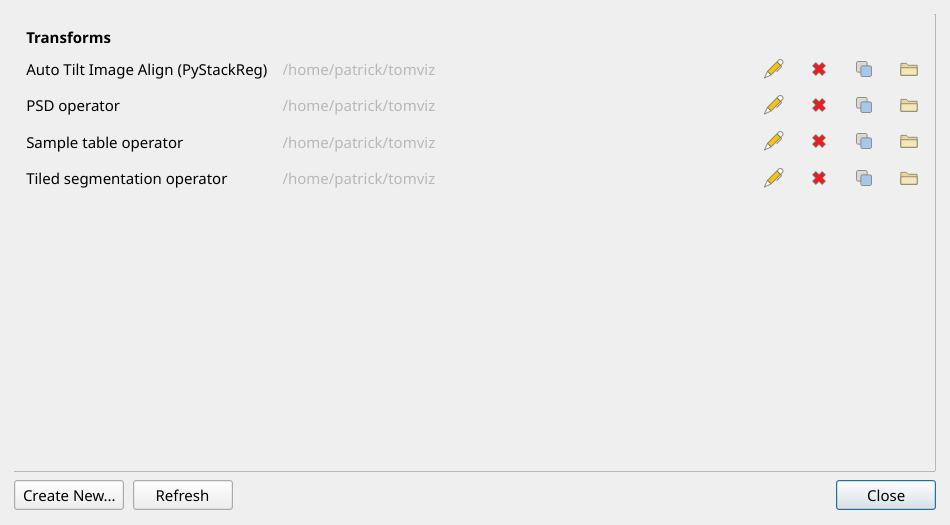

# Development

Transforms are the core of the data processing pipeline. Most are written in
Python, some in C++. A typical transform takes a volume, operates on it, and
outputs a volume. In Python the volume is a NumPy array that views Tomviz's
native C++ memory.

Tomviz supports two APIs for writing Python transforms: the **legacy operator
API** (`tomviz.operators`) and the **new node API** (`tomviz.nodes`). Both
work for custom transforms.

## Legacy Operator API

### Simple Transform

`Data Transforms` -> `Custom Transform` creates a transform like this one,
about the simplest possible. A simple transform defines a `transform`
function, imports the modules it needs, and gets the data as an array.

``` python
def transform(dataset):
    """Python transform that operates on the input array"""

    import numpy as np

    # Get the current volume as a numpy array.
    array = dataset.active_scalars

    # This is where you operate on your data, here we square root it.
    result = np.sqrt(array)

    # This is where the transformed data is set, it will display in tomviz.
    dataset.active_scalars = result

    # Optionally set the voxel sizes (in physical units)
    dataset.spacing = [5, 10, 7]
```

Edit the code in the dialog's `Script` tab. `Apply` runs it and keeps the
dialog open; `OK` runs it and closes the dialog.

### Subclassing tomviz.operators.Operator

To write a transform as a class, subclass `tomviz.operators.Operator` and
implement the `transform` method.

```python
import tomviz.operators

class MyOperator(tomviz.operators.Operator):
    def transform(self, dataset):
        # Do work here
```

### Subclassing tomviz.operators.CancelableOperator

For a transform that can be canceled, derive from
`tomviz.operators.CancelableOperator` and check its `canceled` property,
which is set when the user cancels.

```python
import tomviz.operators

class MyCancelableOperator(tomviz.operators.CancelableOperator):
    def transform(self, dataset):
         while(not self.canceled):
            # Do work here
```

### Operator progress

Instances of `tomviz.operators.Operator` have a `progress` attribute for
reporting progress. Set `progress.maximum` for the total steps,
`progress.value` for the current step, and `progress.message` for a status
message.

```python
import tomviz.operators

class MyProgressOperator(tomviz.operators.Operator):
    def transform(self, dataset):
        self.progress.maximum = 100
        for i in range(100):
            # Do work here
            self.progress.value = i + 1
```

## New Node API

Tomviz 3.0 added the node API, `tomviz.nodes`, which matches the pipeline
model and has explicit input and output ports.

### SourceNode

A `SourceNode` produces output data without any inputs. Subclass
`tomviz.nodes.SourceNode` and implement the `produce` method:

```python
import tomviz.nodes
import numpy as np

class MySphere(tomviz.nodes.SourceNode):
    def produce(self, radius=10.0, shape_x=100, shape_y=100, shape_z=100):
        ds = self.create_dataset()

        # Generate a sphere
        x, y, z = np.mgrid[:shape_x, :shape_y, :shape_z]
        center = np.array([shape_x, shape_y, shape_z]) / 2
        dist = np.sqrt((x - center[0])**2 + (y - center[1])**2 +
                       (z - center[2])**2)
        volume = (dist <= radius).astype(np.float32)

        ds.active_scalars = volume
        ds.spacing = (1.0, 1.0, 1.0)
        return {'output': ds}
```

Parameters are passed as keyword arguments from the JSON description file.
The return value is a dictionary mapping output port names to Dataset objects.

### TransformNode

A `TransformNode` consumes input data and produces output data. Subclass
`tomviz.nodes.TransformNode` and implement the `transform` method:

```python
import tomviz.nodes

class AddConstant(tomviz.nodes.TransformNode):
    def transform(self, inputs, constant=0.0):
        ds = inputs['volume']
        ds.active_scalars = ds.active_scalars + constant
        return {'volume': ds}
```

The `inputs` parameter is a dictionary mapping input port names to Dataset
objects. Return a dictionary mapping output port names to the results.

### Progress, Cancellation, and Completion

Both `SourceNode` and `TransformNode` provide the same progress/cancellation
interface as the legacy API:

```python
class MyNode(tomviz.nodes.TransformNode):
    def transform(self, inputs, **params):
        self.progress.maximum = 100
        for i in range(100):
            if self.canceled:
                return None
            # Do work
            self.progress.value = i + 1
        return {'volume': inputs['volume']}
```

### Periodic execution

A node written with the node API can re-run on its own when new data
arrives. With periodic execution turned on in the node's Execution tab (see
[Live Data and Periodic Execution](pipeline_management.md#live-data-and-periodic-execution)),
Tomviz calls the node's `should_auto_execute` at the set interval and re-runs
the pipeline when it returns `True`.

 * `should_auto_execute(self, **params)` answers "is there new data?". It
   runs often, so keep it cheap.
 * `self.state` is a dictionary kept between runs and checks (not saved in
   state files), for bookkeeping such as when a scan started or which files
   were seen last.
 * `self.set_parameter(name, value)` changes one of the node's own
   parameters; the dialog and the saved state follow.

The `Sample Data` -> `Simulated Live Acquisition` source uses all three. It
simulates an instrument that records one projection every few seconds:

```python
import time
from typing import Any

import numpy as np
import scipy.ndimage

import tomviz.nodes
from tomviz.dataset import Dataset


class SimulatedLiveAcquisition(tomviz.nodes.SourceNode):
    """A pretend tomography scan: one new projection every few seconds.
    Copy it to make a source that watches a real instrument."""

    def produce(self, size: int = 64, num_projections: int = 60,
                start_angle: float = -60.0, end_angle: float = 60.0,
                seconds_per_projection: float = 5.0,
                acquired: int = 0) -> dict[str, Dataset] | None:
        # Build the dataset from every projection recorded so far
        if 'started_at' not in self.state:
            self.state['started_at'] = time.time()  # the scan starts now
        count = self._recorded(num_projections, seconds_per_projection)
        angles = np.linspace(start_angle, end_angle, num_projections)[:count]

        sample = self._test_object(size)
        projections = np.empty((size, size, count), np.float32, order='F')
        self.progress.maximum = count
        for i, angle in enumerate(angles):
            if self.canceled:
                return None
            rotated = scipy.ndimage.rotate(sample, -angle, axes=(1, 2),
                                           reshape=False, order=1)
            projections[:, :, i] = rotated.sum(axis=2)
            self.progress.value = i + 1

        self.set_parameter('acquired', count)  # shown in the dialog

        dataset = self.create_dataset()
        dataset.set_scalars('Projections', projections)
        dataset.tilt_angles = angles
        return {'tilt_series': dataset}

    def should_auto_execute(self, **params: Any) -> bool:
        # Called every interval: True re-runs the pipeline. Keep it cheap.
        if 'started_at' not in self.state:
            # self.state is not saved: after loading a state file, re-run
            return params['acquired'] > 0
        count = self._recorded(params['num_projections'],
                               params['seconds_per_projection'])
        return count > params['acquired']

    def _recorded(self, num_projections: int,
                  seconds_per_projection: float) -> int:
        # How many projections the pretend instrument has recorded by now
        elapsed = time.time() - self.state['started_at']
        return min(1 + int(elapsed // seconds_per_projection),
                   num_projections)

    @staticmethod
    def _test_object(size: int) -> np.ndarray:
        # A sphere with a 3D sine wave inside
        r = np.linspace(-1, 1, size)
        x, y, z = np.meshgrid(r, r, r, indexing='ij')
        wave = 1 + 0.5 * np.sin(2 * np.pi * x) * np.sin(2 * np.pi * y) * \
            np.sin(2 * np.pi * z)
        sphere = x**2 + y**2 + z**2 < 0.8**2
        return np.where(sphere, wave, 0).astype(np.float32)
```

A source for a real instrument has the same shape: `should_auto_execute`
checks the data directory or database, remembers what it saw in
`self.state`, and returns `True` when something changed. `PyXRFSource.py`
and `PtychoSource.py` work this way.

To turn periodic execution on when the source is added, put an
`autoExecute` block in the JSON description. Tomviz reads this block only
for sources, not for transforms:

```json
"autoExecute": {"enabled": true, "intervalSeconds": 5}
```

### Dataset API

The `Dataset` object provides these properties and methods:

 * `active_scalars` - Get/set the active scalar array (NumPy ndarray)
 * `active_name` - Get/set the name of the active scalar
 * `num_scalars` - Number of scalar arrays
 * `scalars_names` - List of all scalar array names
 * `scalars(name)` - Get a scalar array by name
 * `set_scalars(name, array)` - Add or update a scalar array
 * `remove_scalars(name)` - Remove a scalar array
 * `spacing` - Voxel spacing (x, y, z) tuple
 * `tilt_angles` - NumPy array of tilt angles
 * `tilt_axis` - Axis index for tilting (0, 1, 2, or None)
 * `scan_ids` - NumPy array of scan IDs
 * `dark` / `white` - Dark/white field calibration data
 * `file_name` - Original filename
 * `metadata` - Arbitrary metadata dictionary
 * `empty_copy()` - Create a new dataset with same geometry but no arrays

## Generating the user interface automatically

A JSON description file defines a Python transform's parameters. It
contains:

* `name` - The transform name (no spaces).
* `label` - The displayed name in the UI.
* `description` - Description of what the transform does.
* `parameters` - A JSON array of parameter definitions.

Each parameter has:

* `name` - Must be a valid Python variable name.
* `label` - Displayed name in the UI.
* `type` - One of: `bool`, `int`, `double`, `enumeration`, `string`,
  `xyz_header`, `file`, `save_file`, `directory`, `select_scalars`, or
  `dataset` (which adds an input port to link a second dataset to, rather
  than a widget).
* `default` - Default value.
* `minimum` / `maximum` - Value bounds.
* `precision` - Decimal digits for `double` parameters.
* `options` - Array of `{"Name": index}` objects for `enumeration` type.

Examples of parameter descriptions:

`bool`
```json
{
  "name" : "enable_feature",
  "label" : "Enable Feature",
  "type" : "bool",
  "default" : false
}
```

`int`
```json
{
  "name" : "iterations",
  "label" : "Number of Iterations",
  "type" : "int",
  "default" : 100,
  "minimum" : 0
}
```

Multi-element `int`
```json
{
  "name" : "shift",
  "label" : "Shift",
  "type" : "int",
  "default" : [0, 0, 0]
}
```

`double`
```json
{
  "name" : "rotation_angle",
  "label" : "Angle",
  "type" : "double",
  "default" : 90.0,
  "minimum" : -360.0,
  "maximum" : 360.0,
  "precision" : 1
}
```

`enumeration`
```json
{
  "name" : "rotation_axis",
  "label" : "Axis",
  "type" : "enumeration",
  "default" : 0,
  "options" : [
    {"X" : 0},
    {"Y" : 1},
    {"Z" : 2}
  ]
}
```

### Defining Results and Child Data Sets

Transforms may produce additional datasets described in the JSON:

* `results` - Array of `{"name": "...", "label": "..."}` objects for additional
  output datasets.
* `children` - Array describing child datasets that accept further transforms.

Results and children are returned from the `transform` function as a dictionary
mapping names to datasets.

### Command line execution of pipeline

A saved pipeline can be run without the GUI, once or over many datasets,
with the `tomviz-pipeline` tool or the `tomviz_pipeline.run` function.
See [External Pipelines](pipelines.md), which also has a reproducible batch
example.

## Custom Transforms

Your own transforms live in your Tomviz user directory, `~/tomviz/` by
default (set the `TOMVIZ_USER_DIRECTORY` environment variable to move it).
Each custom transform is a pair of files with the same base name:
`my_thing.py` holds the script and `my_thing.json` the description (label,
ports and parameters).

The `Custom Transforms` menu re-scans the directory every time you open it,
so files added outside Tomviz appear without a restart. The menu entry is the
label from the JSON file, or the file name if there is no JSON file.



### Creating and managing custom transforms

The `Custom Transforms` menu starts with two entries for writing these
files from Tomviz:

 * **Create New...** opens the custom node editor on a new transform
   template that uses the node API. Enter a file name, fill in the
   `Definition` tab (a form for the JSON description) and the `Script` tab,
   and click `Save`. Both files are written to your Tomviz directory.
 * **Manage...** lists every custom transform Tomviz can see, grouped into
   sources and transforms, with its file path. Each entry offers `Edit`,
   `Delete`, `Clone` and `Open containing folder`. `Refresh` re-scans the
   directories. A transform whose JSON file cannot be parsed is marked
   `broken`; hover over it to see the error.



To turn a Python node in a pipeline into a custom transform, double-click
its node card and click `Save as Custom Transform...`. A copy of its script
and description opens in the custom node editor for you to name and save.

Editing rewrites or renames the `.py` and `.json` files in place. The ports
of an existing transform cannot change, and parameter names must be unique.
Deleting removes both files.

### Custom Transforms Path

Besides your Tomviz user directory, Tomviz scans `~/.tomviz` (used by
earlier releases) and the platform application-data directory. The
`TOMVIZ_CUSTOM_TRANSFORMS_PATH` environment variable replaces those two with
your own list of directories, separated by `:` (Linux/macOS) or `;`
(Windows). The user directory is always scanned.

Only transforms in your Tomviz user directory can be edited or deleted from
Tomviz. Transforms found elsewhere are read-only in the `Manage...` dialog;
use `Clone` to copy one into your directory and edit the copy.

## Apply transforms

Apply custom transforms from the `Custom Transforms` menu, like built-in
transforms.

### User Input for Transforms

Parameters in the JSON description become fields in the transform's dialog.
For example:

```json
{
  "name": "FancySquareRoot",
  "label": "Classy Square Root",
  "description": "A configurable square root operator.",
  "parameters": [
    {
      "name": "number_of_chunks",
      "label": "Number of Chunks",
      "type": "int",
      "default": 10,
      "minimum": 1,
      "maximum": 1000
    }
  ]
}
```

### Automatic Multi-Array Processing

By default a transform is applied to every scalar array in the dataset, so
datasets with several arrays (such as XRF elements) are processed in one go.
To turn this off, for a transform that handles the arrays itself, add to the
JSON:

```json
{
  "apply_to_each_array" : false
}
```

### Output Color Map

A transform's output starts with the color map and opacity of its primary
input. When the output means something else, such as the spectrum from
`Fast Fourier Transform (FFT)`, add this to the JSON to start from the
default color map (`Plasma`) instead:

```json
{
  "inheritColorMap" : false
}
```

Label maps always use their own label colors.

### External Subprocess Execution

A transform can run in a subprocess with a separate Python environment, for
libraries that would conflict with Tomviz's own environment or packages such
as AI/ML frameworks.

The environment needs the `tomviz-pipeline` package (on PyPI and
conda-forge) plus whatever your transform uses: PyTorch, TensorFlow,
reconstruction libraries and so on. The transform runs in its own Python
process, so there are no dependency conflicts with Tomviz.

External execution can be configured in two ways:

**Via the Execution tab:** A Python transform's dialog has an Execution tab
with an executor dropdown. Select `External` and give the path to a Python
environment containing `tomviz-pipeline`. The tab checks the path as soon as
you pick it. If `tomviz-pipeline` is missing
or outside `tomviz-pipeline>=3.1.3,<4`, it shows the `pip` or `conda`
command that fixes it.

**Via JSON metadata:** Set `tomviz_pipeline_env` in the transform's JSON
description file to make external execution the default:

```json
{
  "name": "MyAITransform",
  "label": "AI Denoise",
  "tomviz_pipeline_env": "/path/to/conda/envs/ai_env"
}
```

Because `tomviz_pipeline_env` is a machine-specific path, it suits operator
collections managed for one site. For portable operators, use the Execution
tab.

Setting `"externalOnly": true` marks a transform as requiring external
execution: the Internal executor is disabled in the Execution tab, and
newly added instances default to External (with a warning until an
environment is selected). Use this for operators whose dependencies
(e.g. PyTorch) can never be imported in the application environment. The
built-in `SAM 2 Segmentation (3D)` operator is an example; see
[Machine Learning Segmentation](ml_segmentation.md).

`"externalCompatible": false` does the opposite: the External executor is
disabled and the transform always runs in the application's own Python.
The ITK-based transforms, `Registration` and `Initialize Real-Time Tomography`
are examples.

To set up an external environment:

```bash
conda create -n my_transform_env python=3.10
conda activate my_transform_env
conda install -c conda-forge tomviz-pipeline
pip install torch  # or any other packages your transform needs
```

### Conditional Visibility with `visible_if`

Parameters can be conditionally shown based on other parameter values:

```json
{
  "name" : "num_iter",
  "label" : "Number of Iterations",
  "type" : "int",
  "default" : 100,
  "visible_if" : "algorithm == 'mlem' or algorithm == 'ospml_hybrid'"
}
```

Conditions can combine `and` and `or`.

### Accessing multiple channels

Datasets can contain multiple scalar arrays. Access them by name:

```python
def transform(dataset):
    import numpy as np

    array = dataset.scalars(name='Tiff Scalars')
    dataset.active_scalars = array
```

Iterate through all channels:

```python
def transform(dataset):
    import numpy as np

    channel_sum = None
    for name in dataset.scalars_names:
        channel = dataset.scalars(name)
        if channel_sum is None:
            channel_sum = channel
        else:
            channel_sum += channel

    dataset.active_scalars = channel_sum
```
