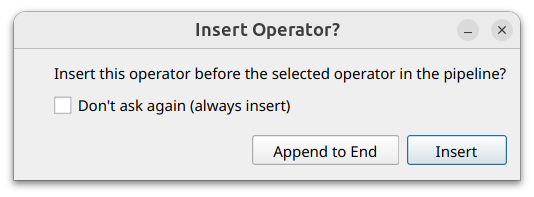

# Pipeline Management

Tomviz provides a flexible data processing pipeline where operators are applied
sequentially to your data. This section covers features for managing and
controlling the pipeline execution.

```{raw} html
<div style="position: relative; padding-bottom: 56.25%; height: 0; overflow: hidden; max-width: 100%; margin-bottom: 1.5em;">
  <iframe src="https://drive.google.com/file/d/1A0o7cdDZLfv69C3ToGWsmTKsSkeMXfqH/preview" style="position: absolute; top: 0; left: 0; width: 100%; height: 100%;" frameborder="0" allow="autoplay; encrypted-media" allowfullscreen></iframe>
</div>
```

## Pipeline Breakpoints

Breakpoints allow you to pause pipeline execution at any operator, enabling
step-by-step inspection of intermediate results. This is useful for debugging
complex pipelines or examining how each operator transforms the data.

### Setting a Breakpoint

To set a breakpoint on an operator, hover your mouse to the left of the
operator in the pipeline view. A faded red circle will appear. Left-click it
to set the breakpoint. The circle will become solid, indicating that the
pipeline will pause before executing that operator.


### Running with Breakpoints

When a pipeline is executed and encounters a breakpoint, execution pauses at
that point. You can inspect the data as it exists after all preceding operators
have run. While paused, you can adjust parameters on operators before the
breakpoint and re-run until the intermediate result looks correct. To resume
execution past the breakpoint, click the green `Play` button in the pipeline
view, located where the breakpoint icon was initially displayed.


The breakpoint is not removed automatically after clicking `Play`. The red
circle will re-appear in the same spot, where you may optionally then
remove it.

### Removing a Breakpoint

To remove a breakpoint, left-click the solid red circle next to the operator.
The breakpoint will be removed, and the next time the pipeline is executed,
it will proceed through that operator without pausing.

## Inserting Operators

By default, new operators are appended to the end of the pipeline. However,
you can also insert an operator before any existing operator in the pipeline.

### Inserting Before an Operator

To insert a new operator before an existing one, first select the operator in
the pipeline view that you want to insert before. Then, when you add a new
operator from any of the menus (Data Transforms, Tomography, Segmentation,
etc.), it will be inserted before the selected operator rather than appended
at the end.

A confirmation dialog will appear asking you to verify the insertion. This
dialog includes a "Don't ask again" option if you prefer to skip the
confirmation in the future.



### Use Cases

Inserting operators is useful when you realize you need an additional
preprocessing step in the middle of an existing pipeline, or when you want to
experiment with different operator orderings without having to rebuild the
entire pipeline from scratch.
