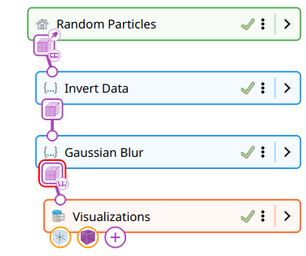
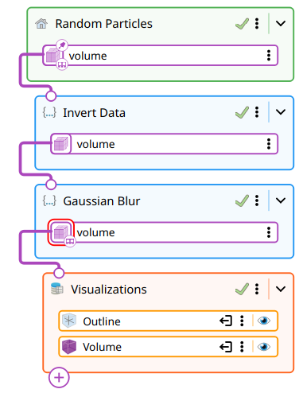
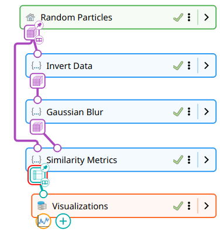
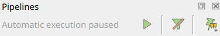
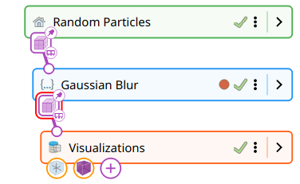
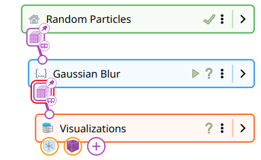
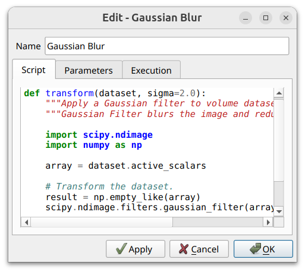
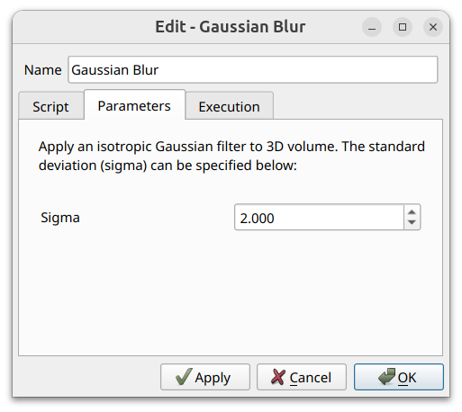
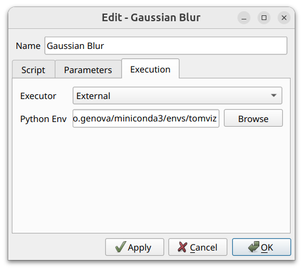

# Pipeline Management

Tomviz uses a node-based pipeline to manage data processing and visualization.
The pipeline is displayed as a vertical pipeline widget in the top-left panel
of the application, showing the flow of data from sources through transforms
to visualizations.

```{raw} html
<div style="position: relative; padding-bottom: 56.25%; height: 0; overflow: hidden; max-width: 100%; margin-bottom: 1.5em;">
  <iframe src="https://drive.google.com/file/d/1w-NiTblh0yRtrv1Sp9UrZBch2q8HtGMO/preview" style="position: absolute; top: 0; left: 0; width: 100%; height: 100%;" frameborder="0" allow="autoplay; encrypted-media" allowfullscreen></iframe>
</div>
```

## Pipeline Concepts

The pipeline is a directed graph built from three kinds of nodes connected
by links:

 * **Sources** - Load or generate data. This includes file readers,
   data generators (constant dataset, random particles, electron beam shape),
   and beamline sources (PyXRF, Ptycho).
 * **Transforms** - Process data. These include all operators from the
   Data Transforms, Segmentation, and Tomography menus.
 * **Visualizations** - Display data. These include Volume, Slice,
   Contour, Outline, Threshold, Clip, Ruler, Scale Cube, Molecule, and Plot.

Each node exposes typed **input ports** (where data comes in) and **output
ports** (where data goes out). Sources have only outputs, visualizations have
only inputs, and transforms have both.

**Links** connect an output port to an input port, defining how data flows
from one node to the next. A single output port may feed multiple downstream
inputs, which creates a branch in the pipeline. An input port accepts at most
one incoming link.

Ports are typed, and the type system is hierarchical. The available types
are:

 * ImageData - generic volumetric data
 * TiltSeries - volumetric data with tilt angles (subtype of ImageData)
 * Volume - volumetric data without tilt angles (subtype of ImageData)
 * LabelMap - categorical/segmentation data (subtype of ImageData)
 * Table
 * Molecule

Because TiltSeries, Volume, and LabelMap are all subtypes of ImageData, an
input that accepts ImageData also accepts any of those subtypes. Transforms
declare what they accept and what they produce, and this drives both link
validity and the operator search dialog: for example, segmentation transforms
like Binary Threshold accept ImageData and produce a LabelMap, while
morphology transforms like Binary Dilate accept and produce LabelMap, so they
can only be linked downstream of a segmentation step. Transforms that are
incompatible with the currently selected port's type appear in the
"Unavailable" section of the operator search dialog.


## Pipeline Widget

:::{list-table}
:widths: 1 1 1
:header-rows: 0
:class: top-align

* - 
  - 
  - 
:::

The pipeline widget displays the pipeline graph as a vertical strip of
compact node cards. Sources are colored green, transforms blue, and
visualizations orange. Each card shows:

 * A colored badge with the node icon
 * The node label
 * A state indicator (spinner while running, checkmark when complete, or error icon)
 * A breakpoint indicator (toward the right of the card)
 * A menu button (three dots)
 * An expand/collapse toggle

### Ports

Ports are color-coded by data type, using the palette below:

 * Amber - ImageData
 * Indigo - TiltSeries
 * Orchid - Volume
 * Green - LabelMap
 * Teal - Table
 * Rose - Molecule

**Input ports** are drawn as small circles on the top edge of the node card,
stroked in the type color. An unconnected input is shown filled with the
background color; an invalid link is drawn as an "X". Input ports cannot be
expanded — they only exist as the dot on the node's edge.

**Output ports** are drawn as rounded squares on the bottom edge of the node
card, filled with the type color and containing a small icon that identifies
the type. When a node is collapsed, output ports appear as a row of these
squares hugging the bottom of the card. When the node is expanded, each
output port also appears as a separate **port card** stacked below the node,
showing the port's label alongside the same colored square.

The **tip output port** — the port new transforms will attach to by default
(see [Inserting Transforms](#inserting-transforms)) — is drawn with a red
rounded outline around its square, whether the node is collapsed or expanded.

Output port squares carry small overlay icons that indicate data storage:

 * **Pin icon** (top-right corner) - Port data is persistent
 * **RAM icon** (bottom-right corner) - Data is currently in memory
 * **Disk icon** (bottom-right corner) - Data is cached on disk

### Selecting Nodes and Ports

Click a node card to select it. The Properties panel on the left will update
to show the selected node's properties. Click an output port square (either
on the node's bottom edge or on its expanded port card) to select that port
specifically.

When **focus dimming** is enabled (via the filter icon in the pipeline controls),
selecting a node highlights it and its immediate connections while dimming
unrelated parts of the pipeline.

### Context Menus

Right-click a node, port, or link to access its context menu. Context menus
provide options such as:

 * **Nodes** - Edit parameters, delete, clone, export data
 * **Ports** - Change persistence mode, export data
 * **Links** - Delete the connection
 * **Visualization groups** - Remove a visualization from its group

Double-click a node card to open its edit dialog.

## Creating Links

<div style="text-align: center;">
  <iframe src="https://drive.google.com/file/d/144ym8hbFQLp44b0YHtTWcGPV5OygAcNC/preview" width="760" height="480" allow="autoplay"></iframe>
</div>

To create a link between nodes, click and drag from an output port square to
an input port on another node. While dragging, a dashed line follows the cursor.
When the cursor is over a valid input port, the line becomes solid. Release
to create the link.

Links can also be created implicitly when you add a new transform or
visualization from the menus — see [Inserting Transforms](#inserting-transforms)
below for the exact rules that govern where the new node attaches.

## Pipeline Controls

<div style="text-align: center;">
  <iframe src="https://drive.google.com/file/d/1tmHj15rZ9YCR_9v6HN1NFb-aVTwMKcUc/preview" width="760" height="480" allow="autoplay"></iframe>
</div>



The pipeline controls toolbar sits above the pipeline widget and provides:

 * **Play/Pause** - Pause automatic pipeline execution. When paused, parameter
   changes accumulate but transforms do not run until you resume.
 * **Stop** - Cancel a currently running pipeline execution.
 * **Focus dimming toggle** (filter icon) - Enable or disable visual dimming of
   unrelated pipeline elements when a node is selected.
 * **Persistence mode** - Set the default data persistence for new transforms:
   * *In Memory* - Keep intermediate results in RAM (fastest, uses more memory)
   * *On Disk* - Cache intermediate results to disk (slower, saves memory)
   * *Transient* - Do not store intermediate results (re-compute when needed)


## Pipeline Breakpoints

Breakpoints allow you to pause pipeline execution at a specific transform,
enabling step-by-step inspection of intermediate results. This is useful for
debugging complex pipelines or examining how each transform affects the data.

:::{list-table}
:widths: 1 1
:header-rows: 0

* - 
  - 
:::

### Setting a Breakpoint

The breakpoint indicator sits on the right side of the node card, alongside
the state icon, menu button, and expand toggle. It is hidden by default;
hovering the mouse over a transform node card reveals it as a faded red
circle. Click the circle to set the breakpoint - it becomes solid and is
shown at all times, indicating that the pipeline will pause before executing
that transform.

Sources and sink groups do not expose a breakpoint slot.

### Running with Breakpoints

When the pipeline encounters a breakpoint, execution pauses at that point. You
can inspect the data as it exists after all preceding transforms have run.
While paused, you can adjust parameters on earlier transforms and re-run. To
resume execution past the breakpoint, click the green Play button that appears
where the breakpoint was.

The breakpoint is not removed automatically after resuming. Click the solid red
circle again to remove it.

## Inserting Transforms

Where a new transform attaches depends on what is currently selected when it
is added from the menus.

**Nothing selected (or a source selected).** The new transform is appended
to the **tip output port** — the last output of the active source's branch,
found by walking downstream through transforms until no transforms remain.
This is the common case: load data, pick transforms from the menu in order,
and they chain end-to-end.

**A node selected.** The tip moves to the selected node's first output port
(or, if the node has no outputs, to the tip of the branch that contains it).
The transform is then appended there.

**An output port selected.** The transform's input is connected directly to
that port. If the port already has downstream links, those links are left in
place and the new transform forms a **new branch** off the same port. This is
how you fan a pipeline out — e.g. running two different reconstructions from
the same aligned tilt series.

**A link selected.** The new transform is **inserted in place** of the link:
the existing link is broken, and two new links are created — one from the
old "from" port to the new transform's input, and one from the new
transform's first output back to the old "to" port. This is the way to splice
a transform into the middle of an established pipeline without disturbing
downstream visualizations.

**Ctrl held when picking from the menu.** The transform is added unconnected.
You then create its links manually by dragging from an output port.

Type compatibility is enforced in every case. If the target output port's
type is not accepted by the new transform's input, the insertion is rejected
and the transform is not added.

## Transform Properties Dialog

Double-click a transform node (or select "Edit" from its context menu) to open
its properties dialog. Every properties dialog provides the same three
buttons at the bottom:

 * **Apply** - Apply the current parameters and re-execute the pipeline, keeping
   the dialog open for further adjustments
 * **OK** - Apply and close the dialog
 * **Cancel** - Discard changes and close

The Apply and OK buttons are disabled while the pipeline is executing.

### Python Transforms and Sources

When the node is implemented in Python — which covers every transform under
the Data Transforms menu as well as Python-based sources — the properties
dialog is organized into three tabs. The dialog opens on the **Parameters**
tab by default.

:::{list-table}
:widths: 1 1 1
:header-rows: 0

* - 
  - 
  - 
:::

 * **Script** - A syntax-highlighted editor for the operator's Python code.
   Edits are saved with the dialog, so a node can be tweaked in place without
   touching the original operator definition on disk.
 * **Parameters** - The form used to configure the operator. By default
   parameters are laid out automatically from the operator's JSON description
   (sliders, spinboxes, dropdowns, file pickers, scalar-array selectors,
   etc.); operators that ship a custom widget show that instead. If the form
   needs upstream data to populate (e.g. a scalar-array picker that reads
   from the input volume) and the data isn't yet in memory, this tab displays
   a placeholder until the pipeline runs and the data becomes available.
 * **Execution** - Selects how this individual node is executed. Two modes are
   offered:
    * *Internal* (default) - The script runs in a thread inside Tomviz, using
      Tomviz's bundled Python interpreter and the modules it ships with.
    * *External* - The script runs in a separate process using an arbitrary
      Python environment that you point Tomviz at. When this mode is
      selected, a **Python Env** field appears below the executor dropdown
      with a Browse button; pick the path to a Python environment that has
      the `tomviz-pipeline` package installed. This is the escape hatch for
      operators that need libraries Tomviz doesn't bundle, or that depend
      on a specific Python version.

The choice of executor is per-node, so different transforms in the same
pipeline can run against different Python environments.

C++ transforms and visualizations don't have Script or Execution tabs — they
expose only their parameter form, in a single-page dialog.
