# Pipeline Management

Tomviz manages data processing and visualization with a node-based pipeline.
The pipeline widget in the top-left panel shows data flowing from sources
through transforms to visualizations.

```{raw} html
<div style="position: relative; padding-bottom: 56.25%; height: 0; overflow: hidden; max-width: 100%; margin-bottom: 1.5em;">
  <iframe src="https://drive.google.com/file/d/1w-NiTblh0yRtrv1Sp9UrZBch2q8HtGMO/preview" style="position: absolute; top: 0; left: 0; width: 100%; height: 100%;" frameborder="0" allow="autoplay; encrypted-media" allowfullscreen></iframe>
</div>
```

## Pipeline Concepts

The pipeline is a directed graph built from three kinds of nodes connected
by links:

 * **Sources** - Load or generate data. This includes file readers,
   data generators (constant dataset, random particles, electron beam shape,
   simulated live acquisition), and beamline sources (PyXRF, Ptycho).
 * **Transforms** - Process data. These include all operators from the
   Data Transforms, Segmentation, and Tomography menus.
 * **Visualizations** - Display data. These include Volume, Slice,
   Contour, Outline, Threshold, Label Map, Clip, Ruler, Scale Cube, Molecule,
   and Plot.

Each node exposes typed **input ports** (where data comes in) and **output
ports** (where data goes out). Sources have only outputs, visualizations have
only inputs, and transforms have both.

**Links** connect an output port to an input port, defining how data flows
from one node to the next. A single output port may feed multiple downstream
inputs, which creates a branch in the pipeline. An input port accepts at most
one incoming link.

Ports are typed, and the type system is hierarchical. The available types
are:

 * ImageData - generic volumetric data
 * TiltSeries - volumetric data with tilt angles (subtype of ImageData)
 * Volume - volumetric data without tilt angles (subtype of ImageData)
 * LabelMap - categorical/segmentation data (subtype of ImageData)
 * Table
 * Molecule

An input that accepts ImageData also accepts its three subtypes. Each
transform declares the types it accepts and produces, and that decides which
links are valid. For example, Binary Threshold accepts ImageData and produces
a LabelMap, while Binary Dilate accepts and produces LabelMap, so it can only
follow a segmentation step. Transforms that do not accept the selected port's
type appear under "Unavailable" in the operator search dialog.


## Pipeline Widget

:::{list-table}
:widths: 1 1 1
:header-rows: 0
:class: top-align

* - 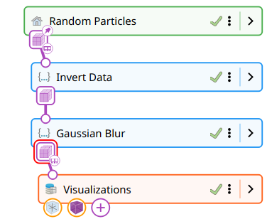
  - 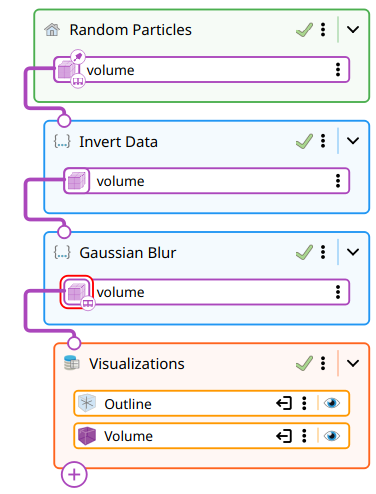
  - 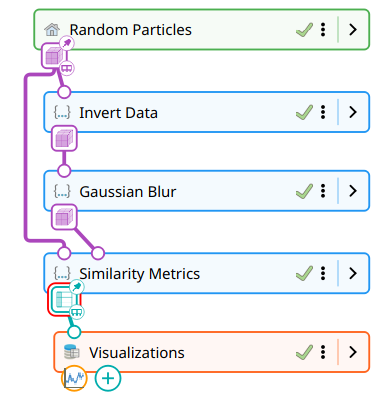
:::

The pipeline widget shows the graph as a vertical strip of node cards.
Sources are colored green, transforms blue, and
visualizations orange. Each card shows:

 * A colored badge with the node icon
 * The node label
 * A state indicator (spinner while running, checkmark when complete, or error icon)
 * A breakpoint indicator (toward the right of the card)
 * A menu button (three dots)
 * An expand/collapse toggle

### Ports

Ports are colored by data type:

 * Amber - ImageData
 * Indigo - TiltSeries
 * Orchid - Volume
 * Green - LabelMap
 * Teal - Table
 * Rose - Molecule

**Input ports** are drawn as small circles on the top edge of the node card,
stroked in the type color. An unconnected input is shown filled with the
background color; an invalid link is drawn as an "X". Input ports cannot be
expanded.

**Output ports** are drawn as rounded squares on the bottom edge of the node
card, filled with the type color and containing a small icon that identifies
the type. When the node is expanded, each output port also gets a
**port card** below the node, showing the port's label next to the same
square.

The **tip output port** (the port new transforms attach to by default, see
[Inserting Transforms](#inserting-transforms)) has a red outline around its
square.

Output port squares carry small overlay icons that indicate data storage:

 * **Pin icon** (top-right corner) - Port data is persistent
 * **RAM icon** (bottom-right corner) - Data is currently in memory
 * **Disk icon** (bottom-right corner) - Data is cached on disk

### Selecting Nodes and Ports

Click a node card to select it and show its properties in the Properties
panel. Click an output port square (on the node's bottom edge or on its port
card) to select that port.

With **focus dimming** on (the filter icon in the pipeline controls),
selecting a node dims everything except it and its immediate connections.

### Context Menus

Right-click a node, port, or link for its context menu, which includes:

 * **Nodes** - Delete, Save Data (sources and transforms), Create Group or
   Leave Group (visualizations)
 * **Ports** - Persistency (Persist in Memory, Persist on Disk, Transient),
   Save Data
 * **Links** - Delete Link

Double-click a node card to open its edit dialog.

## Creating Links

<div style="text-align: center;">
  <iframe src="https://drive.google.com/file/d/144ym8hbFQLp44b0YHtTWcGPV5OygAcNC/preview" width="760" height="480" allow="autoplay"></iframe>
</div>

To link two nodes, drag from an output port square to an input port on
another node. The dashed line turns solid over a valid input port; release to
create the link.

Adding a transform or visualization from the menus also creates links; see
[Inserting Transforms](#inserting-transforms) for where the new node
attaches.

## Pipeline Controls

<div style="text-align: center;">
  <iframe src="https://drive.google.com/file/d/1tmHj15rZ9YCR_9v6HN1NFb-aVTwMKcUc/preview" width="760" height="480" allow="autoplay"></iframe>
</div>

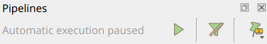

The toolbar above the pipeline widget has:

 * **Play/Pause** - Pause automatic pipeline execution. When paused, parameter
   changes accumulate but transforms do not run until you resume. While the
   pipeline is running, this button becomes **Stop**, which cancels the
   running execution.
 * **Focus dimming toggle** (filter icon) - Dim unrelated nodes when a node
   is selected.
 * **Persistence mode** - Set the default data persistence for new transforms:
   * *Persist in Memory* - Keep intermediate results in RAM (fastest, uses more memory)
   * *Persist on Disk* - Cache intermediate results to disk (slower, saves memory)
   * *Transient* - Do not store intermediate results (re-compute when needed)


## Pipeline Breakpoints

A breakpoint pauses the pipeline at a transform so you can inspect
intermediate results step by step, for example to debug a pipeline or see
what each transform does.

:::{list-table}
:widths: 1 1
:header-rows: 0

* - 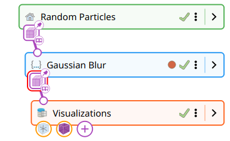
  - 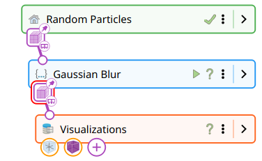
:::

### Setting a Breakpoint

The breakpoint indicator is on the right side of the node card. Hover over a
transform's card to reveal it as a faded red circle, and click it to set the
breakpoint. The circle turns solid and stays visible, and the pipeline will
pause before running that transform.

Sources and sink groups do not expose a breakpoint slot.

### Running with Breakpoints

At a breakpoint, execution stops with all preceding transforms run, so you
can inspect their output. While paused, you can adjust parameters on earlier
transforms and re-run. To continue, click the green Play button that appears
where the breakpoint was.

The breakpoint stays set after resuming. Click the red circle again to remove
it.

## Live Data and Periodic Execution

```{raw} html
<div style="position: relative; padding-bottom: 56.25%; height: 0; overflow: hidden; max-width: 100%; margin-bottom: 1.5em;">
  <iframe src="https://drive.google.com/file/d/18zxhe5K994PDiMc4U73E-IGrD8IBIvG4/preview" style="position: absolute; top: 0; left: 0; width: 100%; height: 100%;" frameborder="0" allow="autoplay; encrypted-media" allowfullscreen></iframe>
</div>
```

Periodic execution keeps a pipeline up to date while data is still being
acquired. Tomviz asks the node at a fixed interval whether new data has
arrived and, if so, runs it again. Everything downstream, such as a
reconstruction and its visualizations, updates with it.

To turn it on, double-click the node's card, open the **Execution** tab,
check `every` next to **Periodic Execution** and set the interval in seconds. While
it is on, the node's card shows a button in its header; click it to turn
periodic execution off.

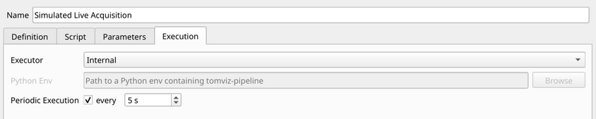

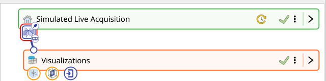

The [PyXRF](sources_pyxrf.md) and [Ptycho](sources_ptycho.md) sources use
this to pick up new scans during an experiment. To try it without an
instrument, choose `Sample Data` -> `Simulated Live Acquisition`. It adds a
tilt series that gains a projection every few seconds, with periodic
execution already on. Add a reconstruction from `Tomography` ->
`Reconstruction` (the video uses `Constraint-based Direct Fourier Method`)
and watch it sharpen as projections arrive.

For TEM data there is also `Tomography` -> `Simulation & Demonstrations` ->
`Initialize Real-Time Tomography`, described in
[Schwartz et al., *Nature Communications* **13**, 4458 (2022)](https://doi.org/10.1038/s41467-022-32046-0).
It watches a directory for new `dm4`, `dm3` or `ser` projections, aligns
them by center of mass or cross correlation, and reconstructs them with ART,
randART, SIRT or WBP as they arrive.

Periodic execution is only offered for Python nodes written with the node
API. To write your own live source, see
[Periodic execution](operators_development.md#periodic-execution).

## Inserting Transforms

Where a new transform attaches depends on what is currently selected when it
is added from the menus.

**Nothing selected (or a source selected).** The new transform is appended
to the **tip output port**: the last output of the active source's branch,
found by walking downstream through transforms until no transforms remain.
Transforms picked from the menu one after another therefore chain end to
end.

**A node selected.** The tip moves to the selected node's first output port
(or, if the node has no outputs, to the tip of the branch that contains it).
The transform is then appended there.

**An output port selected.** The transform's input is connected directly to
that port. If the port already has downstream links, those links are left in
place and the new transform forms a **new branch** off the same port, for
example to run two reconstructions from the same aligned tilt series.

**A link selected.** The new transform is **inserted in place** of the link:
the existing link is broken, and two new links are created: one from the
old "from" port to the new transform's input, and one from the new
transform's first output back to the old "to" port. Use this to splice a
transform into the middle of a pipeline without disturbing downstream
visualizations.

**Ctrl held when picking from the menu.** The transform is added unconnected.
You then create its links manually by dragging from an output port.

Type compatibility is enforced in every case. If the target output port's
type is not accepted by the new transform's input, the insertion is rejected
and the transform is not added.

## Transform Properties Dialog

Double-click a transform node to open its properties dialog. A transform
with parameters opens it when added from a menu and does not run until you
click `Apply` or `OK`; `Cancel` removes it. Every properties dialog has the
same three buttons at the bottom:

 * **Apply** - Apply the current parameters and re-execute the pipeline, keeping
   the dialog open for further adjustments
 * **OK** - Apply and close the dialog
 * **Cancel** - Discard changes and close

The Apply and OK buttons are disabled while the pipeline is executing.

### Python Transforms and Sources

For Python nodes (most transforms in the Data Transforms menu, and the
Python-based sources), the dialog has tabs and opens on **Parameters**.

:::{list-table}
:widths: 1 1 1
:header-rows: 0

* - 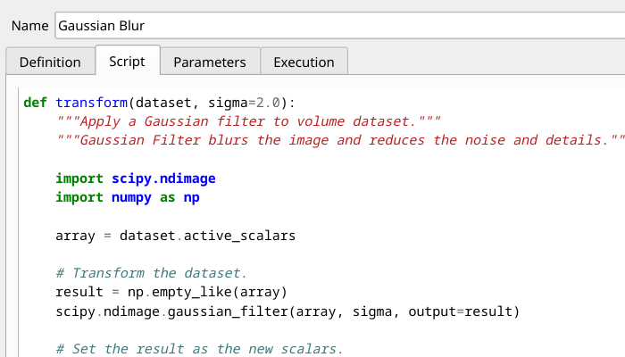
  - 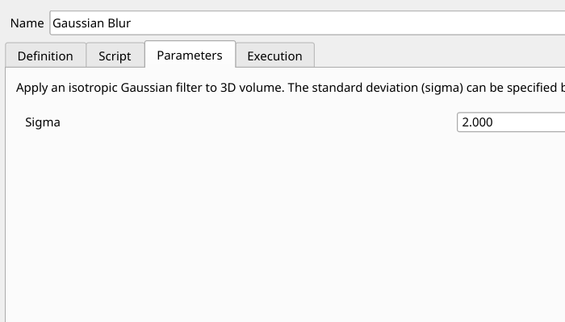
  - 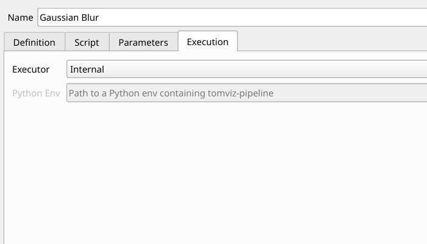
:::

 * **Definition** - The operator's JSON description (label, parameters,
   ports), editable in place. Operators with a custom parameter widget do not
   have this tab.
 * **Script** - A syntax-highlighted editor for the operator's Python code.
   Edits apply to this node only; the operator's files on disk are not
   changed.
 * **Parameters** - The parameter form, laid out from the operator's JSON
   description (sliders, spinboxes, dropdowns, file pickers, scalar-array
   selectors, etc.) unless the operator ships a custom widget. If the form
   needs upstream data that isn't in memory yet, such as a scalar-array
   picker, it shows a placeholder until the pipeline runs.
 * **Execution** - How this node runs, and
   [periodic execution](#live-data-and-periodic-execution). The `Executor`
   dropdown offers two modes:
    * *Internal* (default) - The script runs in a thread inside Tomviz, using
      Tomviz's bundled Python interpreter and the modules it ships with.
    * *External* - The script runs in a separate process in a Python
      environment of your choice, for operators that need libraries Tomviz
      doesn't bundle or a specific Python version. Set **Python Env** to an
      environment with the `tomviz-pipeline` package installed. Tomviz checks
      it right away and shows the install command if `tomviz-pipeline` is
      missing or the wrong version.

The choice of executor is per-node, so different transforms in the same
pipeline can run against different Python environments.

C++ transforms and visualizations show only their parameter form, without
tabs.
