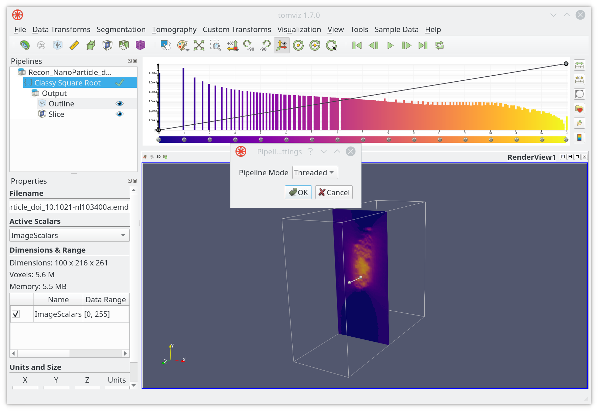
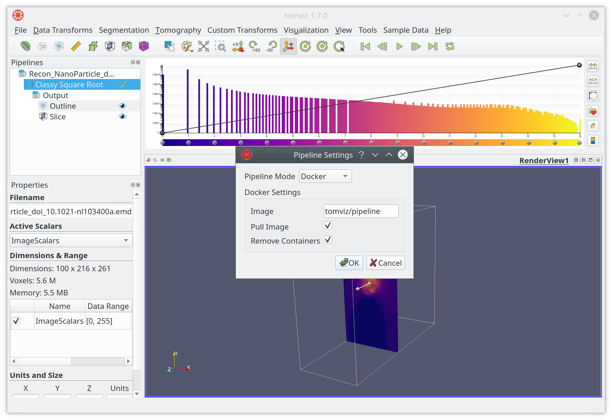
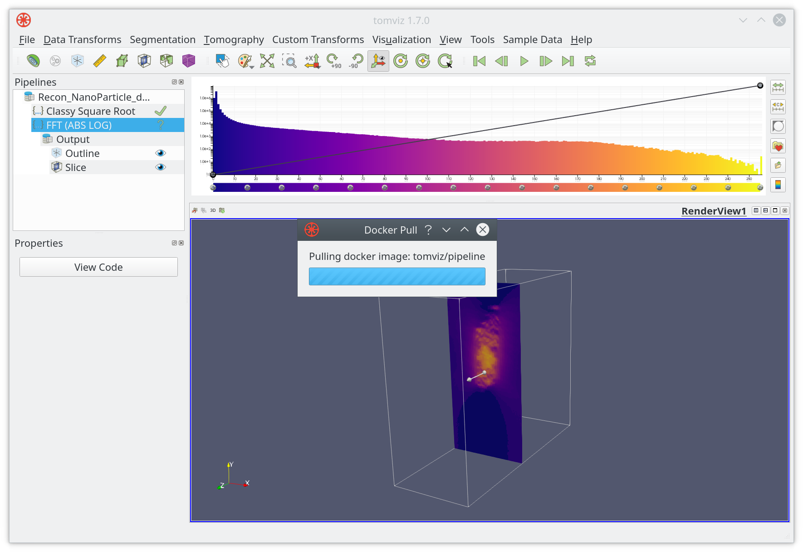

# External Pipelines

Tomviz includes a number of functions and algorithms, if those do not satisfy
your needs there is also support for extensions. These include custom operators
and file formats, which are primarily implemented using Python scripts and JSON
to describe user interface elements. These are introduced in the
[operators](operator.md) section.

The data processing pipeline is central to Tomviz, and each operator is a
self-contained unit operating on the data. It is possible to run these operators
interactively in the application, in a Docker container as part of the
application, and in an external pipeline runner. This section covers running
operators in external pipelines.

## Configuration

Tomviz usually runs pipelines in a background thread (```Threaded```)
interactively in the application. This can be changed to ```Docker``` in
```Pipeline Settings```.



When changing ```Pipeline Mode``` to ```Docker```, a new dialog will appear:



Click on ```OK``` when ready. Tomviz will download the docker image from the
selected source the next time the pipeline executes.



### Running Pipelines

We recommend that you create a virtual environment, and install requirements
into that environment. The steps are shown below:

```bash
  $ git clone --recursive git://github.com/openchemistry/tomviz
  $ cd tomviz/tomviz/python
  $ mkvirtualenv tomviz
  $ pip install -e .
```

Use Tomviz to build a pipeline, and save the sate state file (JSON). Note that
the input must be an EMD file, and the output will be an EMD file. The operators
can will be executed in sequence as they are in the application.

```bash
  $ tomviz-pipeline -s state.tvsm -d data.emd -o output.emd
  [2019-07-23 14:14:59,647] INFO: Executing 'Invert Data' operator
  [2019-07-23 14:14:59,963] INFO: Writing transformed data.
```

A directory may also be provide for the `-d` option. In this case the pipeline
will be executed on all EMD files contained within that directory. The `-o` option
will also accept a directory to which the transformed EMD files will be written.

For example given a directory containing the follow EMD files:

```bash
ls -la /tmp/data
total 503920
-rw-r--r-- 1 tomviz tomviz 64495909 Aug 22 09:14 small1.emd
-rw-r--r-- 1 tomviz tomviz 64495909 Aug 22 09:14 small2.emd
-rw-r--r-- 1 tomviz tomviz 64495909 Aug 22 09:14 small3.emd
-rw-r--r-- 1 tomviz tomviz 64495909 Aug 22 09:14 small4.emd
-rw-r--r-- 1 tomviz tomviz 64495909 Aug 22 09:14 small5.emd
-rw-r--r-- 1 tomviz tomviz 64495909 Aug 22 09:14 small6.emd
-rw-r--r-- 1 tomviz tomviz 64495909 Aug 22 09:14 small7.emd
-rw-r--r-- 1 tomviz tomviz 64495909 Aug 22 09:14 small8.emd
```

We can run a pipeline on these file using the following invocation:

```bash
~$ tomviz-pipeline -s /tmp/test.tvsm -d /tmp/data/ -o /tmp/output
[2019-08-23 08:14:11,570] INFO: Executing pipeline on 8 files.
[2019-08-23 08:14:11,570] INFO: Executing pipeline on /tmp/data/small3.emd
[2019-08-23 08:14:12,263] INFO: Executing 'Invert Data' operator
100%|████████████████████████████████████████████████████████████████████████████████████████████████████████████████████████████████████████████████████████| 10/10 [00:00<00:00, 35.66it/s]
[2019-08-23 08:14:12,574] INFO: Execution complete.
[2019-08-23 08:14:12,574] INFO: Writing transformed data.
[2019-08-23 08:14:13,166] INFO: Write complete.
[2019-08-23 08:14:13,178] INFO: Executing pipeline on /tmp/data/small8.emd
[2019-08-23 08:14:13,852] INFO: Executing 'Invert Data' operator
100%|████████████████████████████████████████████████████████████████████████████████████████████████████████████████████████████████████████████████████████| 10/10 [00:00<00:00, 38.67it/s]
[2019-08-23 08:14:14,111] INFO: Execution complete.
[2019-08-23 08:14:14,111] INFO: Writing transformed data.
[2019-08-23 08:14:14,704] INFO: Write complete.
[2019-08-23 08:14:14,716] INFO: Executing pipeline on /tmp/data/small4.emd
[2019-08-23 08:14:15,390] INFO: Executing 'Invert Data' operator
100%|████████████████████████████████████████████████████████████████████████████████████████████████████████████████████████████████████████████████████████| 10/10 [00:00<00:00, 38.22it/s]
[2019-08-23 08:14:15,652] INFO: Execution complete.
[2019-08-23 08:14:15,652] INFO: Writing transformed data.
[2019-08-23 08:14:16,245] INFO: Write complete.
[2019-08-23 08:14:16,256] INFO: Executing pipeline on /tmp/data/small6.emd
[2019-08-23 08:14:16,929] INFO: Executing 'Invert Data' operator
100%|████████████████████████████████████████████████████████████████████████████████████████████████████████████████████████████████████████████████████████| 10/10 [00:00<00:00, 38.53it/s]
[2019-08-23 08:14:17,189] INFO: Execution complete.
[2019-08-23 08:14:17,189] INFO: Writing transformed data.
[2019-08-23 08:14:17,769] INFO: Write complete.
[2019-08-23 08:14:17,780] INFO: Executing pipeline on /tmp/data/small2.emd
[2019-08-23 08:14:18,473] INFO: Executing 'Invert Data' operator
100%|████████████████████████████████████████████████████████████████████████████████████████████████████████████████████████████████████████████████████████| 10/10 [00:00<00:00, 39.05it/s]
[2019-08-23 08:14:18,729] INFO: Execution complete.
[2019-08-23 08:14:18,729] INFO: Writing transformed data.
[2019-08-23 08:14:19,325] INFO: Write complete.
[2019-08-23 08:14:19,335] INFO: Executing pipeline on /tmp/data/small1.emd
[2019-08-23 08:14:20,031] INFO: Executing 'Invert Data' operator
100%|████████████████████████████████████████████████████████████████████████████████████████████████████████████████████████████████████████████████████████| 10/10 [00:00<00:00, 37.97it/s]
[2019-08-23 08:14:20,295] INFO: Execution complete.
[2019-08-23 08:14:20,295] INFO: Writing transformed data.
[2019-08-23 08:14:20,906] INFO: Write complete.
[2019-08-23 08:14:20,916] INFO: Executing pipeline on /tmp/data/small7.emd
[2019-08-23 08:14:21,601] INFO: Executing 'Invert Data' operator
100%|████████████████████████████████████████████████████████████████████████████████████████████████████████████████████████████████████████████████████████| 10/10 [00:00<00:00, 38.51it/s]
[2019-08-23 08:14:21,862] INFO: Execution complete.
[2019-08-23 08:14:21,862] INFO: Writing transformed data.
[2019-08-23 08:14:22,461] INFO: Write complete.
[2019-08-23 08:14:22,470] INFO: Executing pipeline on /tmp/data/small5.emd
[2019-08-23 08:14:23,144] INFO: Executing 'Invert Data' operator
100%|████████████████████████████████████████████████████████████████████████████████████████████████████████████████████████████████████████████████████████| 10/10 [00:00<00:00, 39.34it/s]
[2019-08-23 08:14:23,399] INFO: Execution complete.
[2019-08-23 08:14:23,399] INFO: Writing transformed data.
[2019-08-23 08:14:24,002] INFO: Write complete.
```

Here is the listing of the output directoy `/tmp/out`:

```bash
-rw-r--r-- 1 tomviz tomviz 257935088 Aug 23 08:14 small1_transformed.emd
-rw-r--r-- 1 tomviz tomviz 257935088 Aug 23 08:14 small2_transformed.emd
-rw-r--r-- 1 tomviz tomviz 257935088 Aug 23 08:14 small3_transformed.emd
-rw-r--r-- 1 tomviz tomviz 257935088 Aug 23 08:14 small4_transformed.emd
-rw-r--r-- 1 tomviz tomviz 257935088 Aug 23 08:14 small5_transformed.emd
-rw-r--r-- 1 tomviz tomviz 257935088 Aug 23 08:14 small6_transformed.emd
-rw-r--r-- 1 tomviz tomviz 257935088 Aug 23 08:14 small7_transformed.emd
-rw-r--r-- 1 tomviz tomviz 257935088 Aug 23 08:14 small8_transformed.emd
```

As you can see the transformed datasets are written to files with the
`_transformed` suffix.

## Summary

This section showed how the pipeline can be run externally.
