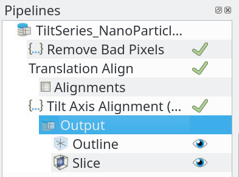
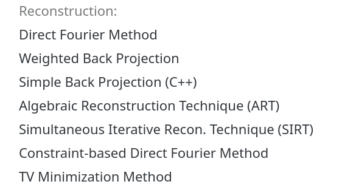
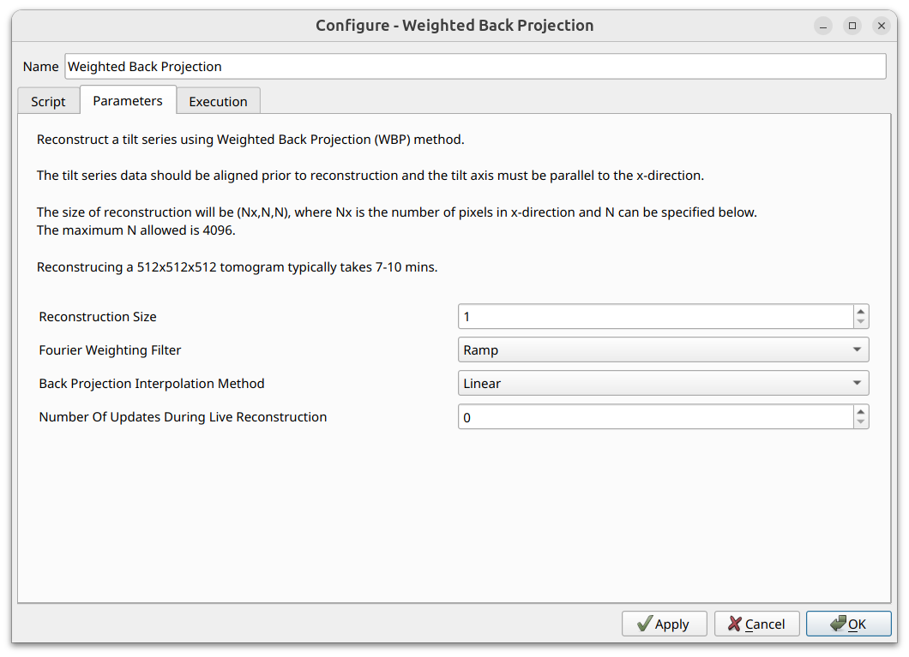
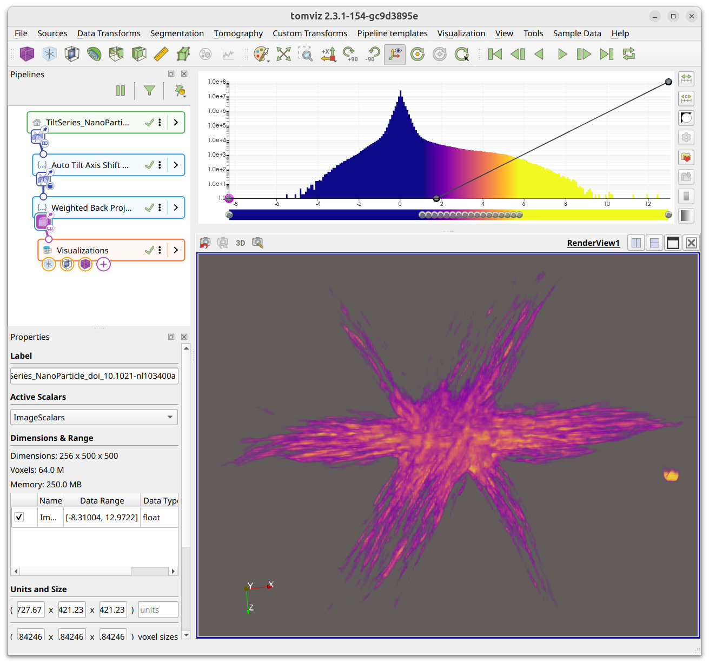
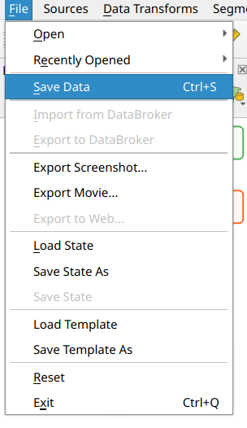
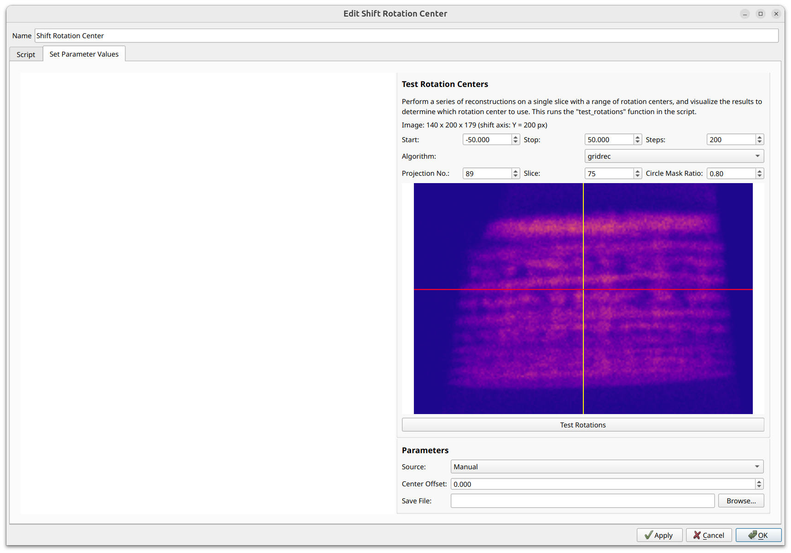
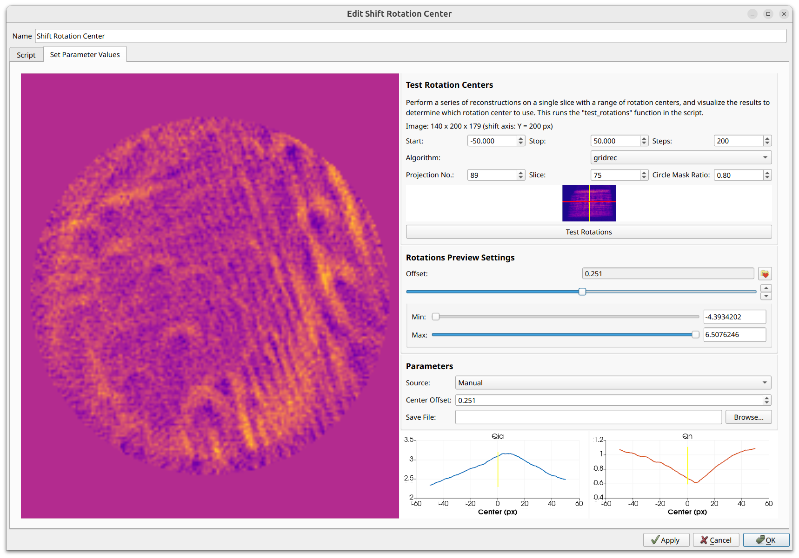
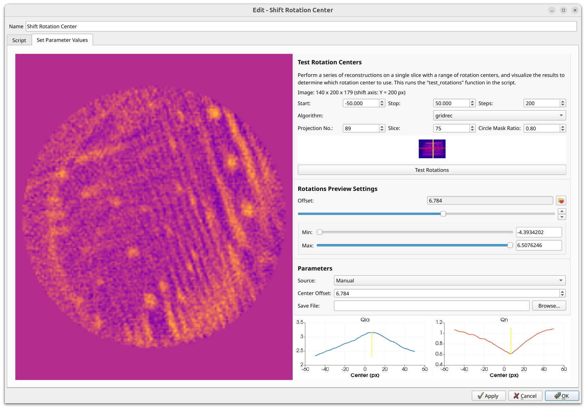

# Reconstruction

Tomographic reconstruction transforms a tilt series into a reconstructed volume.
It is the most computationally intensive step step. We recommended that you save
your work often, and consider downsampling the dataset in order to preview
results rapidly.

A number of reconstruction techniques are available in Tomviz:

 * Simple back projection (C++)
 * Weighted back projection
 * Direct Fourier
 * Constraint-based Direct Fourier
 * Algebraic Reconstruction Technique (ART)
 * Simultaneous Iterative Reconstruction Technique (SIRT)
 * TV minimization method
 * TomoPy

Most of the reconstruction techniques have been developed in Python, with the
simple back projection being the exception (developed in C++ for rapid
feedback). They serve as a good starting point to develop new algorithms, or
inspect the implementation of the reconstruction techniques.

## Pre-reconstruction pipeline

The pipeline shown below is typical of a pre-reconstruction pipeline. This
includes a number of steps discussed in the [alignment section](alignment.md).



## Reconstruction menu

The reconstruction techniques are in the `Tomography` menu, the menu is shown
below:



## Weighted back projection

A simple and relatively fast reconstruction technique is the weighted back
projection technique. It has a number of parameters that can be specified, along
with the number of updates during reconstruction if you would like to preview
the reconstruction as it proceeds. Once ready to run click on `OK`.



A typical reconstruction of the sample tilt series is shown below, it should be
noted that this data was not aligned and distortions are apparent in the
resulting volume.



## Save the reconstruction data

The reconstructed data is shown as a child dataset of the loaded tilt series. In
order to save the result highlight the `Reconstruction` object in the pipeline,
click on `Save Data` in the `File` menu as shown below.



## TomoPy

Reconstructions may be performed using [TomoPy](https://tomopy.readthedocs.io).
The TomoPy reconstruction operator supports multiple reconstruction algorithms:

 * **gridrec** — A fast, Fourier-based reconstruction algorithm. Best for quick
   reconstructions with good quality.
 * **fbp** — Filtered back projection. A standard analytical reconstruction
   method.
 * **mlem** — Maximum Likelihood Expectation Maximization. An iterative method
   that can produce higher quality results for noisy data.
 * **ospml_hybrid** — Ordered Subset Penalized Maximum Likelihood with hybrid
   penalty. An iterative method with regularization.

The iterative methods (mlem, ospml_hybrid) expose a `num_iter` parameter that
controls the number of iterations to perform.

To use TomoPy reconstruction, select `Tomography` -> `Reconstruction (TomoPy)`
from the menu. Select the desired algorithm and set any other needed parameters.

## Shift Rotation Center

```{raw} html
<div style="position: relative; padding-bottom: 56.25%; height: 0; overflow: hidden; max-width: 100%; margin-bottom: 1.5em;">
  <iframe src="https://drive.google.com/file/d/1rGz23e7bdHALZC-jhKkl9Rg0_5kcZd3F/preview" style="position: absolute; top: 0; left: 0; width: 100%; height: 100%;" frameborder="0" allow="autoplay; encrypted-media" allowfullscreen></iframe>
</div>
```

The Shift Rotation Center tool helps determine the optimal rotation center
for tomographic reconstruction. It generates a set of reconstructions from a
single slice using a range of test rotation centers, allowing you to visually
identify which center produces the best reconstruction.

Applying the operator then shifts the data so that the center of rotation is
at the center of the image.

This tool is accessible from the `Tomography` menu.

### How It Works

The tool reconstructs a single slice of your data using multiple different
rotation center values. The results are presented side-by-side so you can
compare them and identify the rotation center that produces the sharpest,
most artifact-free reconstruction.



The "Projection No." may be edited to view a different projection. The red line
represents the "Slice" parameter - the plane of the test reconstructions. The
yellow line represents the current shift in the rotation axis center, in
fractional pixels.

Clicking the "Test Rotations" button generates the preview reconstructions at the
various rotation centers defined by the "Start", "Stop", and "Step" parameters.



Adjusting the slider interactively updates the preview reconstruction, and allows
you to interactively determine which rotation center produces the highest quality
reconstruction. For this example, sliding the value to the correct center yields
the following preview image:



Once the correct rotation center has been discovered, applying the operator will
shift the images so that the rotation center is now at the center of the images.

### Quality Metrics

In addition to visual inspection, the tool computes two quality metrics from
[Donath et al. (2006)](https://opg.optica.org/josaa/abstract.cfm?uri=josaa-23-5-1048)
to help quantify reconstruction quality at each candidate rotation center:

 * **QiA (Integral of Absolute Value)** — Measures the sharpness of the
   reconstruction by summing the absolute values of all pixel intensities.
   When the rotation center is correct, the reconstruction focuses signal
   properly into sharp features with high absolute intensities. An incorrect
   center smears the signal, reducing the total absolute intensity. The
   optimal rotation center **maximizes** QiA.

 * **QN (Integral of Negativity)** — Measures the total amount of negative
   pixel intensity in the reconstruction. The reconstructed quantity (e.g.,
   attenuation coefficient) is inherently non-negative, so negative values
   in a reconstruction indicate artifacts from an incorrect rotation center.
   The optimal rotation center **minimizes** QN (i.e., has the least amount
   of negative intensity). Note that QN is only meaningful for non-iterative
   algorithms (gridrec, fbp) that can produce negative values. It is
   automatically hidden when iterative algorithms (mlem, ospml_hybrid) are
   selected, since those enforce non-negativity constraints.

Both metrics are plotted as line charts alongside the reconstruction previews,
with the X-axis showing the rotation center offset. A vertical indicator line
marks the currently selected center, helping you identify the optimal value
both visually and numerically.

### Saving and Loading Parameters

Parameters can be saved to and loaded from NPZ files. This is useful for
interoperability with other alignment workflows, allowing you to reuse
rotation center parameters across different datasets or tools. The NPZ
files take into account pixel size, so they can be applied to datasets with
a different shape (for example, taking the shift from an XRF dataset and
applying the same shift to a ptychography dataset).

## Advanced reconstruction techniques

As already mentioned most of the reconstruction techniques are developed in
Python. You can inspect the code in the application, and modify the approach if
needed to improve your results. Any custom Python code will be saved in a state
file. Tomviz offers a number of ready to use algorithms, and is designed so that
you can add more. Experiment in the local application and consider contributing
new algorithms to our codebase.
