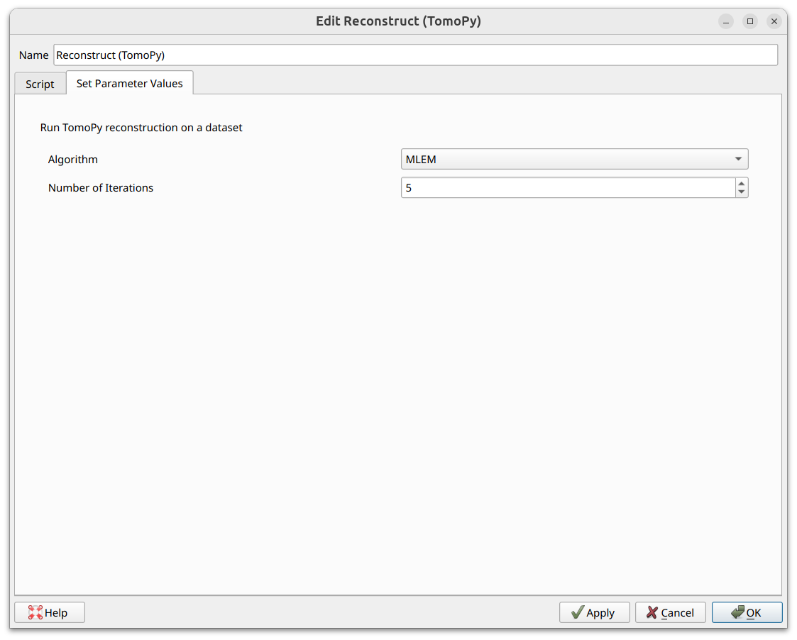

# Reconstruction

Tomographic reconstruction transforms a tilt series into a reconstructed volume.
It is the most computationally intensive step. We recommend that you save
your work often, and consider downsampling the dataset in order to preview
results rapidly.

A number of reconstruction techniques are available in Tomviz under the
`Tomography` > `Reconstruction` submenu:

 * Simple Back Projection (C++)
 * Weighted Back Projection
 * Direct Fourier Method
 * Constraint-based Direct Fourier Method
 * Algebraic Reconstruction Technique (ART)
 * Simultaneous Iterative Recon. Technique (SIRT)
 * TV Minimization Method
 * TomoPy Reconstruction

Most of the reconstruction techniques have been developed in Python, with the
simple back projection being the exception (developed in C++ for rapid
feedback). They serve as a good starting point to develop new algorithms, or
inspect the implementation of the reconstruction techniques.

## Pre-reconstruction pipeline

A typical pre-reconstruction pipeline includes loading a tilt series, setting
tilt angles, performing image alignment (e.g. PyStackReg), and centering the
rotation axis (e.g. Tilt Axis Shift Alignment). These steps are discussed in
the [alignment section](alignment.md).

## Reconstruction menu

The reconstruction techniques are available under `Tomography` >
`Reconstruction`.

## Weighted Back Projection

A simple and relatively fast reconstruction technique is the weighted back
projection technique. It has a number of parameters that can be specified, along
with the number of updates during reconstruction if you would like to preview
the reconstruction as it proceeds. Once ready to run click on `OK`.

A typical reconstruction of the sample tilt series is shown below. The pipeline
shows the source, alignment transforms, and reconstruction transform with its
output volume.

## Save the reconstruction data

The reconstructed data is shown as a child output in the pipeline. In
order to save the result, select the reconstruction output node in the pipeline,
then click `Save Data` in the `File` menu.

## TomoPy

Reconstructions may be performed using [TomoPy](https://tomopy.readthedocs.io).
The TomoPy reconstruction transform supports multiple algorithms:

 * **gridrec** - A fast, Fourier-based reconstruction algorithm (default). Best
   for quick reconstructions with good quality.
 * **fbp** - Filtered back projection. A standard analytical reconstruction
   method.
 * **sirt** - Simultaneous Iterative Reconstruction Technique. An iterative
   method that converges to a solution by simultaneously updating all voxels.
 * **art** - Algebraic Reconstruction Technique. An iterative method that
   updates voxels one ray at a time.
 * **tv** - Total Variation minimization. An iterative method with
   regularization that promotes piecewise-smooth reconstructions. Useful for
   data with limited projections.
 * **mlem** - Maximum Likelihood Expectation Maximization. An iterative method
   that can produce higher quality results for noisy data.
 * **ospml_hybrid** - Ordered Subset Penalized Maximum Likelihood with hybrid
   penalty. An iterative method with regularization.

### Parameters

 * **Algorithm** - Select the reconstruction algorithm from the dropdown.
 * **Number of Iterations** - Controls how many iterations to perform (1–1000,
   default 5). Only applicable to iterative methods (sirt, art, tv, mlem,
   ospml_hybrid).
 * **Regularization** - Controls the regularization strength (0.0001–10.0,
   default 0.1). Only applicable to the TV method.
 * **Use GPU (CUDA)** - Enable GPU acceleration for faster reconstruction. Only
   available for SIRT and MLEM algorithms, and requires a CUDA-capable GPU.

To use TomoPy reconstruction, select `Tomography` > `Reconstruction` >
`TomoPy Reconstruction` from the menu. Select the desired algorithm and set
parameters. The reconstruction will automatically:

 1. Normalize the data to the [0, 1] range
 2. Compute the rotation center from the data dimensions
 3. Run the selected TomoPy algorithm
 4. Apply a circular mask (ratio 0.95) to the result
 5. Create a child dataset with the reconstructed volume

## Shift Rotation Center

The Shift Rotation Center tool helps determine the optimal rotation center
for tomographic reconstruction. It generates a set of reconstructions from a
single slice using a range of test rotation centers, allowing you to visually
identify which center produces the best reconstruction.

Applying the operator then shifts the data so that the center of rotation is
at the center of the image.

This tool is accessible from `Tomography` > `Alignment` >
`Shift Rotation Center (Manual)`.

### How It Works

The tool reconstructs a single slice of your data using multiple different
rotation center values. The results are presented side-by-side so you can
compare them and identify the rotation center that produces the sharpest,
most artifact-free reconstruction.

The "Projection No." may be edited to view a different projection. The red line
represents the "Slice" parameter - the plane of the test reconstructions. The
yellow line represents the current shift in the rotation axis center, in
fractional pixels.

Clicking the "Test Rotations" button generates the preview reconstructions at
the various rotation centers defined by the "Start", "Stop", and "Step"
parameters.

Adjusting the slider interactively updates the preview reconstruction, and
allows you to interactively determine which rotation center produces the
highest quality reconstruction. For this example, sliding the value to the
correct center yields the following preview image:

Once the correct rotation center has been discovered, applying the operator will
shift the images so that the rotation center is now at the center of the images.

### Quality Metrics

In addition to visual inspection, the tool computes two quality metrics from
[Donath et al. (2006)](https://opg.optica.org/josaa/abstract.cfm?uri=josaa-23-5-1048)
to help quantify reconstruction quality at each candidate rotation center:

 * **QiA (Integral of Absolute Value)** - Measures the sharpness of the
   reconstruction by summing the absolute values of all pixel intensities.
   When the rotation center is correct, the reconstruction focuses signal
   properly into sharp features with high absolute intensities. An incorrect
   center smears the signal, reducing the total absolute intensity. The
   optimal rotation center **maximizes** QiA.

 * **QN (Integral of Negativity)** - Measures the total amount of negative
   pixel intensity in the reconstruction. The reconstructed quantity (e.g.,
   attenuation coefficient) is inherently non-negative, so negative values
   in a reconstruction indicate artifacts from an incorrect rotation center.
   The optimal rotation center **minimizes** QN (i.e., has the least amount
   of negative intensity). Note that QN is only meaningful for non-iterative
   algorithms (gridrec, fbp) that can produce negative values. It is
   automatically hidden when iterative algorithms are selected, since those
   enforce non-negativity constraints.

Both metrics are plotted as line charts alongside the reconstruction previews,
with the X-axis showing the rotation center offset. A vertical indicator line
marks the currently selected center, helping you identify the optimal value
both visually and numerically.

### Saving and Loading Parameters

Parameters can be saved to and loaded from NPZ files. This is useful for
interoperability with other alignment workflows, allowing you to reuse
rotation center parameters across different datasets or tools. The NPZ
files take into account pixel size, so they can be applied to datasets with
a different shape (for example, taking the shift from an XRF dataset and
applying the same shift to a ptychography dataset).

## Advanced reconstruction techniques

Most of the reconstruction techniques are developed in Python. You can inspect
the code in the application and modify the approach if needed to improve your
results. Any custom Python code will be saved in a state file. Tomviz offers a
number of ready to use algorithms, and is designed so that you can add more.
Experiment in the local application and consider contributing new algorithms to
our codebase.
