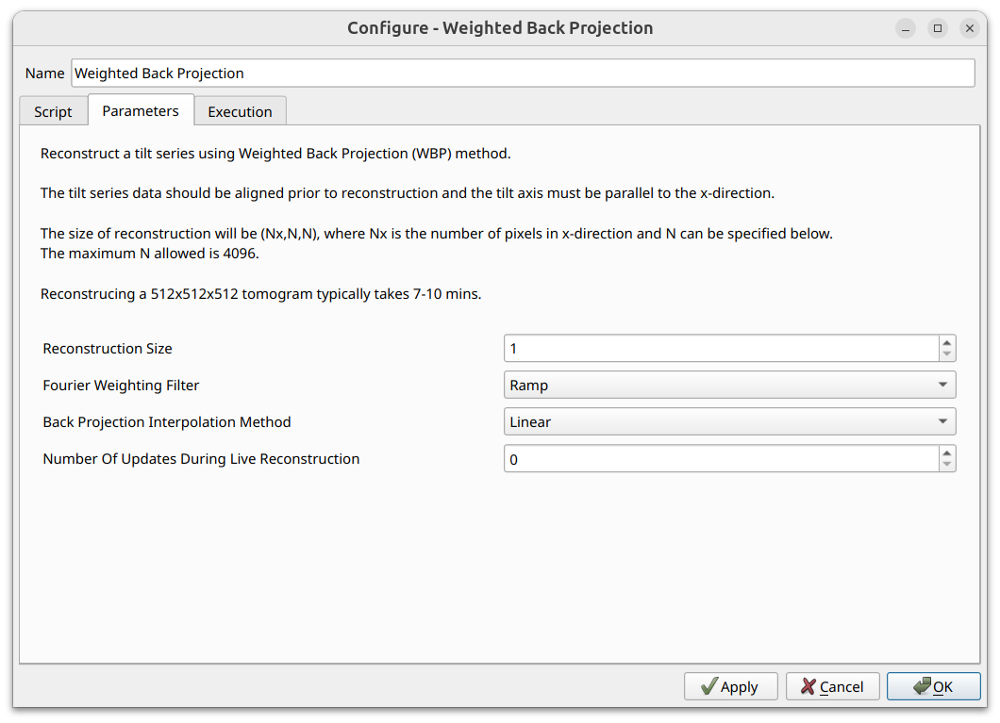
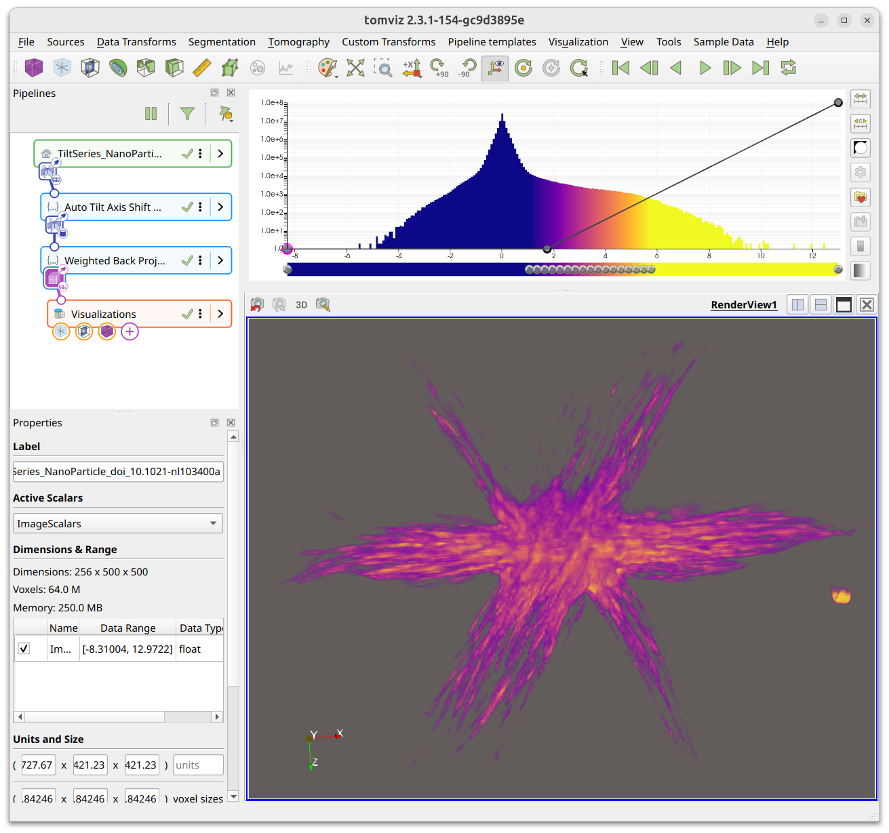
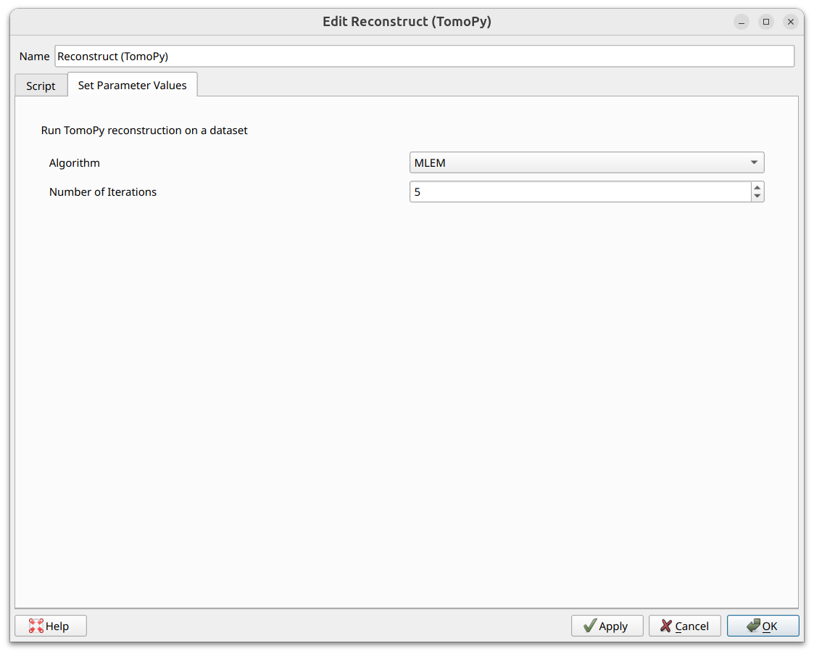
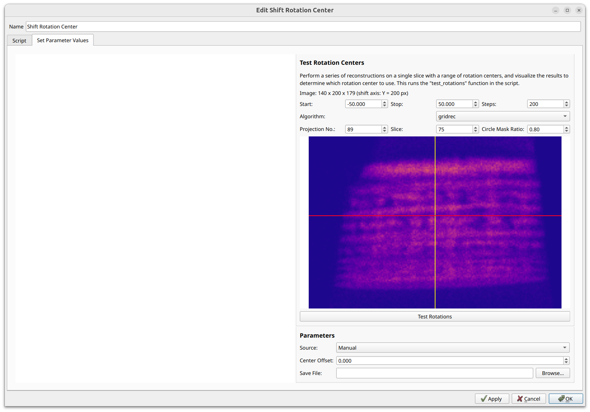
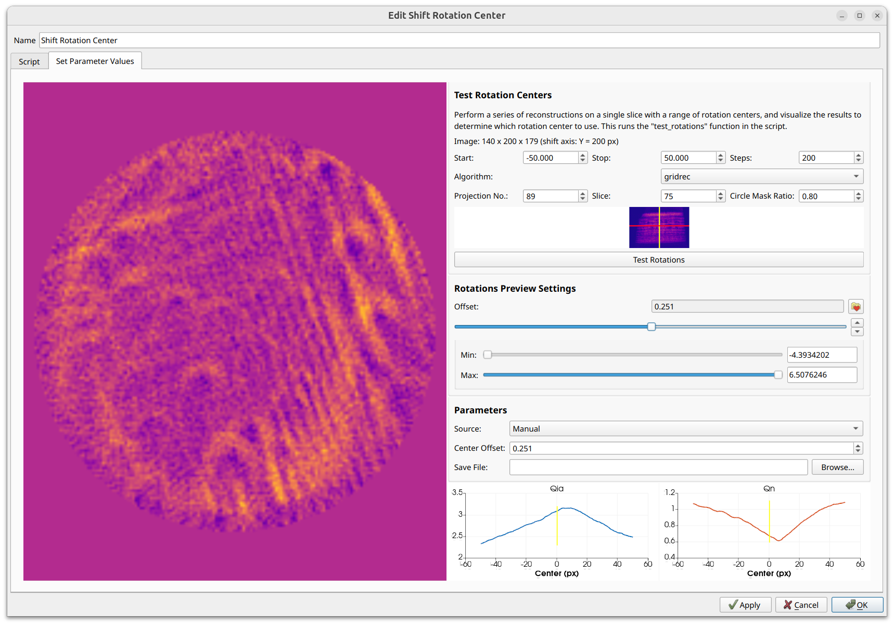
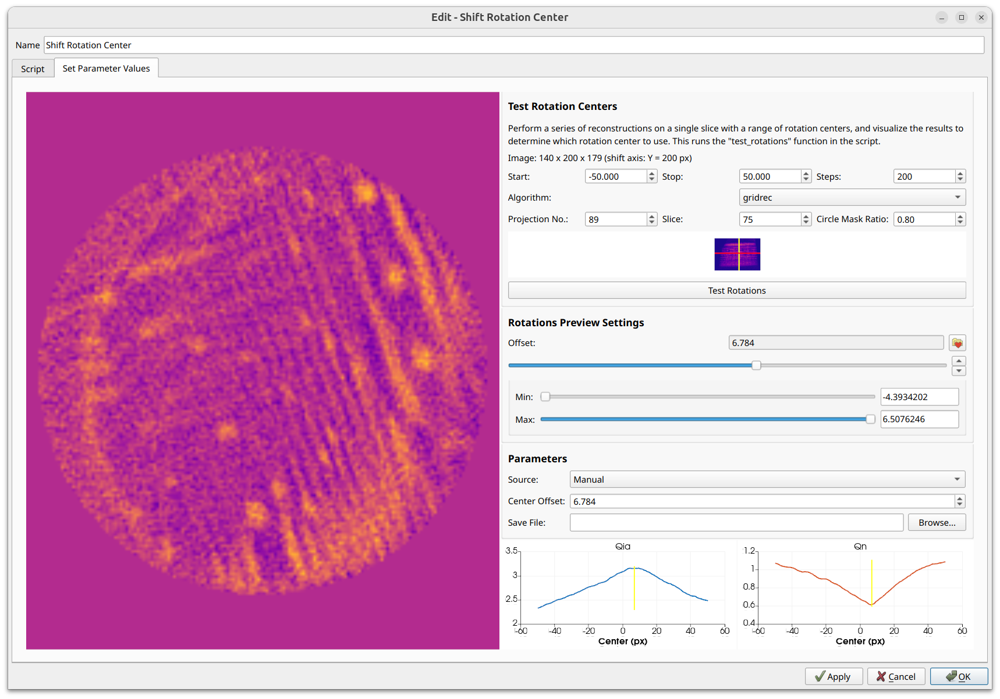

# Reconstruction

Reconstruction turns a tilt series into a volume. It is the most
computationally intensive step, so save your work often, and consider
downsampling the data to preview results quickly.

## Pre-reconstruction pipeline

A typical pre-reconstruction pipeline includes loading a tilt series, setting
tilt angles, performing image alignment (e.g. PyStackReg), and centering the
rotation axis (e.g. Tilt Axis Shift Alignment). These steps are discussed in
the [alignment section](alignment.md).

## Reconstruction menu

`Tomography` -> `Reconstruction` has these techniques:

 * Direct Fourier Method
 * Weighted Back Projection
 * Simple Back Projection (C++)
 * Algebraic Reconstruction Technique (ART)
 * Simultaneous Iterative Recon. Technique (SIRT)
 * Constraint-based Direct Fourier Method
 * TV Minimization Method
 * TomoPy Reconstruction

All are written in Python except Simple Back Projection, which is C++ for
fast feedback.

## Weighted Back Projection

Weighted back projection is simple and relatively fast. Besides its
parameters, you can set a number of updates to preview the reconstruction as
it runs. Click `OK` to run it.

A typical reconstruction of the sample tilt series is shown below. The pipeline
shows the source, alignment transforms, and reconstruction transform with its
output volume.

## Save the reconstruction data

The reconstruction appears as an output in the pipeline. To save it, select
the reconstruction output in the pipeline and choose `File` -> `Save Data`.

## TomoPy

`Tomography` -> `Reconstruction` -> `TomoPy Reconstruction` runs
[TomoPy](https://tomopy.readthedocs.io) with a choice of algorithms:

 * **gridrec** - Fast and Fourier-based (default); good quality for quick
   reconstructions.
 * **fbp** - Filtered back projection, a standard analytical method.
 * **sirt** - Simultaneous Iterative Reconstruction Technique. Iterative,
   updating all voxels at once.
 * **art** - Algebraic Reconstruction Technique. Iterative, updating voxels
   one ray at a time.
 * **tv** - Total variation minimization. Iterative, with regularization that
   favors piecewise-smooth results; useful for data with few projections.
 * **mlem** - Maximum likelihood expectation maximization. Iterative; can give
   better results on noisy data.
 * **ospml_hybrid** - Ordered subset penalized maximum likelihood with a
   hybrid penalty. Iterative, with regularization.

### Parameters

 * **Algorithm** - The reconstruction algorithm.
 * **Number of Iterations** - 1 to 1000, default 5. For the iterative methods
   only (sirt, art, tv, mlem, ospml_hybrid).
 * **Regularization** - Regularization strength, 0.0001 to 10.0, default 0.1.
   For tv only.
 * **Use GPU (CUDA)** - GPU acceleration for sirt and mlem. Requires a
   CUDA-capable GPU.

The transform:

 1. Normalizes the data to the [0, 1] range
 2. Takes the rotation center as the middle of the images
 3. Runs the selected TomoPy algorithm
 4. Applies a circular mask (ratio 0.95) to the result
 5. Outputs the reconstructed volume

## Shift Rotation Center

`Tomography` -> `Alignment` -> `Shift Rotation Center (Manual)` finds the
rotation center. It reconstructs one slice at a range of test centers so you
can see which is best. Applying it shifts the data so that the rotation center
is at the center of the image.

### How It Works

The dialog shows a projection of the data:

`Projection No.` picks the projection shown. The red line is the `Slice`, the
plane of the test reconstructions. The yellow line is the current shift of the
rotation center, in fractional pixels.

`Test Rotations` reconstructs that slice at `Steps` evenly spaced rotation
centers from `Start` to `Stop`.

Move the slider to step through the previews and find the sharpest,
most artifact-free one. With the correct center, the preview looks like this:

Then apply the operator to shift the images so the rotation center is at
their center.

### Quality Metrics

The tool also computes two quality metrics from
[Donath et al. (2006)](https://opg.optica.org/josaa/abstract.cfm?uri=josaa-23-5-1048)
at each candidate rotation center:

 * **QiA (Integral of Absolute Value)** - The sum of the absolute pixel
   intensities, a measure of sharpness. The correct center focuses the signal
   into sharp features; a wrong one smears it and lowers the sum. The best
   center **maximizes** QiA.

 * **QN (Integral of Negativity)** - The total negative intensity. The
   reconstructed quantity (e.g., attenuation coefficient) cannot be negative,
   so negative values are artifacts of a wrong center. The best center
   **minimizes** QN. QN is only meaningful for the non-iterative algorithms
   (gridrec, fbp), and is hidden for iterative ones, which enforce
   non-negativity.

Both are plotted against the rotation center offset next to the previews,
with a vertical line at the selected center.

### Saving and Loading Parameters

The rotation center can be saved to and loaded from an NPZ file, to reuse it
on other datasets or in other alignment workflows. The file accounts for pixel
size, so it can be applied to a dataset with a different shape (for example,
the shift from an XRF dataset applied to a ptychography dataset).

## Advanced reconstruction techniques

Because most reconstruction techniques are in Python, you can read and modify
their code in the application to improve your results. Your changes are saved
in the state file. You can also add new algorithms; consider contributing them
to our codebase.
