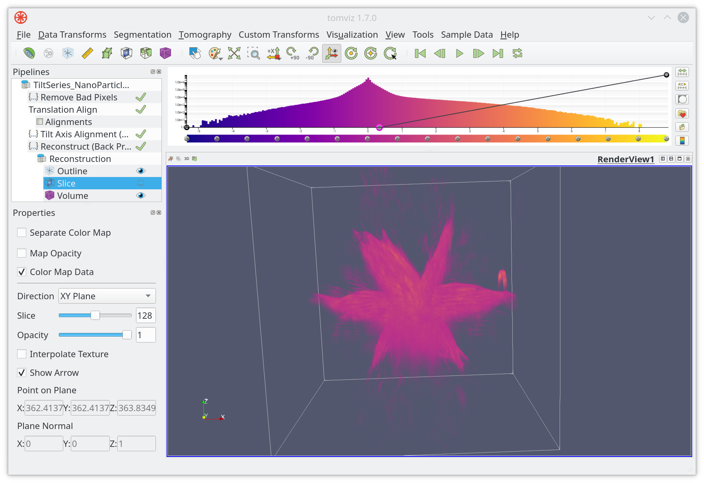
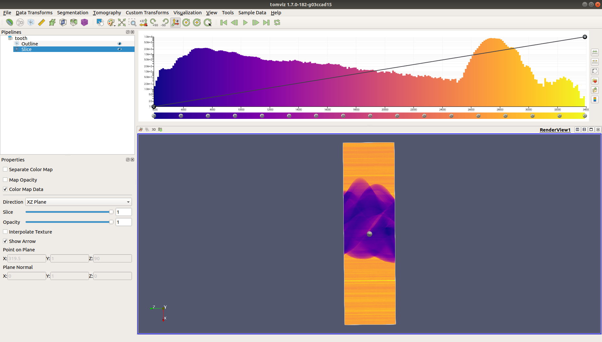
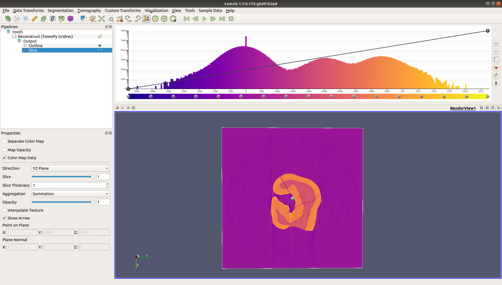

Tomographic reconstruction transforms a tilt series into a reconstructed volume.
It is the most computationally intensive step step. We recommended that you save
your work often, and consider downsampling the dataset in order to preview
results rapidly.

A number of reconstruction techniques are available in Tomviz:

 * Simple back projection (C++)
 * Weighted back projection
 * Direct Fourier
 * Constraint-based Direct Fourier
 * Algebraic Reconstruction Technique (ART)
 * Simultaneous Iterative Reconstruction Technique (SIRT)
 * TV minimization method
 * TomoPy

Most of the reconstruction techniques have been developed in Python, with the
simple back projection being the exception (developed in C++ for rapid
feedback). They serve as a good starting point to develop new algorithms, or
inspect the implementation of the reconstruction techniques.

### Pre-reconstruction pipeline

The pipeline shown below is typical of a pre-reconstruction pipeline. This
includes a number of steps discussed in the [alignment section](alignment.md).

### Reconstruction menu

The reconstruction techniques are in the `Tomography` menu, the menu is shown
below:

### Weighted back projection

A simple and relatively fast reconstruction technique is the weighted back
projection technique. It has a number of parameters that can be specified, along
with the number of updates during reconstruction if you would like to preview
the reconstruction as it proceeds. Once ready to run click on `OK`.

A typical reconstruction of the sample tilt series is shown below, it should be
noted that this data was not aligned and distortions are apparent in the
resulting volume.

### Save the reconstruction data

The reconstructed data is shown as a child dataset of the loaded tilt series. In
order to save the result highlight the `Reconstruction` object in the pipeline,
click on `Save Data` in the `File` menu as shown below.

### TomoPy

Reconstructions may be performed using [TomoPy](https://tomopy.readthedocs.io)
when utilizing the Docker pipeline mode along with the "tomviz/tomopy-pipeline"
docker image. This can be done by changing the settings under
"Tools"->"Pipeline Settings".

An example which uses the
[gridrec](https://tomopy.readthedocs.io/en/latest/ipynb/tomopy.html#gridrec)
reconstruction algorithm is available in Tomviz, and the TomoPy sample file
[tooth.h5](https://github.com/tomopy/tomopy/blob/master/source/tomopy/data/tooth.h5)
is a good example to start with.

After opening the TomoPy sample file, its sinogram may be visualized by
changing the slice direction to the "XZ" plane:

Next, select "Tomography"->"TomoPy Gridrec Method", and set the "Rotation
Center" to be around 300. The rotation center will be tuned automatically
in this example.

Start the reconstruction. Once the reconstruction is completed, the image
may be viewed by changing the slice direction to the "YZ" plane.

### Advanced reconstruction techniques

As already mentioned most of the reconstruction techniques are developed in
Python. You can inspect the code in the application, and modify the approach if
needed to improve your results. Any custom Python code will be saved in a state
file. Tomviz offers a number of ready to use algorithms, and is designed so that
you can add more. Experiment in the local application and consider contributing
new algorithms to our codebase.
