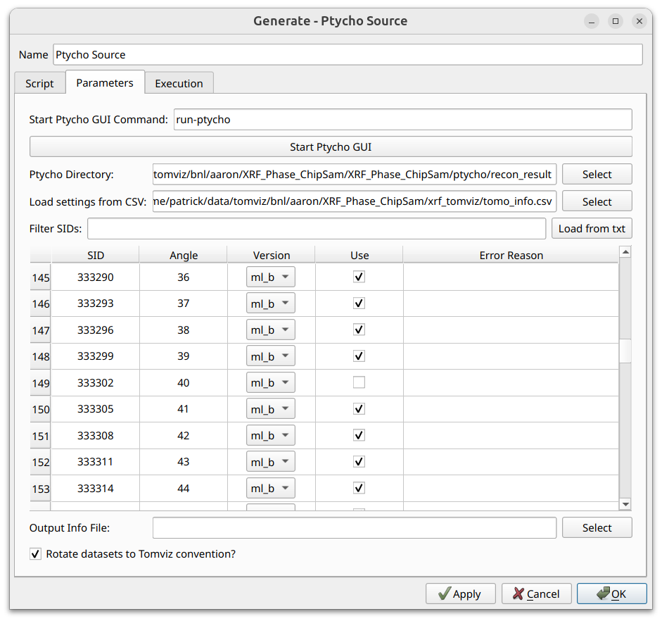
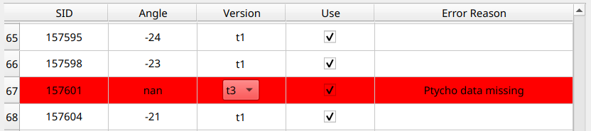
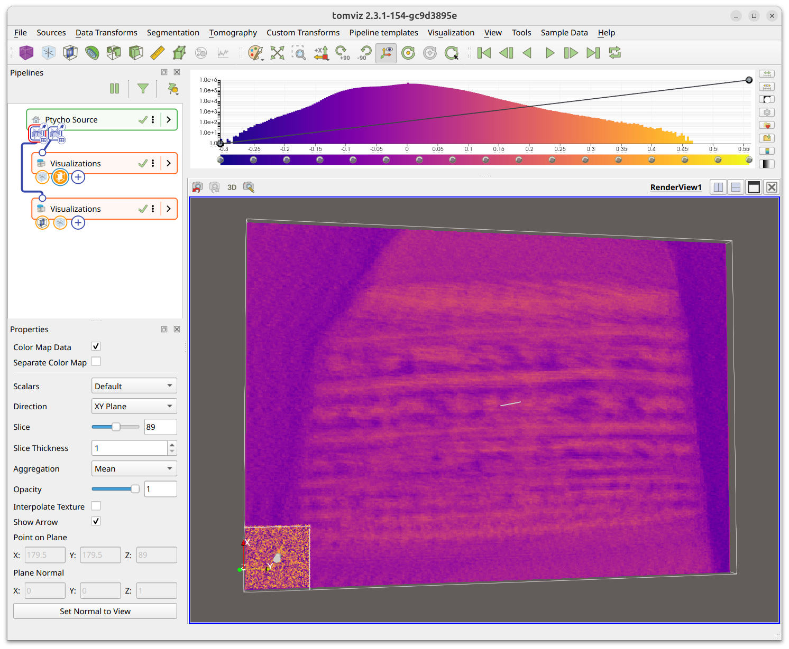
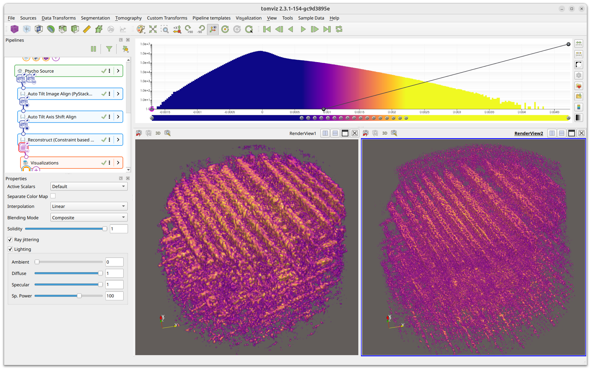

# Ptycho Source

The Ptycho source streamlines the stacking and analysis of ptychography data,
particularly for the HXN beamline at NSLS-II.

It relies on NSLS-II's [Ptycho GUI](https://github.com/NSLS2/ptycho_gui) to
download and process the ptycho data into a directory with pre-defined
file paths. This directory is specified within the Ptycho source widget in
Tomviz, which then automatically stacks, formats, and loads the data.

Steps for the subsequent data analysis of the Ptycho data are included in
Tomviz, including deleting invalid slices, performing automatic image
alignment, centering the images, performing the 3D reconstruction, and then
comparatively visualizing different reconstructed elements. Those steps are
also detailed below.

To begin, click on `Sources` in the top menu bar, and then select `Ptycho`.

## Tutorial Video

  <iframe src="https://drive.google.com/file/d/1YbE158I4umDG908Q4FRGSDUq1SlYlB0v/preview" width="760" height="480" allow="autoplay"></iframe>

## Ptycho Source Widget

After selecting `Sources` > `Ptycho`, a source node is created in the pipeline
with a configure dialog containing Script, Parameters, and Execution tabs.
The Parameters tab contains the full data loading interface. All settings are
persisted between sessions.

### Ptycho GUI

If the ptycho data has not yet been downloaded and processed, specify the
command in the `Start Ptycho GUI Command` field (e.g. `run-ptycho`) and click
`Start Ptycho GUI`. See the
[Ptycho GUI documentation](https://github.com/NSLS2/ptycho_gui) for usage
instructions.

### Directory Selection

Once the ptycho data has been processed, specify the output directory
containing the scan ID subdirectories (e.g., `S157391`, `S157394`) in the
`Ptycho Directory` field. Click `Select` to browse. Tomviz will automatically
analyze the directory and populate the scan table. If the directory contains a
`recon_result` subdirectory, it will be auto-detected.

### Loading Settings from CSV

The `Load settings from CSV` field allows you to specify a CSV file to
automatically configure the scan table. Click `Select` to browse. CSV files
generated from the [PyXRF source](./sources_pyxrf.md) are compatible. When
loaded, the CSV file will:

 * Mark each SID as "Use" that was marked as "Use" in the CSV
 * Unmark SIDs missing from the CSV or not marked as "Use"
 * Set versions from the "Version" column if present

### Filtering SIDs

The **Filter SIDs** field supports numpy-like slice syntax:

 * `157394:157413:3` - Every third SID from 157394 to 157413
 * `157394:157413:3, 157420:157500:2` - Multiple comma-delimited ranges

SIDs can also be loaded from a text file using the `Load from txt` button.
Filtered-out SIDs are hidden and excluded from stacking.

### Scan Table

The table shows one row per SID with five columns:

 * **SID** - The scan identifier
 * **Angle** - The tilt angle
 * **Version** - Combo box for selecting the reconstruction version (e.g.
   `ml_b`). When multiple versions are available, use the dropdown to choose.
   Multiple rows can be selected and their versions set together via the
   context menu.
 * **Use** - Checkbox to include/exclude this SID
 * **Error Reason** - Displays any detected errors for this SID/version
   combination

If errors are detected for a particular SID and version combination, the row
appears red with the error reason displayed:

### Output Options

 * **Output Info File** - Optionally specify a text file to write a summary of
   the stacking configuration. Click `Select` to browse.
 * **Rotate datasets to Tomviz convention?** - Rotate the resulting datasets
   to match the convention expected by reconstruction transforms

### Output

When the source executes, it produces two tilt series datasets via two
output ports on the Ptycho Source node (visible as two colored dots below
the node in the pipeline strip widget):

 * **object** - Contains `Amplitude` and `Phase` arrays
 * **probe** - Contains `Probes Amplitude` and `Probes Phase` arrays

## Analyzing Ptycho Data

After stacking and importing, the data appears in the pipeline with the
Ptycho Source node showing its two output ports. Each port feeds into its
own set of visualizations:

The probe slice may appear much smaller than the ptycho object because the
voxel sizes differ (typically ~5 nm for the object vs ~1 nm default for the
probe). If the probe is not needed, its visualizations can be deleted from
the pipeline.

Select the `ptycho_object` and verify the voxel sizes in the Properties panel.
Correct voxel sizes are important if transformation matrices from the XRF
workflow will be applied to the ptycho dataset.

The Ptycho workflow then follows the same analysis steps as the XRF workflow,
as outlined in the [PyXRF data analysis section](./sources_pyxrf.md#xrf-data-analysis).
If transformation matrices were saved during the PyXRF workflow, the same SIDs
were used, and voxel sizes are correct for both datasets, the same
transformation matrices can be applied to the ptycho data.

If voxel sizes are set properly for both XRF and Ptycho data, they can be
visualized together and will appear approximately the same size. In the
screenshot below, the left render view shows XRF data and the right shows
ptychography data. The higher spatial resolution of ptychography is clearly
visible in the finer structural detail.

