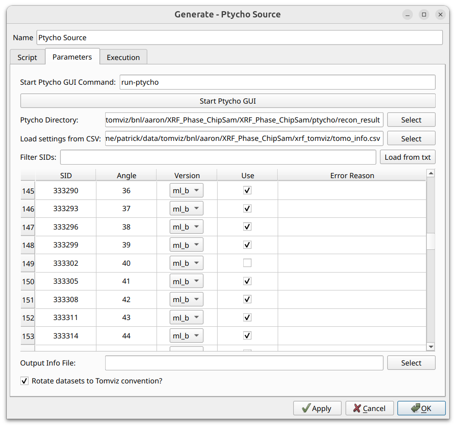
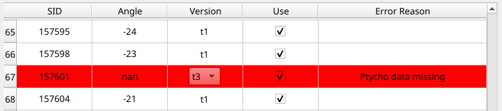
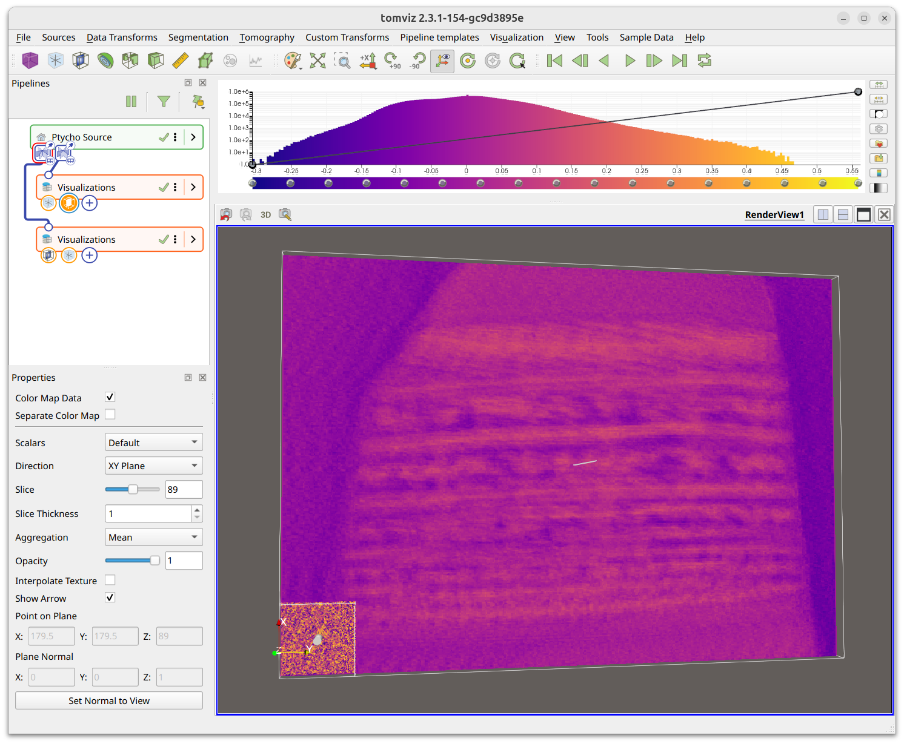
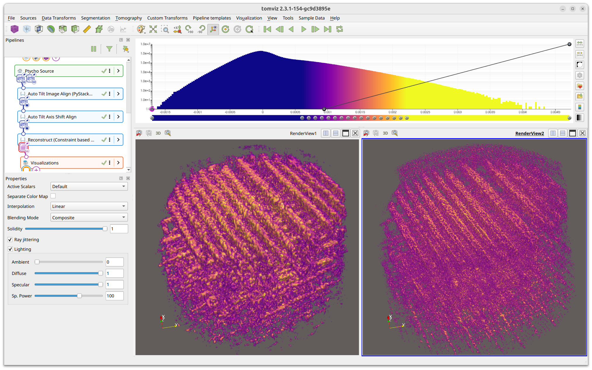

# Ptycho Source

The Ptycho source handles the stacking and analysis of ptychography data,
particularly for the HXN beamline at NSLS-II.

NSLS-II's [Ptycho GUI](https://github.com/NSLS2/ptycho_gui) downloads and
processes the ptycho data into a directory with a fixed layout. Point the
Ptycho source at that directory, and Tomviz stacks, formats, and loads the
data.

Tomviz also has the tools for the rest of the analysis: deleting invalid
slices, automatic image alignment, centering the images, 3D reconstruction,
and viewing the result alongside the XRF data. These steps are covered below.

To begin, choose `Sources` -> `Ptycho`.

## Tutorial Video

<div style="text-align: center;">
  <iframe src="https://drive.google.com/file/d/1YbE158I4umDG908Q4FRGSDUq1SlYlB0v/preview" width="760" height="480" allow="autoplay"></iframe>
</div>

## Ptycho Source Widget

This adds a source node to the pipeline and opens its dialog. The
Parameters tab holds the loading settings, which are kept between sessions.



### Ptycho GUI

If the ptycho data has not yet been downloaded and processed, specify the
command in the `Start Ptycho GUI Command` field (e.g. `run-ptycho`) and click
`Start Ptycho GUI`. See the
[Ptycho GUI documentation](https://github.com/NSLS2/ptycho_gui) for usage
instructions.

### Directory Selection

Once the data is processed, set `Ptycho Directory` to the output directory
containing the scan ID subdirectories (e.g., `S157391`, `S157394`). A
`recon_result` subdirectory is detected automatically.

Tomviz scans the directory in the background. Scan IDs appear in the table as
they are found, with a progress bar below it. Applying the source waits for
the scan to finish.

### Loading Settings from CSV

`Load settings from CSV` takes a scan list file that sets up the scan table.
Loading it:

 * Marks "Use" on each SID marked "Use" in the file
 * Unmarks SIDs missing from the file or not marked "Use"
 * Sets versions from the "Version" column, if present

SIDs in the file that are not in the ptycho directory are skipped with a
warning in the message log.

The `Save Scan List...` button next to the SID filter writes the SIDs shown in
the table (`Scan ID`, `Theta`, `Use`, `Version`) to a CSV without running the
operator.

Scan list files are shared with the [PyXRF](./sources_pyxrf.md) source, so a
list from one can be loaded into the other. Accepted files:

 * The CSV written by the PyXRF source
 * The CSV or text file written by this source's **Output Info File** (see
   below)
 * A plain text file with one scan ID per line

Column names ignore case and punctuation, so `Scan ID`, `Scan_ID`, and `SID`
all work.

### Filtering SIDs

The **Filter SIDs** field takes NumPy-like slices:

 * `157394:157413:3` - Every third SID from 157394 to 157413
 * `157394:157413:3, 157420:157500:2` - Multiple comma-delimited ranges

SIDs can also be loaded from a text file using the `Load from txt` button.
SIDs that are filtered out are hidden and not stacked.

### Scan Table

The table shows one row per SID with five columns:

 * **SID** - The scan identifier
 * **Angle** - The tilt angle
 * **Version** - The reconstruction version (e.g. `ml_b`), chosen from a
   dropdown when there are several. To set the version of several rows at
   once, select them and use the context menu.
 * **Use** - Checkbox to include/exclude this SID
 * **Error Reason** - Any error found for this SID and version

Rows with errors are shown in red:



### Output Options

 * **Output Info File** - Optional file for a summary of the stacking
   configuration. A name ending in
   `.csv` gets a scan list CSV (`Scan ID`, `Theta`, `Use`, `Version`); any
   other name gets a whitespace-delimited text file.
 * **Rotate datasets to Tomviz convention?** - Rotate the resulting datasets
   to match the convention expected by reconstruction transforms

### Live Updates

With [periodic execution](pipeline_management.md#live-data-and-periodic-execution)
enabled on the node's Execution tab, Tomviz re-executes the source when
reconstructions in the ptycho directory change. A newly completed scan
(object, probe, and config file present) is added to the scan list, marked
"Use", and stacked with the others. Scans you deselected stay deselected, and
incomplete scans are picked up once their remaining files arrive.

To try this with synthetic data, run the simulator from a Tomviz source
checkout and point the ptycho directory at its output:

```bash
python tests/simulation/simulate_ptycho_stream.py /tmp/ptycho-sim --interval 5
```

### Output

The source produces two tilt series, one on each of its two output ports:

 * **object** - Contains `Amplitude` and `Phase` arrays
 * **probe** - Contains `Probes Amplitude` and `Probes Phase` arrays

## Analyzing Ptycho Data

Each output port gets its own visualizations:



The probe slice may appear much smaller than the ptycho object because the
voxel sizes differ (typically ~5 nm for the object vs ~1 nm default for the
probe). If you don't need the probe, delete its visualizations.

Select the `object` output port and check its voxel sizes in the Properties
panel. They must be correct to apply transformation matrices from the XRF
workflow to the ptycho data.

From here, follow the same steps as the
[XRF data analysis](./sources_pyxrf.md#xrf-data-analysis). If you saved
transformation matrices in the PyXRF workflow, and both datasets use the same
SIDs and have correct voxel sizes, you can apply those matrices to the ptycho
data.

With correct voxel sizes, XRF and ptycho data shown together appear about the
same size. Below, XRF is on the left and ptychography on the right, where the
finer detail shows its higher spatial resolution.


