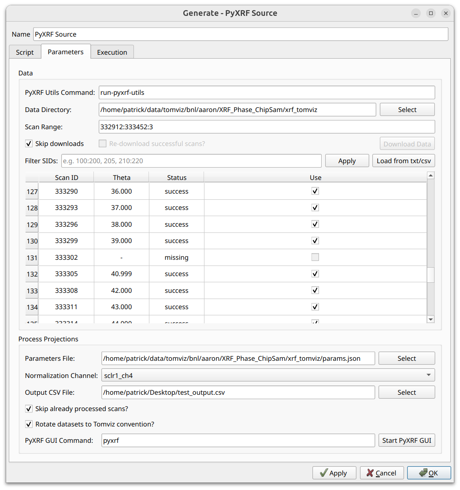
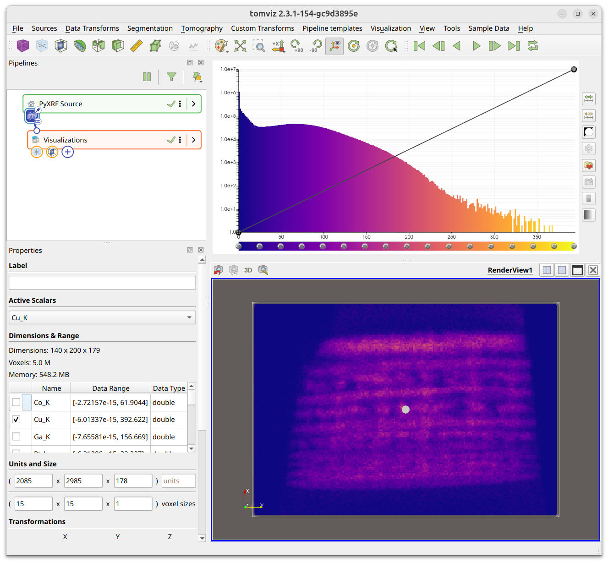
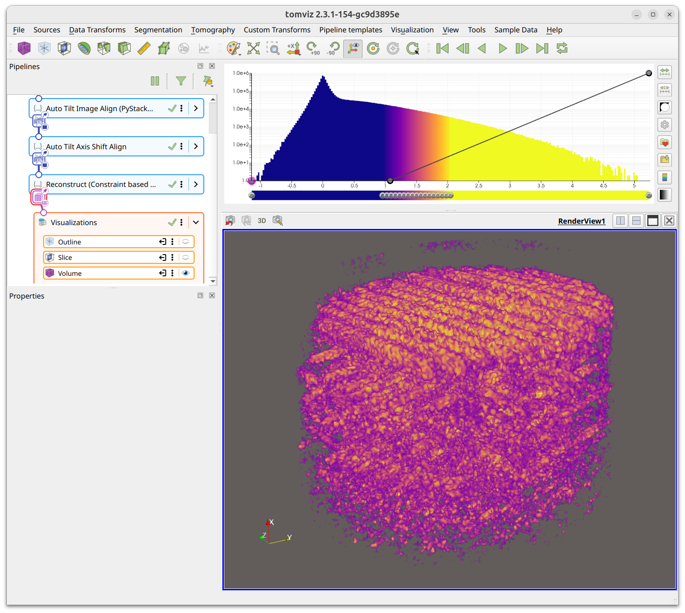
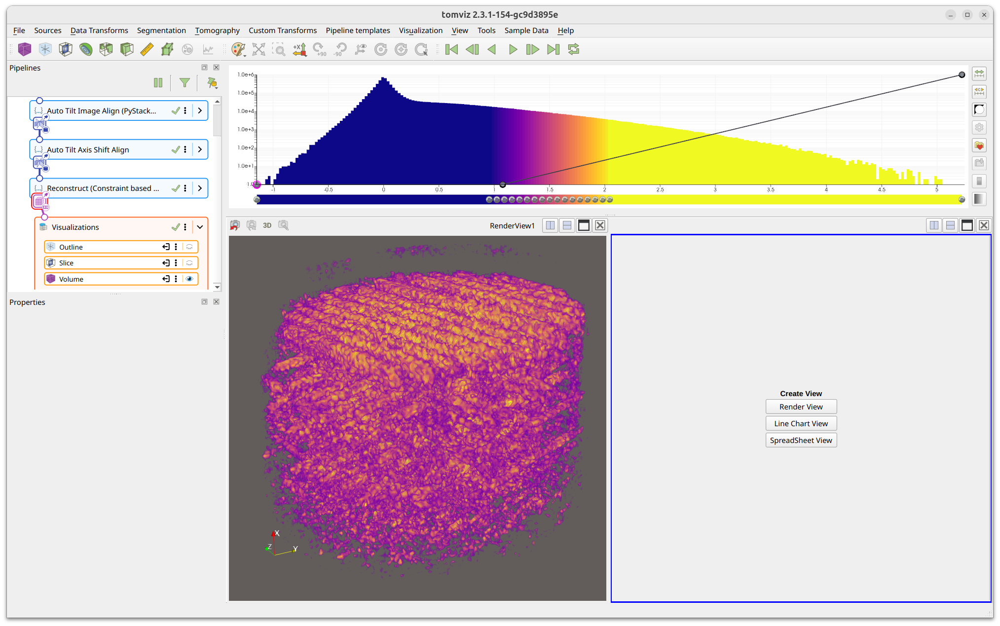
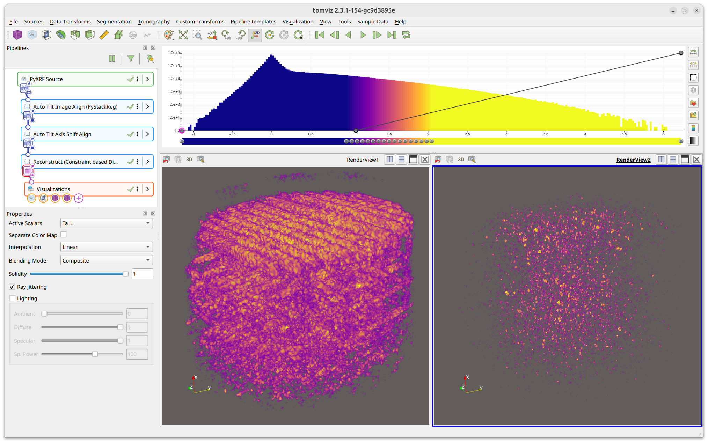
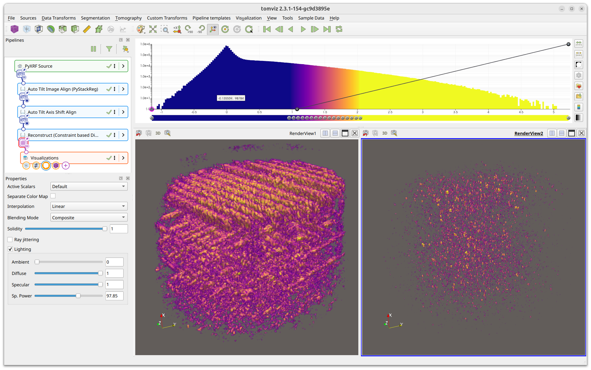

# PyXRF Source

The PyXRF source streamlines the download and processing of XRF data,
particularly for the HXN beamline at NSLS-II.

It utilizes the PyXRF library to download scan data and process projections,
in order to ultimately end up with tilt series image stacks for each element
identified within the data. The resulting data is automatically loaded into
Tomviz as a source node in the pipeline.

Steps for the subsequent data analysis of the XRF data are included in Tomviz,
including deleting invalid slices, performing automatic image alignment,
centering the images, performing the 3D reconstruction, and then comparatively
visualizing different reconstructed elements. Those steps are also detailed
below.

To begin, click on `Sources` in the top menu bar, and then select `PyXRF`.

## Tutorial Video

<!-- VIDEO NEEDED: Updated PyXRF source tutorial. The workflow has been completely
     redesigned from a multi-dialog approach to a single embedded widget within
     a source node. Show: selecting Sources > PyXRF, configuring the widget
     (scan range, download, filter SIDs, CSV import, process projections,
     normalization channel), and the resulting loaded data in the pipeline. -->

## PyXRF Source Widget

After selecting `Sources` > `PyXRF`, a source node is created in the pipeline
with a configure dialog containing Script, Parameters, and Execution tabs.
The Parameters tab contains the full data download and processing interface.
All settings are persisted between sessions.

### Data Download

The top section of the Parameters tab configures data downloading:

 * **PyXRF Utils Command** - The command used to execute PyXRF utilities (e.g.
   `run-pyxrf-utils`). This can be a script that sets up and runs pyxrf-utils
   in a different environment. The command-line API is expected to match that
   shown [here](https://github.com/OpenChemistry/tomviz/tree/master/tomviz/python/tomviz/pyxrf/pyxrf-utils).
 * **Data Directory** - The working directory where data and log files will be
   stored. Click `Select` to browse.
 * **Scan Range** - The range of scans to download, specified in
   `start:stop:stride` format (both start and stop inclusive).
 * **Skip downloads** - When checked, skips the download step entirely and uses
   existing data on disk. This disables the `Re-download successful scans`
   checkbox and the `Download Data` button.
 * **Re-download successful scans?** - When checked, re-downloads scans that
   were previously downloaded successfully.

Click `Download Data` to begin downloading. The scan table is populated
automatically once the data directory contains scan data.

### Scan Table

The scan table shows one row per scan with the following columns:

 * **Scan ID** - The beamline scan identifier
 * **Theta** - The tilt angle for this scan (shown as "-" for failed scans)
 * **Status** - Download/processing status (success, fail, missing)
 * **Use** - Checkbox to include/exclude this scan from processing (disabled
   for failed scans)

#### Filtering SIDs

The **Filter SIDs** field above the table supports numpy-like slice syntax for
filtering displayed scans. Type a filter expression and click `Apply`. For
example:

 * `157394:157413:3` - Every third scan from 157394 to 157413
 * `157394:157413:3, 157420:157500:2` - Comma-delimited multiple ranges

Filtered-out SIDs are hidden and excluded from subsequent processing.

SIDs can also be loaded from a text file or CSV file using the
`Load from txt/csv` button. When loading a CSV, columns named "Scan ID" and
"Use" are recognized, allowing you to reuse scan selections.

### Processing Projections

The bottom section configures how the downloaded data is processed:

 * **Parameters File** - The JSON parameters file created using PyXRF GUI.
   Click `Select` to browse, or use `Start PyXRF GUI` at the bottom to launch
   the GUI and create this file. Follow the official
   [PyXRF Documentation](https://nsls-ii.github.io/PyXRF/) for modeling and
   fitting elements.
 * **Normalization Channel** - The ion chamber channel for normalization
   (auto-detected from data; typically `sclr1_ch4` for HXN).
 * **Output CSV File** - Optionally specify a CSV file path to write scan
   metadata. Click `Select` to browse.
 * **Skip already processed scans?** - Skip HDF5 files that already contain
   processed results. Uncheck this if you changed the parameters file or
   normalization channel.
 * **Rotate datasets to Tomviz convention?** - Rotate the resulting tilt image
   stacks to match the convention expected by reconstruction transforms.
 * **PyXRF GUI Command** - The command to launch PyXRF GUI (default: `pyxrf`).
   Can be overridden with the `TOMVIZ_PYXRF_EXECUTABLE` environment variable.
 * **Start PyXRF GUI** - Launches the PyXRF GUI for creating the parameters
   file.

### Output

After processing, the extracted elements are loaded as a single tilt series
source node in the pipeline, with each element as a separate scalar array. The
voxel sizes are set automatically from the XRF data metadata when available.

## XRF Data Analysis

After the source produces its output, the data appears in the pipeline as a
tilt series with multiple arrays (one per element). The Properties panel shows
the `Active Scalars` dropdown for switching between elements, and a
Dimensions & Range table listing all scalar arrays with their data ranges and
types.

The currently "active" array can be switched to visualize different elements.
This "active" array is also what is used by transforms as
`dataset.active_scalars`, so make sure the correct array is selected before
running a transform.

### PyStackReg Image Alignment

A typical next step is to perform image alignment using the PyStackReg
image alignment transform. Before opening the transform, first determine
an ideal array (one with a high signal-to-noise ratio) and an ideal slice
(close to 0 degrees, or close to the middle of the image). Select the ideal
array as the active array, and navigate to the ideal slice in a slice
visualization.

Then click `Tomography` > `Alignment` > `Image Alignment (Auto: PyStackReg)`:

The transform defaults to selecting the `Slice Index` of the currently viewed
slice. The PyStackReg transform determines transformation matrices using the
currently selected active array and applies those same matrices to all arrays.

Select the `Transformation Type` (`Translation` is a good starting point).
`Padding` can help ensure the image does not wrap around.

The option to `Save Transformations File` saves transformations and pixel sizes
in NPZ format. These can be reused with the `Load From File` option on datasets
with different pixel sizes (such as ptychography data).

More details about PyStackReg can be found in the
[alignment section](alignment.md#pystackreg-image-alignment).

### Tilt Axis Shift Alignment

After PyStackReg alignment, center the data before reconstruction. Navigate to
`Tomography` > `Alignment` > `Tilt Axis Shift Alignment (Auto)`:

Options are similar to PyStackReg, including loading/saving shifts from/to
files, padding, and applying to all arrays. The transform randomly selects
slices to test for determining the ideal alignment.

More details about Tilt Axis Shift Alignment can be found in the
[alignment section](alignment.md#auto-tilt-axis-shift-alignment).

### 3D Reconstruction

After alignment and centering, perform a 3D reconstruction. The primary
reconstruction transforms for the XRF workflow are the "Constraint-based Direct
Fourier Method" and the "Direct Fourier Method", available under `Tomography` >
`Reconstruction`.

The reconstruction transform iterates through every array and performs the
reconstruction on each one.

Once reconstruction finishes, the output appears downstream in the pipeline
with Outline, Slice, and Volume visualizations. Adjust the opacity editor to
highlight features of interest:

Different elements can be selected via the `Active Scalars` dropdown in the
Properties panel.

### Comparatively Visualizing Different Elements

Multiple elements can be visualized simultaneously in separate render views.
Click one of the split icons in the top-right section of the render window to
divide the view area. A dropdown appears with view type options - select
`Render View`:

Click on the new render view to select it (indicated by a blue border), and
add a new Volume visualization. In the volume properties, change `Active
Scalars` to a different element to compare side-by-side:

Link cameras between render views so they rotate together: right-click one
view, click `Add Camera Link`, and then left-click the other view:

More realistic rendering can be achieved by enabling lighting in the volume
properties and adjusting the Diffuse, Specular, and Specular Power sliders:

