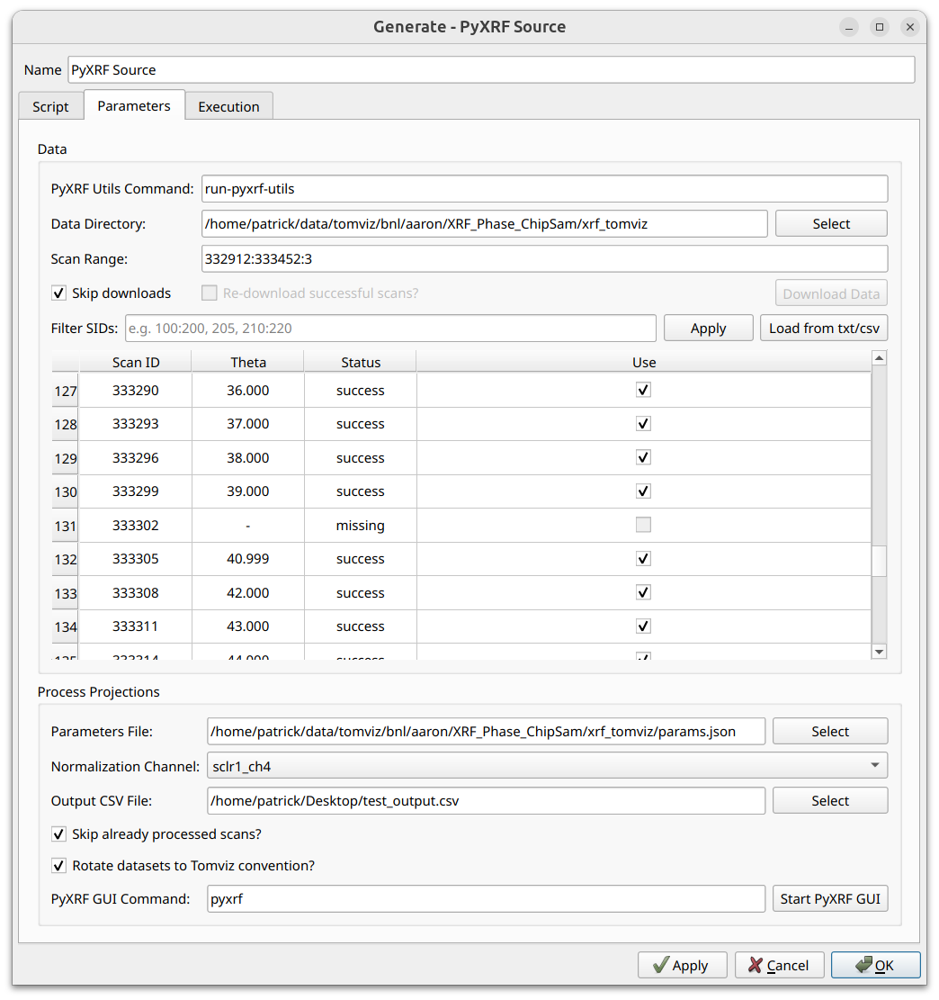
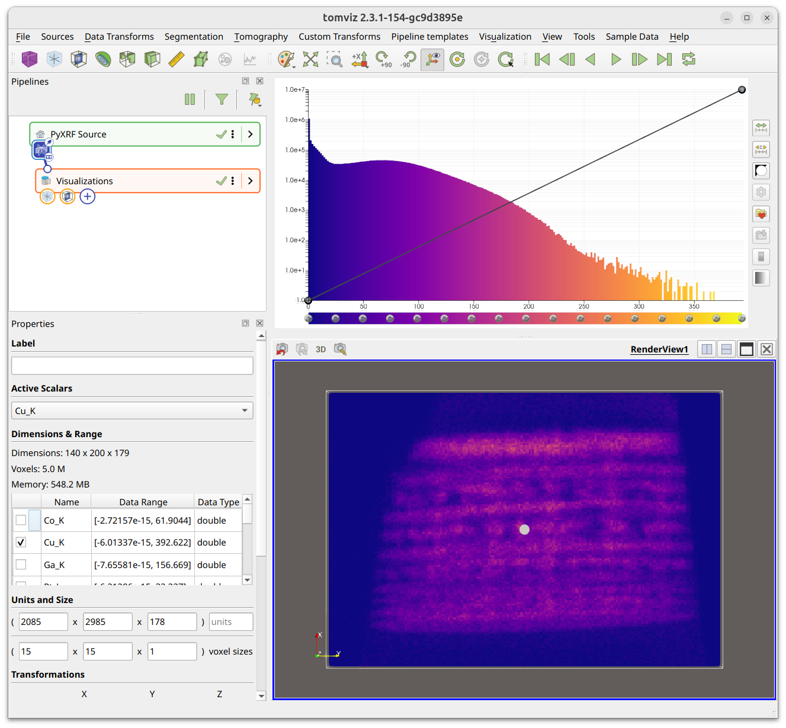
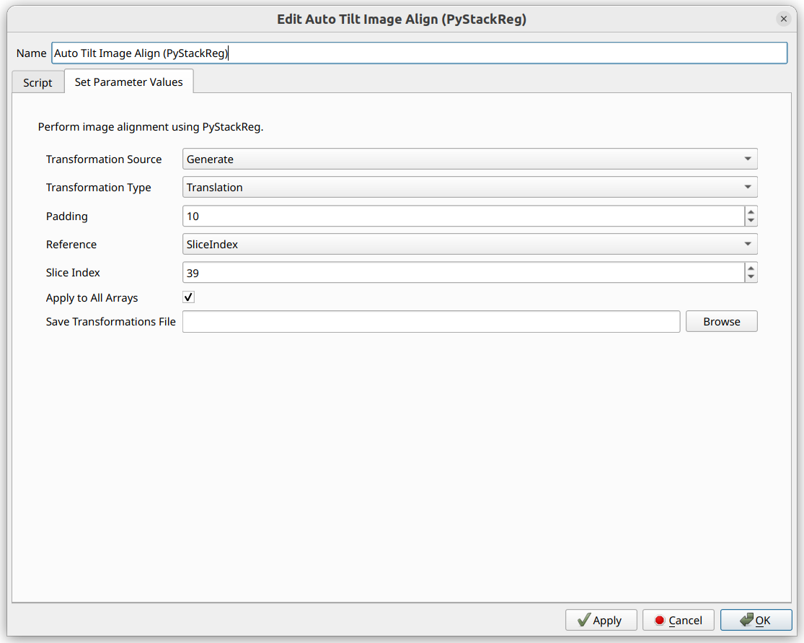
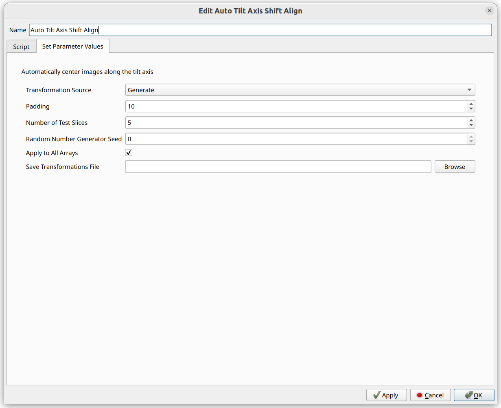
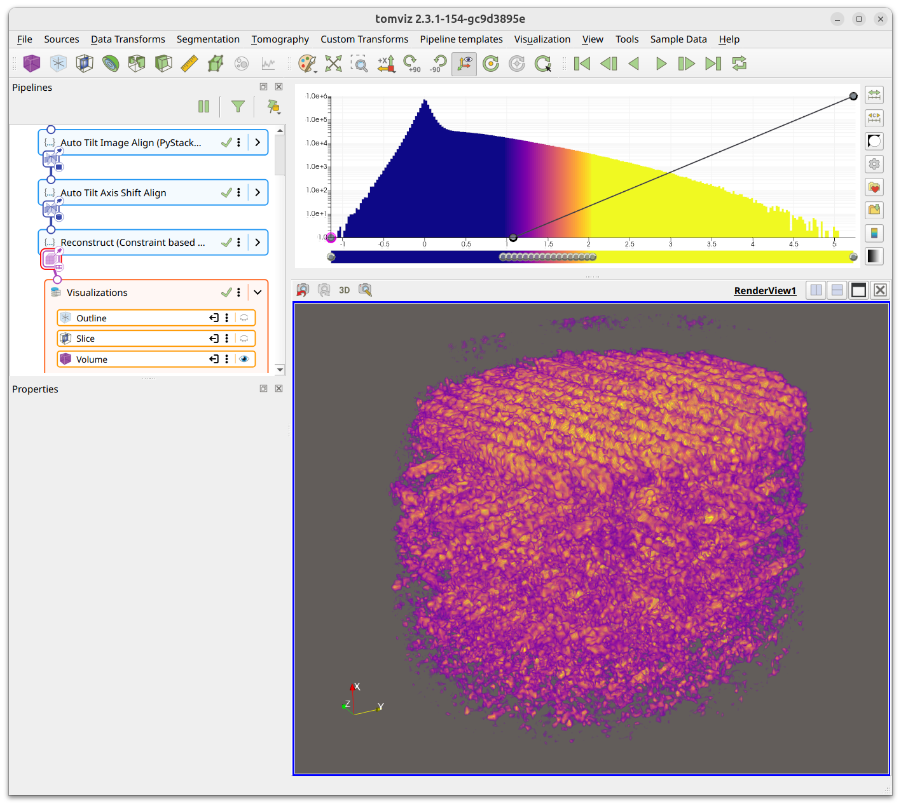
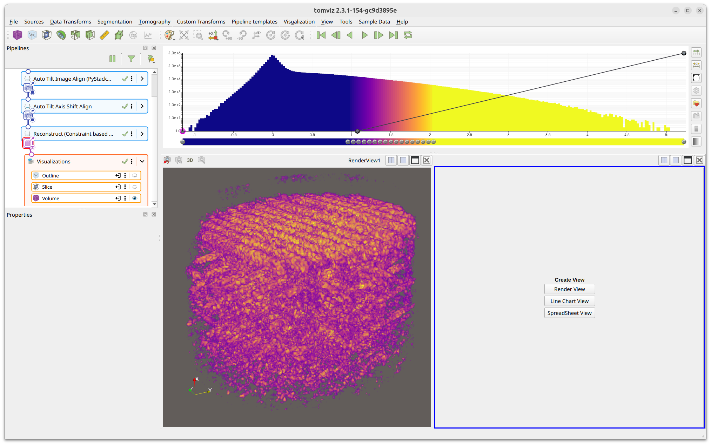
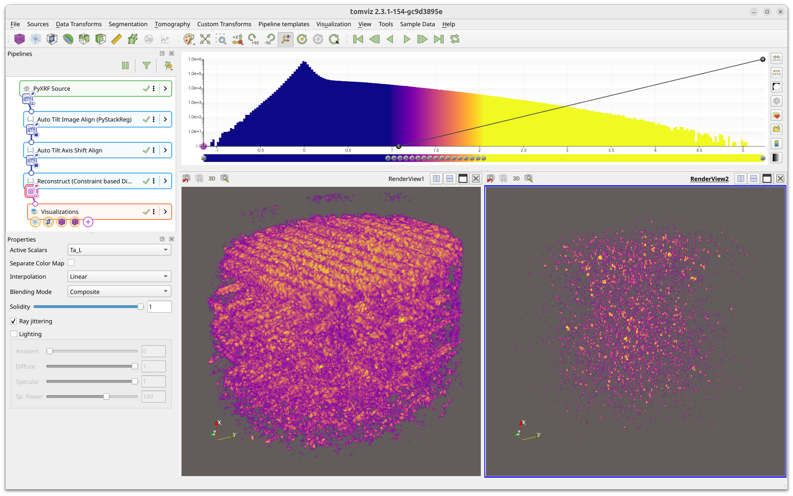
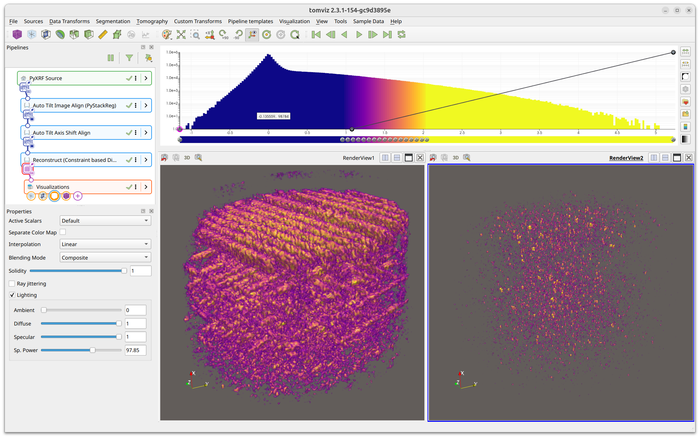

# PyXRF Source

The PyXRF source handles the download and processing of XRF data,
particularly for the HXN beamline at NSLS-II.

It uses the PyXRF library to download scans and process the projections
into a tilt series with an image stack for each element found in the data.
The result is loaded into Tomviz as a source node in the pipeline.

Tomviz also has the tools for the rest of the XRF analysis: deleting invalid
slices, automatic image alignment, centering the images, 3D reconstruction,
and comparing the reconstructed elements. These steps are covered below.

To begin, choose `Sources` -> `PyXRF`.

## Tutorial Video

<div style="text-align: center;">
  <iframe src="https://drive.google.com/file/d/1PgD8TLvymbVrlpI6W9kmaaTbPaNEbkuI/preview" width="760" height="480" allow="autoplay"></iframe>
</div>

## PyXRF Source Widget

This adds a source node to the pipeline and opens its dialog. The
Parameters tab holds the download and processing settings, which are kept
between sessions.



### Data Download

The top section sets up the download:

 * **PyXRF Utils Command** - The command that runs the PyXRF utilities (e.g.
   `run-pyxrf-utils`). It can be a script that runs pyxrf-utils in another
   environment, as long as its command-line API matches
   [pyxrf-utils](https://github.com/OpenChemistry/tomviz/tree/master/tomviz/python/tomviz/pyxrf/pyxrf-utils).
 * **Data Directory** - The working directory for data and log files.
 * **Scan Range** - The range of scans to download, specified in
   `start:stop:stride` format (both start and stop inclusive).
 * **Skip downloads** - Use the data already on disk instead of
   downloading. This disables `Re-download successful scans?` and
   `Download Data`.
 * **Re-download successful scans?** - Download scans again even if they
   succeeded before.

Click `Download Data` to start. The scan table fills in once the data
directory contains scan data.

### Scan Table

The scan table has one row per scan, with these columns:

 * **Scan ID** - The beamline scan identifier
 * **Theta** - The tilt angle for this scan (shown as "-" for failed scans)
 * **Status** - Download/processing status (success, fail, missing)
 * **Use** - Checkbox to include/exclude this scan from processing (disabled
   for failed scans)

#### Filtering SIDs

The **Filter SIDs** field above the table takes NumPy-like slices. Type an
expression and click `Apply`, for example:

 * `157394:157413:3` - Every third scan from 157394 to 157413
 * `157394:157413:3, 157420:157500:2` - Comma-delimited multiple ranges

Scans that are filtered out are hidden and not processed.

`Load from txt/csv` loads SIDs from a text or CSV file. In a CSV, the
`Scan ID` and `Use` columns are read, so you can reuse a scan selection.

Scan list files are shared with the [Ptycho source](./sources_ptycho.md),
so a list from either can be loaded into the other. The button also reads the
CSV or text file written by the ptycho source's **Output Info File**, and a
plain list of one scan ID per line. Column names ignore case and punctuation,
so `Scan ID`, `Scan_ID`, and `SID` all work. A `Use` value of `1`, `x`,
`true`, or `yes` marks a scan as used.

The `Save Scan List...` button writes the table (`Scan ID`, `Theta`, `Use`)
to a CSV without running the operator, so you can prepare a list and load it
into either dialog later.

### Live Updates

With [periodic execution](pipeline_management.md#live-data-and-periodic-execution)
enabled on the node's Execution tab, Tomviz re-executes the source when scan
files in the data directory change. With the `Scan Range` empty, each run
reads the current `tomo.h5`, so new scans appear once they are added to that
file. With a range set, the range is extended when scans arrive past its end,
and the new scans are downloaded and processed. Scans below the range or in
gaps within it are left out.

To try this with synthetic data, run the simulator from a Tomviz source
checkout, point the data directory at its output, leave the scan range
empty, and check `Skip downloads`:

```bash
python tests/simulation/simulate_pyxrf_stream.py /tmp/pyxrf-sim --interval 5
```

### Processing Projections

The bottom section sets up processing:

 * **Parameters File** - The JSON parameters file made in the PyXRF GUI. To
   create one, click `Start PyXRF GUI` at the bottom and follow the
   [PyXRF documentation](https://nsls-ii.github.io/PyXRF/) for modeling and
   fitting elements.
 * **Normalization Channel** - The ion chamber channel for normalization
   (auto-detected from data; typically `sclr1_ch4` for HXN).
 * **Output CSV File** - Optional CSV file for the scan metadata.
 * **Skip already processed scans?** - Skip HDF5 files that already contain
   processed results. Uncheck this if you changed the parameters file or
   normalization channel.
 * **Rotate datasets to Tomviz convention?** - Rotate the resulting tilt image
   stacks to match the convention expected by reconstruction transforms.
 * **PyXRF GUI Command** - The command to launch PyXRF GUI (default: `pyxrf`).
   Can be overridden with the `TOMVIZ_PYXRF_EXECUTABLE` environment variable.
 * **Start PyXRF GUI** - Launches the PyXRF GUI for creating the parameters
   file.

Scans with different pixel counts are padded to the largest shape before
they are stacked.

### Output

The elements are loaded as one tilt series source node, with a scalar array
per element. Voxel sizes come from the XRF metadata when available.

## XRF Data Analysis

For the loaded tilt series, the Properties panel has an `Active Scalars`
dropdown for switching between elements, and a Dimensions & Range table
listing each array with its range and type.



Transforms also see the active array as `dataset.active_scalars`, so select
the right one before running a transform.

### PyStackReg Image Alignment

A typical next step is image alignment with PyStackReg. First make an array
with high signal-to-noise the active array, and show a good reference slice
(close to 0 degrees, or close to the middle of the image) in a slice
visualization.

Then click `Tomography` -> `Alignment` -> `Image Alignment (Auto: PyStackReg)`:



The `Slice Index` defaults to the slice shown. The matrices are computed from
the active array and applied to all arrays.

`Translation` is a good first `Transformation Type`. `Padding` keeps the
image from wrapping around.

`Save Transformations File` saves the matrices and pixel sizes as NPZ, for
reuse with `Load From File` on data with different pixel sizes (such as
ptychography data).

See the [alignment section](alignment.md#pystackreg-image-alignment) for
more.

### Tilt Axis Shift Alignment

Next, center the data with `Tomography` -> `Alignment` ->
`Tilt Axis Shift Alignment (Auto)`:



Its options are like PyStackReg's: loading and saving shifts, padding, and
applying to all arrays. It tests randomly chosen slices to find the best
shift. See the
[alignment section](alignment.md#auto-tilt-axis-shift-alignment) for more.

### 3D Reconstruction

Then reconstruct. The main reconstruction transforms for XRF are
`Constraint-based Direct Fourier Method` and `Direct Fourier Method`, under
`Tomography` -> `Reconstruction`. Every array is reconstructed.

The output appears downstream in the pipeline with Outline, Slice, and Volume
visualizations. Adjust the opacity to bring out features of interest:



Switch elements with the `Active Scalars` dropdown in the Properties panel.

### Comparatively Visualizing Different Elements

To compare elements side by side, click one of the split icons at the top
right of the render window and choose `Render View`:



Click the new view to select it (it gets a blue border), add a Volume
visualization, and set its `Active Scalars` to another element:


Link cameras between render views so they rotate together: right-click one
view, click `Add Camera Link...`, and then left-click the other view:



For more realistic rendering, pick a lighting preset in the volume
properties (see [Lighting presets](visualization.md#lighting-presets)):


