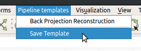
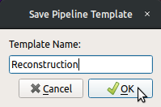
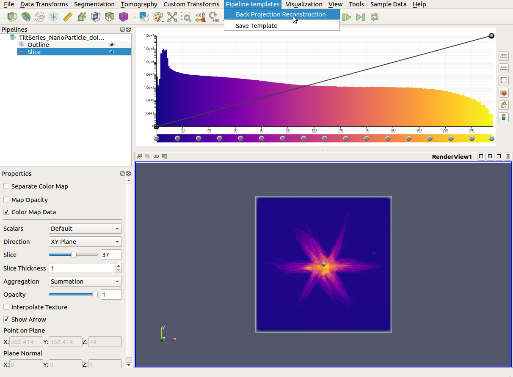
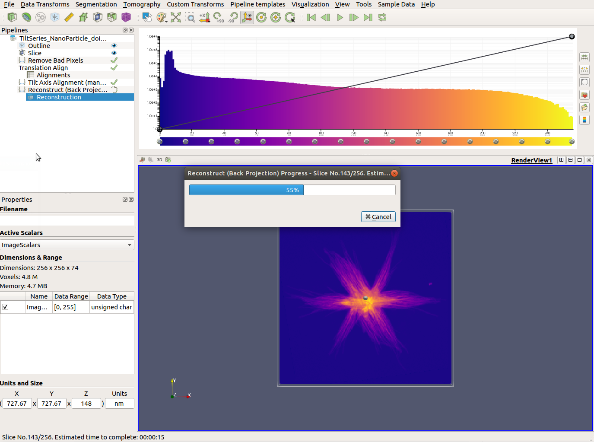

# Templates

Operators and visualization modules that have been applied to a data source can be saved as a template, which allows for quick and easy reuse with new data that may require the same pipeline.

## Create a Template

Templates can be created by selecting ```Save Template``` from  the ```Pipeline Templates``` menu. This will save all currently applied operators and visualization modules for the selected data source.



A dialog will be provided that will allow the template to be named before it is saved. The ```Pipeline Templates``` menu will be automatically updated to include the new template, which is then available for immediate use.



## Applying Templates

As with saving, loading will apply the template to the currently selected data source, so if you have more than one data source loaded you will want to make sure you have the correct one chosen. From there simply select the desired template from the ```Pipeline Templates``` menu.



Any visualization modules or operators that were already applied to the data will remain after the template has been applied.


