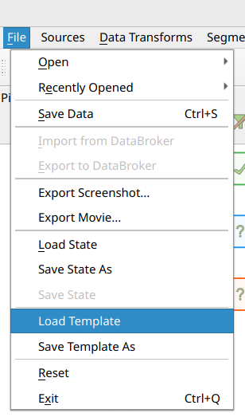
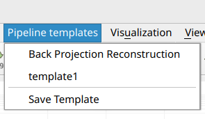

# Templates

A **template** is a pipeline state with the source nodes and visualization
nodes stripped out — only the transform graph and its connectivity remain.
What's left is a recipe for processing data, decoupled from where the data
came from or how it's displayed.

The point is reuse. Once you've assembled a useful chain of transforms — an
alignment + reconstruction recipe, a segmentation workflow, a denoising
pipeline — saving it as a template lets you apply the same chain to any
source you load next. The same template can be applied to many different
sources over the course of a session.

  <iframe src="https://drive.google.com/file/d/1Y9zIefNjfhqoXJvM-8Et2XhngSrnsKHB/preview" width="760" height="480" allow="autoplay"></iframe>

## Loading and Saving Templates

Templates live in Tomviz state files (`.tvsm` and `.tvh5`). There are two
ways to load and save them.

:::{list-table}
:widths: 1 1
:header-rows: 0
:class: top-align

* - 
  - 
:::

**From the File menu.** `Load Template` opens a file picker and applies the
chosen template to the current pipeline. `Save Template As` writes the
current pipeline to a state file with the sources, sinks, and sink groups
filtered out — what remains on disk is just the transform-only graph.

**From the Pipeline templates menu.** A dedicated top-level menu lists
templates that Tomviz discovers automatically in a known set of directories.
Out of the box this includes the bundled `share/tomviz/templates/` directory
that ships with the application, plus a user templates directory under your
Tomviz user data path. You can override the user location by setting the
`TOMVIZ_PIPELINE_TEMPLATES_PATH` environment variable to a list of
directories — Tomviz will then scan those instead. The menu also exposes a
`Save Template` entry that saves the current pipeline into the first of
those directories (so it shows up in the menu on the next scan) and prompts
only for a name rather than a full path.

## Using Regular State Files as Templates

Because a template is just a stripped-down state file, the loader will
happily accept any regular state file via `Load Template` as well. When it
does, source nodes, sink nodes, sink groups, and any links touching them are
dropped, along with view layout and palette information. Only the transforms
and the links between them are loaded into the current pipeline.

This means an existing `.tvsm` or `.tvh5` you saved as a full session can be
reused as a template against a different source, without having to manually
re-save it as one.
