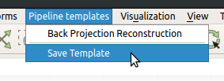
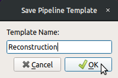
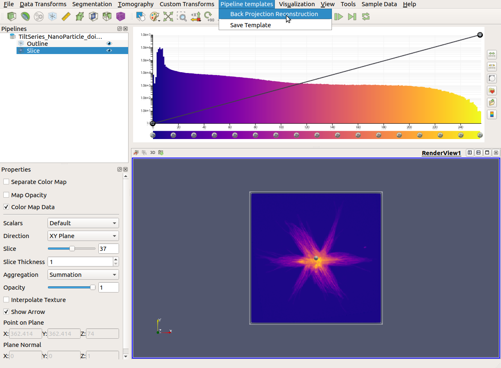
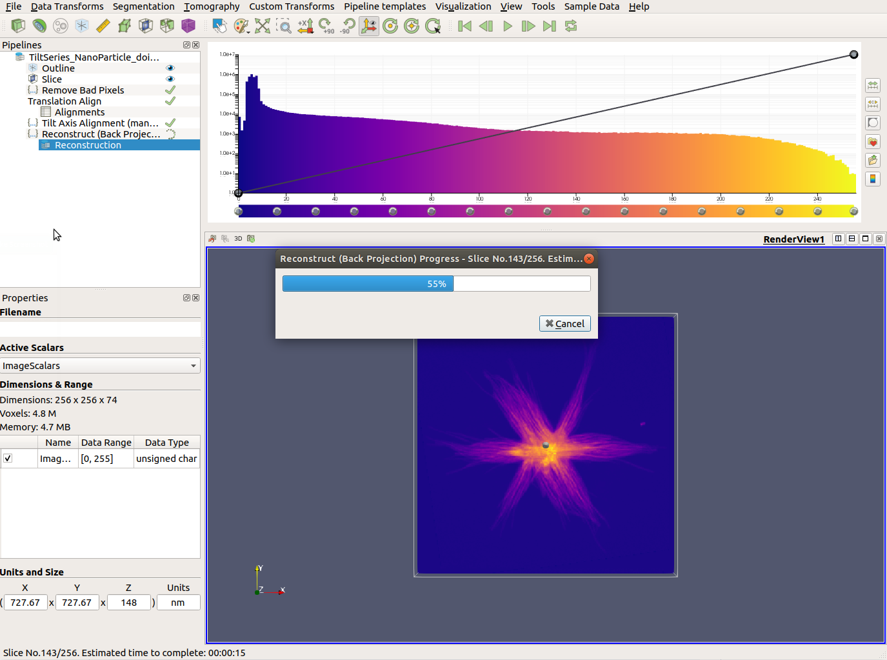

# Templates

Transforms and visualizations that have been applied to a data source can be
saved as a template, which allows for quick and easy reuse with new data that
may require the same pipeline.

## Create a Template

Templates can be created by selecting `Save Template As` from the `File` menu.
This will save all currently applied transforms and visualizations for the
selected source node.

<!-- SCREENSHOT NEEDED: File menu showing "Save Template As" option, or the
     template save workflow in the new UI. -->

A dialog will be provided that allows the template to be named before it is
saved. The saved template will appear in the `Pipeline templates` top-level
menu, where it is available for immediate use.

<!-- SCREENSHOT NEEDED: Template name dialog in the new UI. -->

## Applying Templates

Loading will apply the template to the currently selected source node, so if
you have more than one source loaded you will want to make sure you have the
correct one chosen. Select the desired template from the `Pipeline templates`
menu.

<!-- SCREENSHOT NEEDED: Pipeline strip widget showing data before template
     application (just source with default visualizations). -->

Any visualizations or transforms that were already applied will remain after
the template has been applied.

<!-- SCREENSHOT NEEDED: Pipeline strip widget showing data after template
     application (source with template transforms and visualizations added). -->

