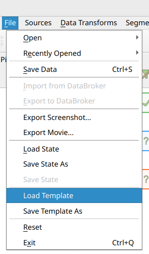
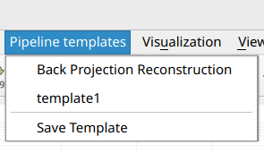

# Templates

A **template** is a pipeline state with the source and visualization nodes
stripped out, leaving only the transforms and their links. It is a recipe for
processing data, independent of where the data came from or how it is shown.

Once you have built a useful chain of transforms, such as alignment and
reconstruction, a segmentation workflow, or a denoising pipeline, save it as
a template to apply the same chain to any source you load later.

  <iframe src="https://drive.google.com/file/d/1Y9zIefNjfhqoXJvM-8Et2XhngSrnsKHB/preview" width="760" height="480" allow="autoplay"></iframe>

## Loading and Saving Templates

Templates are saved as Tomviz state files (`.tvsm`), and the
`Pipeline templates` menu lists the `.tvsm` files it finds. There are two
ways to load and save them.

:::{list-table}
:widths: 1 1
:header-rows: 0
:class: top-align

* - 
  - 
:::

**From the File menu.** `Load Template` opens a file picker and applies the
chosen template to the current pipeline. `Save Template As` writes the
current pipeline to a state file without its sources, sinks, and sink
groups.

**From the Pipeline templates menu.** This top-level menu lists the templates
Tomviz finds in the bundled `share/tomviz/templates/` directory and in your
user templates directory, `~/tomviz/templates` by default. To scan other directories
instead of the user one, set the `TOMVIZ_PIPELINE_TEMPLATES_PATH`
environment variable to a list of directories. The menu's `Save Template`
entry asks only for a name and saves the current pipeline to the first
directory in `TOMVIZ_PIPELINE_TEMPLATES_PATH` when it is set, otherwise to
the user templates directory, so it appears in the menu next time.

## Using Regular State Files as Templates

Because a template is just a stripped-down state file, `Load Template` also
accepts any regular state file. Source nodes, sink nodes, sink groups, and
any links touching them are dropped, along with the view layout and palette.
Only the transforms and the links between them are loaded into the current
pipeline, so a full session saved as `.tvsm` or `.tvh5` can be reused as a
template on a different source without re-saving it.
