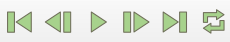
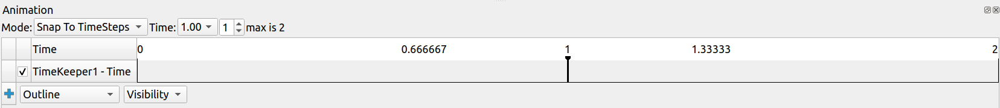
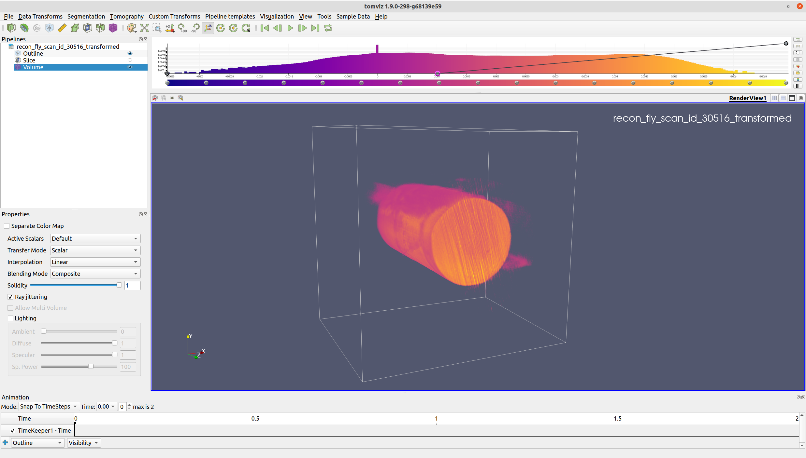
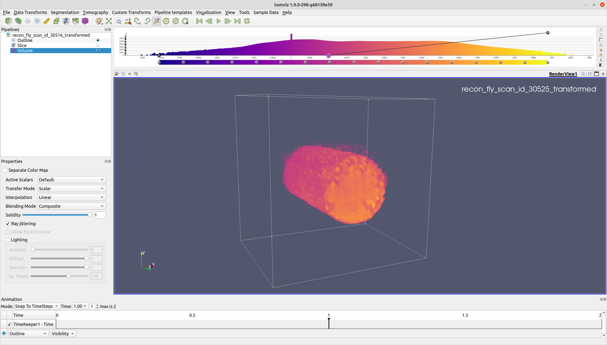
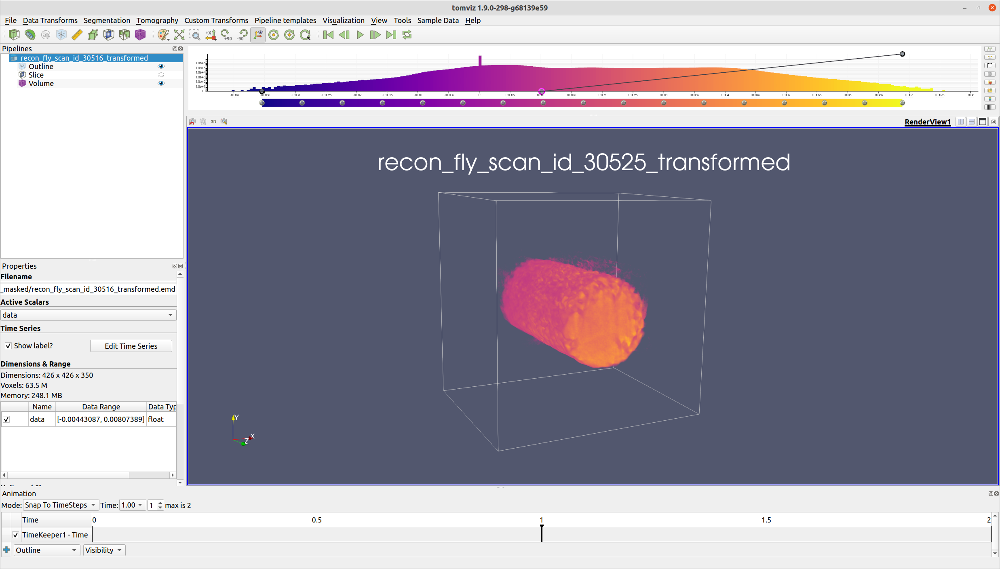
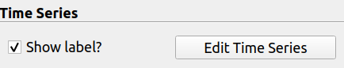
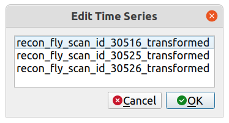
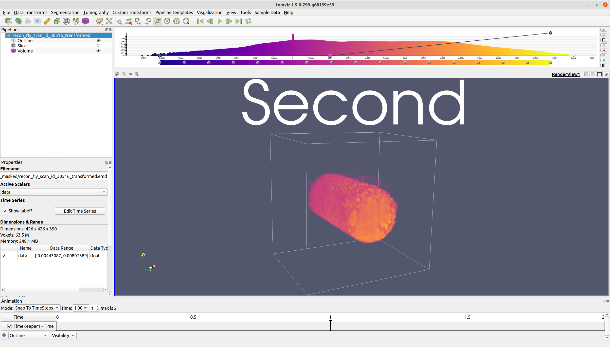

# Time Series

Time series contain a series of volumes where each volume is associated
with a specific time step. Time series can be used, for instance, to
create an animation of a volume changing over time. Currently, each
time step volume is loaded as a separate data file.

## Loading a Time Series

For loading a time series, see [here](data.md#time-series). Note that
the time steps will be sorted by file name, but
[the order may be edited](#editing-a-time-series).

## Stepping through a Time Series

In Tomviz, time steps are integrated with the animation features. Thus,
one way to manipulate the current time step is through the VCR toolbar
(found at the top of the main window).



This toolbar includes buttons to play through all of the time steps,
step back/forward one frame, go to the first/last frame, and loop
through the time steps.

Alternatively, the time steps may be manipulated through the use of
the animation widget, which may be displayed by clicking
```View```->```Animation```:



This includes several methods for manipulating time, including combo
boxes, a spin box, and a track slider.

When data is loaded as a time series, a label indicating the current
time step automatically appears in the top right corner of the
render view:



Using the VCR toolbar or the animation widget to proceed to the next
time step results in both the volume and the label updating:



The label can be moved by left-clicking and dragging it. It may also be
resized by left-clicking and dragging a border. An example of a label that
has been moved and resized is shown in the image below:



The label may also be hidden or edited (see
[Editing a Time Series](#editing-a-time-series)).

Note: normally, when data is loaded in Tomviz, a default camera orbit
animation is generated. However, when data is loaded as a time series,
the camera orbit animation is skipped.

## Editing a Time Series

If a data source has been loaded as a time series, a "Time Series"
section will be available in the data properties (which can be seen
by selecting the data source in the pipeline):



The "Show label?" checkbox allows the user to modify the visibility of
the time series label. If unchecked, the time series label will be
hidden.

The "Edit Time Series" button allows the ordering of the time steps and
the labels to be edited. If clicked, a dialog will appear similar to
the one below:



Individual rows may be left-clicked and dragged to modify the ordering
of the time steps. The labels may also be modified
by double-clicking them and typing a new label. If "OK" is clicked,
the changes will be applied. An example of an edited label is provided
in the image below:



