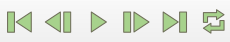
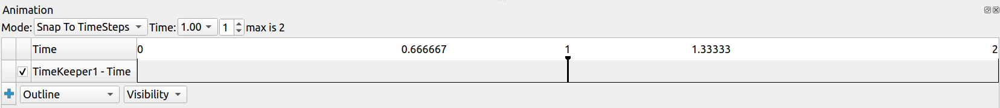
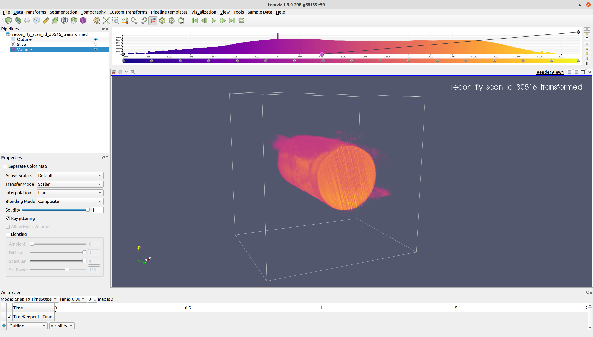
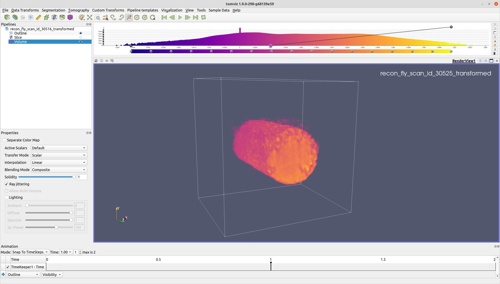
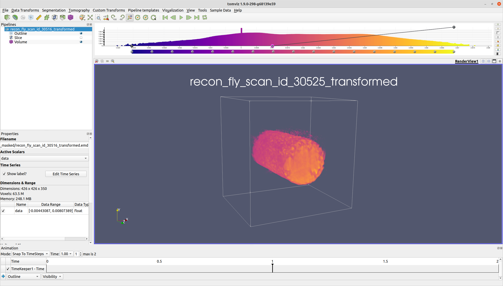
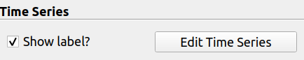
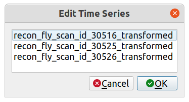
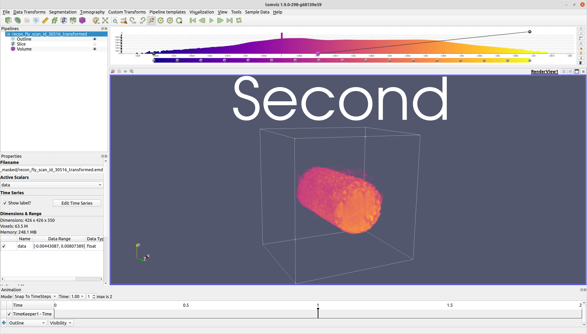

# Time Series

Time series contain a series of volumes where each volume is associated
with a specific time step. Time series can be used, for instance, to
create an animation of a volume changing over time. Currently, each
time step volume is loaded as a separate data file.

## Loading a Time Series

For loading a time series, see [here](data.md#time-series). Note that
the time steps will be sorted by file name, but
[the order may be edited](#editing-a-time-series).

## Stepping through a Time Series

In Tomviz, time steps are integrated with the animation features. Thus,
one way to manipulate the current time step is through the VCR toolbar
(found at the top of the main window).

This toolbar includes buttons to play through all of the time steps,
step back/forward one frame, go to the first/last frame, and loop
through the time steps.

Alternatively, the time steps may be manipulated through the use of
the animation widget, which may be displayed by clicking
`View` > `Animation`:

This includes several methods for manipulating time, including combo
boxes, a spin box, and a track slider.

When data is loaded as a time series, a label indicating the current
time step automatically appears in the top right corner of the
render view:

Using the VCR toolbar or the animation widget to proceed to the next
time step results in both the volume and the label updating:

The label can be moved by left-clicking and dragging it. It may also be
resized by left-clicking and dragging a border:

The label may also be hidden or edited (see
[Editing a Time Series](#editing-a-time-series)).

Note: normally, when data is loaded in Tomviz, a default camera orbit
animation is generated. However, when data is loaded as a time series,
the camera orbit animation is skipped.

## Editing a Time Series

If a source has been loaded as a time series, a "Time Series" section
will be available in the Properties panel (visible when selecting the
source node in the pipeline):

The "Show label?" checkbox controls the visibility of the time series label.

The "Edit Time Series" button opens a dialog for reordering time steps and
editing labels:

Individual rows may be left-clicked and dragged to modify the ordering.
Labels may be edited by double-clicking them.

