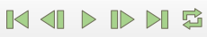
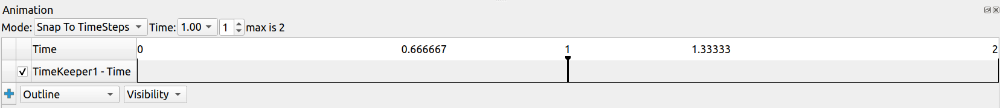
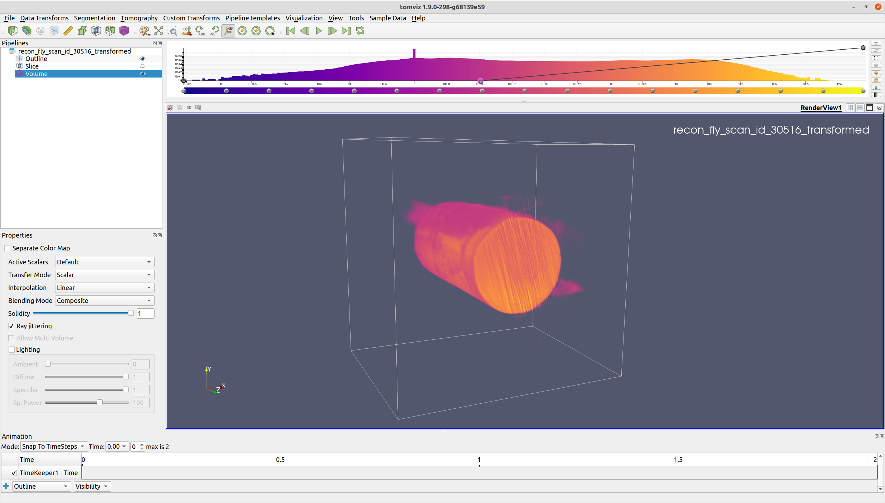
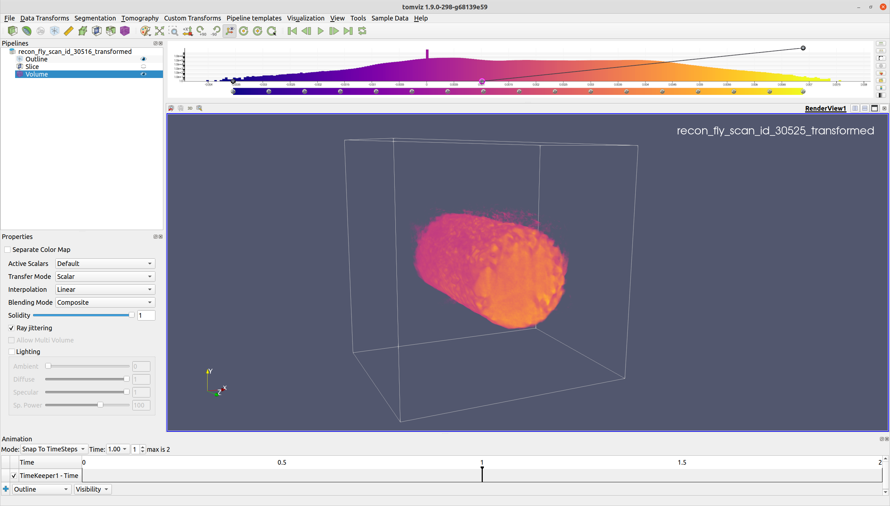
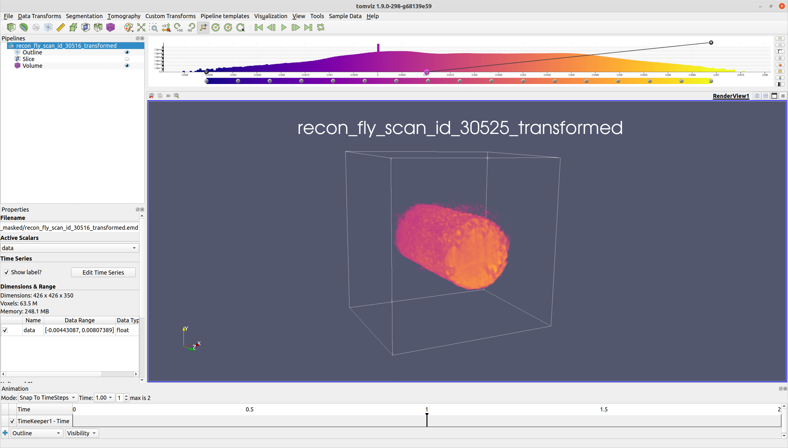
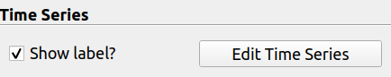
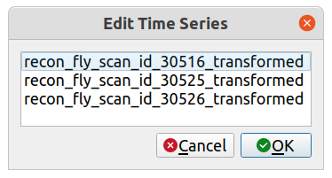
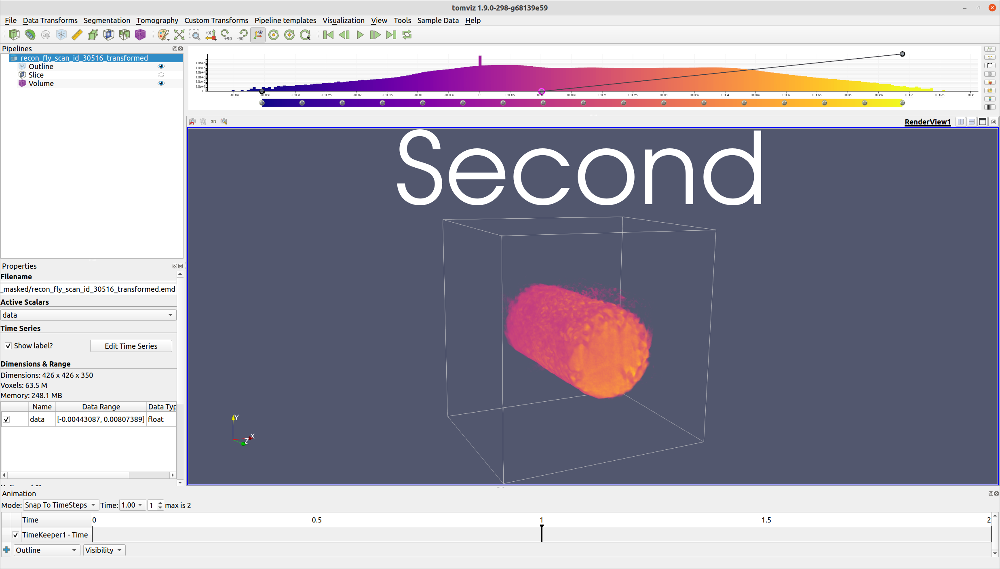

# Time Series

A time series is a sequence of volumes, one per time step, such as a sample
changing over time. Each time step is loaded from its own file.

## Loading a Time Series

See [Time Series](data.md#time-series) on the Data page. The time steps are
sorted by file name.

## Stepping through a Time Series

Time steps are part of the animation features, so the VCR toolbar at the top
of the main window steps through them.

Its buttons play all the time steps, step back or forward one frame, jump to
the first or last frame, and loop.

The animation panel, from `Animation` -> `Animation Panel` (also in the `View`
menu), sets the time step too:

It has combo boxes, a spin box and a track slider.

A time series shows a label with the current time step in the top right
corner of the render view:

Moving to the next time step updates both the volume and the label:

Drag the label to move it, or drag a border to resize it:

To hide or edit the label, see
[Editing a Time Series](#editing-a-time-series).

With a time series loaded, `Play` steps through the time steps instead of
orbiting the camera. While a camera path plays, the
[Animation Helper](animation.md#animation-helper)'s `Play time series`
checkbox (on by default, at the bottom of the helper) steps them too. It
appears only when a time series is loaded.

## Editing a Time Series

Select the source node of a time series to see a `Time Series` section in
the Properties panel:

`Show Time Series Label` shows or hides the label. `Edit Time Series...`
opens a dialog for editing the labels:

Double-click a label to edit it.

