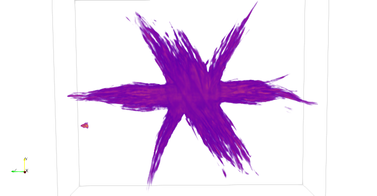
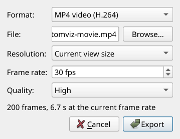
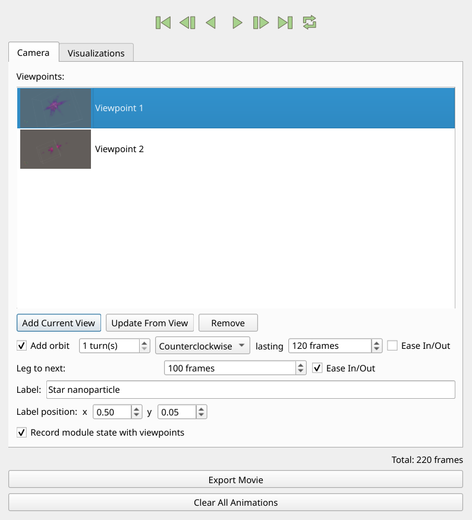
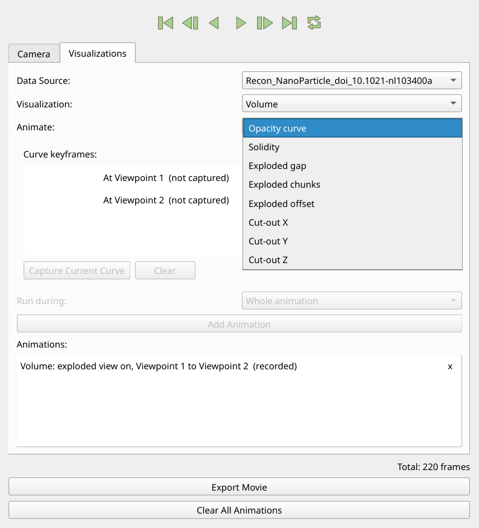

# Visualization

Tomviz provides a hardware accelerated visualization engine connected to a data
pipeline. Upon loading data a default volume rendering will be shown of the
data. Once transforms are applied to the data, visualizations will
move to the output of the pipeline automatically.

It is possible to visualize the original data by selecting the source node
and adding desired visualizations to it. Data can be cloned, which will create
a new source node with a copy of the selected data.

Tomviz saves its state every five minutes which can be recovered when Tomviz next
starts should the application crash or the computer have power issues. You can
also save the application state by taking a snapshot of the pipeline at a given
moment. See the [data section](data.md) for more details on loading/saving data
and/or state.

## Techniques

```{raw} html
<div style="position: relative; padding-bottom: 56.25%; height: 0; overflow: hidden; max-width: 100%; margin-bottom: 1.5em;">
  <iframe src="https://drive.google.com/file/d/1FUg6hx2XG4exz5JMNDiI9Z7PQirvPR_Q/preview" style="position: absolute; top: 0; left: 0; width: 100%; height: 100%;" frameborder="0" allow="autoplay; encrypted-media" allowfullscreen></iframe>
</div>
```

The video above tours the volume rendering tools (lighting presets, the
cut-out and exploded views, region auto-contrast and opacity presets), then
linked slices shown in the 2D image viewer, and several volumes rendered in
one view.

In this section, we will go over some available techniques and explain the
important parameters. Most of the techniques are GPU accelerated, which requires
a good graphics card that has at least 2GB memory, and ideally 16GB of system
memory. Larger volumes will require more data, see [data section](data.md) for
some discussion of typical data sizes.

## Visualizations


Visualizations are implemented in C++ using GLSL to take full advantage of
hardware acceleration. They are available from the `Visualization` menu and
the toolbar, and operate on the volumes loaded/processed in the application.


### Views of loaded data

When Tomviz opens data it has a number of defaults. The screenshot below shows
a typical view of a volume loaded, with a volume rendering and the default
`Plasma` color map. The histogram and opacity transfer function are displayed
in the top-right.


### Palette and background colors

The color palette can be modified using the button shown, and has several
useful presets. The default palette can also be changed if preferred.


The black background is recommended when displaying on monitors, or in some
presentations, white is often better for print, web pages and etc.

### Color maps

`Plasma` is the default color map, but the application contains a number of
alternative color maps that can be used. You can invert the color maps, and also
create custom color maps that can be saved for future use.


Selecting `Viridis` will result in the view being modified as shown, different
data can benefit from some of the alternate color maps.


### Contour

A contour along a single isovalue can be displayed in the application by
adding a contour visualization. The properties panel has a slider where the
isovalue can be specified; a few example contours are shown below at different
isovalues. Note how the color is set by the color map.


The contour properties include `Mode` (Surface, Wireframe or Points), `Lighting`
controls (Ambient, Diffuse, Specular, Specular Power), and the option to use a
`Separate Color Map`. If multiple scalars are available on the data, you can
select both the scalars to `Contour by` and the scalars to `Color by`.


### Slice

Slices through the data can be added with the `Slice` visualization. The default
is to show an orthogonal slice along the XY plane, as shown below. The
properties panel lets you choose the `Direction` (XY, XZ, YZ, or Custom),
adjust `Slice Thickness`, toggle `Interpolate Texture`, and set the point and
normal of the plane.


You can set the direction to `Custom` in order to slice through at any angle;
in custom mode the `Point on Plane` and `Plane Normal` fields become editable.
For a thick slice, `Aggregation` (Minimum, Maximum, Mean or Summation) sets
how the slices are combined, and `Opacity` makes the slice translucent.


When loading tilt series data, a slice visualization is shown by default to
allow browsing through the projection images.

#### Linking slices across datasets

When two datasets were acquired at the same time - two elemental channels,
say, or an XRF volume and the ptychography reconstruction of the same
specimen - it is tedious to step each one's slice view to the same place by
hand. Turn on `Link Slices` in two or more slice visualizations and they move
together: changing the direction or the slice index in any of them applies the
same change to all the others.

Linked slices match up by *physical position*, not by index: if the
ptychography reconstruction has twice the resolution of the XRF map, slice 100
of one lines up with slice 50 of the other, provided both datasets carry
their voxel sizes. Datasets of different depths stay in range, because each
linked slice clamps to its own extents, and until a dataset's geometry is
known the raw index is used. `Custom` planes are linked too: dragging the
plane's arrow or center handle, or editing the normal and center in the
panel, moves every linked view's plane to the same place. While a slider is
being dragged the other views follow when it is released. The link is a
property of each slice visualization, so it is saved with the state file,
and turning it on adopts the state of the view you enabled it in.

The `Clip` visualization has the same `Link Clips` option, so cut-away views
of several datasets can be moved together in the same way.

```{tip}
An axis-aligned plane can only be pushed along its axis. Grabbing its arrow
(to rotate) or its center sphere (to move freely) switches the direction to
`Custom` from the plane's current position, for slices and clips alike.
```

```{tip}
To link the camera as well, so that rotating one view rotates the others,
right-click in a render view and choose `Add Camera Link...`.
```

#### 2D image viewer

The `2D`/`3D` button in each render view's toolbar turns that view into a 2D
image viewer. Every visualization except one slice is hidden (the slice of
the selected dataset, or a new one if the view has none), and the camera
looks straight down the slice from the side it was already on, keeping the
up direction closest to the current one. Pan and zoom as on any image.
Clicking `3D` restores the hidden visualizations and the camera exactly as
they were. It is per view, so a split layout can show a 2D viewer next to a
3D view, which pairs well with linked slices.


### Outline

The outline visualization principally shows the extents of the volume, and can
be useful to see how far the volume extends. The properties panel includes
`Show Axes`, `Show Grid`, and `Custom Axes Titles` options. The screenshot
below shows the outline with axes and a grid enabled, with custom axis labels.


### Ruler

Rulers can be used to measure distances in the scene. The properties panel
displays the length and coordinates of the two endpoints. Use `P` to place
alternating points on the mesh, or `1`/`Ctrl+1` and `2`/`Ctrl+2` for the
individual endpoints. Use `X`/`Y`/`Z` to constrain the ruler to an axis.


### Threshold

The `Threshold` visualization will display all voxels between the specified
minimum and maximum values. The properties panel includes `Minimum` and
`Maximum` sliders, `Representation` (Surface, Wireframe or Points),
`Opacity`, and `Specular` controls. Like contours, thresholds support
`Threshold by` and `Color by` when multiple scalars are available.


The two screenshots show two distinct ranges as selected in the properties
panel.


The visualization opens on the brightest voxels of the data: the 95th
percentile of the voxels above the minimum value, so the zero padding of a
reconstruction does not count, capped so that no more than about 250,000
voxels show on a large volume. That keeps the first render quick; drag the
`Minimum` slider down from there. It shows exactly the voxels in range, one
cube per voxel, so what you see is what a `Binary Threshold` with the same
values will segment.

### Label Map

```{raw} html
<div style="position: relative; padding-bottom: 56.25%; height: 0; overflow: hidden; max-width: 100%; margin-bottom: 1.5em;">
  <iframe src="https://drive.google.com/file/d/1AgzvmGFW2iVmYAMCmT4cCFZ5iVCY5ujU/preview" style="position: absolute; top: 0; left: 0; width: 100%; height: 100%;" frameborder="0" allow="autoplay; encrypted-media" allowfullscreen></iframe>
</div>
```

The `Label Map` visualization shows a segmentation: the output of `Binary
Threshold`, `Connected Components` and the other segmentation transforms, or
any integer volume whose values are labels. The properties panel lists the
labels found in the data with a checkbox to show or hide each one and a
color you can change by double-clicking. Hiding labels is also how you
choose what a [Remove Labels](analysis.md#segmentation) transform drops, and
the hidden set is recorded with camera viewpoints by the
[Animation Helper](#animation-helper), so labels can appear one by one as
the camera moves.


**Representation** chooses how the labels are drawn:

 * **Surface** (the default) extracts one closed surface per label with
   Surface Nets, an algorithm made for label maps: adjacent labels stay
   watertight against each other. The mesh is then relaxed with a
   shrink-free smoothing that never moves the surface more than half a
   voxel, so a particle a few voxels across keeps the size the volume
   rendering shows. Surfaces are lit properly everywhere and render
   quickly. **Smoothing** sets the number of smoothing iterations (up to
   32); `0` shows the raw voxel faces. **Opacity** makes the surfaces
   translucent.
 * **Volume** renders the label map through the volume renderer, with the
   usual lighting, cut-out and exploded view controls. Use it for translucent
   overlays inside a volume, or for label maps too large to mesh. A label map
   has no intensity gradient inside a label, so with shading on the renderer
   can only light the one-voxel shell at each boundary; Tomviz samples label
   maps more finely and lifts the ambient light to keep this from showing,
   but a smooth, lit view of the shapes is what the Surface representation is
   for.

### Clip

Clipping planes can be added to the data in order to clip any applied `Slice`,
`Volume`, or `Contour` visualizations. The default is an orthogonal plane, but
its direction can be changed and the plane can be inverted to allow for clipping
from any direction. The properties panel lets you select the plane color,
toggle `Show Plane` and `Show Arrow` (the arrow only shows with the plane),
flip the side that is clipped away with `Invert Plane Direction`, and choose
the `Direction`.


The direction can be set to `Custom` to clip at any angle. The point on the
plane and the plane normal can be set numerically, or you can click
`Set Normal to View` to align the clip plane with the current camera direction.


The plane and arrow can be toggled off for clearer views of the clipped data.


## Color Bar and Opacity Editor


The color map, histogram, and opacity function are combined in the widget in
the top-right corner of the application display. The color map works primarily
with the [slice visualization](#slice) and [volume rendering](#volume-rendering),
and the opacity function works primarily with
[volume rendering](#volume-rendering).

The rectangular bar at the bottom is the color bar. New nodes can be added by
clicking the color bar, nodes can be deleted via the "Delete" key, they can be
moved by dragging them, and they can be re-colored by double left-clicking
them.

The line at the top represents the opacity function. New nodes may be added by
clicking on the function, they may be deleted via the "Delete" key, and they
may be moved by dragging them. Nodes can be dragged up (more opaque) and down
(less opaque) and side-to-side to change the scalar value to which they apply.

### Color Space

The color space may be changed by selecting the gear icon on the right side of
the histogram.

### Opacity Presets

The opacity icon on the right side of the histogram opens the
`Opacity Presets` dialog, which replaces the opacity curve with a prescribed
shape over the data range:

 * **Gaussian** - a bell centered on **Center** with **Width** as its sigma,
   which highlights one intensity band and fades everything else out.
 * **Linear** - a ramp from fully transparent to fully opaque, **Ramp Width**
   wide and centered on **Ramp Center** (the defaults span the whole range).
 * **Linear with cutoff** - transparent below **Cutoff**, then a ramp of
   **Ramp Width** up to fully opaque.

The sliders apply as they move, and the curve stays editable in the
histogram afterwards. For the Gaussian, `Color map end follows the Gaussian`
moves the color map's upper end to three widths past the center, so the
brightest color lands where the opacity fades out. `Reset` puts back the
curve from when the dialog was opened.


### Brightness and Contrast

The brightness and contrast may be edited by selecting the grayscale icon on
the right side of the histogram. This is primarily intended for grayscale
color maps, but can be used for other color maps as well. The dialog shows
`Minimum`, `Maximum`, `Brightness`, and `Contrast` controls.


Adjusting the brightness shifts the color bar left and right.
Adjusting the contrast makes the color bar width shrink and expand.

The `Auto` button automatically adjusts the brightness and contrast to the
data range based on certain thresholds. The `Reset` button restores the
original values.


Repeatedly pressing `Auto` increases the threshold that is used, and thus
increases the contrast as well.

The `Auto (Selected Region)...` button restricts that same calculation to a
region you choose, rather than the whole volume. It opens a box selector in
the 3D view: drag the box over the part of the data whose contrast matters,
then click `Apply`. This is the option to reach for when something outside
your region of interest - a bright hot spot, a mount, or a large empty
volume - dominates the whole-volume result and leaves the interesting
structure washed out. The dialog stays open so you can move the box and apply
again to compare.


## Volume Rendering

Tomviz uses volume rendering provided by VTK that utilizes graphics processing
units (GPUs) to accelerate rendering and achieve maximum performance. It needs
to upload the volume as a 3D texture, and offers a number of rendering options
that will be described and demonstrated. The default settings of the volume
renderer with the default color map and opacity look like the image below.


### Color Map and Opacity

The combined [color map, histogram, opacity function widget](#color-bar-and-opacity-editor)
is closely integrated with the volume renderer.

The screenshot below shows the impact on the volume renderer of adding an
opacity node, and setting it to zero such that all values below about
10,000 are fully transparent. This tends to remove most of the "background"
values that dominate in the default image with just two nodes. The transparency
linearly interpolates between points.


### Background color

The color palette can be manipulated by clicking on the artist palette icon in
the toolbar. The screenshots below show the white and black palettes and their
impact on the volume rendering without any other changes.


### Empty space and cropping

Making the outline visualization visible will show the total extent of the
volume. Once we have found suitable opacity points it is clear that quite a bit
of the space is empty.


You can access the `Crop` transform from the `Data Transforms` >
`Data Management` menu, and interactively crop the volume. This can be done
numerically in the dialog or interactively in the 3D view. The screenshot below
shows an example of the crop transform in action.


The crop dialog shows the selected volume start and end coordinates as
spinboxes. You can type the desired extents directly, or drag the spherical
handles on the 3D crop box to move the planes in or out.


When the desired values are set, click `OK` to finish the cropping. You can
also click `Apply` to preview the result while keeping the dialog open, and
`Cancel` to discard changes.


#### Cut-out views

Cropping with the `Crop` transform changes which data is kept. Its inverse
is `Clear Subvolume` (under `Data Transforms` > `Volume Manipulation`),
which keeps the volume's shape but sets everything inside the box you drag
to a fill value. To keep all of the data but see inside it, use the volume
visualization's `Cut Out` option instead: it removes one octant of the volume at render time, the
cut-away presentation familiar from Avizo and Dragonfly.

Check the `Cut Out` group below `Lighting` in the volume's properties panel,
choose which corner is removed with `Corner` (labeled by
the axis directions it sits on, for example `+X +Y +Z`), and place the cut
with the `X`, `Y`, and `Z` sliders, each a fraction of the volume's extent
along that axis. The controls are hidden until the group is checked. Nothing is
modified: the data is untouched and turning the option off restores the full
volume immediately. The setting is saved with the state file.


```{note}
Cut-out rendering, like clipping, has no effect on volumes larger than the
GPU's 3-D texture size limit, since those are rendered in bricks. Tomviz
writes a warning to the message log when this happens; crop or subsample the
volume to bring it under the limit.
```

#### Cylindrical Crop

In addition to the box crop, Tomviz offers a `Cylindrical Crop` transform
(also in `Data Transforms` > `Data Management`) for cropping the volume to a
cylindrical region with arbitrary axis orientation. See the
[Cylindrical Crop](operators_catalog.md#cylindrical-crop) section in the
operator catalog for details and examples.

#### Exploded view

To see the interior as a series of slabs rather than through a single cut,
check the `Exploded View` group below `Cut Out`. The volume is rendered as
evenly sized slabs along the chosen `Axis`, `Slabs` of them, pulled apart by a
`Gap` given as a fraction of the volume's length along that axis. `Axis` can
also be `Custom`: a `Direction` row then takes the three components of any
direction in the data's coordinates (its length does not matter), the slabs
are cut perpendicular to it and pulled apart along it, and, with `Show Arrow`
checked, an arrow at the center of the volume shows the direction; drag its
tip to turn it. `Offset` slides every cut along the direction by a number
of voxels, positive or negative, to put the gaps where you want them: the
first slab grows by the offset and the last shrinks (or the reverse), and
the range is limited so every slab keeps at least one voxel. Nothing is
modified: the slabs are extra renderings of the same data, so they pick up
the same color map, opacity, and lighting, and they follow the volume if it
is shifted or rotated. The camera refits when the view is toggled. The
exploded view and the cut-out are exclusive, it is not available on volumes
too large for one GPU texture or while several volumes are rendered together
in one view, and volumetric shadows are off while it is on,
since each slab would cast its own shadow pass.


### Several volumes in one view

When two or more volume visualizations are shown in the same view, Tomviz
renders them together along the same rays, so overlapping volumes blend
correctly instead of one being painted over the other. Color map, opacity,
interpolation and solidity stay per volume. Blending is always `Composite`
with ray jittering, a clip plane on any of them clips them all, and the
lighting is shared: it is set on the first volume shown, and the others'
panels say so. Cut-out, exploded view and volumetric shadows are unavailable
while volumes share a view; they come back once only one volume is shown.


### Rendering Properties

The volume renderer properties are in the properties panel when the volume
visualization is selected in the pipeline. The panel is shown below with the
default options selected.


The properties panel includes `Active Scalars` (to select which scalar array
to render), `Separate Color Map`, the [`Cut Out`](#cut-out-views) group,
`Interpolation` (Nearest Neighbor or Linear), `Blending Mode` (Composite,
Max, Min, Average, Additive), a `Solidity` slider, `Ray jittering` toggle,
and `Lighting` controls.

The `Lighting` group leads with five presets. `Flat` is unlit, so colors
read straight off the color map. `Simple` is classic directional shading.
`Gentle` is a matte, low-contrast look with no highlight that reads the
shape without turning reconstruction noise into glitter; it is as fast as
`Simple`. `Soft` and `Full` add volumetric shadows, soft and short-range or
long-range and dramatic, and cost render time. Because a shadow pass on
lower-end hardware can take long enough for the driver to reset the GPU,
choosing either of them, or switching shadows on any other way, first shows
a warning; tick `Don't warn me again` to silence it. The `Advanced`
expander holds the individual controls: `Shading`, `Ambient`, `Diffuse`,
`Specular`, `Sp. Power`, the `Shadows` switch with `Shadow Strength`,
`Shadow Reach` and `Anisotropy`, and `Smooth Normals`.

Below the presets, the `Saved presets` row holds your own: adjust the
controls, click `Save...`, and give the settings a name. They are stored in
the application settings, so they are available for any volume in any later
session; `Rename...` renames the selected one and `Delete` removes it. The
row shows the saved preset the current settings match, if any.


The `Cut Out` and `Exploded View` groups below `Lighting` collapse to their
title while unchecked, so the panel stays short until they are in use.

The following screenshots only modify the options in the volume renderer
properties panel. The default options produce the following result:


Turning `Ray jittering` off does not look very different with this dataset, but
in others the jittering can remove what looks like a wood grain pattern.



Turning lighting on can have quite a marked effect, it adds shadows, highlights
and other related lighting benefits. It often needs enough opacity to be used
for the shadows and surface to offer the additional depth shown below.


The `Max` blending mode (`Composite` is default) enables you to see
the core of the structure more easily. In this case there is a lot more high
intensity that is typically hidden.


## Exporting Visualizations

Tomviz offers a number of options to export the visualizations created in the
application.

### Export screenshot

From the `File` menu, you can choose `Export Screenshot`. The dialog lets
you specify the resolution of the image and the color palette. You can use a
transparent background, which can be especially useful for presentations.


### Export movie

`Export Movie...` is in the `File` and `Animation` menus. It records the
animation the scene plays, such as a camera path and the visualization
animations set up in the [Animation Helper](#animation-helper). The dialog
sets the `Format` (MP4 video when FFmpeg is available, Ogg Theora video when
that writer is available, or a PNG image sequence), the `File`, the
`Resolution` (the current view size, common video sizes, or custom), the
`Frame rate` and the `Quality`. Click `Export` to write it. For a simple spin,
press `Play` once with nothing set up first: that creates a `Camera Orbit`
viewpoint to record.



### Animation Helper

```{raw} html
<div style="position: relative; padding-bottom: 56.25%; height: 0; overflow: hidden; max-width: 100%; margin-bottom: 1.5em;">
  <iframe src="https://drive.google.com/file/d/1iP4xu-RYXccXjCk9W-rW4yyreNBi0B7Z/preview" style="position: absolute; top: 0; left: 0; width: 100%; height: 100%;" frameborder="0" allow="autoplay; encrypted-media" allowfullscreen></iframe>
</div>
```

`Animation Helper` in the `Animation` menu builds a camera path from
*viewpoints*: frame the view, click `Add Current View`, repeat. With two or
more viewpoints, `Play` and `Export Movie` fly through them in order. Each
leg, from one viewpoint to the next, has its own number of frames and
`Ease In/Out`. A viewpoint can also `Add orbit`: once the camera arrives,
it swings around the focal point for a chosen number of full turns,
counterclockwise or clockwise as seen from above, for a chosen number of
frames, and then flies on. An orbit turns at constant speed, so a spin
loops without a pause; check its own `Ease In/Out` to have it start slowly
and slow to a stop instead. The animation is as long as its legs and orbits
add up to, shown as the total at the bottom of the helper, so lengthening
one leg never shortens another; the `Number of Frames` box applies only
when there is no camera path. So a reel can spin the whole sample first and then fly in to the
details, or fly to a feature and orbit it there; the last viewpoint can
orbit to end on a spin, and a single viewpoint that orbits is an animation
by itself. Anything recorded or bound to a leg waits for the orbit to
finish. The camera flies the path whenever there is one. Pressing `Play`
with nothing set up to animate turns the current view into a single
orbiting viewpoint named `Camera Orbit`, which is the spin a fresh dataset
shows out of the box; edit it, build on it or remove it, and until you
press `Play` the viewpoint list stays yours. `Clear All Animations` removes
the viewpoints along with every other animation.



With `Record module state with viewpoints` checked (the default), each
viewpoint also records which visualizations are visible, the opacity of
contour, slice, clip, threshold, segment and label map (surface)
visualizations, where each slice and clip plane sits, every contour's iso
value, every threshold's range, which labels of each label map are hidden,
every volume's opacity curve and solidity, and the volume `Cut Out` and
`Exploded View` settings. Whatever differs between two consecutive viewpoints shows up
under `Visualizations` as a row marked *recorded*, for example "Slice 2:
slice 40 to 80, Viewpoint 1 to Viewpoint 2" or "Volume 1: opacity curve
changes, Viewpoint 2 to Viewpoint 3", and plays between those viewpoints in
step with the camera: slices and clips slide (a custom plane slides and
turns, and a change of direction swings the plane round to its new
orientation), iso values and threshold ranges sweep, visualizations fade in and
out through their opacity, the opacity curve morphs, the cut-out position
and the exploded gap slide, and hidden labels switch halfway along the leg.
Switching the cut-out or the exploded view on or off animates too: the
cut-out box grows out of its corner or shrinks back into it, and the slabs
open from a closed volume or close up before the view turns off. A new
corner, or a new slab count or direction, passes through the closed state
on the way, and a leg that swaps the cut-out for the exploded view gives
each half of it.
Anything identical at both viewpoints gets no row and is left alone.

The rows are a live view of the viewpoints, not copies. `Update From View`
(or `Update From Current View` in a viewpoint's right-click menu) re-records
the current state and the rows follow. The `x` on a recorded row
edits the later viewpoint so that property keeps its earlier value on that
leg, which is why the row stays gone. An animation you add by hand for the
same visualization and property takes over the legs it runs on; the
recorded change is not played there and your row is listed instead. For a
volume, the `Curve keyframes` list (shown when `Animate` is `Opacity curve`)
shows the recorded curve at each
viewpoint, marked *recorded*, until you capture or clear one there; that
first edit starts your own morph from the recorded curves. Selecting any
row, recorded or your own, puts its visualization, property, values and leg
into the controls above, so you can read it off and, after a tweak, `Add`
your own version; a recorded row that changed one setting, such as an
exploded gap, a cut-out axis or one end of a threshold range, fills in that
property and its values. A
visualization added after a viewpoint was saved counts as hidden at that
viewpoint until you update it, so it fades in on the first leg that has it;
one that no viewpoint has recorded is never touched. `Go To` in a
viewpoint's right-click menu restores its camera and module state, and the recordings are saved with the
state file.

Animations you author yourself sweep one property of a visualization from
a start value to a stop value, over the whole timeline or during one leg of
the camera path. Pick the `Data Source`, the `Visualization` and what to
`Animate`, set the range, and click `Add Animation`. What is offered depends
on the visualization:

 * **Contour**: iso value, opacity.
 * **Slice** and **Clip**: slice index while axis aligned, or position
   along the plane's own normal while the plane is custom, and opacity.
 * **Threshold**: the lower or the upper end of the range, and opacity.
 * **Volume**: the opacity curve (keyframed per viewpoint), the solidity,
   the exploded gap, number of slabs and offset, and the cut-out position along X, Y or
   Z. The exploded view or cut-out is switched on when the animation
   starts.
 * **Label Map**: surface opacity, solidity, exploded view and cut-out.
 * **Segment**: opacity.



Each viewpoint also has a `Label`. When it is set, the text is drawn in the
render view while the path is at that viewpoint and along the leg leaving
it, so exported movies carry the caption too. Leave it empty for no
caption. `Label position` is where every caption is centered, as a fraction
of the view's width and height from the lower-left corner: `0.5, 0.5` is the
middle of the view, and the default, `0.5, 0.05`, the bottom middle.


## Plot Visualization

```{raw} html
<div style="position: relative; padding-bottom: 56.25%; height: 0; overflow: hidden; max-width: 100%; margin-bottom: 1.5em;">
  <iframe src="https://drive.google.com/file/d/1EVoWTAiN61pKwAJdNu0_9D_KGCkE1e1s/preview" style="position: absolute; top: 0; left: 0; width: 100%; height: 100%;" frameborder="0" allow="autoplay; encrypted-media" allowfullscreen></iframe>
</div>
```

The Plot visualization provides interactive line chart displays for tabular
results produced by transforms. Transforms such as
[Power Spectrum Density](analysis.md#power-spectrum-density-psd) and
[Fourier Shell Correlation](analysis.md#fourier-shell-correlation-fsc)
generate table-based output that is displayed as line charts in a dedicated
plot view.


### Adding a Plot Visualization

To add a Plot visualization, select a node that produces table output in the
pipeline, then click the `Plot` button in the Visualization toolbar. The Plot
will appear in the pipeline linked to the selected node's table output port.

### Plot Options

The Plot visualization supports several options for customizing the display:

 * **Log Scale X** - Toggle logarithmic scaling on the X axis
 * **Log Scale Y** - Toggle logarithmic scaling on the Y axis

Axis labels are initially provided by the transform that generated the data,
giving context to what is being plotted. The axis labels are also editable,
allowing you to customize them as needed.

### Plot Colors

When multiple data series are displayed, the plot uses automatically generated
colors based on HSV spacing. This produces a large number of visually
distinguishable colors, making it easy to differentiate between many series.

### Exporting Plot Data

Table results displayed in the Plot visualization can be exported as CSV files
for external analysis. Right-click the transform in the pipeline and select
`Export Table as CSV` to save the data.

