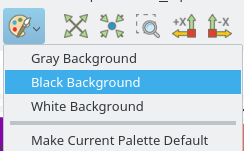
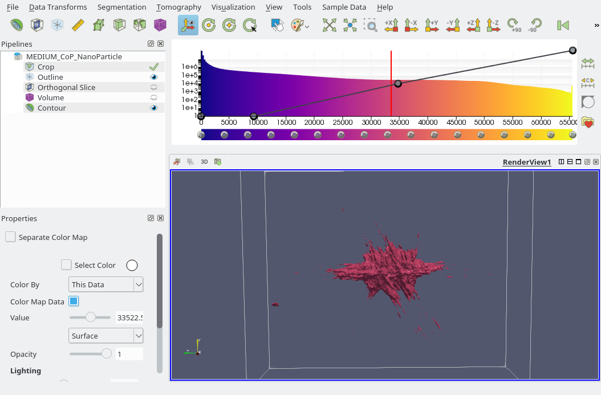
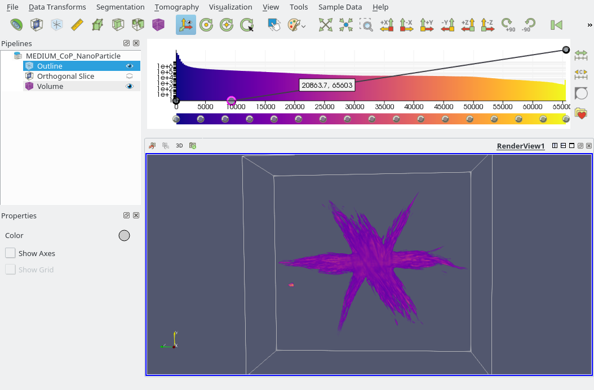
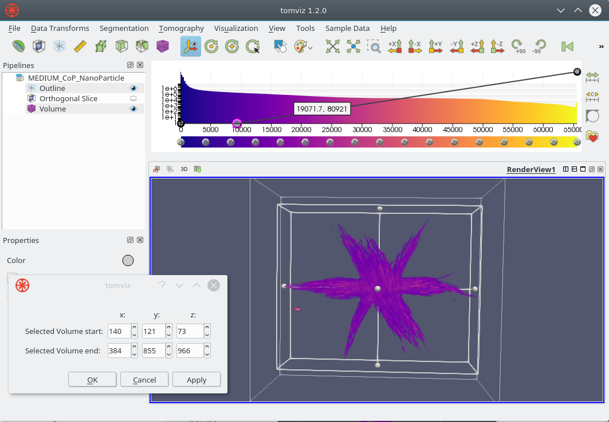
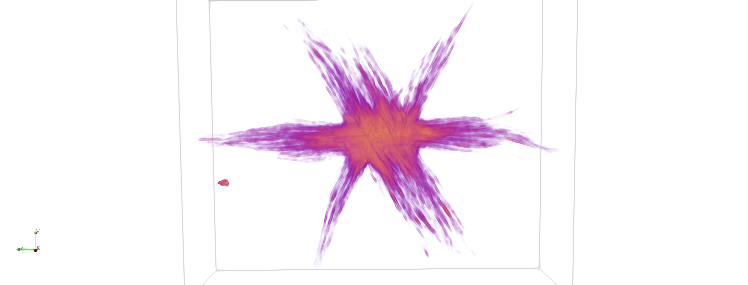
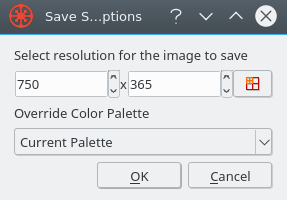
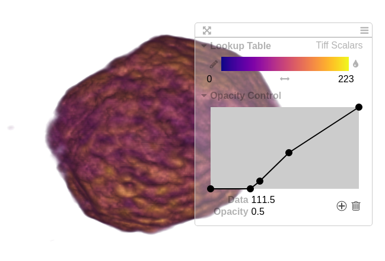
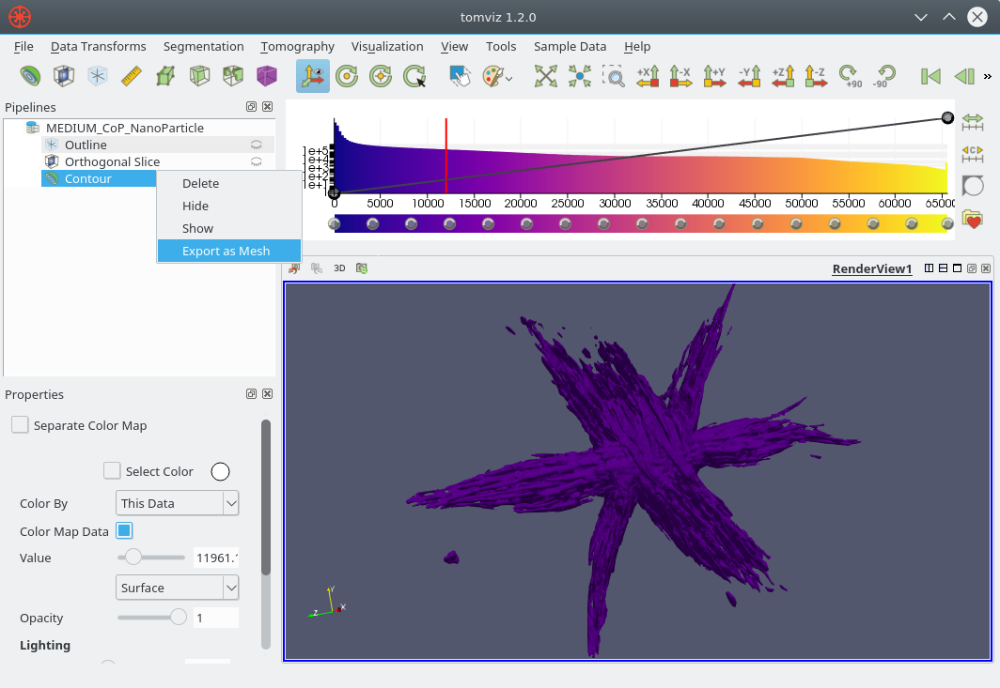

# Visualization

Tomviz provides a hardware accelerated visualization engine connected to a data
pipeline. Upon loading data a default view will be shown of the data (a slice
and an outline). Once operations are applied to the data these will move to the
output of the pipeline automatically.

It is possible to visualize the original data by selecting the root (usually
denoted by the name of the file loaded) and adding the desired visualization
modules to it. Data can be cloned, which will create a new root with a copy of
the selected data.

Tomviz saves its state every five minute which can be recovered when Tomviz next
starts should the application crash or the computer have power issues. You can
also save the application state by taking a snapshot of the pipeline at a given
moment, note that saving state does not save data. See the
[data section](data.md) for more details on loading/saving data and/or state.

The screenshot above shows data as loaded on the left, and then a cropped view
of a single nanoparticle on the right. Note the two volume modules in the
pipeline placed on the original data and the output data.

## Techniques

In this section, we will go over some available techniques and explain the
important parameters. Most of the techniques are GPU accelerated, which requires
a good graphics card that has at least 2GB memory, and ideally 16GB of system
memory. Larger volumes will require more data, see [data section](data.md) for
some discussion of typical data sizes.

## Modules

Visualization modules are implemented in C++ using GLSL to take full advantage
of hardware acceleration. These modules are available from the visualization
menu and operate on the volumes loaded/processed in the application. The toolbar
is shown above, with the `Visualization` menu shown below, note the identical
icons with brief descriptions in the menu.

### Views of loaded data

When Tomviz opens data it has a number of defaults. The screenshot below shows
a typical view of a volume loaded, with a slice through the center of the data,
an outline showing the total size of the volume, and the default `Plasma` color
map. Histogram is calculated in the background thread and then displayed when
ready in the top-right.

### Palette and background colors

The color palette can be modified using the button shown, and has several
useful presets. The default palette can also be changed if preferred.

The black background is recommended when displaying on monitors, or in some
presentations, white is often better for print, web pages and etc.

### Color maps

`Plasma` is the default color map, but the application contains a number of
alternative color maps that can be used. You can invert the color maps, and also
create custom color maps that can be saved for future use.

Selecting `Viridis` will result in the view being modified as shown, different
data can benefit from some of the alternate color maps.

### Contour

A contour along a single isovalue can be displayed in the application by double
clicking on the histogram at the desired value, or by adding a contour module.
The module properties has a slider where the value can be specified, a few
example contours are shown below at different isovalues. Note how the color is
set by the color map.

If multiple scalars are available on the data, the user is able to select both
the scalars to contour by, and the scalars to color by.

### Slice

Slices through the data can be added with the `Slice` module. The default is to
show an orthogonal slice such as that shown below.

You can set the direction to `Custom` in order to slice through at any angle.

### Outline

The outline module principally shows the extents of the volume, and can be
useful to see how far the volume extends. There are a few other options
available in the module properties. Clicking on `Show Axes` will show the axes,
and clicking on `Show Grid` will add a grid as shown below.

### Ruler

Rulers can be used to measure distances in the scene. The start and end point
can be selected interactively, and the length is displayed.

### Threshold

The `Threshold` module will display all voxels between the specified minimum and
maximum values. The bounds are specified in the properties panel for the module.

The two screenshots show two distinct ranges as selected in the properties
panel shown.

### Clip

Clipping planes can be added to the data in order to clip any applied `Slice`,
`Volume`, or `Contour` modules. The default is an orthogonal plane, but its
direction can be changed and the plane can be inverted to allow for clipping
from any direction.

The direction can be set to `Custom` to clip at any angle, and the plane color
and opacity can also be changed to fit your needs.

Planes and arrows can also be toggled off for clearer views of the clipped data.

## Color Bar and Opacity Editor

The color map, histogram, and opacity function are combined in the widget in
the top-right corner of the application display. The color map works primarily
with the [slice module](#slice) and [volume rendering](#volume-rendering), and
the opacity function works primarily with [volume rendering](#volume-rendering).

The rectangular bar at the bottom is the color bar. New nodes can be added by
clicking the color bar, nodes can be deleted via the "Delete" key, they can be
moved by dragging them, and they can be re-colored by double left-clicking
them.

The line at the top represents the opacity function. New nodes may be added by
clicking on the function, they may be deleted via the "Delete" key, and they
may be moved by dragging them. Nodes can be dragged up (more opaque) and down
(less opaque) and side-to-side to change the scalar value to which they apply.

### Color Space

The color space may be changed by selecting the gear icon on the right side of
the histogram.

### Brightness and Contrast

The brightness and contrast may be edited by selecting the grayscale icon on
the right side of the histogram. This is primarily intended for grayscale
color maps, but can be used for other color maps as well.

Adjusting the brightness shifts the color bar and opacity left and right.
Adjusting the contrast makes the color bar and opacity widths shrink and expand.

The "Auto" button may be pressed to automatically adjust the brightness and
contrast to the data range based on certain thresholds.

Repeatedly pressing the "Auto" button increases the threshold that is used,
and thus increases the contrast as well.

## Volume Rendering

Tomviz uses volume rendering provided by VTK that utilizes graphics processing
units (GPUs) to accelerate rendering and achieve maximum performance. It needs
to upload the volume as a 3D texture, and offers a number of rendering options
that will be described and demonstrated. The default settings of the volume
renderer with the default color map and opacity look like the image below.

### Color Map and Opacity

The combined [color map, histogram, opacity function widget](#color-bar-and-opacity-editor)
is closely integrated with the volume renderer.

The screenshot below shows the impact on the volume renderer of adding an
opacity node, and setting it to zero such that all values below about
10,000 are fully transparent. This tends to remove most of the "background"
values that dominate in the default image with just two nodes. The transparency
linearly interpolates between points

### Background color

The color palette can be manipulated by clicking on the artist palette icon in
the toolbar. The screenshots below show the white and black palettes and their
impact on the volume rendering without any other changes.

### Empty space and cropping

Making the outline module visible by adding it (or clicking on the eyeball) will
show the total extent of the volume. Once we have found suitable opacity points
it is clear that quite a bit of the space is empty.

You can access the `Crop` operator from the `Data Transforms` menu, and
interactively crop the volume. This can be done numerically in the dialog or
interactively in the 3D view. The screenshot below shows an example of the crop
operator in action, this is a C++ operator developed to be highly interactive.

You can either type the desired extents into the dialog, or drag the spherical
handles to move the planes in or out.

When the desired values are set, click on `OK` to finish the cropping, you can
also click `Apply` to see the result but keep the dialog open to interactively
update the crop values until you are happy with them.

### Rendering Properties

The volume renderer properties are in the properties panel when the volume
module is selected in the pipeline browser. The panel is shown below with the
default options selected.

The following screenshots only modify the options in the volume renderer
properties panel. The default options produce the following result:

Turning `Ray Jittering` off does not look very different with this dataset, but
in others the jittering can remove what looks like a wood grain pattern.

Turning lighting on can have quite a marked effecf, it adds shadows, highlights
and other related lighting benefits. It often needs enough opacity to be used
for the shadows and surface to offer the additional depth shown below.

The `Max Intensity` blending mode (`Composite` is default) enables you to see
the core of the structure more easily. In this case there is a lot more high
intensity that is typically hidden.

The 1D transfer function highlights surfaces using gradient opacity to modulate
the volume rendered image.

The 2D transfer also highlights the surfaces/high rates of change but can offer
the ability to be more selective. The volume must be quite well behaved to
exhibit enough structure to be amenable to this approach.

The 2D transfer function features a box using the main color map with its
opacity values, and that box can be moved around to select specific regions
of scalar value and gradient magnitude.

### Visualizing RGB Volumes

When multi-component image data is loaded (see [Merging Data](data.md#merging-data)
for an example), the volume visualization will by default display the magnitude
of the data.

If 3-component image data is loaded, a "Use RGBA Mapping" checkbox will
appear in the volume panel. If this setting is checked, then the three
components of the data will be mapped to the red, green and blue channels,
respecitvely, and the color map will be ignored. The magnitude of the 3
channels is then used alongside the opacity editor to compute the opacity of
the volume.

If checked, an RGBA Mapping Range will appear below it.

This indicates the data range that will get mapped to the RGB range.
The sliders can be adjusted to remove noise from the visualization
in order to primarily display the true signal.

## Exporting Visualizations

Tomviz offers a number of options to export the visualizations created in the
application.

### Export screenshot

From the same `File` menu, you can choose `Export Screenshot`. The dialog lets
you specify the size of the image to export and supports most standard image
formats. You can override palette, the use of the transparent background can be
especially useful in presentations for example.

### Export movie

The movie defaults to producing an orbit around the volume using the scene in
the current view. You can set the resolution before saving and the color
palette as above. It is `Export Movie` in the `File` menu, and supports a number
of common movie formats.

### Export to web

The option to export to web is useful to go beyond a simple movie, and offer an
interactive element that can be shared in any modern web browser. By default
it generates images statically, and the HTML page can be opened in almost any
browser, with limited interactivity.

It is usually better to use a geometry based export, but that requires a more
modern web browser that supports WebGL. You often need to downsample the data
in order to view it in a browser, and offer better interactivity. You can set
it to use an external data file that can be used in larger web pages, or an
integrated HTML page that can be emailed as a single object/hosted.

An example after successfully exporting the data to web may look like

### Export mesh for 3D printing

Contours of the data set with a specific value can be exported to an STL mesh
file by right-clicking on `Contour` inside the `Pipelines` browser as shown
below. You should choose `Export as Mesh` and choose where to save the mesh to.

### Export image from slice

A similar capability is offered in the slice widget, where you can right-click
the `Slice` and select `Export as image` from the context menu. You can choose
where to save the image, and it will be exported as a flat image sharing the
dimensions of that slice through the volume in the case of orthogonal slices.

## Image Viewer Mode

Under the "View" menu, there is an option to enter "Image Viewer Mode".

Image viewer mode essentially sets up the main window, the modules, and the
view so that the user can more easily scroll through and visualize the data
as a stack of images.

Enabling image viewer mode does the following:

1. Sets the projection to orthographic
2. Sets the interaction mode to 2D
3. Resets the view direction to -Z
4. Finds a slice module, or creates one. Show it, and hide all other modules.
5. Zooms the camera so the slice fits the window
6. Places a slider below the render window for selecting the slice to view

When image viewer mode is disabled, most of the settings and the view will
be restored to what they were before image viewer mode was enabled.
