# Visualization and Analysis

## Table of Contents
1. [Introduction](#introduction)
    1. [Load data](#loaddata)
    2. [Save Results](#saveresults)
    3. [Recover and load state](#recoverstate)
2. [Visualization Techniques](#visualizationtechniques)
    1. [Available visualization modules](#vizmodules)
    2. [Default view of loaded data](#defaultview)
3. [Volume Rendering](#volumerendering)
4. [Data Transforms](#datatransforms)
5. [Segmentation](#segmentation)
6. [Exporting Data](#exportingdata)

<a name="introduction"></a>
## Introduction

Tomviz visualizes the resulting data set at the end of each processing pipeline, where normally several operations have been applied. However, if no operators have been applied, the original data will be visualized.

Users can also display the original data directly from the beginning of a pipeline, by simply selecting the data set, and adding modules to it. Data sets can be clones, which means creating a new root.

During the process, Tomviz saves the pipeline every five minutes. This can be recovered upon next restart of Tomviz. Users can also save the application state by taking a snapshot of the pipeline at a given moment, which can be restored, edited, saved again later. Note that saving state does not save data.

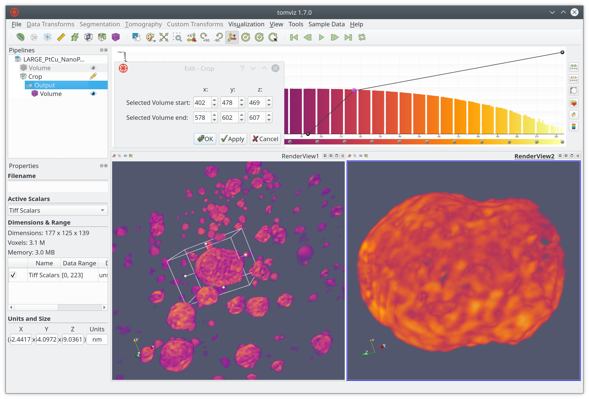

Typical datasets may have following relationships between attributes and sizes.

| Volume          | Voxels        | Size (char) | Size (int) |
|  :---           |  :---         |    :---     | :---       |
| 64<sup>3</sup>  | 262,144       | 0.25 MB     | 1 MB       |
| 128<sup>3</sup> | 2,097,152     | 2.00 MB     | 8 MB       |
| 256<sup>3</sup> | 16,777,216    | 16.00 MB    | 64 MB      |
| 512<sup>3</sup> | 134,217,728   | 128.00 MB   | 512 MB     |
| 103<sup>3</sup> | 1,073,741,824 | 1,024.00 MB | 4096 MB    |

<a name="loaddata"></a>
### Load data

In this subsection, loading methods for three data categories, single data file, stack of images and raw data set, are being introduced.

#### Single data file

Loading single data set is straight forward, simply select ```Open Data``` from the ```File``` menu, as indicated in screenshot below.

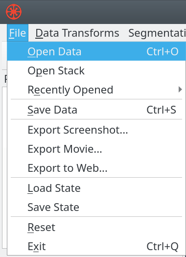

#### Image stacks

Loading image stacks takes a little bit more efforts than loading single data file. After selecting ```Open Stack``` from the ```File``` menu, check all the images you would like to include in the pop-up window, as indicated in screenshots below.

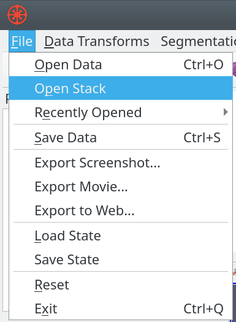

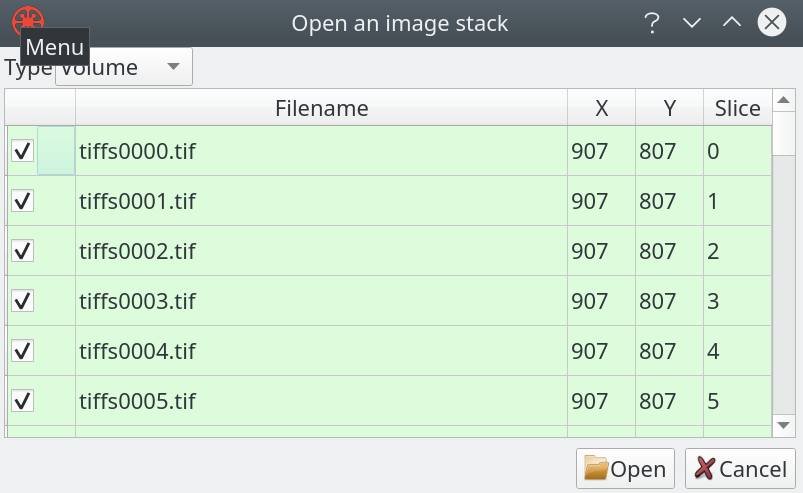

#### Reading a raw file

Users can also choose to read raw files by defining data dimensions, type, endianness, and etc, as indicated below.

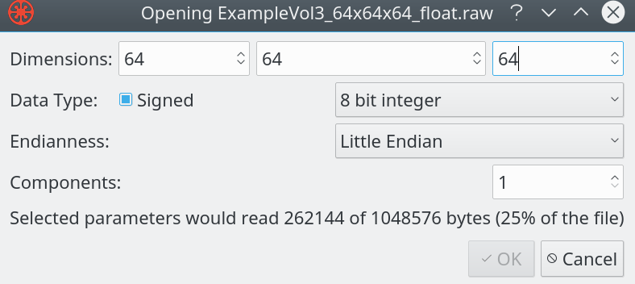

<a name="saveresults"></a>
### Save results

#### Save data

Users can save the data by either clicking the ```Save Data``` button from ```File``` (as shown below), or simply using the keyboard short-cut ```Ctrl+S```.

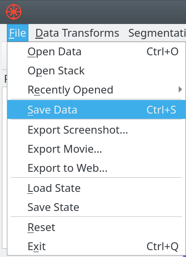

#### Save state

Similary to saving data, users can save the state by clicking the ```Save State``` button from ```File```.

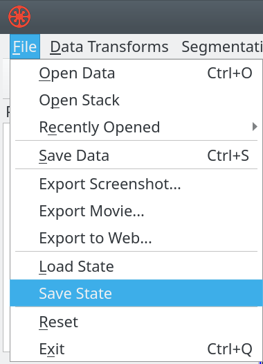

<a name="recoverstate"></a>
### Recover and load state

#### Recover state

Tomviz saves the pipeline every five minutes, users can recover the previous states by simply allowing the Tomviz to load them.

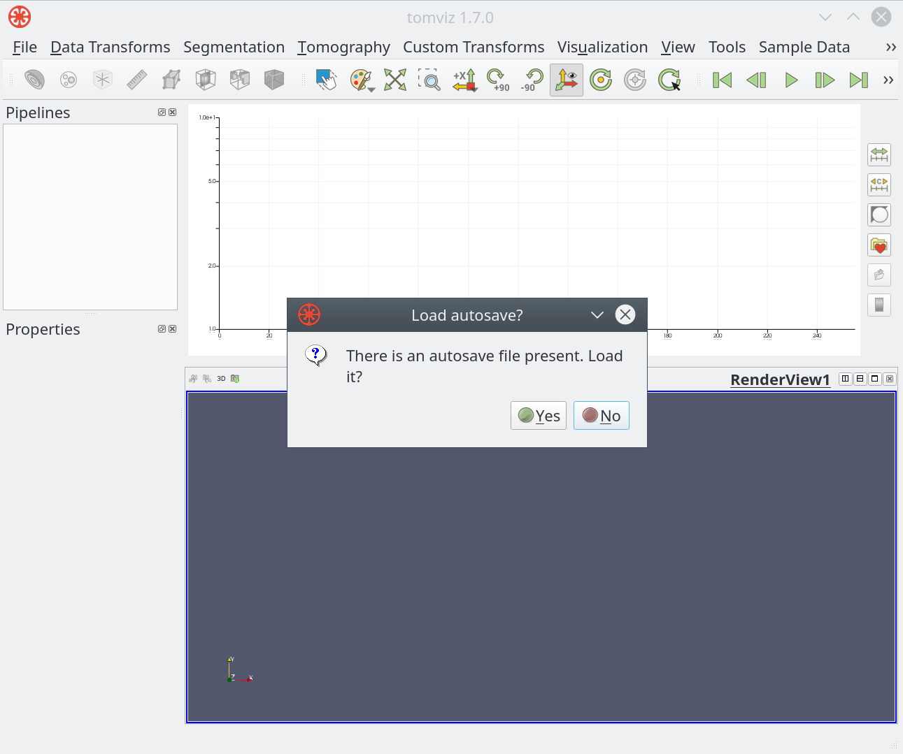

#### Load state

When there is no prompt, users can manually load and recover previous states by selecting ```Load State``` from ```File```.

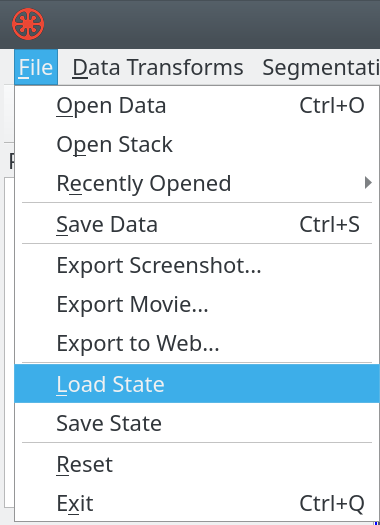

<a name="visualizationtechniques"></a>
## Visualization techniques

In this section, we will go over some available techniques and explain the important parameters. Most of the techniques are GPU accelerated, which requires a good graphics card that has at least 1GB memory.

<a name="vizmodules"></a>
### Available visualization modules

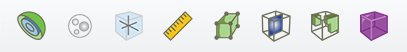

Visualization modules were implemented and optimized using C++ and GLSL (GLslang) to take full advantage of hardware accelerations. These modules are available from the visulization menu.

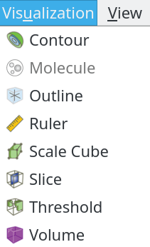

<a name="defaultview"></a>
### Views of loaded data

A set of visualization modules come pre-set when loading any datasets, as shown in the image below. Default color map, plasma,is used. Histogram is calculated in the background thread and then displayed when ready in the top-right.

Default pipeline is constructed with two modules; outline, which shows the extent of the data; and a slice, which shows the slice going through the center of data.

All the default settings can be modified later.


#### Palette and background colors

Palette can be easily modified with several presets.

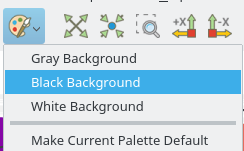

Tips: balck blackground is recommended in some situations on monitors; white is preferred for print, web pages and etc. to highlight samples.

#### Color maps

As introduced, ```Plasma``` is the default color map. But users can always choose others from the menu.


For example, below shows the same data set with ```Viridis``` color map.

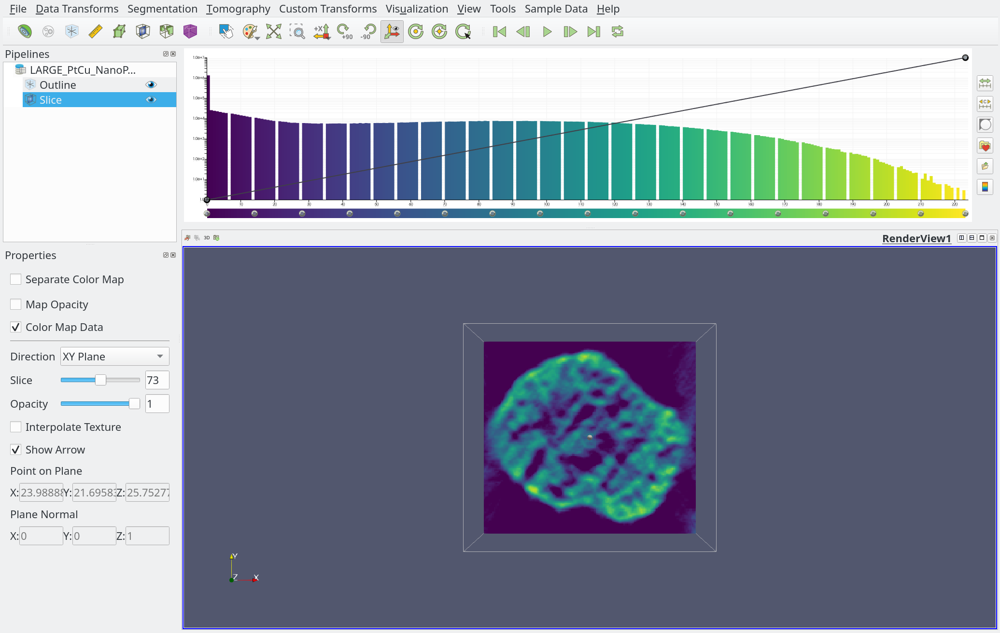

#### Contour

Users can choose to display the contour at a certain level by sliding the threshold bar (red line in images below). Two options, which are specular and values, are supported.

##### Specular

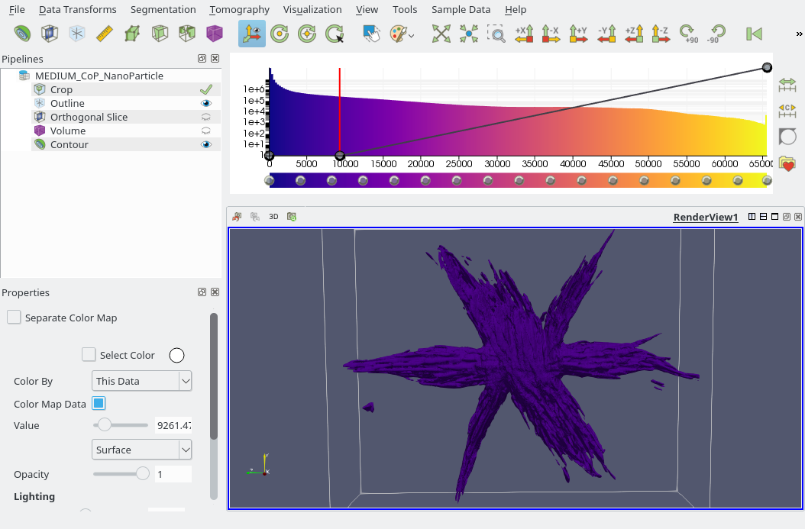

##### Values

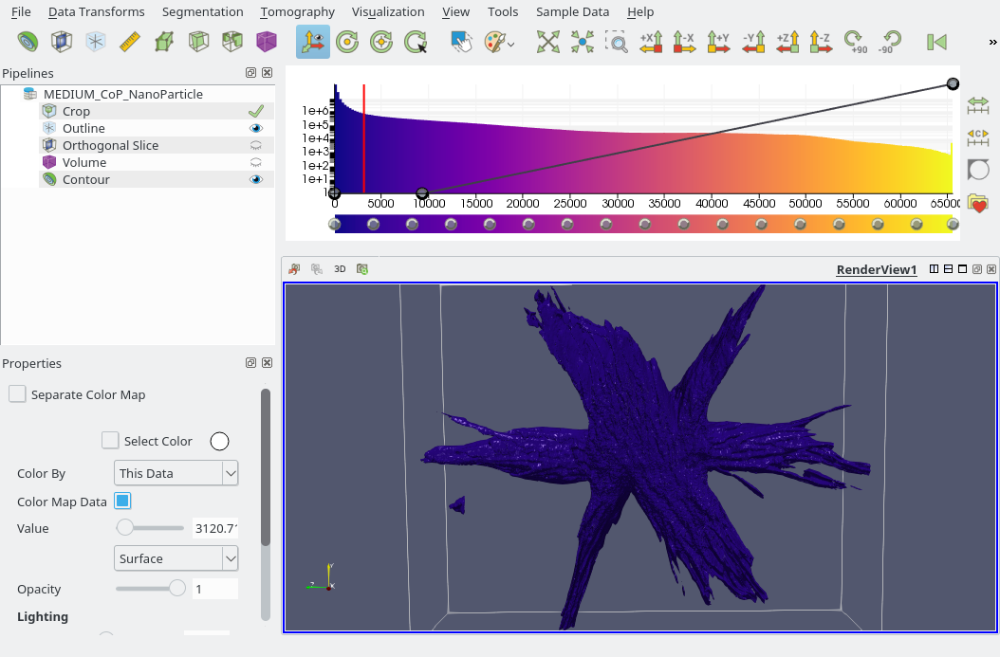

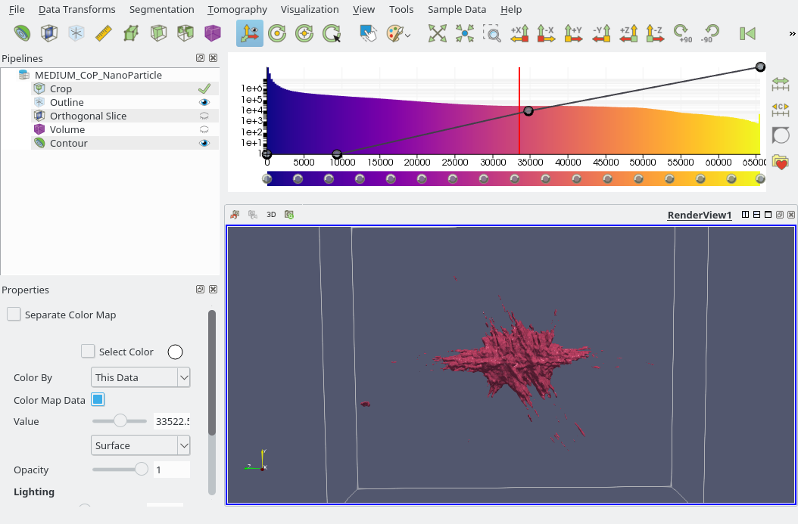

#### Slice

A 2D lice of data can be displayed separately from a 3D dataset. The slice can be a standard orthogonal slice, or a slice with any arbitrary angles.

##### Orthogonal slice

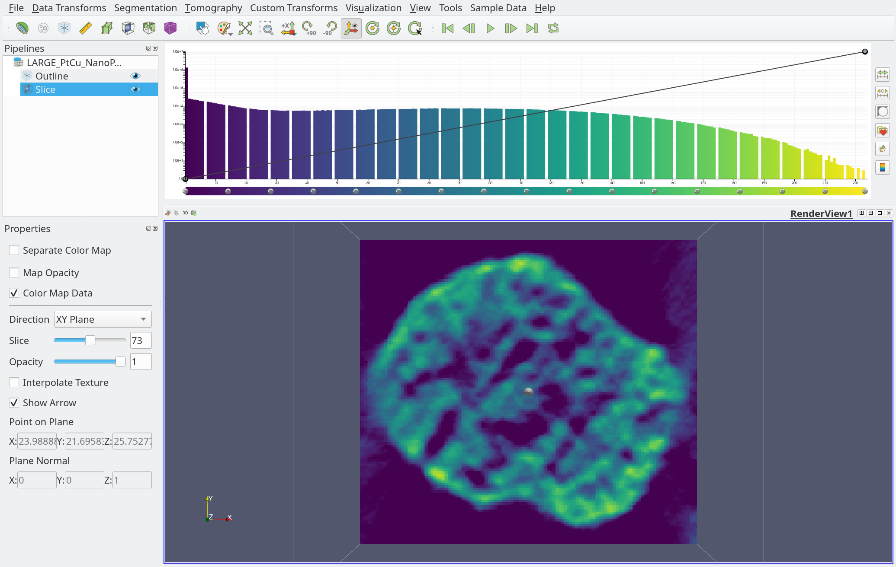

##### Arbitrary slice

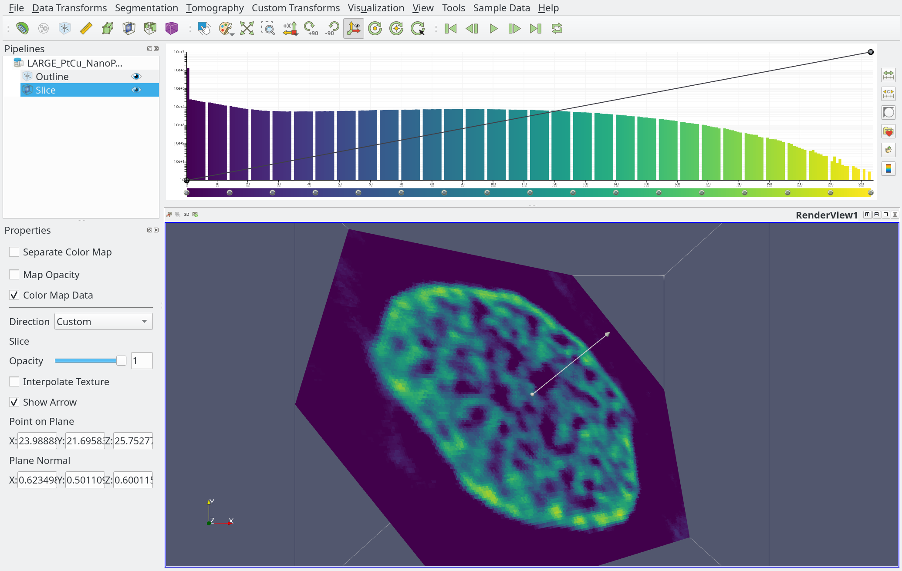

#### Outline

Several tools are available to understand the outline of the loaded data set.

##### Grid and axes

Grid and axes generated a bounding box with grids and axes, which help users understand the size of the data set.

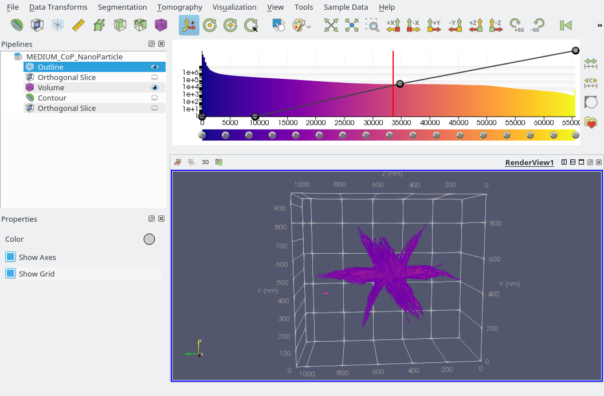

##### Ruler

Rulers are manually defined by users where the start and end points of the ruler is set on specific places of the data set. The length of the ruler is then displayed, as shown in image below.

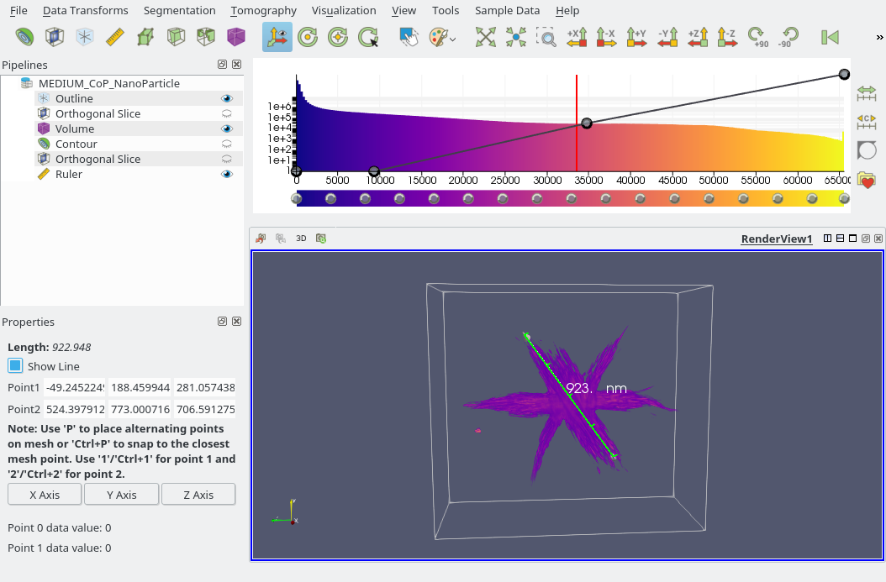

##### Threshold

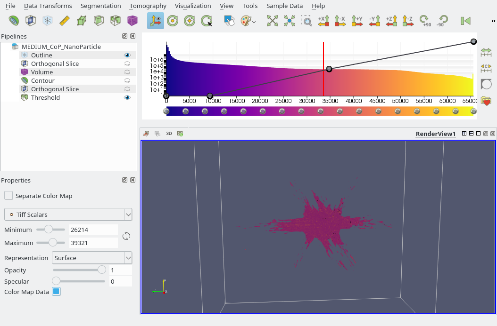

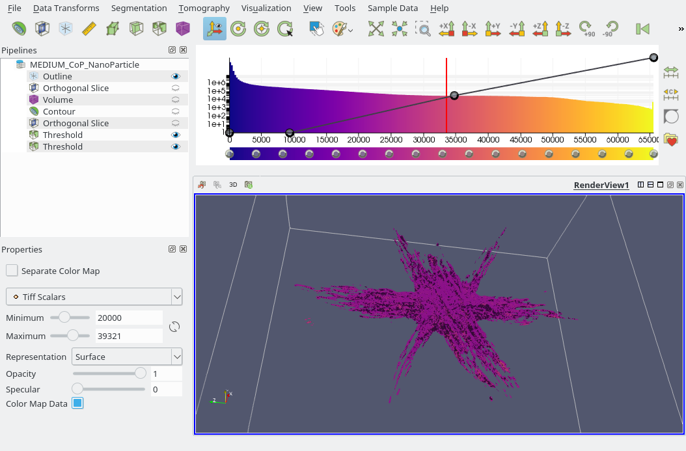

<a name="volumerendering"></a>
## Volume Rendering

<a name="datatransforms"></a>
## Data Transforms

<a name="segmentation"></a>
## Segmentation

<a name="exportingdata"></a>
## Exporting Data
