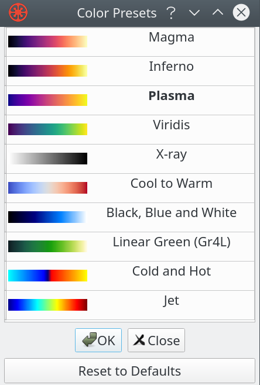

# Visualization and Analysis

<!--*********************** Section 1 Introduction ***********************-->
## Introduction

Tomviz visualizes the resulting data set at the end of each processing pipeline, where normally several operations have been applied. However, if no operators have been applied, the original data will be visualized.

Users can also display the original data directly from the beginning of a pipeline, by simply selecting the data set, and adding modules to it. Data sets can be clones, which means creating a new root.

During the process, Tomviz saves the pipeline every five minutes. This can be recovered upon next restart of Tomviz. Users can also save the application state by taking a snapshot of the pipeline at a given moment, which can be restored, edited, saved again later. Note that saving state does not save data.


Typical data sets may have following relationships between attributes and sizes.

| Volume          | Voxels        | Size (char) | Size (int) |
|  :---           |  :---         |    :---     | :---       |
| 64<sup>3</sup>  | 262,144       | 0.25 MB     | 1 MB       |
| 128<sup>3</sup> | 2,097,152     | 2.00 MB     | 8 MB       |
| 256<sup>3</sup> | 16,777,216    | 16.00 MB    | 64 MB      |
| 512<sup>3</sup> | 134,217,728   | 128.00 MB   | 512 MB     |
| 1024<sup>3</sup>| 1,073,741,824 | 1,024.00 MB | 4096 MB    |

### Load data

In this subsection, loading methods for three data categories, single data file, stack of images and raw data set, are being introduced.

#### Single data file

Loading single dataset is straight forward, simply select ```Open Data``` from the ```File``` menu, as indicated in screenshot below.


#### Image stacks

Loading image stacks takes a little bit more efforts than loading single data file. After selecting ```Open Stack``` from the ```File``` menu, check all the images you would like to include in the pop-up window, as indicated in screenshots below.


#### Reading a raw file

Users can also choose to read raw files by defining data dimensions, type, endianness, and etc, as indicated below.


### Save results

#### Save data

Users can save the data by either clicking the ```Save Data``` button from ```File``` (as shown below), or simply using the keyboard short-cut ```Ctrl+S```.


#### Save state

Similarly to saving data, users can save the state by clicking the ```Save State``` button from ```File```.


### Recover and load state

#### Recover state

Tomviz saves the pipeline every five minutes, users can recover the previous states by simply allowing the Tomviz to load them.


#### Load state

When there is no prompt, users can manually load and recover previous states by selecting ```Load State``` from ```File```.


## Visualization techniques

In this section, we will go over some available techniques and explain the important parameters. Most of the techniques are GPU accelerated, which requires a good graphics card that has at least 1GB memory.

### Available visualization modules


Visualization modules were implemented and optimized using C++ and GLSL to take full advantage of hardware accelerations. These modules are available from the visualization menu.


### Views of loaded data

A set of visualization modules come pre-set when loading any data sets, as shown in the image below. Default color map, plasma,is used. Histogram is calculated in the background thread and then displayed when ready in the top-right.

Default pipeline is constructed with two modules; outline, which shows the extent of the data; and a slice, which shows the slice going through the center of data.

All the default settings can be modified later.


#### Palette and background colors

Palette can be easily modified with several presets.


Tips: black background is recommended in some situations on monitors; white is preferred for print, web pages and etc. to highlight samples.

#### Color maps

As introduced, ```Plasma``` is the default color map. But users can always choose others from the menu.



For example, below shows the same dataset with ```Viridis``` color map.


#### Contour

Users can choose to display the isocontour at a certain level by either sliding the red line on top inside the histogram, or within the bottom-right ```Properties``` section. Specular lighting is used when displaying contours. Several examples with different levels of isocontours are shown below.


#### Slice

A 2D lice of data can be displayed separately from a 3D dataset. The slice can be a standard orthogonal slice, or a slice with any arbitrary angles.

##### Orthogonal slice


##### Arbitrary slice


#### Outline

Several tools are available to understand the outline of the loaded data set.

##### Grid and axes

Grid and axes generated a bounding box with grids and axes, which help users understand the size of the data set.


##### Ruler

Rulers are manually defined by users where the start and end points of the ruler is set on specific places of the data set. The length of the ruler is then displayed, as shown in image below.


##### Threshold

Users can choose to display only the voxels that are within a certain set of min and max values. The bounds can be set inside the bottom-right ```Properties``` section, as shown below.


<!--*********************** Section 3 Volume Rendering ***********************-->
## Volume Rendering

Tomviz volume rendering utilizes GPU memory to upload volume to card and provides powerful techniques that traces paths of rays. It supports different options such as changing color map, modifying the opacity transfer function, transfer modes, interpolation, blending, lighting, jittering, and etc. The volume rendering with default settings can look like the image below.


### Display options

#### Opacity

Different opacities can be set by dragging the pink ring within the histogram; the higher the more opaque, and the lower the more transparent. An example shown below illustrates when setting voxels with values smaller than around 10,000 are set to completely transparent. In contrast to the default rendering shown above, the "outside blue bounding box" now disappears.


#### Background color

Background color can be set by right clicking inside the render view and choosing ```Background color``` in the prompt menu. Both customized and pre-selected colors are available. Images below show two examples of the same dataset with black and white background colors.


#### Empty space


#### Cropping

Cropping can be easily accessed from ```Crop``` within the ```Data Transform``` menu.


After selecting ```Crop```, a prompt will pop up and ask for the start and end values for cropping. Users can type the exact numbers manually, or dragging the little round dots inside the render view. The numbers inside the pop-up window will change according as the user drags the sliding dots.


When the desired values are set, simply click on ```Apply``` to finish the cropping.


### Rendering Properties

All the available rendering properties live in the bottom left of the window, as shown in image below. It includes many volume rendering properties, which would affect rendering in different ways.


Below we list several results to illustrate the rendering under different properties.

#### Default


#### No jittering


#### Lighting


#### Max intensity


#### 1D transfer

1D transfer function highlights gradients


#### 2D transfer

Just like 1D transfer function, 2D transfer also highlights the gradients.


Besides it, 2D transfer function provides more selectivity for some data sets. As shown below, users can select a box in the 2D histogram.


<!--*********************** Section 4 Data Transforms ***********************-->
## Data Transforms

Data transforms were implemented as operators in C++ or Python. They can be applied to the data directly, while some of them provide graphical interfaces. The operators source code can be viewed and edited from the ```Context``` menu. Most of the operators make extensive use of NumPy.

All the operators execute in a background thread. During the execution, application remains interactive, and users can still edit the pipeline.

All the operators can be easily accessed from the ```Data Transforms``` menu, as shown below.


<!--*********************** Section 5 Segmentation ***********************-->
## Segmentation

Tomviz uses [ITK](https://itk.org/) (Segmentation and Registration Toolkit) to segment data in various ways. For examples, topological segmentation, data labeling, summarization, and etc.

All the available segmentation methods can be accessed through the ```Segmentation``` menu, as shown below.


<!--*********************** Section 6 Exporting Data ***********************-->
## Exporting Data

Resulting data can be exported via many ways, which includes saving data to standard formats; taking screenshots or animations of the render view; creating an interactive scene for web browsers; exporting geometry for 3D printing and generating images of slices.

### Save data

Saving data can be accessed via ```File``` menu, simply click on ```Save Data```. Alternatively users can also simply press ```Ctrl+S```.


In the pop-up window, choose one of the standard formats that you want to save your data as.


We recommend EMD (HDF5 based) for saving data. Because it supports all the data types that are used in Tomviz, and can save units in all three dimensions. However, note that it may not be as widely supported.

Besides EMD, TIFF is often the most diverse type to export to. Although it supports limited types that are used in Tomviz due to limited support for units and dimensions, it is open and widely supported by many other packages.

### Export screenshot

From the same ```File``` menu, you can choose ```Export Screenshot``` option. Inside the prompt window, specify size, which supports a number of image formats. And then override palette, it is recommended to use transparent backgrounds.


### Export movie

Exporting movie supports common movie formats. Same as before, ```Export Movie``` can be accessed from ```File```. In the pop-up window, set the resolution or override color palette when needed.


### Export to web

When exporting to web, different types of data may need different settings. When generating images, there is no need for WebGL or any other special settings for the browser. However, when exporting geometry based data where actual data is exported, it is often needed to downsample the result, which also provides better interactivity inside browsers. And when generating data for viewer option, it is better exported to larger website, since by default the whole dataset will be exported to a single HTML page.


An example after successfully exporting the data to web may look like


### Export mesh for 3D printing

Isocontours of the data set with a specific level can be exported to mesh by right-clicking on ```Contour``` inside the ```Pipelines``` section, as shown below, and then choosing ```Export as Mesh```. Define the settings such as the saving address, etc, to complete the process.


### Export image from slice

A certain slice of data (either orthogonal or with arbitrary angles) that goes through the data can be saved as an image. Similar to the process when exporting to mesh, simply right-click on the slice that you want to export, and select ```Export as image```.


## Summary

This tutorial covered how to work with and visualize volume data, which includes data transforms, segmentation and many other options for contours generation, volume rendering, and etc. Different visualization types can be combined and the resulting data set can be exported via various formats and different media types.
