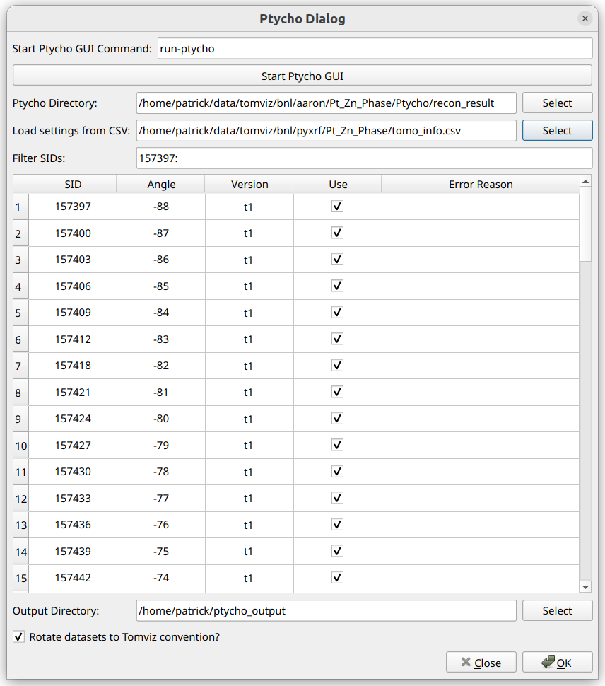
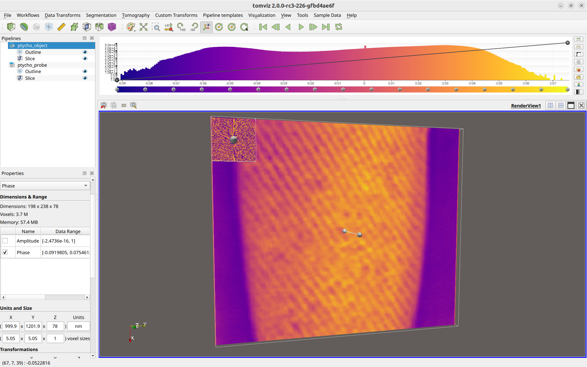
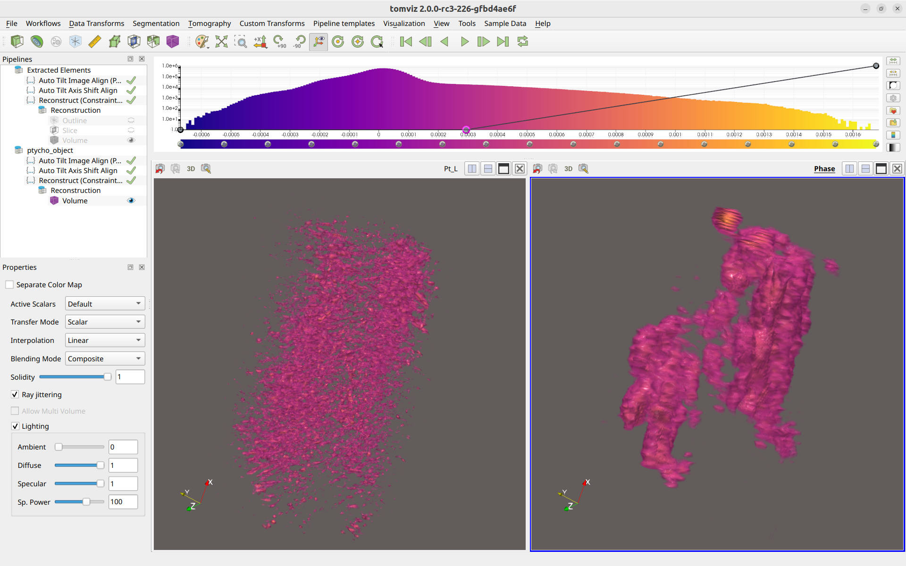

# Ptycho

The Ptycho workflow is intended to streamline the stacking and analysis
of Ptycho data, particularly for the HXN beamline at NSLS-II.

It relies on NSLS2's [Ptycho GUI](https://github.com/NSLS2/ptycho_gui) to
download and process the ptycho data into a directory with pre-defined
file paths. This directory is specified within Tomviz, which is then able
to automatically stack, format, and load the data.

Steps for the subsequent data analysis of the Ptycho data are included in Tomviz,
including deleting invalid slices, performing automatic image alignment,
centering the images, performing the 3D reconstruction, and then comparitively
visualizing different reconstructed elements. Those steps are also detailed below.

To begin, click on "Workflows" in the top menu bar, and then select "Ptycho".

## Tutorial Video

  <iframe src="https://drive.google.com/file/d/1vBzNkJtdVt6ik0nmI3FdbZSheIV6gpFP/preview" width="760" height="480" allow="autoplay"></iframe>

## Ptycho Dialog

After starting the Ptycho workflow, the following dialog will appear:

If the ptycho data has not yet been downloaded and processed, a command can
be specified within the `Start Ptycho GUI Command` section, and that command
ran via `Start Ptycho GUI`. This is typically `run-ptycho` at NSLS2.
The documentation for using the Ptycho GUI can be found [here](https://github.com/NSLS2/ptycho_gui).

Once the ptycho data has been downloaded and processed, the output directory
containing the scan IDs (for example, `S157391`, `S157394`, etc.) should be
specified for the `Ptycho Directory` input.

Once this is selected, Tomviz will automatically analyze the directory and
use the information to populate the table below, where each row represents
and SID, and the angle and version is specified.

The table settings can be automatically set by loading a CSV file, which are
generated from the [Make HDF5 step of the PyXRF Workflow](./workflows_pyxrf.md#make-hdf5).
This can be useful to ensure that the same SIDs are used for Ptycho as were
used for the XRF workflow. Once loaded, the CSV file will automatically mark
each SID as "Use" that was marked as "Use" within the CSV file. Any SIDs
missing from the CSV file or not marked as "Use" will be not marked as
"Use" in the table. Additionally, if a "Version" column is present within the
CSV file, the selected versions within the CSV file will be selected
automatically within the table.

The contents of the table can also be filtered using the "Filter SIDs"
setting. This uses numpy-like syntax for selecting values. For example:
"157394:157413:3"
would only allow every third number between 157394 (inclusive) and 157413
(exclusive) to be shown. The filtered out SIDs are hidden and won't be used in
the next step. This also supports separate sets of comma-delimited slices, for
example: "157394:157413:3, 157420:157500:2".

After optionally loading the CSV file, and filtering SIDs, the table can
be manually edited for any further edits needed. If more than one version is
available for an SID, the entry in the "Version" column for that SID will be
a combo box where a different version may be selected.

If any errors were detected for a particular SID and version combination,
the row will appear red, and a reason for the error will be displayed in the
far-right column, like so:

After the table is properly set, an output directory for the extracted
output files can be selected in the "Output Directory" section.

Finally, if "Rotate datasets to Tomviz convention?" is checked, the
datasets will automatically be rotated to the convention that is
ready to use for the reconstruction operators within Tomviz.

When "OK" is clicked, a progress dialog will appear, reporting
progress as the datasets are stacked. The messages will also
indicate whether the pixel sizes were automatically detected.
If they are automatically detected, it will report which file
was used, and what the pixel sizes were determined to be. This
will be printed before the rest of the ptycho stacking output.

## Analyzing Ptycho Data

After stacking and importing the ptycho data, it may appear as follows:

Two different data sources are present in the pipeline. One for the
ptycho object (which contains arrays of `Amplitude` and `Phase`), and
one for the probe objection (which contains arrays of `Probes Amplitude`
and `Probes Phase`).

In the above image, the probe slice is much smaller than the ptycho object
slice because the voxel sizes were automatically determined and set to be
about ~5 nm for the ptycho object, whereas the ptycho probe just defaulted
to sizes of about ~1 nm. If the ptycho probe is not to be used, feel free to
delete it from the pipeline.

Select the `ptycho_object` and verify that the "voxel sizes" section in the
bottom-left appear correct. It is important that these are correct if
transformation matrices from the XRF workflow will be applied to the ptycho
dataset as well.

The Ptycho workflow can then follow the same exact steps as the XRF workflow
did, as outlined [here](./workflows_pyxrf.md#xrf-data-analysis). In fact, if
the transformation matrices were saved in the PyXRF workflow, the same exact
SIDs were used for every slice between the XRF and Ptycho data, and the voxel
sizes for both the XRF data and the Ptycho data are correct, the same
transformation matrices can be applied to the ptycho data.

Finally, if the voxel sizes were set properly for both the XRF data and Ptycho,
then they may be visualized together, and will appear to be approximately the
same size within the render windows, like so:

